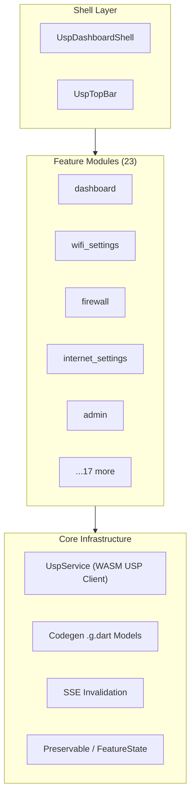
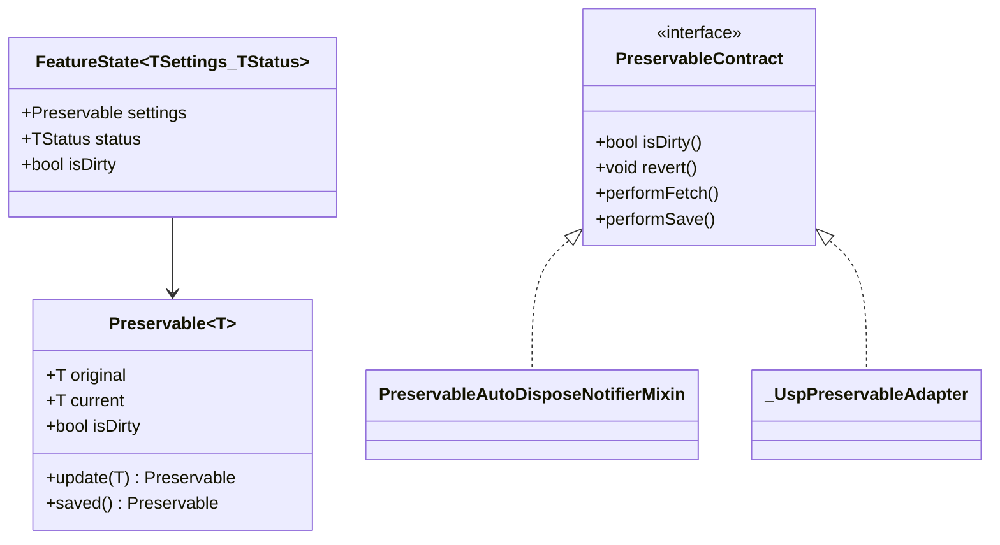
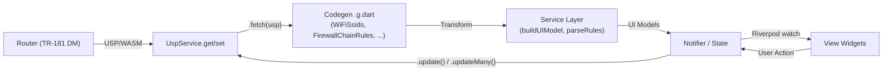
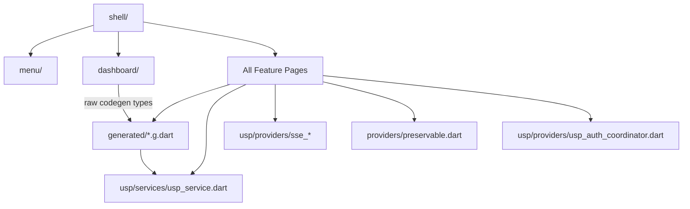

# USP Pages Architecture Analysis — v2.1.0

> **Scope**: `lib/usp_page/` — 23 feature modules, 85+ Dart files  
> **Date**: 2026-03-16

---

## 1. High-Level Architecture



USP Pages replaces the legacy JNAP pages with a new module group that communicates with the router via the **USP (User Services Platform)** protocol. The codebase follows a **Feature-First** directory structure with a consistent 4-layer design within each module.

---

## 2. Module Inventory

| Category | Modules | Structure |
|----------|---------|-----------|
| **Shell** | `shell/`, `menu/` | App shell & navigation |
| **Full CRUD** | `wifi_settings`, `firewall`, `internet_settings`, `admin`, `dmz`, `instant_safety`, `ipv6_port_service`, `local_network`, `static_routing` | models + services + providers + views |
| **Dashboard** | `dashboard/` | Largest module (17 data sources, 20+ UI models) |
| **Read-only / View-only** | `advanced_settings`, `dhcp`, `devices`, `network_diagnostics`, `statistics`, `support`, `system_log`, `test_console`, `port_forwarding` | Views only (or partial providers) |
| **Presentational** | `topology/` | helpers, models, providers, views |
| **Shared** | `components/` | Cross-module UI components |

---

## 3. Standard Module Layout

```
usp_page/<feature>/
├── models/        # UI Models (Equatable, copyWith, toMap/fromMap)
├── services/      # Stateless data transformers (codegen → UI Model)
├── providers/     # Riverpod Notifiers + State definitions
└── views/
    ├── components/  # Sub-components (cards, panels)
    ├── dialogs/     # Edit / confirmation dialogs
    └── sections/    # Page sections (for complex pages)
```

Not all modules have all four layers. `statistics/` and `advanced_settings/` contain only `views/`, indicating they are purely presentational or borrow data from the Dashboard provider.

---

## 4. Core Architectural Patterns

### 4.1 Provider Patterns — Three Variants

#### Variant A: `PreservableAutoDisposeNotifierMixin`

**Used by**: `wifi_settings`, `admin`

```dart
class UspWifiSettingsNotifier 
    extends AutoDisposeNotifier<UspWifiSettingsState>
    with PreservableAutoDisposeNotifierMixin<
        WifiSettingsSettings, WifiSettingsStatus, UspWifiSettingsState> {
  
  @override
  Future<(WifiSettingsSettings?, WifiSettingsStatus?)> performFetch(...) async { ... }
  
  @override
  Future<void> performSave() async { ... }
}
```

- State extends `FeatureState<TSettings, TStatus>`
- `Preservable<T>` wraps `original` / `current` for automatic dirty-checking
- Mixin provides `fetch()`, `save()`, `revert()`, `markAsSaved()`
- Best suited for "fetch → edit → save → re-fetch" workflows

#### Variant B: `AutoDisposeAsyncNotifier` + Manual Original/Pending

**Used by**: `firewall`, `internet_settings`, `dmz`, `local_network`, `instant_safety`, `ipv6_port_service`

```dart
class UspFirewallNotifier extends AutoDisposeAsyncNotifier<UspFirewallState> {
  @override
  Future<UspFirewallState> build() async { ... }

  void updateSetting(FirewallUIModel Function(FirewallUIModel) updater) { ... }
  Future<void> save() async { ... }
}
```

- State maintains `original` / `pending` snapshots manually
- `isDirty => original != pending`
- Uses `_withLock()` to prevent concurrent mutations
- Bridges to `PreservableContract` via `_UspPreservableAdapter`

#### Variant C: `AsyncNotifier` (Non-AutoDispose)

**Used by**: `dashboard`

```dart
class UspDashboardNotifier extends AsyncNotifier<UspDashboardState> { ... }
```

- **Not** auto-disposed — data persists across tab switches
- 17 parallel `Future.wait` fetches with progress reporting
- Supports SSE domain-specific incremental updates
- `_withLock()` serializes mutations (WASM constraint)

### 4.2 Preservable / Dirty Guard System



- `Preservable<T>` uses `Equatable` to compare `original` vs. `current`
- `FeatureState` separates **editable settings** (`TSettings`) from **read-only status** (`TStatus`)
- `PreservableContract` interface enables `LinksysRoute.onExit` dirty-check prompts

### 4.3 Data Flow: Codegen → Service → Provider → View



**Key Design Decisions**:

- **Codegen types** (e.g., `WiFiSsids`, `FirewallChainRules`) are generated by the `usp-codegen` tool from YAML definitions. They provide static `fetch()`, `update()`, and `updateMany()` methods.
- **Service layer is stateless**: performs data transformation only (codegen type → UI Model), holds no state.
- **Provider layer owns all state**: including loading, saving, and dirty flags.

### 4.4 SSE (Server-Sent Events) Invalidation

```dart
ref.listen(sseInvalidationProvider, (prev, next) {
  if (next.valueOrNull == InvalidationDomain.firewallRules) {
    if (!s.isDirty && !s.isSaving) {
      ref.invalidateSelf();  // re-trigger build()
    }
  }
});
```

| Strategy | Description |
|----------|-------------|
| **Domain-scoped** | `InvalidationDomain` enum differentiates data sources |
| **Debounced** | Dashboard debounces 500ms, batching rapid SSE events |
| **Dirty-safe** | Does **not** auto-refetch when user has unsaved changes |
| **Incremental** | Dashboard `_handleInvalidation()` re-fetches only affected subsets (not all 17 classes) |

### 4.5 Mutation Lock Pattern

```dart
Future<T> _withLock<T>(Future<T> Function() action) async {
  if (_mutating) throw StateError('Another mutation is in progress');
  _mutating = true;
  try { return await action(); } 
  finally { _mutating = false; }
}
```

Used by `dashboard`, `internet_settings`, and `firewall` save operations to prevent concurrent mutations due to WASM client limitations.

---

## 5. Dashboard Module Deep Dive

The Dashboard is the largest and most complex module:

| Aspect | Detail |
|--------|--------|
| **Data sources** | 17 codegen types + 4 extra fetches (gateway, IPv6, firmware, bridge ports) |
| **UI components** | 21 card components (barrel export in `_components.dart`) |
| **UI models** | 15+ types (`DeviceUIModel`, `WanStatusUIModel`, `WifiRadioUIModel`, etc.) |
| **Progress tracking** | `UspLoadingProgress` provider reports real-time fetch progress |
| **Layout system** | `UspLayoutController` + `UspLayoutPreferences` for customizable card arrangement |
| **System monitor** | Independent `UspSystemMonitorNotifier` recording CPU/Memory history |
| **Analytics** | `UspDeviceAnalyticsNotifier` + `DeviceAnalyticsPersistence` (local persistence) |
| **Traffic** | `UspTrafficAnalysisNotifier` for real-time traffic analysis |
| **PDF export** | `UspPdfService` for report generation |

### Dashboard State Structure

```dart
class UspDashboardState {
  // Raw codegen data (retained for mutation payloads)
  final SystemInfo systemInfo;
  final ConnectedDevices connectedDevices;
  final WiFiRadios wifiRadios;
  // ...13 more raw types

  // Pre-computed UI models (for View consumption)
  final SystemInfoUIModel systemInfoModel;
  final List<DeviceUIModel> deviceModels;
  final List<WifiRadioUIModel> wifiRadioModels;
  // ...10 more UI model types
}
```

> **Note**: The Dashboard retains both raw codegen data and computed UI models. Raw data is used for mutation payload construction and SSE incremental recomputation; UI models are consumed directly by Views.

---

## 6. Model Layer Design

All UI models share a consistent design:

| Feature | Implementation |
|---------|---------------|
| **Value equality** | Extends `Equatable`, overrides `props` |
| **Immutability** | All fields `final`, provides `copyWith()` |
| **Serialization** | `toMap()` / `fromMap()` + `toJson()` / `fromJson()` |
| **TR-181 aware** | Field names map directly to TR-181 DM paths (e.g., `ssidInstancePath`, `accessPointInstancePath`) |

**Example** — `WifiNetworkUIModel` merges three TR-181 collections:

```
SSID.{i} ─────────┐
AccessPoint.{i} ───┤──→ WifiNetworkUIModel
Radio.{i} ─────────┘
```

---

## 7. Service Layer Design

| Principle | Description |
|-----------|-------------|
| **Stateless** | All services are stateless `Provider` instances (not Notifiers) |
| **Single responsibility** | Handles codegen → UI model transformation + SET payload construction |
| **TR-181 knowledge encapsulation** | Path normalization (trailing dot), relationship resolution (SSID↔AP↔Radio) |
| **Business logic** | Firewall accept/drop rule inversion, WiFi 6 GHz WPA3 enforcement |

---

## 8. View Layer Organization

| Pattern | Description | Example |
|---------|-------------|---------|
| `usp_*_view.dart` | Root View widget per module | `usp_firewall_view.dart` |
| `components/` | Composable sub-components (cards, panels) | `usp_wifi_status_card.dart` |
| `dialogs/` | Modal dialogs | `change_password_dialog.dart` |
| `sections/` | Logical page sections | `usp_ipv4_section.dart` |
| Barrel exports | `_components.dart` | Dashboard's 21 card components |

---

## 9. Module Dependency Graph



All feature modules depend on `UspService` (WASM USP client) and codegen `.g.dart` types, but have **no lateral dependencies** on each other — each module is a self-contained feature slice.

---

## 10. Strengths & Areas for Improvement

### Strengths

| Area | Description |
|------|-------------|
| **Consistent module structure** | Easy onboarding — learn one module design, apply everywhere |
| **Dirty Guard** | `Preservable` + `PreservableContract` unifies unsaved-changes protection |
| **SSE incremental updates** | Dashboard avoids full refetch, reducing latency |
| **Codegen abstraction** | `.g.dart` types encapsulate USP communication details; modules only call `fetch()` / `update()` |
| **Testable services** | Stateless + pure transformations make unit testing straightforward |
| **Mutation lock** | Prevents WASM client concurrency issues |

### Areas for Improvement

| Area | Description |
|------|-------------|
| **Inconsistent provider patterns** | Three notifier variants are mixed (Preservable mixin / manual original-pending / async-only); consider unifying |
| **Oversized Dashboard** | A single Notifier manages 17 data sources + 21 UI models; `UspDashboardState` is excessively large and could be split into sub-providers |
| **Missing service layers** | `port_forwarding/` and `dhcp/` contain only views/models without services, suggesting business logic may be embedded in views |
| **Hardcoded guest detection** | `isGuest` relies on SSID name containing "guest" (marked with TODO); not reliable long-term |
| **Inconsistent state file placement** | Firewall's `UspFirewallState` is defined inline in the notifier file vs. WiFi's separate state file |
