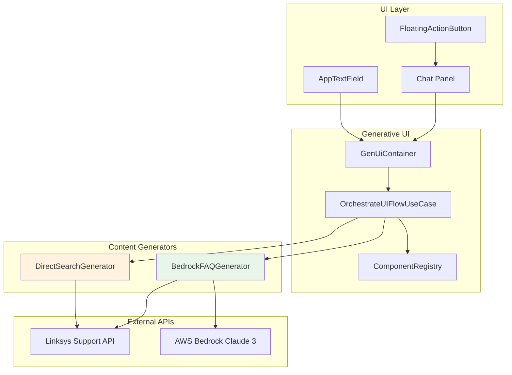
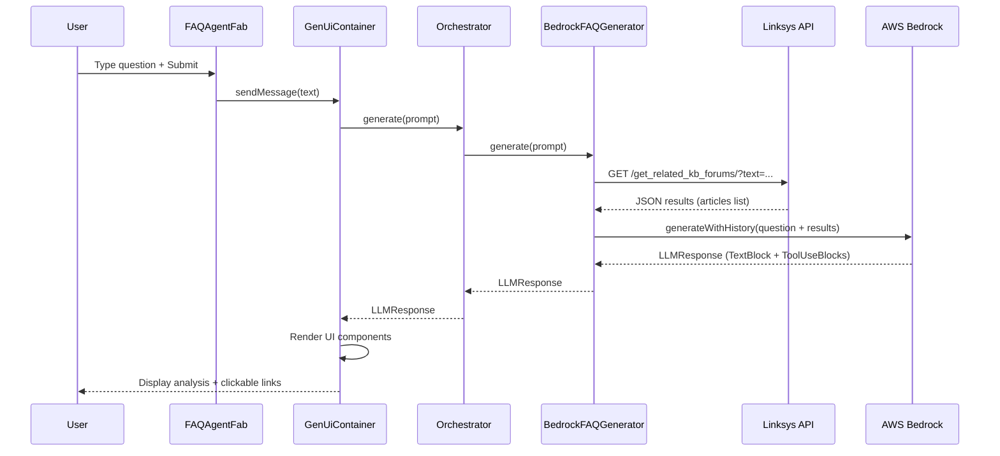

# FAQ Agent Design Document

> Technical design and implementation details for the FAQ Assistant feature in PrivacyGUI.

---

## 1. Overview

The **FAQ Agent** is a floating action button (FAB) component that provides AI-powered FAQ search and analysis capabilities. It combines:

- **Linksys Support API** — Real-time FAQ article search
- **AWS Bedrock Claude 3** — Intelligent analysis and recommendations
- **Generative UI Framework** — Dynamic component rendering

### Key Features

| Feature | Description |
|---------|-------------|
| **Dual Mode** | AI mode (Bedrock) with Search mode fallback |
| **Smart Analysis** | LLM analyzes search results and provides conclusions |
| **Clickable Results** | Direct links to Linksys Support articles |
| **Graceful Degradation** | Falls back to direct search when AI unavailable |

---

## 2. Architecture



---

## 3. Data Flow



---

## 4. Component Structure

### 4.1 Main Widget: FAQAgentFab

```dart
class _FAQAgentFabState extends State<FAQAgentFab> {
  // State
  bool _isExpanded = false;           // Dialog expansion state
  bool _useMock = true;               // AI mode or Search mode
  
  // Core Components
  late final OrchestrateUIFlowUseCase _orchestrator;
  late final IComponentRegistry _registry;
  
  // UI Controllers
  final _containerKey = GlobalKey<GenUiContainerState>();
  final _inputController = TextEditingController();
  late final AnimationController _animController;
}
```

### 4.2 Custom UI Components

| Component | Purpose | Properties |
|-----------|---------|------------|
| `FAQResult` | Clickable article link | `id`, `title`, `type` |
| `NoResults` | Empty state message | `message` |

```dart
registry.register('FAQResult', (context, props, {onAction}) {
  return AppListTile(
    leading: Icon(props['type'] == 'article' 
        ? Icons.article_outlined 
        : Icons.forum_outlined),
    title: AppText.bodyMedium(props['title'] ?? ''),
    trailing: const Icon(Icons.open_in_new),
    onTap: () => gotoOfficialWebUrl(
      'https://support.linksys.com/${props['type']}/article/${props['id']}-en/'
    ),
  );
});
```

---

## 5. Content Generators

### 5.1 BedrockFAQGenerator (AI Mode)

**Flow**: User Question → Linksys API Search → Results + Question → AWS Bedrock → Analysis + Recommendations

```dart
class BedrockFAQGenerator implements IContentGenerator {
  @override
  Future<LLMResponse> generate(String prompt) async {
    // 1. Search Linksys API
    final searchResults = await _fetchSearchResults(prompt);
    
    // 2. Build context for LLM
    final userContent = '''
User question: $prompt

Search results from Linksys Support:
${searchResults.map((r) => '- [ID: ${r['id']}] ${r['title']}').join('\n')}
''';
    
    // 3. Call AWS Bedrock with tools
    return await _awsGenerator.generateWithHistory(
      [ChatMessage.user(userContent)],
      tools: _tools,
      systemPrompt: _systemPrompt,
      forceToolUse: false,
    );
  }
}
```

**System Prompt Guidelines**:
1. First provide conclusion/analysis
2. Then list source articles using FAQResult tool
3. If no search results, suggest 3 possible article topics
4. Limit to 5 most relevant articles
5. Respond in user's language

### 5.2 DirectSearchGenerator (Fallback Mode)

**Flow**: User Question → Linksys API Search → Format as ToolUseBlocks

Used when AWS credentials are not configured or API fails.

---

## 6. External APIs

### Linksys Support API

```
GET https://support.linksys.com/get_related_kb_forums/?text={keyword}
```

**Response**:
```json
[
  { "id": 123, "title": "How to reset router", "type": "article" },
  { "id": 456, "title": "Factory reset discussion", "type": "forum" }
]
```

---

## 7. Protocol Choice: Tool Use

This implementation uses **Tool Use** instead of A2UI for the following reasons:

| Requirement | FAQ Agent Needs | Protocol Choice |
|-------------|-----------------|-----------------|
| UI Structure | Flat list | Tool Use ✓ |
| Data Binding | None needed | Tool Use ✓ |
| User Interaction | Click only (Client-handled) | Tool Use ✓ |
| State Management | None needed | Tool Use ✓ |
| Dynamic Updates | None needed | Tool Use ✓ |

> [!NOTE]
> For detailed protocol comparison, see [PROTOCOL_COMPARISON.md](../../ui_kit/generative_ui/docs/PROTOCOL_COMPARISON.md)

---

## 8. UI Layout

```
┌─────────────────────────────────────────┐
│ [🤖] FAQ Assistant          [AI] [✕]  │  ← Header with mode indicator
├─────────────────────────────────────────┤
│                                         │
│  User: How to reset my router?          │  ← GenUiContainer
│                                         │
│  Assistant:                             │
│  To reset your router, you can...       │  ← TextBlock
│                                         │
│  📄 Factory reset Linksys router    🔗 │  ← FAQResult components
│  📄 How to perform hard reset       🔗 │
│  📄 Router not responding           🔗 │
│                                         │
├─────────────────────────────────────────┤
│ [Search for help topics...    ] [🔍]   │  ← Input bar
└─────────────────────────────────────────┘
                                      
                               ┌────┐
                               │ 🤖 │  ← FAB (collapsed)
                               └────┘
```

---

## 9. Configuration

### AWS Bedrock Configuration

The FAQ Agent requires AWS credentials in `.env`:

```env
AWS_REGION=us-west-2
AWS_ACCESS_KEY_ID=your_access_key
AWS_SECRET_ACCESS_KEY=your_secret_key
```

If credentials are missing, the agent automatically falls back to **Search mode**.

---

## 10. Future Enhancements

| Enhancement | Description | Protocol Impact |
|-------------|-------------|-----------------|
| Follow-up questions | Allow users to ask clarifying questions | May require A2UI |
| Article ratings | Let users rate article relevance | Requires action handling |
| Conversation history | Maintain context across questions | Requires state management |
| Multi-language support | Detect and respond in user's language | No protocol change |
