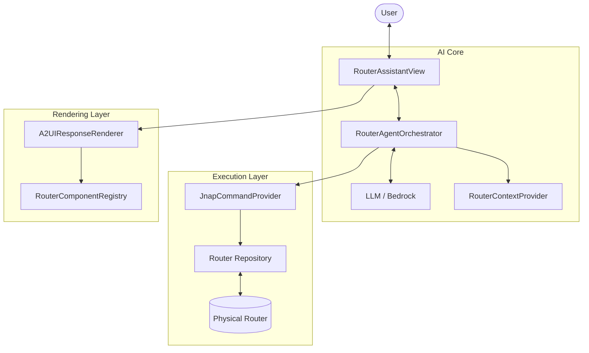

# Router AI Assistant Architecture & Workflow

This document outlines the internal architecture and workflow of the **Router AI Assistant**, a generative UI feature that allows users to interact with their Linksys router using natural language.

---

## 1. System Architecture

The AI Assistant is built on a **Modular Agentic Architecture**, separating UI, Logic, and Data Execution.

### Core Components

| Component | Responsibility |
|-----------|----------------|
| **RouterAssistantView** | The main Chat UI. Handles user input, displays message history, and renders A2UI responses (Widgets). |
| **RouterAgentOrchestrator** | The "Brain". Manages the conversation loop, builds System Prompts, handles LLM calls, and parses Tool calls. |
| **RouterContextProvider** | Provides "Environmental Awareness". Injects a real-time summary of the router status (connected devices count, WAN status) into the System Prompt. |
| **JnapCommandProvider** | The execution layer. Translates abstract AI tools (e.g., `router://devices`) into actual JNAP API calls (`GetDevices`). |
| **RouterComponentRegistry** | A dictionary of custom UI components (`NetworkStatusCard`, `RouterSettingsCard`) that the AI can "summon" via JSON. |
| **A2UIResponseRenderer** | The engine that turns raw JSONL from the LLM into Flutter Widgets using the Registry. |

### Visual Architecture

---

## 2. Conversation Workflow (The Loop)

The conversation follows a strict **Thought-Action-Observation** loop, enhanced with Generative UI capabilities.

### Step-by-Step Flow

1.  **User Input**: User types "Why is my internet slow?"
2.  **Context Construction**:
    *   `RouterContextProvider` fetches a **summary** (not full data) of the current state.
    *   *Example*: "WAN: Connected, Devices: 15".
    *   This is injected into the System Prompt.
3.  **LLM Processing (Thought)**:
    *   The LLM analyzes the request against the context.
    *   *Decision*: "I need to check the actual bandwidth usage."
4.  **Tool Execution (Action)**:
    *   LLM calls function `router_status`.
    *   `RouterAgentOrchestrator` intercepts this, calls `JnapCommandProvider`.
    *   JNAP API is executed.
5.  **Observation**:
    *   The API returns raw JSON data.
    *   This data is fed back to the LLM as a "Tool Result".
6.  **Response Generation (Answer)**:
    *   The LLM formulates a final response.
    *   **Crucial Step**: Instead of just text, it generates **A2UI JSONL**.
    *   *Example*: It decides to show a `NetworkStatusCard`.
7.  **Rendering**:
    *   `RouterAssistantView` receives the stream.
    *   It detects `application/vnd.a2ui` content.
    *   `A2UIResponseRenderer` looks up `NetworkStatusCard` in the Registry.
    *   The generic JSON data is mapped to the concrete Flutter Widget.

---

## 3. Data Strategy: Summary vs. On-Demand

To optimize performance and token usage, we use a hybrid data strategy:

*   **Always-On Context (Summary)**:
    *   A lightweight summary is sent with *every* message.
    *   Includes: WAN connection status, *Count* of connected devices (e.g., "55"), Firmware version.
    *   **Purpose**: Allows the AI to answer basic questions ("Are we online?") without calling tools.
*   **On-Demand Data (Tooling)**:
    *   Heavy data (e.g., the full list of 55 devices with IP/MAC addresses) is **NOT** sent by default.
    *   The AI must explicitly call `router://devices` to fetch this.
    *   **Purpose**: Prevents context window overflow and saves tokens.

> **Data Consistency Rule**:
> We explicitly instruct the LLM in the System Prompt to always use the *Context Summary* for counts (e.g., "55 devices") even if it hasn't fetched the full list, ensuring UI consistency (avoiding "0 devices" bugs).

---

## 4. Sequence Diagram

This diagram illustrates the flow of a complex request: "List my devices".

