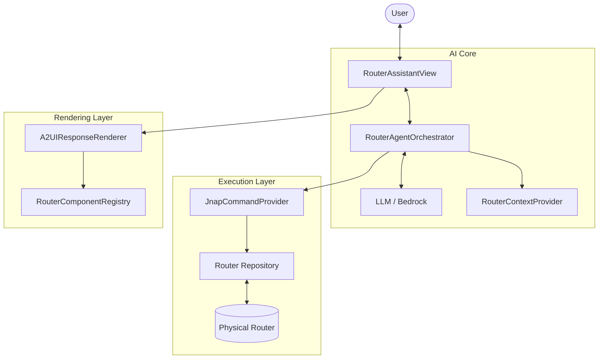
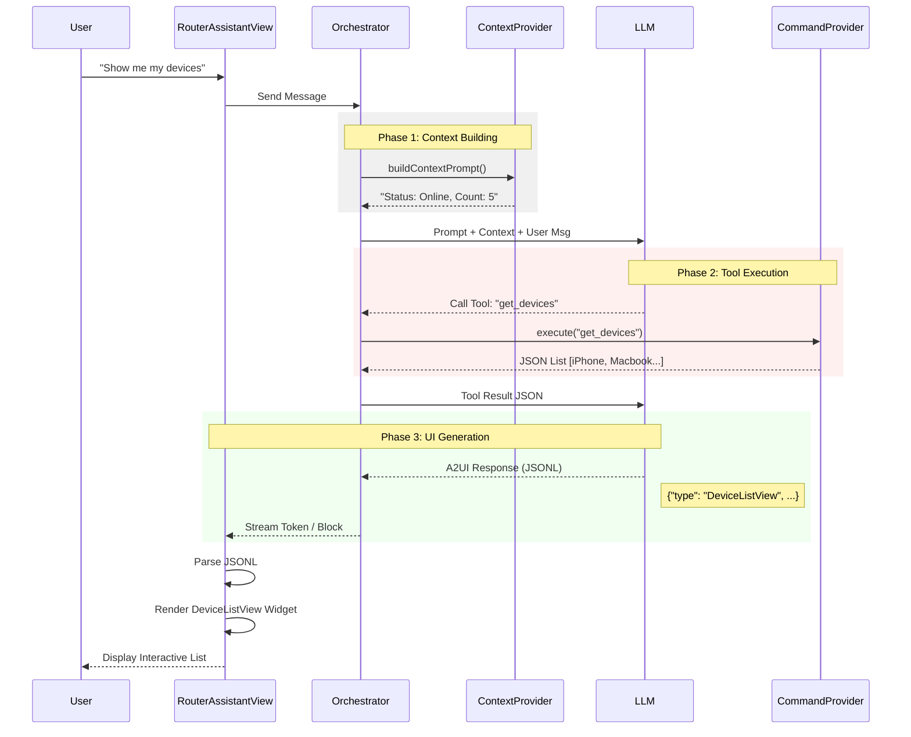
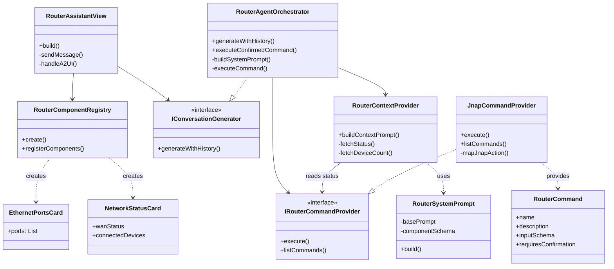

# Router AI Assistant: Architecture & Design

This document describes the structural design, workflow, and software patterns used in the implementation of the **Router AI Assistant** module within PrivacyGUI. It combines high-level agentic conceptual design with concrete low-level implementation details.

---

## 1. System High-Level Architecture

The system implements a **Modular Agentic Architecture** integrated into a Clean Architecture application. It bridges the Generative UI framework (`generative_ui`) with the router's domain logic (`jnap`).

### Core Components

| Component | Responsibility |
|-----------|----------------|
| **RouterAssistantView** | The main Chat UI. Handles user input, displays message history, and renders A2UI responses (Widgets). |
| **RouterAgentOrchestrator** | The "Brain". Manages the conversation loop, builds System Prompts, handles LLM calls, and parses Tool calls. |
| **RouterContextProvider** | Provides "Environmental Awareness". Injects a real-time summary of the router status (connected devices count, WAN status) into the System Prompt. |
| **JnapCommandProvider** | The execution layer (Adapter). Translates abstract AI tools (e.g., `router://devices`) into actual JNAP API calls (`GetDevices`). |
| **RouterComponentRegistry** | A dictionary of custom UI components (`NetworkStatusCard`, `RouterSettingsCard`) that the AI can "summon" via JSON. |
| **A2UIResponseRenderer** | The engine that turns raw JSONL from the LLM into Flutter Widgets using the Registry. |

### Visual Architecture



---

## 2. Conversation Workflow (The Loop)

The conversation follows a strict **Thought-Action-Observation** loop, enhanced with Generative UI capabilities.

### Step-by-Step Flow

1.  **User Input**: User types "Why is my internet slow?"
2.  **Context Construction**:
    *   `RouterContextProvider` fetches a **summary** (not full data) of the current state.
    *   *Example*: "WAN: Connected, Devices: 15".
    *   This is injected into the System Prompt.
3.  **LLM Processing (Thought)**:
    *   The LLM analyzes the request against the context.
    *   *Decision*: "I need to check the actual bandwidth usage."
4.  **Tool Execution (Action)**:
    *   LLM calls function `router_status`.
    *   `RouterAgentOrchestrator` intercepts this, calls `JnapCommandProvider`.
    *   JNAP API is executed.
5.  **Observation**:
    *   The API returns raw JSON data.
    *   This data is fed back to the LLM as a "Tool Result".
6.  **Response Generation (Answer)**:
    *   The LLM formulates a final response.
    *   **Crucial Step**: Instead of just text, it generates **A2UI JSONL**.
    *   *Example*: It decides to show a `NetworkStatusCard`.
7.  **Rendering**:
    *   `RouterAssistantView` receives the stream.
    *   It detects `application/vnd.a2ui` content.
    *   `A2UIResponseRenderer` looks up `NetworkStatusCard` in the Registry.
    *   The generic JSON data is mapped to the concrete Flutter Widget.

### Sequence Diagram



---

## 3. Data Strategy: Summary vs. On-Demand

To optimize performance and token usage, we use a hybrid data strategy:

*   **Always-On Context (Summary)**:
    *   A lightweight summary is sent with *every* message.
    *   Includes: WAN connection status, *Count* of connected devices (e.g., "55"), Firmware version.
    *   **Purpose**: Allows the AI to answer basic questions ("Are we online?") without calling tools.
*   **On-Demand Data (Tooling)**:
    *   Heavy data (e.g., the full list of 55 devices with IP/MAC addresses) is **NOT** sent by default.
    *   The AI must explicitly call `router://devices` to fetch this.
    *   **Purpose**: Prevents context window overflow and saves tokens.

> **Data Consistency Rule**:
> We explicitly instruct the LLM in the System Prompt to always use the *Context Summary* for counts (e.g., "55 devices") even if it hasn't fetched the full list, ensuring UI consistency (avoiding "0 devices" bugs).

---

## 4. Software Design Patterns

### 1. Orchestrator Pattern (`RouterAgentOrchestrator`)
**Purpose**: Centralizes the complex logic of managing the AI's "thought process".
*   It acts as a mediator between the LLM (brain), the User (chat history), and the System (tools).
*   It manages the internal "loop" (Thought -> Tool Call -> Result -> Answer) transparently to the View.

### 2. Adapter Pattern (`JnapCommandProvider`)
**Purpose**: Adapts the router's internal JNAP API to a format understandable by the AI.
*   **Adaptee**: `RouterRepository` (Raw JNAP methods like `send(JNAPAction.getDevices)`).
*   **Target Interface**: `IRouterCommandProvider` (AI-friendly `RouterCommand` with JSON schemas).
*   This generic interface allows the AI to "see" router capabilities as standard tools without knowing JNAP details.

### 3. Registry Pattern (`RouterComponentRegistry`)
**Purpose**: Decouples the A2UI parsing engine from concrete Flutter widgets.
*   The `A2UIResponseRenderer` (engine) doesn't know about `EthernetPortsCard` at compile time.
*   The Registry provides a lookup mechanism (`String` -> `WidgetBuilder`), allowing us to dynamically extend the AI's UI capabilities without modifying the core engine.

### 4. Builder Pattern (`RouterSystemPrompt`)
**Purpose**: Constructs the complex System Prompt string.
*   Assembles various distinct parts: Format Constraints, Role Definition, Component Schemas, and Dynamic Context.
*   Ensures the prompt is always well-formed with critical instructions (like the A2UI JSON requirement) placement.

---

## 5. Implementation Structure

### Class Diagram



### Directory Map

The architecture maps directly to the project folder structure in `lib/ai/`.

```
lib/ai/
├── abstraction/             # Core Interfaces
│   ├── _abstraction.dart    # IConversationGenerator, etc.
│   └── models/              # ChatMessage, LLMResponse
├── orchestrator/            # The "Brain"
│   ├── router_agent_orchestrator.dart  # Main Logic
│   └── router_context_provider.dart    # Context Builder
├── providers/               # Data Adapters
│   └── jnap_command_provider.dart      # JNAP Implementation
├── registry/                # UI Registries
│   └── router_component_registry.dart  # Component definitions
└── prompts/                 # Prompt Engineering
    └── router_system_prompt.dart       # Prompt Templates
```
