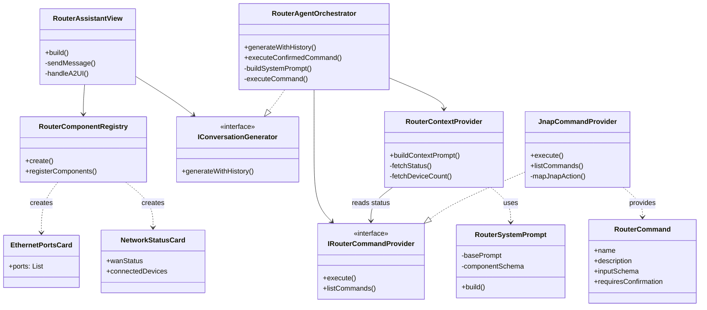

# Router AI Assistant: Architecture Design

This document describes the structural design and software patterns used in the implementation of the Router AI Assistant module within PrivacyGUI.

---

## 1. High-Level Design

The system implements a **Modular Agentic Architecture** integrated into a Clean Architecture application. It bridges the Generative UI framework (`generative_ui`) with the router's domain logic (`jnap`).

### Core Design Principles
*   **Separation of Concerns**: UI rendering (View), AI Logic (Orchestrator), and Data Execution (Provider) are strictly decoupled.
*   **Dependency Injection**: All major components (`RouterRepository`, `CommandProvider`) are injected via Riverpod.
*   **Protocol-Oriented**: Interactions are defined by abstract interfaces (`IConversationGenerator`, `IRouterCommandProvider`, `IComponentRegistry`) to allow easy mocking and swapping.

---

## 2. Structural Class Diagram

This diagram illustrates the static relationships between classes and interfaces.



---

## 3. Design Patterns Applied

### 1. Orchestrator Pattern (`RouterAgentOrchestrator`)
**Purpose**: Centralizes the complex logic of managing the AI's "thought process".
*   It acts as a mediator between the LLM (brain), the User (chat history), and the System (tools).
*   It manages the internal "loop" (Thought -> Tool Call -> Result -> Answer) transparently to the View.

### 2. Adapter Pattern (`JnapCommandProvider`)
**Purpose**: Adapts the router's internal JNAP API to a format understandable by the AI.
*   **Adaptee**: `RouterRepository` (Raw JNAP methods like `send(JNAPAction.getDevices)`).
*   **Target Interface**: `IRouterCommandProvider` (AI-friendly `RouterCommand` with JSON schemas).
*   This generic interface allows the AI to "see" router capabilities as standard tools without knowing JNAP details.

### 3. Registry Pattern (`RouterComponentRegistry`)
**Purpose**: Decouples the A2UI parsing engine from concrete Flutter widgets.
*   The `A2UIResponseRenderer` (engine) doesn't know about `EthernetPortsCard` at compile time.
*   The Registry provides a lookup mechanism (`String` -> `WidgetBuilder`), allowing us to dynamically extend the AI's UI capabilities without modifying the core engine.

### 4. Builder Pattern (`RouterSystemPrompt`)
**Purpose**: Constructs the complex System Prompt string.
*   Assembles various distinct parts: Format Constraints, Role Definition, Component Schemas, and Dynamic Context.
*   Ensures the prompt is always well-formed with critical instructions (like the A2UI JSON requirement) placement.

---

## 4. Directory Structure

The architecture maps directly to the project folder structure in `lib/ai/`.

```
lib/ai/
├── abstraction/             # Core Interfaces
│   ├── _abstraction.dart    # IConversationGenerator, etc.
│   └── models/              # ChatMessage, LLMResponse
├── orchestrator/            # The "Brain"
│   ├── router_agent_orchestrator.dart  # Main Logic
│   └── router_context_provider.dart    # Context Builder
├── providers/               # Data Adapters
│   └── jnap_command_provider.dart      # JNAP Implementation
├── registry/                # UI Registries
│   └── router_component_registry.dart  # Component definitions
└── prompts/                 # Prompt Engineering
    └── router_system_prompt.dart       # Prompt Templates
```
