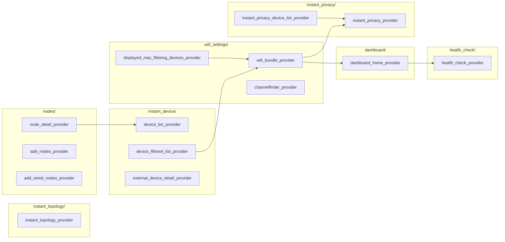
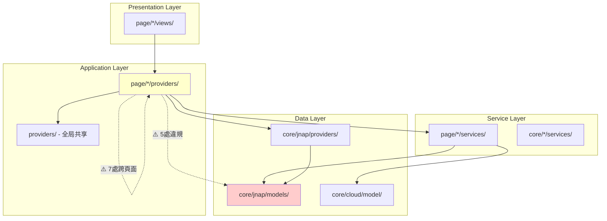

# PrivacyGUI 專案架構分析報告

## 執行摘要

對 PrivacyGUI 專案進行了全面的架構分析，評估模組間的解耦狀況。專案整體架構設計良好，但存在若干需要改進的耦合問題。

---

## 1. 專案結構概覽

```
lib/
├── ai/                    # AI 助手模組 (15 files) ✅ 解耦良好
├── core/                  # 核心基礎設施 (170 files)
│   ├── bluetooth/         # 藍牙連接
│   ├── cache/             # 快取機制
│   ├── cloud/             # 雲端服務 (31 files)
│   ├── http/              # HTTP 客戶端
│   ├── jnap/              # JNAP 協議層 (99 files) ⚠️ 重度依賴
│   ├── usp/               # USP 協議層 (11 files)
│   └── utils/             # 工具類
├── page/                  # UI 頁面模組 (391 files)
│   ├── advanced_settings/ # 136 files
│   ├── dashboard/         # 21 files
│   ├── wifi_settings/     # 36 files
│   └── ... (18 more feature modules)
├── providers/             # 全局狀態管理 (25 files)
└── route/                 # 路由配置 (14 files)

packages/
├── usp_client_core/       # USP 協議核心 (獨立 package)
└── usp_protocol_common/   # USP 協議共享 (獨立 package)
```

---

## 2. 架構層次分析

### 2.1 理想的 4 層架構 (已文件化於 specs/002-dmz-refactor/)

```
┌─────────────────────────────────────────────────────────────┐
│ Data Layer (core/jnap/models/)                              │
│ - JNAP domain models                                        │
│ - Protocol serialization (toMap/fromMap)                    │
└────────────────────┬────────────────────────────────────────┘
                     │ Only Service knows about these
                     ↓
┌─────────────────────────────────────────────────────────────┐
│ Service Layer (page/*/services/)                            │
│ - Converts Data models ↔ UI models                          │
│ - All protocol handling                                     │
└────────────────────┬────────────────────────────────────────┘
                     │ Service returns only UI models
                     ↓
┌─────────────────────────────────────────────────────────────┐
│ Application Layer (page/*/providers/)                       │
│ - UI-specific models                                        │
│ - Riverpod state management                                 │
└────────────────────┬────────────────────────────────────────┘
                     │ Only UI models exposed
                     ↓
┌─────────────────────────────────────────────────────────────┐
│ Presentation Layer (page/*/views/)                          │
│ - Flutter widgets                                           │
│ - Only knows about UI models                                │
└─────────────────────────────────────────────────────────────┘
```

---

## 3. 解耦狀況評估

### ✅ 良好的解耦實踐

#### 3.1 AI 模組 (`lib/ai/`)
- **評分: 優秀**
- 使用 `IRouterCommandProvider` 抽象介面
- 遵循 MCP (Model Context Protocol) 模式
- 支援 JNAP 和 USP 的多實現切換

```dart
// lib/ai/abstraction/i_router_command_provider.dart
abstract class IRouterCommandProvider {
  Future<List<RouterCommand>> listCommands();    // ≈ MCP tools/list
  Future<RouterCommandResult> execute(...);      // ≈ MCP tools/call
  List<RouterResourceDescriptor> listResources(); // ≈ MCP resources/list
  Future<RouterResource> readResource(...);      // ≈ MCP resources/read
}
```

#### 3.2 USP 協議層 (`packages/`)
- **評分: 優秀**
- 獨立的 Flutter package
- 與主專案通過 `core/usp/` 橋接
- 支援協議切換而不影響上層

#### 3.3 DMZ 設定模組 (`page/advanced_settings/dmz/`)
- **評分: 優秀**
- 嚴格遵循 4 層架構
- 有 `DMZUISettings` 等 UI 專用模型
- Service 層負責所有模型轉換

---

### ⚠️ 需要改進的耦合問題

#### 3.4 Provider 層直接引用 Data 模型 (詳細分析)

**問題**: Provider 層直接 import `core/jnap/models/`，違反層次分離原則。

---

##### 3.4.1 `auto_parent_first_login_provider.dart`

**檔案位置**: `lib/page/login/auto_parent/providers/auto_parent_first_login_provider.dart`

**違規導入**:
```dart
import 'package:privacy_gui/core/jnap/models/firmware_update_settings.dart';
```

**問題程式碼** (第 56-87 行):
```dart
Future<void> setFirmwareUpdatePolicy() async {
  final repo = ref.read(routerRepositoryProvider);
  final firmwareUpdateSettings = await repo
      .send(JNAPAction.getFirmwareUpdateSettings, ...)
      .then((value) => value.output)
      .then(
        (output) => FirmwareUpdateSettings.fromMap(output).copyWith(
            updatePolicy: FirmwareUpdateSettings.firmwareUpdatePolicyAuto),
      );
  // ...
  repo.send(JNAPAction.setFirmwareUpdateSettings,
      data: firmwareUpdateSettings.toMap(), ...);
}
```

**問題分析**:
- Provider 直接調用 `FirmwareUpdateSettings.fromMap()` 反序列化 JNAP 響應
- Provider 直接調用 `.toMap()` 序列化回 JNAP 格式
- 這些是 Data 層的協議細節，不應暴露給 Application 層

**修復建議**:
1. 創建 UI 模型 `FirmwareUpdatePolicyUI`
2. 在新建的 `AutoParentFirstLoginService` 中處理轉換
3. Provider 只調用 Service 方法

```dart
// 新增: lib/page/login/auto_parent/services/auto_parent_first_login_service.dart
class AutoParentFirstLoginService {
  Future<void> setAutoFirmwareUpdatePolicy(Ref ref) async {
    final repo = ref.read(routerRepositoryProvider);
    final currentSettings = await repo.send(JNAPAction.getFirmwareUpdateSettings, ...);
    
    // 在 Service 層處理 Data 模型
    final updated = FirmwareUpdateSettings.fromMap(currentSettings.output)
        .copyWith(updatePolicy: FirmwareUpdateSettings.firmwareUpdatePolicyAuto);
    
    await repo.send(JNAPAction.setFirmwareUpdateSettings, data: updated.toMap());
  }
}
```

---

##### 3.4.2 `add_nodes_provider.dart`

**檔案位置**: `lib/page/nodes/providers/add_nodes_provider.dart`

**違規導入**:
```dart
import 'package:privacy_gui/core/jnap/models/back_haul_info.dart';
```

**問題程式碼** (第 115, 226-271 行):
```dart
List<BackHaulInfoData> backhaulInfoList = [];  // 直接使用 Data 模型

Stream<List<BackHaulInfoData>> pollNodesBackhaulInfo(...) {
  return repo.scheduledCommand(...)
      .transform(
        StreamTransformer<JNAPResult, List<BackHaulInfoData>>.fromHandlers(
          handleData: (result, sink) {
            final backhaulList = List.from(result.output['backhaulDevices'] ?? [])
                .map((e) => BackHaulInfoData.fromMap(e)).toList();  // 直接反序列化
            sink.add(backhaulList);
          },
        ),
      );
}
```

**問題分析**:
- `BackHaulInfoData` 是 JNAP 協議的 Data 模型
- Provider 直接處理 Stream 轉換和反序列化
- `collectChildNodeData()` 方法直接操作 `BackHaulInfoData`

**修復建議**:
1. 創建 UI 模型 `BackhaulInfoUI` 在 `lib/page/nodes/providers/add_nodes_state.dart`
2. 創建 `AddNodesService` 處理 JNAP 調用和模型轉換
3. Provider 只持有 `BackhaulInfoUI` 列表

```dart
// 新增: lib/page/nodes/models/backhaul_info_ui.dart
class BackhaulInfoUI {
  final String deviceUUID;
  final String connectionType;
  final WirelessConnectionInfo? wirelessInfo;
  // ... 只包含 UI 需要的欄位
}

// 新增: lib/page/nodes/services/add_nodes_service.dart  
class AddNodesService {
  Stream<List<BackhaulInfoUI>> pollNodesBackhaulInfo(List<LinksysDevice> nodes) {
    // 在 Service 層處理 BackHaulInfoData 轉換
  }
}
```

---

##### 3.4.3 `add_wired_nodes_provider.dart`

**檔案位置**: `lib/page/nodes/providers/add_wired_nodes_provider.dart`

**違規導入**:
```dart
import 'package:privacy_gui/core/jnap/models/back_haul_info.dart';
```

**問題程式碼** (第 145-204 行):
```dart
Stream pollBackhaulInfo(BuildContext context, [bool refreshing = false]) {
  // ...
  condition: (result) {
    final backhaulInfoList = List.from(result.output['backhaulDevices'] ?? [])
        .map((e) => BackHaulInfoData.fromMap(e)).toList();  // 直接反序列化
    // ...
  },
}
```

**問題分析**:
- 與 `add_nodes_provider.dart` 類似的問題
- 存在重複的 `BackHaulInfoData.fromMap()` 調用
- 兩個 Provider 有潛在的代碼重複

**修復建議**:
1. 重用 `add_nodes_provider.dart` 的解決方案
2. 考慮合併共享的 backhaul 邏輯到統一的 Service
3. 創建 `lib/page/nodes/services/backhaul_service.dart` 處理所有 backhaul 相關邏輯

---

##### 3.4.4 `pnp_provider.dart`

**檔案位置**: `lib/page/instant_setup/providers/pnp_provider.dart`

**違規導入**:
```dart
import 'package:privacy_gui/core/jnap/models/auto_configuration_settings.dart';
```

**問題程式碼** (第 140-143, 452-457 行):
```dart
// 抽象方法定義
Future<AutoConfigurationSettings?> autoConfigurationCheck();

// 實現
Future<AutoConfigurationSettings?> autoConfigurationCheck() {
  final pnpService = ref.read(pnpServiceProvider);
  return pnpService.autoConfigurationCheck();  // Service 返回 Data 模型
}
```

**問題分析**:
- `AutoConfigurationSettings` 是 Data 模型，但被用作方法返回類型
- 雖然 Provider 委託給 Service，但 Service 仍返回 Data 模型穿透了層次邊界
- 這違反了「Service 只返回 UI 模型」的原則

**修復建議**:
1. 創建 `AutoConfigurationUI` 或簡化的 enum/record 類型
2. 修改 `PnpService.autoConfigurationCheck()` 返回 UI 模型
3. 將 `ConfigurationResult` 擴展以包含所有必要資訊

```dart
// 修改: lib/page/instant_setup/services/pnp_service.dart
Future<AutoConfigurationUI> autoConfigurationCheck() async {
  final result = await _fetchAutoConfigSettings();
  return AutoConfigurationUI(
    isConfigured: result.isConfigured,
    passwordToUse: result.adminPassword,
    // ... 只暴露 UI 需要的欄位
  );
}
```

---

##### 3.4.5 `mock_pnp_providers.dart`

**檔案位置**: `lib/page/instant_setup/providers/mock_pnp_providers.dart`

**違規導入**:
```dart
import 'package:privacy_gui/core/jnap/models/auto_configuration_settings.dart';
```

**問題分析**:
- 這是測試/Demo 用的 Mock 實現
- 需要返回與主 Provider 相同的類型
- 當主 Provider 修復後，此檔案需同步更新

---

#### 3.5 跨頁面 Provider 依賴 (詳細分析)

**問題**: 頁面模組之間的 Provider 直接依賴形成了複雜的依賴網絡。

---

##### 3.5.1 依賴圖譜



---

##### 3.5.2 關鍵耦合熱點分析

**熱點 1: `wifi_bundle_provider.dart` (高風險)**

```dart
// 當前導入
import 'package:privacy_gui/page/dashboard/providers/dashboard_home_provider.dart';
import 'package:privacy_gui/page/instant_privacy/providers/instant_privacy_state.dart';
```

**耦合原因分析** (第 35-81 行):
```dart
WifiBundleState build() {
  final dashboardManagerState = ref.read(dashboardManagerProvider);  // ✓ OK - core provider
  final deviceManagerState = ref.read(deviceManagerProvider);        // ✓ OK - core provider
  final homeState = ref.read(dashboardHomeProvider);                 // ✗ 跨頁面依賴

  final initialWifiListStatus = WiFiListStatus(
      canDisableMainWiFi: homeState.lanPortConnections.isNotEmpty);  // 需要 dashboard 狀態
  // ...
  final initialPrivacySettings = InstantPrivacySettings.init();       // ✗ 引用 privacy 的 State
}
```

**問題**:
- 需要 `lanPortConnections` 來決定 WiFi 禁用能力
- 直接引用 `InstantPrivacySettings` 類型

**修復建議**:
```dart
// 方案 A: 提取共享狀態到 core
// lib/core/jnap/providers/connectivity_status_provider.dart
final connectivityStatusProvider = Provider<ConnectivityStatus>((ref) {
  final dashboardState = ref.watch(dashboardManagerProvider);
  return ConnectivityStatus(
    hasLanConnections: dashboardState.lanPortConnections.isNotEmpty,
    // ... 其他共享狀態
  );
});

// 方案 B: 使用依賴注入傳遞必要資訊
// wifi_bundle_provider.dart
WifiBundleState build() {
  final hasLanConnections = ref.read(connectivityStatusProvider).hasLanConnections;
  // ...
}
```

---

**熱點 2: `dashboard_home_provider.dart` → `health_check_provider.dart`**

```dart
// lib/page/dashboard/providers/dashboard_home_provider.dart
import 'package:privacy_gui/page/health_check/providers/health_check_provider.dart';

class DashboardHomeNotifier extends Notifier<DashboardHomeState> {
  @override
  DashboardHomeState build() {
    // Watch healthCheckProvider to maintain reactivity
    ref.watch(healthCheckProvider);  // ✗ 跨頁面依賴
    // ...
  }
}
```

**問題分析**:
- Dashboard 需要知道 HealthCheck 的狀態來顯示速度測試結果
- 這是 UI 層級的數據共享需求

**修復建議**:
```dart
// 方案: 將 HealthCheck 結果提取到共享層
// lib/providers/network_health_provider.dart
final networkHealthProvider = Provider<NetworkHealthState>((ref) {
  // 監聽底層數據，提供給多個頁面使用
  final speedTestResult = ref.watch(_speedTestResultProvider);
  return NetworkHealthState(lastSpeedTest: speedTestResult);
});
```

---

**熱點 3: `device_filtered_list_provider.dart` → `wifi_bundle_provider.dart`**

```dart
import 'package:privacy_gui/page/wifi_settings/providers/wifi_bundle_provider.dart';
```

**問題分析**:
- `device_filtered_list` 需要 WiFi 資訊來過濾裝置
- 這創建了 `instant_device` ↔ `wifi_settings` 的雙向依賴風險

**修復建議**:
- 將 WiFi 狀態的「裝置可見」部分提取到 `core/jnap/providers/`
- 或創建專門的 `device_wifi_binding_provider.dart` 在 `lib/providers/`

---

##### 3.5.3 跨頁面依賴完整清單

| 來源 Provider | 目標 Provider | 耦合類型 | 風險等級 |
|--------------|--------------|----------|----------|
| `wifi_bundle_provider` | `dashboard_home_provider` | 狀態讀取 | 🔴 高 |
| `wifi_bundle_provider` | `instant_privacy_state` | 類型引用 | 🟡 中 |
| `dashboard_home_provider` | `health_check_provider` | 反應式監聽 | 🔴 高 |
| `device_filtered_list_provider` | `wifi_bundle_provider` | 狀態讀取 | 🟡 中 |
| `displayed_mac_filtering_devices_provider` | `wifi_bundle_provider` | 狀態讀取 | 🟡 中 |
| `instant_privacy_device_list_provider` | `instant_privacy_provider` | 同模組 | 🟢 低 |
| `node_detail_provider` | `device_list_provider` | 數據共享 | 🟡 中 |

---

##### 3.5.4 核心 Provider 的合理引用

以下導入被認為是**合理的**，因為它們引用的是 `core/jnap/providers/` 中的共享全局狀態：

| 被引用的 Core Provider | 引用來源 (page/*) | 用途 |
|-----------------------|------------------|------|
| `dashboardManagerProvider` | 6 個頁面 | 全局 Dashboard 狀態 |
| `deviceManagerProvider` | 11 個頁面 | 裝置列表管理 |
| `pollingProvider` | 9 個頁面 | 輪詢控制 |
| `firmwareUpdateProvider` | 2 個頁面 | 韌體更新狀態 |
| `wanExternalProvider` | 1 個頁面 | WAN 狀態 |

**這些都是設計良好的共享狀態**，應保持這種模式，但需確保：
- 這些 Provider 不直接返回 Data 模型
- 它們提供的是 UI 友好的狀態抽象

---

#### 3.6 巨型檔案

| 檔案 | 大小 | 問題 |
|------|------|------|
| `core/usp/jnap_tr181_mapper.dart` | 42.5KB | JNAP↔TR-181 映射邏輯過於集中 |
| `route/router_provider.dart` | 19.8KB | 路由邏輯與認證邏輯混合 |
| `core/jnap/router_repository.dart` | 15.6KB | 多種命令類型處理混合 |
| `core/cloud/linksys_cloud_repository.dart` | 16KB | 雲端功能過於集中 |

---

## 4. 模組間依賴統計 (詳細分析)

### 4.1 核心模組被引用統計

#### 4.1.1 `core/jnap/providers/` 被引用分布

```
dashboardManagerProvider     → 6 files (wifi_settings, instant_device, dashboard)
deviceManagerProvider        → 11 files (節點、設備、WiFi 相關)
pollingProvider             → 9 files (需要控制輪詢的功能)
firmwareUpdateProvider       → 2 files (topology, login)
device_manager_state        → 7 files (使用 LinksysDevice 類型)
side_effect_provider        → 1 file
wan_external_provider       → 1 file
```

#### 4.1.2 `core/jnap/models/` 被違規引用

```
firmware_update_settings.dart    → 1 provider ⚠️
back_haul_info.dart              → 2 providers ⚠️
auto_configuration_settings.dart → 2 providers ⚠️
```

#### 4.1.3 跨頁面 Provider 引用熱度圖

```
                      被引用次數
wifi_bundle_provider     ████████  3次
dashboard_home_provider  ██████    2次
device_list_provider     ████      1次
health_check_provider    ████      1次
instant_privacy_provider ████      1次
```

---

### 4.2 依賴方向與違規分析



---

### 4.3 建議的依賴層次結構

```
┌─────────────────────────────────────────────────────────────────┐
│ page/*/views/                                                   │
│ - 只 import page/*/providers/ 和 UI Kit                        │
└─────────────────────────────────────────────────────────────────┘
                              │
                              ▼
┌─────────────────────────────────────────────────────────────────┐
│ page/*/providers/                                               │
│ - import page/*/services/                                       │
│ - import page/*/models/ (UI 模型)                               │
│ - import lib/providers/ (全局共享狀態)                          │
│ - import core/jnap/providers/ (✓ 合理的共享狀態)               │
│ - ❌ 禁止 import core/jnap/models/                              │
│ - ❌ 禁止 import 其他 page/*/providers/                         │
└─────────────────────────────────────────────────────────────────┘
                              │
                              ▼
┌─────────────────────────────────────────────────────────────────┐
│ page/*/services/                                                │
│ - import core/jnap/models/ (✓ Data 模型處理)                   │
│ - import core/jnap/router_repository.dart                       │
│ - 負責 Data ↔ UI 模型轉換                                      │
└─────────────────────────────────────────────────────────────────┘
                              │
                              ▼
┌─────────────────────────────────────────────────────────────────┐
│ lib/providers/ (全局共享)                                       │
│ - 跨頁面共享的狀態                                              │
│ - 例: connectivityStatusProvider, networkHealthProvider         │
└─────────────────────────────────────────────────────────────────┘
                              │
                              ▼
┌─────────────────────────────────────────────────────────────────┐
│ core/jnap/providers/ (核心共享狀態)                             │
│ - dashboardManagerProvider                                      │
│ - deviceManagerProvider                                         │
│ - pollingProvider                                               │
│ - 這些應該只暴露 UI 友好的狀態                                  │
└─────────────────────────────────────────────────────────────────┘

```

---

### 4.4 修復優先級矩陣

| 優先級 | 問題 | 影響範圍 | 修復難度 | 建議時程 |
|--------|------|---------|---------|---------|
| P0 | Provider 直接引用 Data 模型 | 5 個檔案 | 中 | 1-2 週 |
| P1 | `wifi_bundle` ↔ `dashboard` 耦合 | 3 個檔案 | 高 | 2-3 週 |
| P2 | `dashboard` → `health_check` 耦合 | 2 個檔案 | 中 | 1 週 |
| P3 | 其他跨頁面依賴 | 5+ 個檔案 | 中 | 持續進行 |
| P4 | 巨型檔案拆分 | 4 個檔案 | 高 | 按需進行 |

---

### 4.5 驗證命令

**檢查 Provider 層是否有 Data 模型引用**:
```bash
grep -r "import 'package:privacy_gui/core/jnap/models/" \
  lib/page/*/providers/*.dart
# 預期: 0 個結果 (修復後)
```

**檢查跨頁面 Provider 引用**:
```bash
grep -r "import 'package:privacy_gui/page/" lib/page/*/providers/*.dart \
  | grep -v "import 'package:privacy_gui/page/\($(basename $(dirname $PWD))\)" \
  | grep -v "_state.dart" | grep -v "/models/"
# 應只顯示必要的跨頁面引用
```

---

## 5. 符合架構規範的模組

以下模組展現了良好的解耦實踐：

| 模組 | 結構 | 解耦評分 |
|------|------|----------|
| `page/advanced_settings/dmz/` | models/providers/services/views | ⭐⭐⭐⭐⭐ |
| `page/wifi_settings/` | models/providers/services/views | ⭐⭐⭐⭐ |
| `page/instant_admin/` | providers/services/views | ⭐⭐⭐⭐ |
| `page/health_check/` | models/providers/services/views | ⭐⭐⭐⭐ |
| `ai/` | abstraction/orchestrator/providers | ⭐⭐⭐⭐⭐ |

---

## 6. 改進建議

### 高優先級

1. **Provider 層淨化**
   - 移除所有 Provider 對 `core/jnap/models/` 的直接引用
   - 為每個受影響的 Provider 創建對應的 UI 模型

2. **共享狀態提取**
   - 將 `deviceManagerProvider`、`dashboardManagerProvider` 等全局狀態移至 `lib/providers/`
   - 減少 `page/` 模組間的直接依賴

### 中優先級

3. **拆分巨型檔案**
   - `jnap_tr181_mapper.dart` → 按功能域拆分
   - `router_provider.dart` → 分離路由與認證邏輯

4. **建立模組邊界**
   - 為每個 `page/*` 模組創建 barrel export (`_module.dart`)
   - 只暴露公開 API，隱藏內部實現

### 低優先級

5. **文件化架構規範**
   - 擴展 `specs/002-dmz-refactor/ARCHITECTURE_DECISION.md` 為全專案指南
   - 添加 linter 規則強制架構約束

---

## 7. 總結評分

| 維度 | 評分 | 說明 |
|------|------|------|
| 整體架構設計 | ⭐⭐⭐⭐ | 4 層架構清晰，有文件化規範 |
| 核心模組解耦 | ⭐⭐⭐⭐⭐ | AI、USP 模組解耦良好 |
| 頁面模組解耦 | ⭐⭐⭐ | 存在跨模組依賴問題 |
| Provider 層純淨度 | ⭐⭐⭐ | 5 處違規需修復 |
| 模組邊界清晰度 | ⭐⭐⭐ | barrel export 使用不一致 |

**總體評分: 3.6/5 ⭐**

專案架構設計良好，主要問題集中在 Provider 層的直接 Data 模型引用和跨頁面依賴。建議優先解決 Provider 層淨化問題，並逐步建立更嚴格的模組邊界。
