# PrivacyGUI Project Architecture Comprehensive Analysis Report

This report provides a detailed analysis of the overall architecture of the PrivacyGUI project, focusing on three major aspects: **Clean Architecture**, **Layered Architecture**, and **Domain Decoupling**.

---

## 1. High-Level Architecture

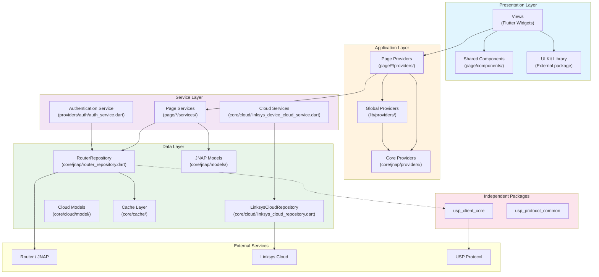

---

## 2. Project Directory Structure and Responsibilities

```
PrivacyGUI/
├── lib/
│   ├── main.dart                 # Application Entry Point
│   ├── app.dart                  # MaterialApp configuration
│   ├── di.dart                   # Dependency Injection Configuration
│   │
│   ├── core/                     # 📦 Core Infrastructure Layer (173 files)
│   │   ├── jnap/                 # JNAP Protocol Layer (76 files)
│   │   │   ├── actions/          # JNAP Action Definitions
│   │   │   ├── command/          # Command Executors
│   │   │   ├── models/           # JNAP Data Models (55 files)
│   │   │   ├── providers/        # Core State Management
│   │   │   └── router_repository.dart  # Main Repository
│   │   ├── cloud/                # Cloud Service Layer (31 files)
│   │   ├── cache/                # Cache Mechanism (6 files)
│   │   ├── data/                 # Shared Data Layer
│   │   │   ├── providers/        # Data State Management
│   │   │   └── services/         # Data Services
│   │   ├── http/                 # HTTP Client
│   │   ├── usp/                  # USP Protocol Layer (11 files)
│   │   └── utils/                # Utility Functions
│   │
│   ├── page/                     # 📱 Page Feature Modules (453 files)
│   │   ├── dashboard/            # Dashboard
│   │   ├── wifi_settings/        # WiFi Set up
│   │   ├── advanced_settings/    # Advanced Settings (136 files)
│   │   │   ├── dmz/              # ⭐ Example Module (Complete Layering)
│   │   │   ├── firewall/
│   │   │   ├── port_forwarding/
│   │   │   └── ...
│   │   ├── instant_device/       # Device Management
│   │   ├── instant_topology/     # Network Topology
│   │   ├── nodes/                # Node Management
│   │   └── ...                   # (Total of 21 feature modules)
│   │
│   ├── providers/                # 🔗 Global State Management (25 files)
│   │   ├── auth/                 # Authentication State (8 files)
│   │   ├── connectivity/         # Connectivity State
│   │   └── app_settings/         # App Settings
│   │
│   ├── route/                    # 🗺️ Route Configuration (14 files)
│   │   ├── router_provider.dart  # RouteStatus管理
│   │   ├── route_*.dart          # Per-page Route Definitions
│   │   └── constants.dart        # Route Constants
│   │
│   ├── constants/                # Constant Definitions (13 files)
│   ├── util/                     # Utility Classes (30 files)
│   └── l10n/                     # Internationalization (l10n) (26 files)
│
└── packages/                     # 📦 Independent Packages
    ├── usp_client_core/          # USP protocolCore
    └── usp_protocol_common/      # USP protocol共用
```

---

## 3. Clean Architecture Layered Analysis

### 3.1 Four-Layer Architecture Model

```mermaid
graph LR
    subgraph Layer1["Layer 1: Data Layer"]
        direction TB
        M1["JNAP Models"]
        M2["Cloud Models"]
        M3["Protocol Serialization<br/>(toMap/fromMap)"]
    end
    
    subgraph Layer2["Layer 2: Service Layer"]
        direction TB
        S1["Data ↔ UI Model Conversion"]
        S2["Protocol Handling"]
        S3["Business Logic"]
    end
    
    subgraph Layer3["Layer 3: Application Layer"]
        direction TB
        P1["Riverpod Notifiers"]
        P2["UI State Management"]
        P3["Reactive Subscriptions"]
    end
    
    subgraph Layer4["Layer 4: Presentation Layer"]
        direction TB
        V1["Flutter Widgets"]
        V2["UI Components"]
        V3["User Interactions"]
    end
    
    Layer1 --> Layer2
    Layer2 --> Layer3
    Layer3 --> Layer4
    
    style Layer1 fill:#c8e6c9
    style Layer2 fill:#e1bee7
    style Layer3 fill:#fff9c4
    style Layer4 fill:#bbdefb
```

### 3.2 Layer Responsibility Definitions

| Layer | Location | Responsibilities | Referencable Layers |
|------|------|------|--------------|
| **Data Layer** | `core/jnap/models/`, `core/cloud/model/` | Protocol Data Models, Serialization/Deserialization | None (Bottom Layer) |
| **Service Layer** | `page/*/services/`, `providers/auth/auth_service.dart` | Data ↔ UI Model Conversion, Protocol Handling | Data Layer |
| **Application Layer** | `page/*/providers/`, `lib/providers/`, `core/*/providers/` | State Management, Reactive Subscriptions | Service Layer |
| **Presentation Layer** | `page/*/views/`, `page/components/` | Flutter Widgets、User Interactions | Application Layer |

---

## 4. Module區塊圖 (Module Block Diagram)

### 4.1 Feature Modules Overview

```mermaid
graph TB
    subgraph CoreModules["Core Modules (lib/core/)"]
        JNAP["JNAP protocol<br/>76 files"]
        Cloud["Cloud Services<br/>31 files"]
        Data["dataLayer<br/>18 files"]
        Cache["Cache<br/>6 files"]
        HTTP["HTTP<br/>5 files"]
        USP["USP<br/>11 files"]
    end
    
    subgraph FeatureModules["Feature Modules (lib/page/)"]
        Dashboard["Dashboard<br/>74 files"]
        WiFi["WiFi Settings<br/>36 files"]
        Advanced["Advanced Settings<br/>136 files"]
        Device["Instant Device<br/>16 files"]
        Topology["Instant Topology<br/>13 files"]
        Nodes["Nodes<br/>22 files"]
        Setup["Instant Setup<br/>29 files"]
        Admin["Instant Admin<br/>18 files"]
        VPN["VPN<br/>8 files"]
        Health["Health Check<br/>14 files"]
        Login["Login<br/>10 files"]
    end
    
    subgraph SharedModules["Shared Modules"]
        GlobalProviders["Global Providers<br/>(lib/providers/)"]
        Route["Route<br/>(lib/route/)"]
        Components["Shared Components<br/>(page/components/)"]
    end
    
    subgraph Packages["Independent Packages"]
        UspClient["usp_client_core"]
        UspCommon["usp_protocol_common"]
    end
    
    FeatureModules --> CoreModules
    FeatureModules --> SharedModules
    SharedModules --> CoreModules
    CoreModules --> Packages
    
    style CoreModules fill:#e8f5e9
    style FeatureModules fill:#e3f2fd
    style SharedModules fill:#fff3e0
    style Packages fill:#fce4ec
```

### 4.2 ExampleModuleStructure (DMZ - Best Practice)

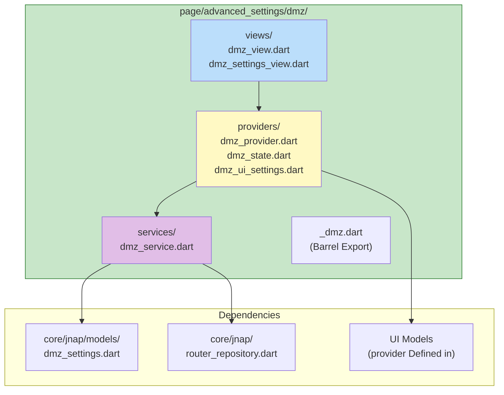

---

## 5. Domain Decoupling Analysis

### 5.1 Decoupling Evaluation Matrix

| Module | Layer Integrity | Dependency Direction | Model Isolation | Score |
|------|------------|----------|----------|------|
| **AI Module** (`lib/ai/`) | ✅ Complete | ✅ Correct | ✅ Abstract Interface | ⭐⭐⭐⭐⭐ |
| **USP 套件** (`packages/`) | ✅ Independent | ✅ Correct | ✅ Fully Isolated | ⭐⭐⭐⭐⭐ |
| **DMZ Module** | ✅ Complete | ✅ Correct | ✅ UI model | ⭐⭐⭐⭐⭐ |
| **Auth Module** | ✅ Complete | ✅ Correct | ✅ Service Layer | ⭐⭐⭐⭐ |
| **WiFi Settings** | ✅ Complete | ⚠️ Cross-page | ✅ UI model | ⭐⭐⭐⭐ |
| **Dashboard** | ✅ Complete | ⚠️ Cross-page | ⚠️ 部minutesviolations | ⭐⭐⭐ |
| **Nodes** | ✅ Complete | ⚠️ Cross-page | ✅ UI model | ⭐⭐⭐⭐ |

### 5.2 Dependency Graph

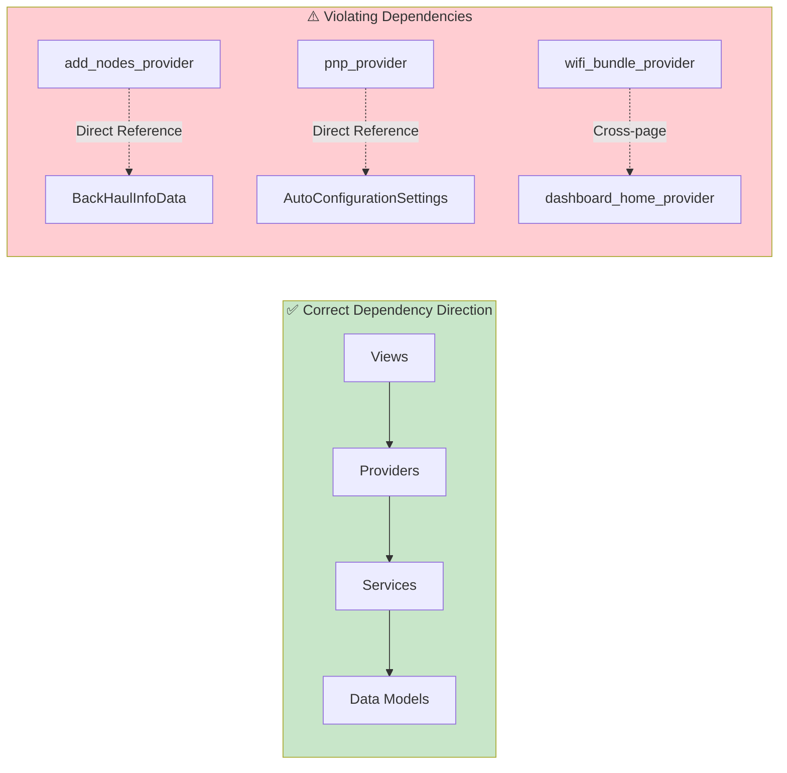

### 5.3 Cross-module Dependency Hotspots

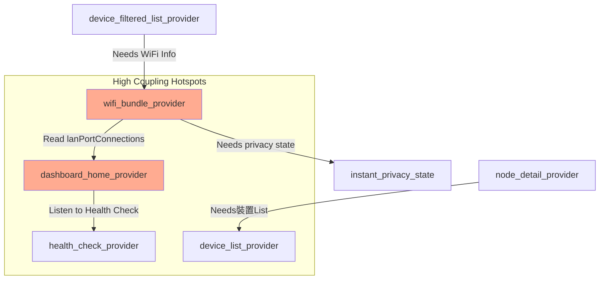

---

## 6. Data Flow Analysis

### 6.1 JNAP Command Execution Flow

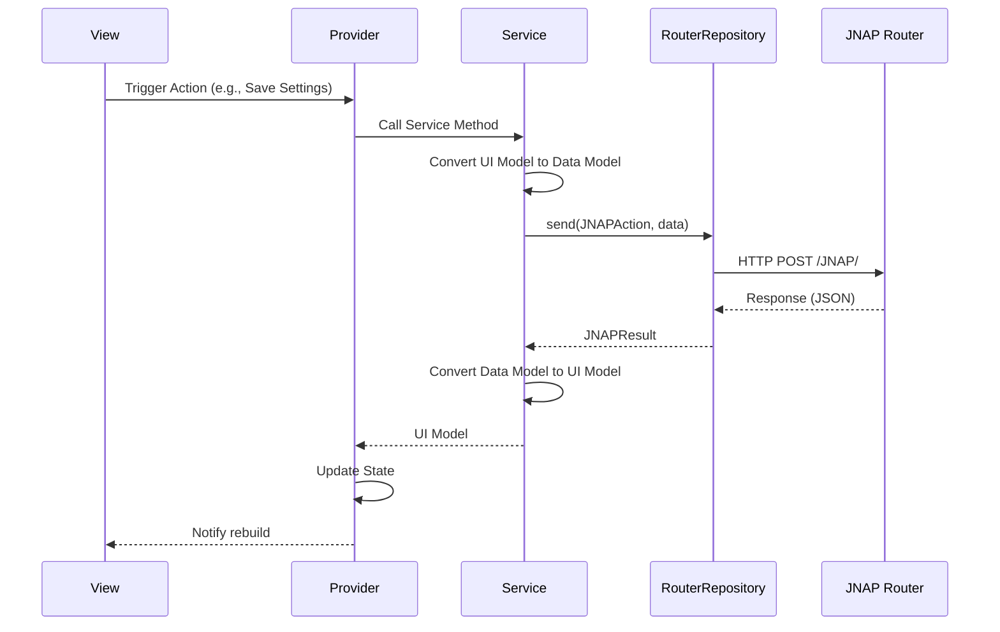

### 6.2 State Management Architecture

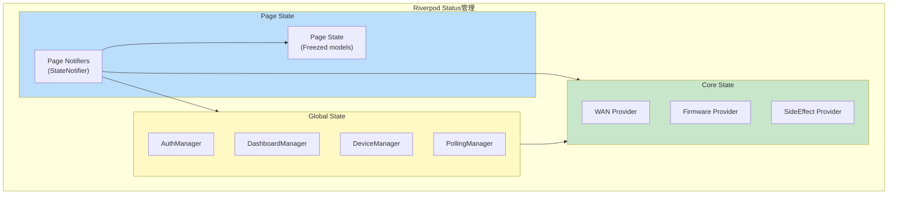

---

## 7. Protocol Abstraction Layer

### 7.1 Multi-protocol Support Architecture

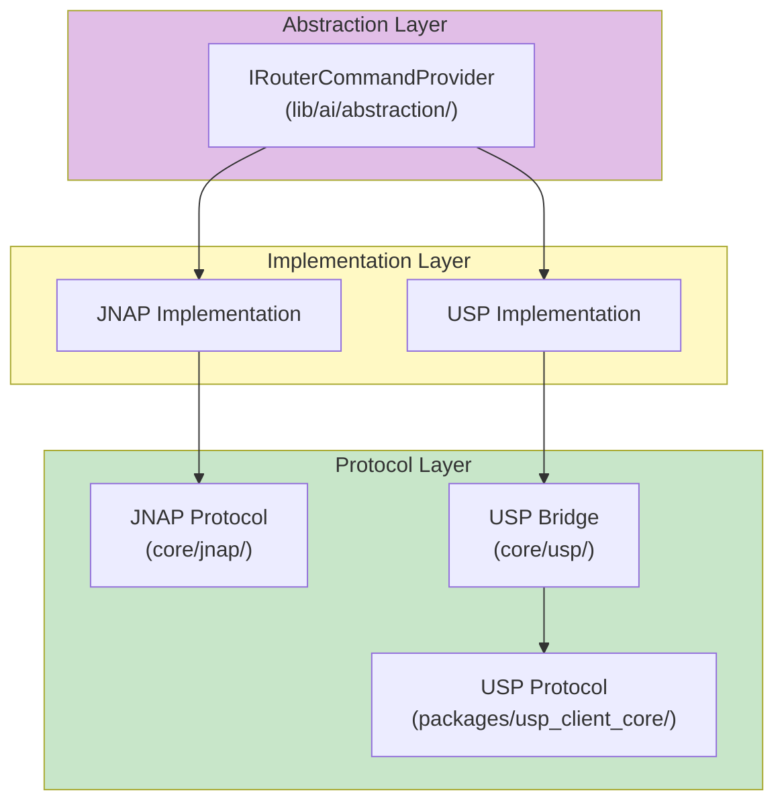

### 7.2 AI Module架構 (MCP Pattern)

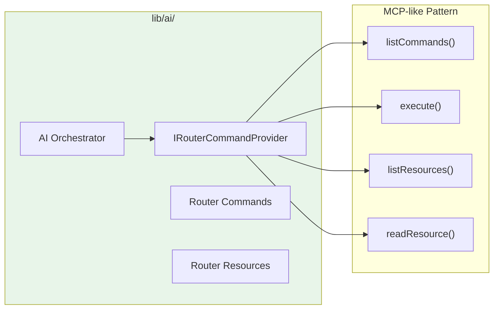

---

## 8. Issue Identification and Improvement Suggestions

### 8.1 majorIssueminutes類

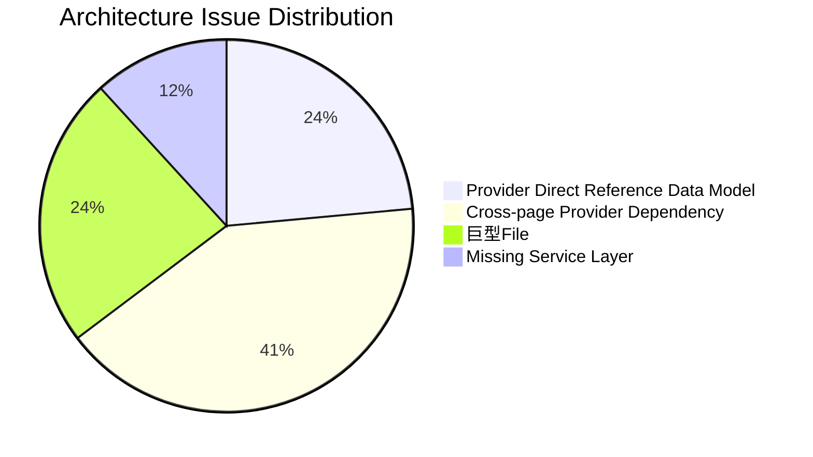

### 8.2 Improvement Priorities

| priority | Issue | impactScope | SuggestionFixTimeline |
|--------|------|----------|--------------|
| **P0** | Provider Direct Reference Data model | 1 File | 1 weeks |
| **P1** | Cross-page Provider Dependency | 3 File | 2-3 weeks |
| **P2** | 巨型FileSplit | 4 File | 按需進 |

---

## 9. 詳細IssueFileList

> [!IMPORTANT]
> Completeof架構violations詳細Report請參閱 [architecture-violations-detail.md](file:///Users/austin.chang/flutter-workspaces/privacyGUI/PrivacyGUI/doc/audit/architecture-violations-detail.md)，containsspecific code line numbers, violating code snippets, and suggested fixes。

### 🔴 P0: RouterRepository Used directly in Views

| File | Line Number | Issue | Fix方式 |
|------|------|------|----------|
| [prepare_dashboard_view.dart](file:///Users/austin.chang/flutter-workspaces/privacyGUI/PrivacyGUI/lib/page/dashboard/views/prepare_dashboard_view.dart) | 78-86 | 直接Use RouterRepository and JNAPAction | Create DashboardPrepareService |
| [router_assistant_view.dart](file:///Users/austin.chang/flutter-workspaces/privacyGUI/PrivacyGUI/lib/page/ai_assistant/views/router_assistant_view.dart) | 9-12 | Defining Provider in View file | Move to providers/ Directory |
| [local_network_settings_view.dart](file:///Users/austin.chang/flutter-workspaces/privacyGUI/PrivacyGUI/lib/page/advanced_settings/local_network_settings/views/local_network_settings_view.dart) | 270, 308 | Direct call `getLocalIP()` | Expose through Provider |
| [pnp_no_internet_connection_view.dart](file:///Users/austin.chang/flutter-workspaces/privacyGUI/PrivacyGUI/lib/page/instant_setup/troubleshooter/views/pnp_no_internet_connection_view.dart) | 119 | Direct check `isLoggedIn()` | Use AuthProvider |

---

### 🔴 P0: JNAPAction Used outside of Services

| File | Line Number | Issue | Fix方式 |
|------|------|------|----------|
| [prepare_dashboard_view.dart](file:///Users/austin.chang/flutter-workspaces/privacyGUI/PrivacyGUI/lib/page/dashboard/views/prepare_dashboard_view.dart) | 82 | 直接Use `JNAPAction.getDeviceInfo` | Encapsulate into Service |
| [select_network_provider.dart](file:///Users/austin.chang/flutter-workspaces/privacyGUI/PrivacyGUI/lib/page/select_network/providers/select_network_provider.dart) | 56 | 直接Use `JNAPAction.isAdminPasswordDefault` | Create SelectNetworkService |

---

### 🟠 P1: Cross-page Provider Dependency

| 來源File | 被ReferenceFile | Line Number | Issue描述 | Status |
|----------|------------|------|----------|------|
| [device_filtered_list_provider.dart](file:///Users/austin.chang/flutter-workspaces/privacyGUI/PrivacyGUI/lib/page/instant_device/providers/device_filtered_list_provider.dart) | `wifi_bundle_provider` | 9, 83-91 | 跨 `instant_device` → `wifi_settings` Read WiFi SSID List | ✅ Fixed |
| [wifi_bundle_provider.dart](file:///Users/austin.chang/flutter-workspaces/privacyGUI/PrivacyGUI/lib/page/wifi_settings/providers/wifi_bundle_provider.dart) | `instant_privacy_state` | 9, 60-61 | 跨 `wifi_settings` → `instant_privacy` Reference State Type | ✅ Fixed |
| [displayed_mac_filtering_devices_provider.dart](file:///Users/austin.chang/flutter-workspaces/privacyGUI/PrivacyGUI/lib/page/wifi_settings/providers/displayed_mac_filtering_devices_provider.dart) | `instant_device/_instant_device` | 2 | 跨Module取得裝置Info | ✅ Fixed |

**device_filtered_list_provider.dart IssueCode:**
```dart
// line 9 - Cross-page Reference
import 'package:privacy_gui/page/wifi_settings/providers/wifi_bundle_provider.dart';

// line 83-91 - Directly reading other page Provider state
List<String> getWifiNames() {
  final wifiState = ref.read(wifiBundleProvider);
  return [
    ...wifiState.settings.current.wifiList.mainWiFi.map((e) => e.ssid),
    wifiState.settings.current.wifiList.guestWiFi.ssid,
  ];
}
```

**SuggestionFix:** 將 WiFi SSID List提取到 `core/data/providers/wifi_radios_provider.dart` 或創建Sharedof `lib/providers/wifi_names_provider.dart`。

---

### 🟡 P2: Large Files (Need Splitting)

| File | 大小 | Issue | Suggested Splitting Method |
|------|------|------|--------------|
| [jnap_tr181_mapper.dart](file:///Users/austin.chang/flutter-workspaces/privacyGUI/PrivacyGUI/lib/core/usp/jnap_tr181_mapper.dart) | ~42KB | JNAP ↔ TR-181 mappingLogic過於Concentrated | Split by functional domain (WiFi, Device, Network) |
| [router_provider.dart](file:///Users/austin.chang/flutter-workspaces/privacyGUI/PrivacyGUI/lib/route/router_provider.dart) | ~19KB | RouteLogicandAuthLogicMixed | Separate `auth_guard.dart` and `route_config.dart` |
| [router_repository.dart](file:///Users/austin.chang/flutter-workspaces/privacyGUI/PrivacyGUI/lib/core/jnap/router_repository.dart) | ~15KB | Multiple命令TypeHandlingMixed | Split HTTP/BT/Remote 命令Handling |
| [linksys_cloud_repository.dart](file:///Users/austin.chang/flutter-workspaces/privacyGUI/PrivacyGUI/lib/core/cloud/linksys_cloud_repository.dart) | ~16KB | CloudFunction過於Concentrated | 按FunctionSplit (Auth, Device, User) |

---

### ✅ Good Examples of Fixed Code

| Module | Structure | Features |
|------|------|------|
| [dashboard/](file:///Users/austin.chang/flutter-workspaces/privacyGUI/PrivacyGUI/lib/page/dashboard/) | providers + services + views | `dashboard_home_provider.dart` 已Use Service Layer |
| [dmz/](file:///Users/austin.chang/flutter-workspaces/privacyGUI/PrivacyGUI/lib/page/advanced_settings/dmz/) | providers + services + views | Complete 4 LayerSeparate，是最佳Example |
| [add_nodes/](file:///Users/austin.chang/flutter-workspaces/privacyGUI/PrivacyGUI/lib/page/nodes/providers/add_nodes_provider.dart) | providers + services | 已委派給 `add_nodes_service.dart` |
| [nodes/](file:///Users/austin.chang/flutter-workspaces/privacyGUI/PrivacyGUI/lib/page/nodes/) | providers + services + state | `NodeLightSettings` Refactored to Clean Architecture |
| [nodes/](file:///Users/austin.chang/flutter-workspaces/privacyGUI/PrivacyGUI/lib/page/nodes/) | providers + services + state | `NodeLightSettings` Refactored to Clean Architecture |
| [ai/](file:///Users/austin.chang/flutter-workspaces/privacyGUI/PrivacyGUI/lib/ai/) | abstraction + orchestrator | Use `IRouterCommandProvider` Abstract Interface |
| **Cross-Page Refs** | Shared Models in Core | `DeviceListItem`, `InstantPrivacySettings` 已Moved to core layer shared |

---

## 10. Concrete Improvement Plans

### 方案 A: Extract Shared State to Core Layer

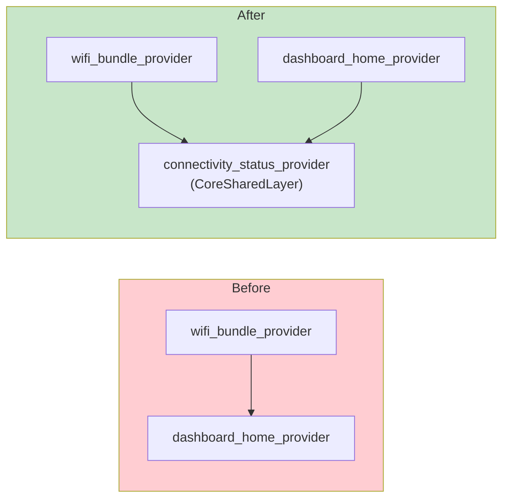

### 方案 B: Establish Module Barrel Export

```dart
// lib/page/wifi_settings/_wifi_settings.dart (Barrel Export)
// Only expose public API

export 'providers/wifi_bundle_provider.dart' show wifiBundleProvider;
export 'models/wifi_status.dart';
// 隱藏內部ImplementationDetails
```

---

## 9. Summary Scores

| Dimension | Score | Description |
|------|------|------|
| 整體架構Design | ⭐⭐⭐⭐ | 4 Layer架構Clear，有文件化spec |
| protocolAbstraction | ⭐⭐⭐⭐⭐ | AI、USP ModuleDecouplingExcellent |
| 頁面ModuleDecoupling | ⭐⭐⭐ | 存in跨ModuleDependencyIssue |
| Provider Layer純淨level | ⭐⭐⭐ | 5 places Data Model violations |
| ModuleBoundaryClearlevel | ⭐⭐⭐ | Barrel export Use不一致 |

**總體Score: 3.6 / 5 ⭐**

Project架構DesignGood，Core Modules (AI、USP、DMZ) 展現了ExcellentofDecouplingPractices。majorImprovement重點in於：
1. Provider Layer不應Direct Reference Data Model
2. 減少跨Feature Modulesof Provider Dependency
3. UnifiedEstablish Module Barrel Export 機制

---

## 10. 參考資源

- 現有架構Analysis: [architecture_analysis_2026-01-05.md](file:///Users/austin.chang/flutter-workspaces/privacyGUI/PrivacyGUI/doc/architecture_analysis_2026-01-05.md)
- DMZ 重構spec: [specs/002-dmz-refactor/](file:///Users/austin.chang/flutter-workspaces/privacyGUI/PrivacyGUI/specs/002-dmz-refactor/)
- UI Kit Library: [privacyGUI-UI-kit](file:///Users/austin.chang/flutter-workspaces/ui_kit)
