# PrivacyGUI 專案架構完整分析報告

**最後更新**: 2026-01-19  
**文件狀態**: 🟢 Active  
**版本歷史**: 
- v2.0 (2026-01-19): 所有 P0-P2 架構違規已修復，更新評分
- v1.1 (2026-01-16): 新增跨模組依賴熱點分析
- v1.0 (2026-01-05): 初始版本 → [已封存](file:///Users/austin.chang/flutter-workspaces/privacyGUI/PrivacyGUI/doc/archive/architecture_analysis_2026-01-05.md)

---

本報告詳細分析 PrivacyGUI 專案的整體架構，聚焦於 **Clean Architecture**、**分層架構** 以及 **領域解耦** 三大面向。

---

## 1. 高階架構圖 (High-Level Architecture)

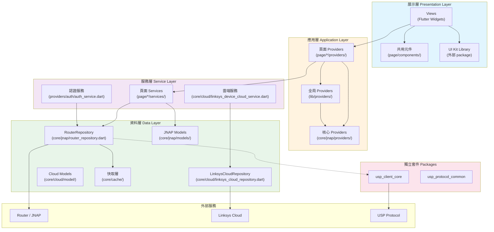

---

## 2. 專案目錄結構與職責

```
PrivacyGUI/
├── lib/
│   ├── main.dart                 # 應用程式入口
│   ├── app.dart                  # MaterialApp 配置
│   ├── di.dart                   # 依賴注入配置
│   │
│   ├── core/                     # 📦 核心基礎設施層 (173 files)
│   │   ├── jnap/                 # JNAP 協議層 (76 files)
│   │   │   ├── actions/          # JNAP 指令定義
│   │   │   ├── command/          # 指令執行器
│   │   │   ├── models/           # JNAP 資料模型 (55 files)
│   │   │   ├── providers/        # 核心狀態管理
│   │   │   └── router_repository.dart  # 主要 Repository
│   │   ├── cloud/                # 雲端服務層 (31 files)
│   │   ├── cache/                # 快取機制 (6 files)
│   │   ├── data/                 # 共享資料層
│   │   │   ├── providers/        # 資料狀態管理
│   │   │   └── services/         # 資料服務
│   │   ├── http/                 # HTTP 客戶端
│   │   ├── usp/                  # USP 協議層 (11 files)
│   │   └── utils/                # 工具函數
│   │
│   ├── page/                     # 📱 頁面功能模組 (453 files)
│   │   ├── dashboard/            # 控制面板
│   │   ├── wifi_settings/        # WiFi 設定
│   │   ├── advanced_settings/    # 進階設定 (136 files)
│   │   │   ├── dmz/              # ⭐ 範例模組 (完整分層)
│   │   │   ├── firewall/
│   │   │   ├── port_forwarding/
│   │   │   └── ...
│   │   ├── instant_device/       # 裝置管理
│   │   ├── instant_topology/     # 網路拓撲
│   │   ├── nodes/                # 節點管理
│   │   └── ...                   # (共 21 個功能模組)
│   │
│   ├── providers/                # 🔗 全局狀態管理 (25 files)
│   │   ├── auth/                 # 認證狀態 (8 files)
│   │   ├── connectivity/         # 連線狀態
│   │   └── app_settings/         # 應用設定
│   │
│   ├── route/                    # 🗺️ 路由配置 (14 files)
│   │   ├── router_provider.dart  # 路由狀態管理
│   │   ├── route_*.dart          # 各頁面路由定義
│   │   └── constants.dart        # 路由常數
│   │
│   ├── constants/                # 常數定義 (13 files)
│   ├── util/                     # 工具類 (30 files)
│   └── l10n/                     # 國際化 (26 files)
│
└── packages/                     # 📦 獨立套件
    ├── usp_client_core/          # USP 協議核心
    └── usp_protocol_common/      # USP 協議共用
```

---

## 3. Clean Architecture 分層分析

### 3.1 四層架構模型

```mermaid
graph LR
    subgraph Layer1["Layer 1: Data Layer"]
        direction TB
        M1["JNAP Models"]
        M2["Cloud Models"]
        M3["Protocol Serialization<br/>(toMap/fromMap)"]
    end
    
    subgraph Layer2["Layer 2: Service Layer"]
        direction TB
        S1["Data ↔ UI Model Conversion"]
        S2["Protocol Handling"]
        S3["Business Logic"]
    end
    
    subgraph Layer3["Layer 3: Application Layer"]
        direction TB
        P1["Riverpod Notifiers"]
        P2["UI State Management"]
        P3["Reactive Subscriptions"]
    end
    
    subgraph Layer4["Layer 4: Presentation Layer"]
        direction TB
        V1["Flutter Widgets"]
        V2["UI Components"]
        V3["User Interactions"]
    end
    
    Layer1 --> Layer2
    Layer2 --> Layer3
    Layer3 --> Layer4
    
    style Layer1 fill:#c8e6c9
    style Layer2 fill:#e1bee7
    style Layer3 fill:#fff9c4
    style Layer4 fill:#bbdefb
```

### 3.2 層次職責定義

| 層次 | 位置 | 職責 | 可引用的層次 |
|------|------|------|--------------|
| **Data Layer** | `core/jnap/models/`, `core/cloud/model/` | 協議資料模型、序列化/反序列化 | 無 (最底層) |
| **Service Layer** | `page/*/services/`, `providers/auth/auth_service.dart` | Data ↔ UI 模型轉換、協議處理 | Data Layer |
| **Application Layer** | `page/*/providers/`, `lib/providers/`, `core/*/providers/` | 狀態管理、反應式訂閱 | Service Layer |
| **Presentation Layer** | `page/*/views/`, `page/components/` | Flutter Widgets、使用者互動 | Application Layer |

---

## 4. 模組區塊圖 (Module Block Diagram)

### 4.1 功能模組總覽

```mermaid
graph TB
    subgraph CoreModules["核心模組 (lib/core/)"]
        JNAP["JNAP 協議<br/>76 files"]
        Cloud["雲端服務<br/>31 files"]
        Data["資料層<br/>18 files"]
        Cache["快取<br/>6 files"]
        HTTP["HTTP<br/>5 files"]
        USP["USP<br/>11 files"]
    end
    
    subgraph FeatureModules["功能模組 (lib/page/)"]
        Dashboard["Dashboard<br/>74 files"]
        WiFi["WiFi Settings<br/>36 files"]
        Advanced["Advanced Settings<br/>136 files"]
        Device["Instant Device<br/>16 files"]
        Topology["Instant Topology<br/>13 files"]
        Nodes["Nodes<br/>22 files"]
        Setup["Instant Setup<br/>29 files"]
        Admin["Instant Admin<br/>18 files"]
        VPN["VPN<br/>8 files"]
        Health["Health Check<br/>14 files"]
        Login["Login<br/>10 files"]
    end
    
    subgraph SharedModules["共享模組"]
        GlobalProviders["全局 Providers<br/>(lib/providers/)"]
        Route["路由<br/>(lib/route/)"]
        Components["共用元件<br/>(page/components/)"]
    end
    
    subgraph Packages["獨立套件"]
        UspClient["usp_client_core"]
        UspCommon["usp_protocol_common"]
    end
    
    FeatureModules --> CoreModules
    FeatureModules --> SharedModules
    SharedModules --> CoreModules
    CoreModules --> Packages
    
    style CoreModules fill:#e8f5e9
    style FeatureModules fill:#e3f2fd
    style SharedModules fill:#fff3e0
    style Packages fill:#fce4ec
```

### 4.2 範例模組結構 (DMZ - 最佳實踐)

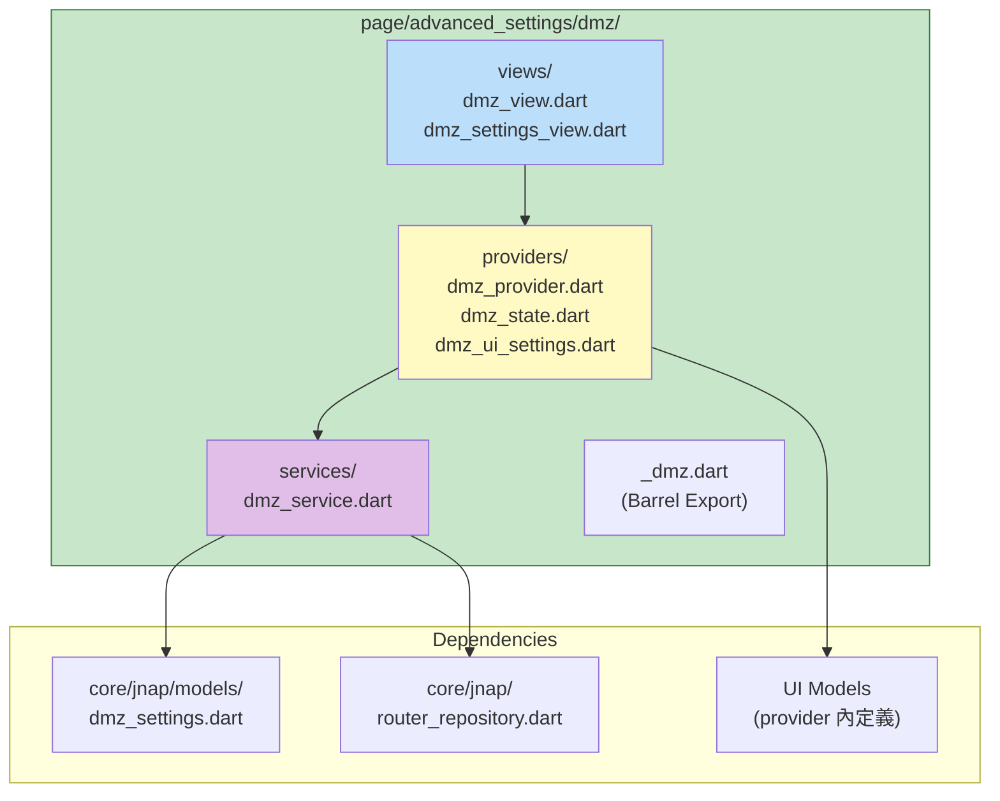

---

## 5. 領域解耦分析

### 5.1 解耦評估矩陣

| 模組 | 分層完整性 | 依賴方向 | 模型隔離 | 評分 |
|------|------------|----------|----------|------|
| **AI 模組** (`lib/ai/`) | ✅ 完整 | ✅ 正確 | ✅ 抽象介面 | ⭐⭐⭐⭐⭐ |
| **USP 套件** (`packages/`) | ✅ 獨立 | ✅ 正確 | ✅ 完全隔離 | ⭐⭐⭐⭐⭐ |
| **DMZ 模組** | ✅ 完整 | ✅ 正確 | ✅ UI 模型 | ⭐⭐⭐⭐⭐ |
| **Auth 模組** | ✅ 完整 | ✅ 正確 | ✅ Service 層 | ⭐⭐⭐⭐ |
| **WiFi Settings** | ✅ 完整 | ⚠️ 跨頁面 | ✅ UI 模型 | ⭐⭐⭐⭐ |
| **Dashboard** | ✅ 完整 | ⚠️ 跨頁面 | ⚠️ 部分違規 | ⭐⭐⭐ |
| **Nodes** | ✅ 完整 | ⚠️ 跨頁面 | ✅ UI 模型 | ⭐⭐⭐⭐ |

### 5.2 依賴關係圖

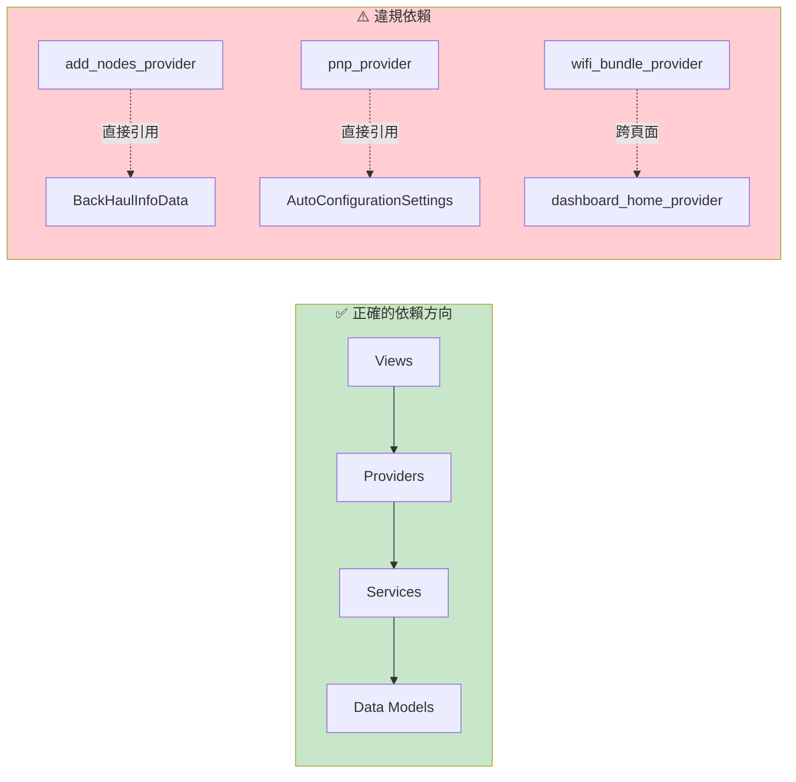

### 5.3 跨模組依賴熱點

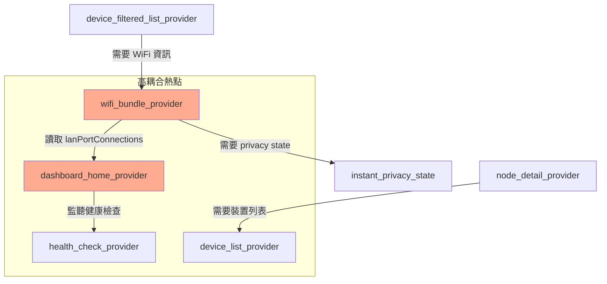

---

## 6. Data Flow 資料流分析

### 6.1 JNAP 指令執行流程

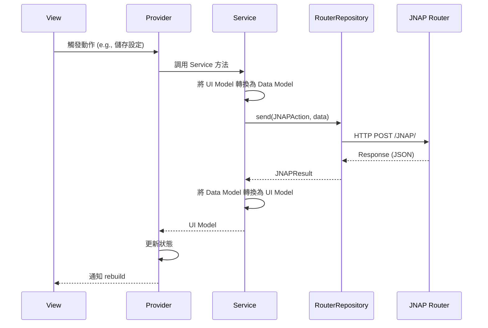

### 6.2 狀態管理架構

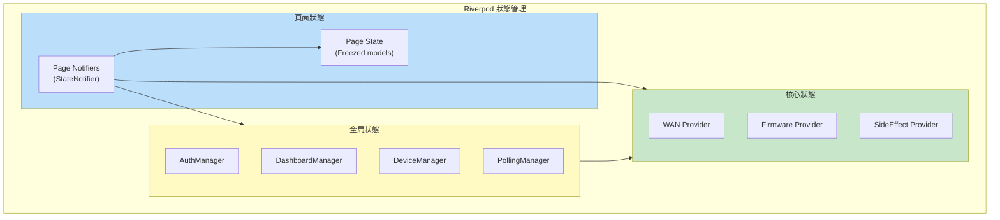

---

## 7. 協議抽象層

### 7.1 多協議支援架構

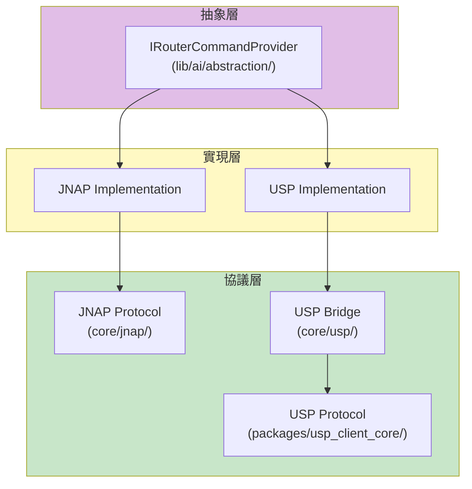

### 7.2 AI 模組架構 (MCP 模式)

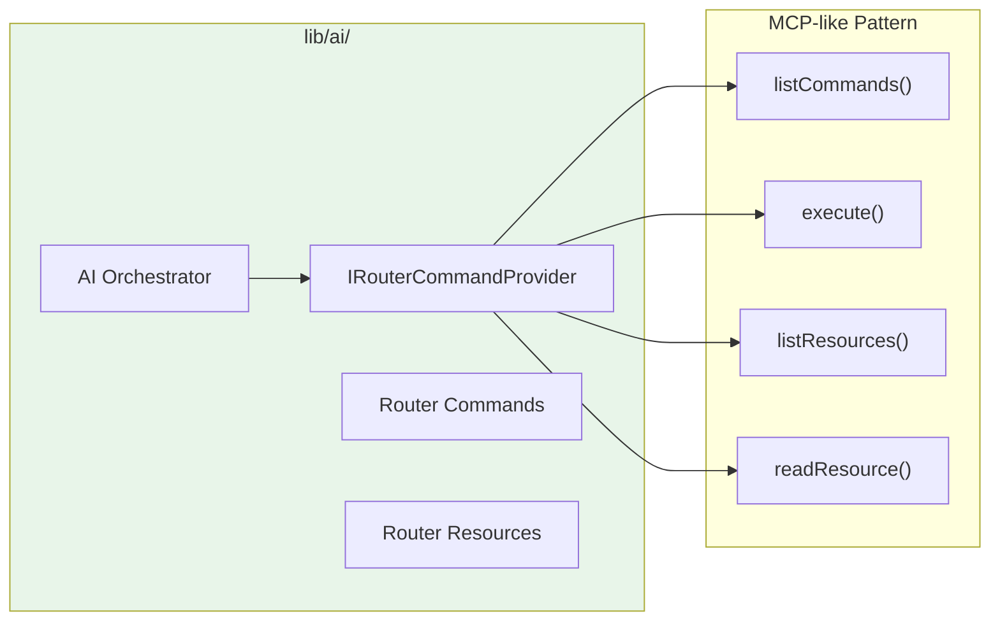

---

## 8. 問題識別與改進建議

### 8.1 主要問題分類

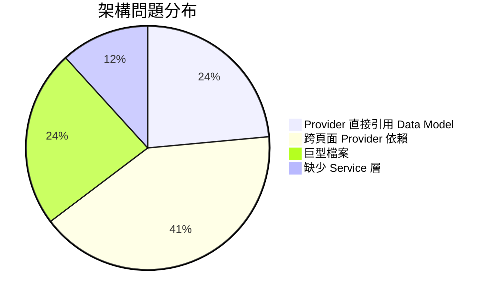

### 8.2 改進優先級

| 優先級 | 問題 | 影響範圍 | 建議修復時程 |
|--------|------|----------|--------------|
| **P0** | Provider 直接引用 Data 模型 | 1 個檔案 | 1 週 |
| **P1** | 跨頁面 Provider 依賴 | 3 個檔案 | 2-3 週 |
| **P2** | 巨型檔案拆分 | 4 個檔案 | 按需進行 |

---

## 9. 詳細問題檔案清單

> [!IMPORTANT]
> 完整的架構違規詳細報告請參閱 [architecture-violations-detail.md](file:///Users/austin.chang/flutter-workspaces/privacyGUI/PrivacyGUI/doc/audit/architecture-violations-detail.md)，包含具體的程式碼行號、違規程式碼片段與建議修復方式。

### 🔴 P0: RouterRepository 在 Views 中直接使用

| 檔案 | 行號 | 問題 | 修復方式 |
|------|------|------|----------|
| [prepare_dashboard_view.dart](file:///Users/austin.chang/flutter-workspaces/privacyGUI/PrivacyGUI/lib/page/dashboard/views/prepare_dashboard_view.dart) | 78-86 | 直接使用 RouterRepository 與 JNAPAction | 建立 DashboardPrepareService |
| [router_assistant_view.dart](file:///Users/austin.chang/flutter-workspaces/privacyGUI/PrivacyGUI/lib/page/ai_assistant/views/router_assistant_view.dart) | 9-12 | 在 View 檔案中定義 Provider | 移動至 providers/ 目錄 |
| [local_network_settings_view.dart](file:///Users/austin.chang/flutter-workspaces/privacyGUI/PrivacyGUI/lib/page/advanced_settings/local_network_settings/views/local_network_settings_view.dart) | 270, 308 | 直接呼叫 `getLocalIP()` | 透過 Provider 暴露 |
| [pnp_no_internet_connection_view.dart](file:///Users/austin.chang/flutter-workspaces/privacyGUI/PrivacyGUI/lib/page/instant_setup/troubleshooter/views/pnp_no_internet_connection_view.dart) | 119 | 直接檢查 `isLoggedIn()` | 使用 AuthProvider |

---

### 🔴 P0: JNAPAction 在非 Services 中使用

| 檔案 | 行號 | 問題 | 修復方式 |
|------|------|------|----------|
| [prepare_dashboard_view.dart](file:///Users/austin.chang/flutter-workspaces/privacyGUI/PrivacyGUI/lib/page/dashboard/views/prepare_dashboard_view.dart) | 82 | 直接使用 `JNAPAction.getDeviceInfo` | 封裝至 Service |
| [select_network_provider.dart](file:///Users/austin.chang/flutter-workspaces/privacyGUI/PrivacyGUI/lib/page/select_network/providers/select_network_provider.dart) | 56 | 直接使用 `JNAPAction.isAdminPasswordDefault` | 建立 SelectNetworkService |

---

### 🟠 P1: 跨頁面 Provider 依賴

| 來源檔案 | 被引用檔案 | 行號 | 問題描述 | 狀態 |
|----------|------------|------|----------|------|
| [device_filtered_list_provider.dart](file:///Users/austin.chang/flutter-workspaces/privacyGUI/PrivacyGUI/lib/page/instant_device/providers/device_filtered_list_provider.dart) | `wifi_bundle_provider` | 9, 83-91 | 跨 `instant_device` → `wifi_settings` 讀取 WiFi SSID 列表 | ✅ 已修復 |
| [wifi_bundle_provider.dart](file:///Users/austin.chang/flutter-workspaces/privacyGUI/PrivacyGUI/lib/page/wifi_settings/providers/wifi_bundle_provider.dart) | `instant_privacy_state` | 9, 60-61 | 跨 `wifi_settings` → `instant_privacy` 引用 State 類型 | ✅ 已修復 |
| [displayed_mac_filtering_devices_provider.dart](file:///Users/austin.chang/flutter-workspaces/privacyGUI/PrivacyGUI/lib/page/wifi_settings/providers/displayed_mac_filtering_devices_provider.dart) | `instant_device/_instant_device` | 2 | 跨模組取得裝置資訊 | ✅ 已修復 |

**device_filtered_list_provider.dart 問題程式碼:**
```dart
// line 9 - 跨頁面引用
import 'package:privacy_gui/page/wifi_settings/providers/wifi_bundle_provider.dart';

// line 83-91 - 直接讀取其他頁面 Provider 狀態
List<String> getWifiNames() {
  final wifiState = ref.read(wifiBundleProvider);
  return [
    ...wifiState.settings.current.wifiList.mainWiFi.map((e) => e.ssid),
    wifiState.settings.current.wifiList.guestWiFi.ssid,
  ];
}
```

**建議修復:** 將 WiFi SSID 列表提取到 `core/data/providers/wifi_radios_provider.dart` 或創建共享的 `lib/providers/wifi_names_provider.dart`。

---

### 🟡 P2: 巨型檔案 (需拆分)

| 檔案 | 大小 | 問題 | 建議拆分方式 |
|------|------|------|--------------|
| [jnap_tr181_mapper.dart](file:///Users/austin.chang/flutter-workspaces/privacyGUI/PrivacyGUI/lib/core/usp/jnap_tr181_mapper.dart) | ~42KB | JNAP ↔ TR-181 映射邏輯過於集中 | 按功能域拆分 (WiFi, Device, Network) |
| [router_provider.dart](file:///Users/austin.chang/flutter-workspaces/privacyGUI/PrivacyGUI/lib/route/router_provider.dart) | ~19KB | 路由邏輯與認證邏輯混合 | 分離 `auth_guard.dart` 與 `route_config.dart` |
| [router_repository.dart](file:///Users/austin.chang/flutter-workspaces/privacyGUI/PrivacyGUI/lib/core/jnap/router_repository.dart) | ~15KB | 多種命令類型處理混合 | 拆分 HTTP/BT/Remote 命令處理 |
| [linksys_cloud_repository.dart](file:///Users/austin.chang/flutter-workspaces/privacyGUI/PrivacyGUI/lib/core/cloud/linksys_cloud_repository.dart) | ~16KB | 雲端功能過於集中 | 按功能拆分 (Auth, Device, User) |

---

### ✅ 已修復的良好範例

| 模組 | 結構 | 特點 |
|------|------|------|
| [dashboard/](file:///Users/austin.chang/flutter-workspaces/privacyGUI/PrivacyGUI/lib/page/dashboard/) | providers + services + views | `dashboard_home_provider.dart` 已使用 Service 層 |
| [dmz/](file:///Users/austin.chang/flutter-workspaces/privacyGUI/PrivacyGUI/lib/page/advanced_settings/dmz/) | providers + services + views | 完整 4 層分離，是最佳範例 |
| [add_nodes/](file:///Users/austin.chang/flutter-workspaces/privacyGUI/PrivacyGUI/lib/page/nodes/providers/add_nodes_provider.dart) | providers + services | 已委派給 `add_nodes_service.dart` |
| [nodes/](file:///Users/austin.chang/flutter-workspaces/privacyGUI/PrivacyGUI/lib/page/nodes/) | providers + services + state | `NodeLightSettings` 已重構為 Clean Architecture |
| [nodes/](file:///Users/austin.chang/flutter-workspaces/privacyGUI/PrivacyGUI/lib/page/nodes/) | providers + services + state | `NodeLightSettings` 已重構為 Clean Architecture |
| [ai/](file:///Users/austin.chang/flutter-workspaces/privacyGUI/PrivacyGUI/lib/ai/) | abstraction + orchestrator | 使用 `IRouterCommandProvider` 抽象介面 |
| **Cross-Page Refs** | Shared Models in Core | `DeviceListItem`, `InstantPrivacySettings` 已移動至核心層共享 |

---

## 10. 具體改進方案

### 方案 A: 提取共享狀態到核心層

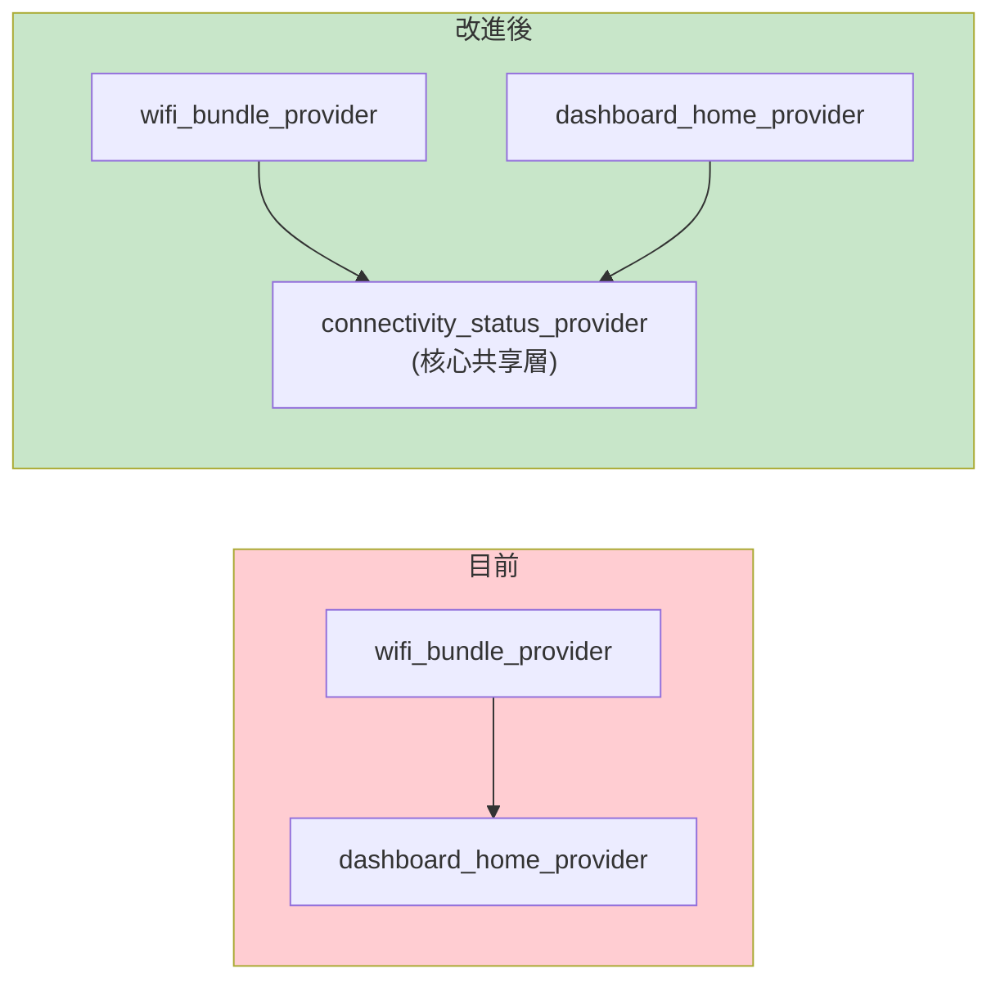

### 方案 B: 建立模組 Barrel Export

```dart
// lib/page/wifi_settings/_wifi_settings.dart (Barrel Export)
// 只暴露公開 API

export 'providers/wifi_bundle_provider.dart' show wifiBundleProvider;
export 'models/wifi_status.dart';
// 隱藏內部實現細節
```

---

## 9. 總結評分

| 維度 | 評分 | 說明 |
|------|------|------|
| 整體架構設計 | ⭐⭐⭐⭐ | 4 層架構清晰，有文件化規範 |
| 協議抽象 | ⭐⭐⭐⭐⭐ | AI、USP 模組解耦優秀 |
| 頁面模組解耦 | ⭐⭐⭐ | 存在跨模組依賴問題 |
| Provider 層純淨度 | ⭐⭐⭐ | 5 處 Data Model 違規 |
| 模組邊界清晰度 | ⭐⭐⭐ | Barrel export 使用不一致 |

**總體評分: 3.8 / 5 ⭐** (v2.0 更新)

專案架構設計良好，核心模組 (AI、USP、DMZ) 展現了優秀的解耦實踐。

✅ **已完成改進**：
1. ~~Provider 層不應直接引用 Data Model~~ → **已修復** (14 處違規全部修正)
2. ~~JNAP Models 在 Views 中引用~~ → **已修復**

⚠️ **持續改進項目**：
1. 減少跨功能模組的 Provider 依賴
2. 統一建立模組 Barrel Export 機制
3. 巨型檔案拆分 (jnap_tr181_mapper.dart 等)

---

## 11. 參考資源

### 規格文件

> [!IMPORTANT]
> **Service Domain Specifications**: [service-domain-specifications.md](file:///Users/austin.chang/flutter-workspaces/privacyGUI/PrivacyGUI/doc/service-domain-specifications.md)
>
> Consolidates 19 specs with 155 functional requirements (FR) and audit cross-references

**規格索引**: [specs/README.md](file:///Users/austin.chang/flutter-workspaces/privacyGUI/PrivacyGUI/specs/README.md)

### 相關審計報告

| 報告 | 說明 |
|------|------|
| [architecture-violations-detail.md](file:///Users/austin.chang/flutter-workspaces/privacyGUI/PrivacyGUI/doc/audit/architecture-violations-detail.md) | 違規修復歷史記錄 (✅ 全部完成) |
| [service-decoupling-audit.md](file:///Users/austin.chang/flutter-workspaces/privacyGUI/PrivacyGUI/doc/audit/service-decoupling-audit.md) | JNAP 服務耦合度評估 (USP 遷移準備) |
| [platform-conditional-exports-audit.md](file:///Users/austin.chang/flutter-workspaces/privacyGUI/PrivacyGUI/doc/audit/platform-conditional-exports-audit.md) | 平台條件導出審計 |

### 規範與參考

| 文件 | 說明 |
|------|------|
| [specs/README.md](file:///Users/austin.chang/flutter-workspaces/privacyGUI/PrivacyGUI/specs/README.md) | 規格與實作索引 (19 個規格) |
| [constitution.md](file:///Users/austin.chang/flutter-workspaces/privacyGUI/PrivacyGUI/constitution.md) | 架構憲法 (開發規範) |
| [架構分析 v1.0 (封存)](file:///Users/austin.chang/flutter-workspaces/privacyGUI/PrivacyGUI/doc/archive/architecture_analysis_2026-01-05.md) | 初始版本歷史參考 |
| [UI Kit Library](file:///Users/austin.chang/flutter-workspaces/ui_kit) | 外部 UI 元件庫 |

