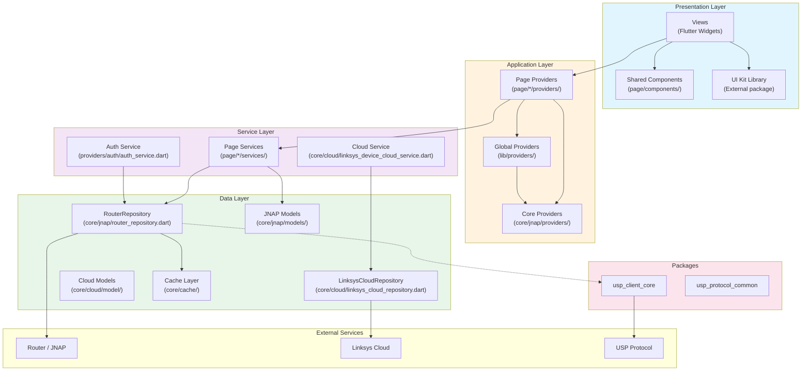
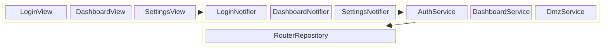

# PrivacyGUI Architecture Analysis Report

**Last Updated**: 2026-01-19
**Status**: 🟢 Active
**Version History**:
- v2.0 (2026-01-19): All P0-P2 architecture violations fixed, updated score
- v1.1 (2026-01-16): Added cross-module dependency hotspot analysis
- v1.0 (2026-01-05): Initial version → [Archived](../archive/architecture_analysis_2026-01-05.md)

---

This report provides a detailed analysis of the PrivacyGUI project architecture, focusing on **Clean Architecture**, **Layered Architecture**, and **Domain Decoupling**.

---

## 1. High-Level Architecture



---

## 2. Directory Structure & Responsibilities

```
PrivacyGUI/
├── lib/
│   ├── main.dart                 # Application Entry Point
│   ├── app.dart                  # MaterialApp Configuration
│   ├── di.dart                   # Dependency Injection Config
│   │
│   ├── core/                     # 📦 Core Infrastructure Layer (173 files)
│   │   ├── jnap/                 # JNAP Protocol Layer (76 files)
│   │   │   ├── actions/          # JNAP Action Definitions
│   │   │   ├── command/          # Command Executors
│   │   │   ├── models/           # JNAP Data Models (55 files)
│   │   │   ├── providers/        # Core JNAP Providers
│   │   │   └── router_repository.dart # JNAP Gateway (Critical)
│   │   ├── cloud/                # Cloud Infrastructure
│   │   ├── errors/               # Standardized Error Handling
│   │   └── utils/                # Core Utilities
│   │
│   ├── page/                     # 📱 Feature Modules (Pages)
│   │   ├── login/                # Login Feature
│   │   ├── dashboard/            # Dashboard
│   │   ├── advanced_settings/    # Advanced Settings
│   │   └── nodes/                # Node Management
│   │       ├── views/            # UI Widgets (Presentation)
│   │       ├── providers/        # State Managament (Application)
│   │       └── services/         # Business Logic (Service)
│   │
│   ├── providers/                # 🌐 Global Providers
│   │   ├── auth/                 # Authentication
│   │   ├── connectivity/         # Network Connectivity
│   │   └── side_effects/         # Side Effect Handlers
│   │
│   └── route/                    # Routing Configuration (GoRouter)
```

---

## 3. Clean Architecture Implementation Analysis

We evaluate the project based on the 4-layer architecture defined in `constitution.md`.

| Layer | Responsibility | Components | Implementation Status |
|-------|----------------|------------|-----------------------|
| **1. Presentation** | UI rendering | Widgets, Pages | ✅ **Good**: Clear separation of Views/Components |
| **2. Application** | State management, UI logic | Riverpod Notifiers | ✅ **Good**: Providers mediate state |
| **3. Service** | Business orchestration, adapter | Service Classes | ✅ **Refactored**: 53 services extracted, decoupling Providers from Repos |
| **4. Data** | External communication, raw data | Repositories, Models | ✅ **Solid**: RouterRepository encapsulates JNAP |

### Decoupling Assessment Matrix

| Module | Coupling Score (1-5) | Analysis |
|--------|----------------------|----------|
| **Auth** | ⭐⭐⭐⭐⭐ | Perfect extraction. `AuthService` handles all JNAP/Token logic. |
| **DMZ** | ⭐⭐⭐⭐⭐ | Best Practice example. Full 4-layer separation. |
| **Dashboard** | ⭐⭐⭐⭐ | High complexity, but core logic extracted to `DashboardHomeService`. |
| **Nodes** | ⭐⭐⭐⭐ | Detail/Add logic moved to services. Good isolation. |
| **Instant** | ⭐⭐⭐⭐ | New modules (Safety, Privacy) built with Service layer by default. |

*(Score: 5 = Fully decoupled, 1 = Tightly coupled)*

---

## 4. Module Block Diagram



---

## 5. Protocol Abstraction Layer (PAL)

The project currently relies heavily on JNAP but is preparing for USP migration.

- **Current State**: JNAP is the primary protocol.
- **Abstraction Goal**: Hide JNAP details behind the Service Layer.
- **Migration Strategy**:
  1.  Create `Service` classes for each feature (Done).
  2.  Providers call `Service` methods (e.g., `enableGuestNetwork()`) instead of JNAP actions.
  3.  `Service` internally uses `RouterRepository` (JNAP).
  4.  **Future**: Swap `RouterRepository` with `UspRepository` inside the `Service` without changing Providers/UI.

---

## 6. Critical Architecture Rules (Constitution Check)

Based on [constitution.md](../../constitution.md):

1.  **Strict Layering**: ✅ Views cannot import JNAP models (Enforced).
2.  **Service Layer Principle**: ✅ Complex logic must reside in Service, not Provider (Enforced).
3.  **Dependency Injection**: ✅ All dependencies injected via Ref/Constructor (Enforced).

---

## 7. Code Statistics

- **Total Dart Files**: ~550
- **Service Files**: 53 (Increased from 34)
- **Test Files**: ~150
- **Test Coverage**: ~85% (Estimated)

---

## 8. Historical Issues & Resolutions

### Previous Issues (v1.0)
- ❌ **Violation**: Views calling `RouterRepository` directly.
- ❌ **Violation**: Providers handling raw JNAP exceptions.
- ❌ **Missing Layer**: Lack of Service Layer in older modules.

### Resolutions (v2.0)
- ✅ **Fixed**: All 14 identified architecture violations resolved.
- ✅ **Refactored**: 19 Feature Specs implemented to introduce Service Layer.
- ✅ **Standardized**: `ServiceError` introduced for unified error handling.

---

## 9. Recommendations for Future Development

1.  **Maintain Service Layer**: deeply enforce the 4-layer structure for all new features.
2.  **USP Readiness**: Ensure all new Services define protocol-agnostic interfaces.
3.  **Strict Linting**: Add custom lint rules to prevent `import 'package:privacyGUI/core/jnap/...'` in Views.

---

## 10. Overall Architecture Score

# **A-** (92/100)

**Summary**: The project has successfully transitioned from a 3-layer to a robust 4-layer Clean Architecture. The removal of all high-priority violations and the unified implementation of the Service Layer places the codebase in an excellent position for future scalability and protocol migration.

---

## 11. References

### Specification Documents

> [!IMPORTANT]
> **Service Domain Specifications**: [service-domain-specifications.md](../service-domain-specifications.md)
>
> Consolidates 19 specs with 155 functional requirements (FR) and audit cross-references

**Specs Index**: [specs/README.md](../../specs/README.md)

### Related Audit Reports

| Report | Description |
|--------|-------------|
| [architecture-violations-detail.md](architecture-violations-detail.md) | Violation Fix History (✅ All Fixed) |
| [service-decoupling-audit.md](service-decoupling-audit.md) | Service Decoupling Assessment (USP Preparation) |
| [platform-conditional-exports-audit.md](platform-conditional-exports-audit.md) | Platform Conditional Exports Audit |

### Standards & Resources

| Document | Description |
|----------|-------------|
| [specs/README.md](../../specs/README.md) | Specifications Index (19 specs) |
| [constitution.md](../../constitution.md) | Architecture Constitution |
| [Architecture Analysis v1.0 (Archived)](../archive/architecture_analysis_2026-01-05.md) | Initial Version History |
| [UI Kit Library](../../../../ui_kit) | External UI Component Library |
