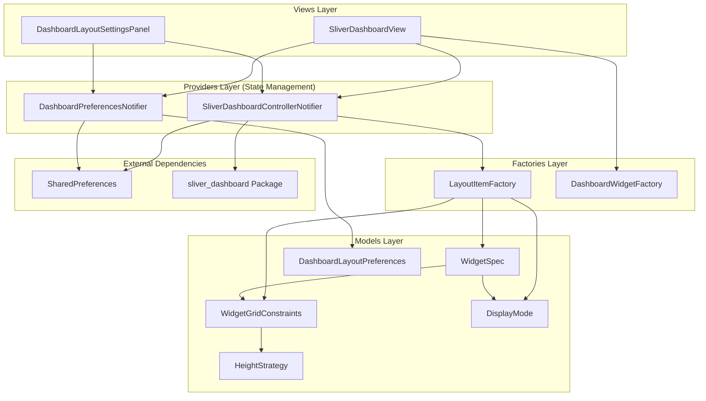
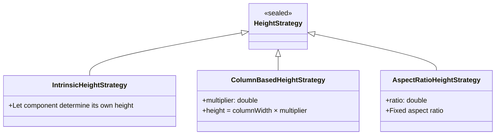
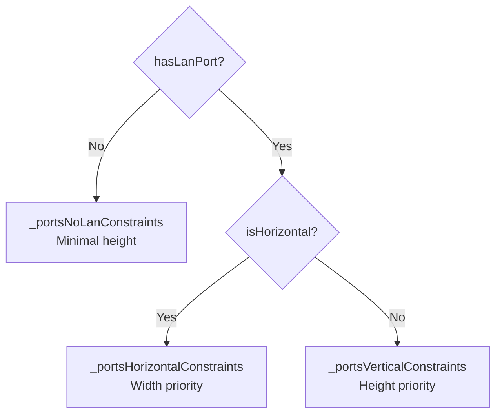
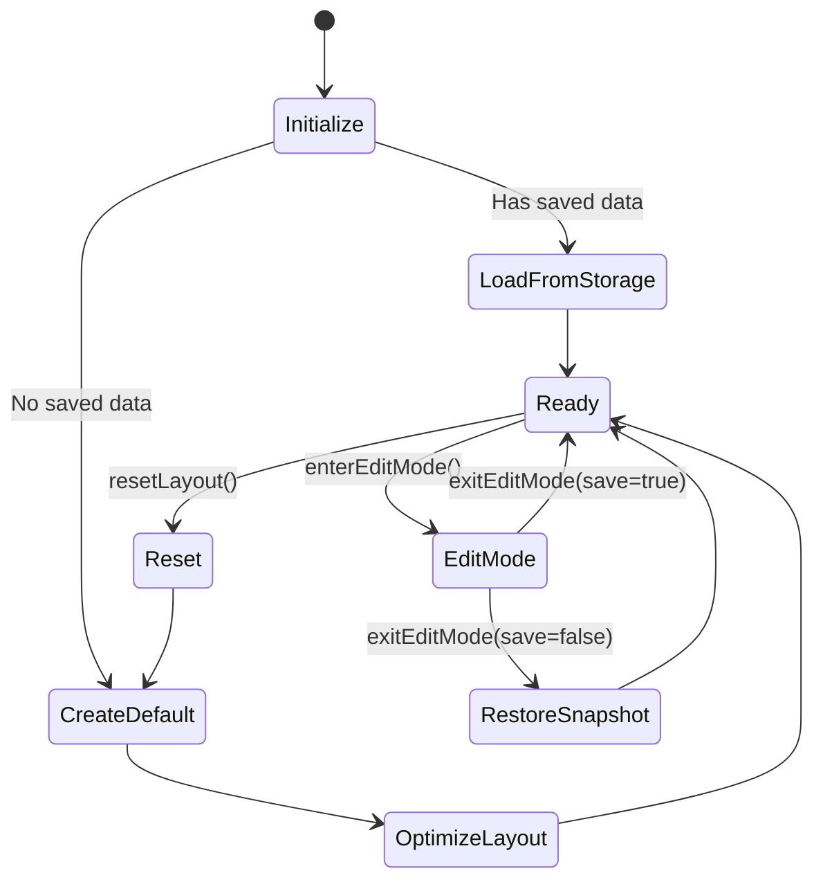
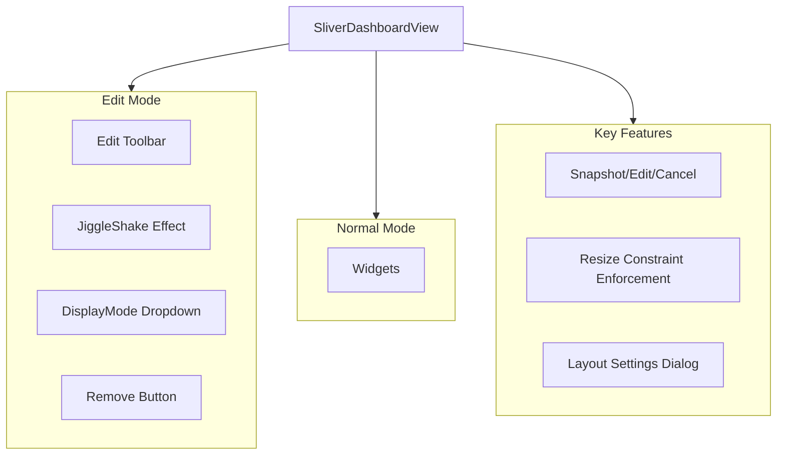
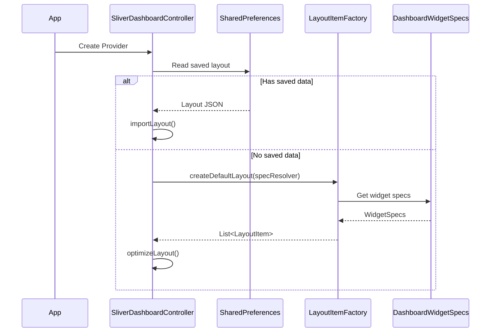
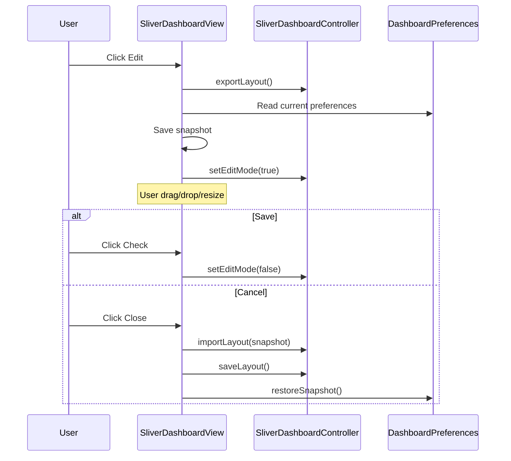

# Dashboard Custom Layout Comprehensive Report

This document integrates the System Architecture Analysis, Functional Implementation, Design Principles Evaluation, and In-depth Design Trade-offs for the PrivacyGUI Dashboard Custom Layout. It aims to provide a complete technical reference for developers, testers, and architects.

---

# Part 1: System Architecture Analysis

## 1. System Architecture Overview



---

## 2. Core Components

### 2.1 Models Layer

#### 2.1.1 `DisplayMode`

**File**: `lib/page/dashboard/models/display_mode.dart`

Defines three display density levels for components:

| Mode | Description |
|------|-------------|
| `compact` | Minimal display, key information only |
| `normal` | Default standard display |
| `expanded` | Full information display |

---

#### 2.1.2 `HeightStrategy`

**File**: `lib/page/dashboard/models/height_strategy.dart`

Uses **sealed class** for type-safe pattern matching:



**Factory Methods**:
- `HeightStrategy.intrinsic()` - Content-adaptive
- `HeightStrategy.columnBased(multiplier)` - Based on column width multiplier
- `HeightStrategy.strict(rows)` - Fixed row count (semantic alias)
- `HeightStrategy.aspectRatio(ratio)` - Fixed ratio

---

#### 2.1.3 `WidgetGridConstraints`

**File**: `lib/page/dashboard/models/widget_grid_constraints.dart`

Constraint system based on a **12-column layout**:

| Property | Description |
|----------|-------------|
| `minColumns` | Minimum columns (1-12) |
| `maxColumns` | Maximum columns |
| `preferredColumns` | Default/preferred columns |
| `minHeightRows` | Minimum height in rows |
| `maxHeightRows` | Maximum height in rows |
| `heightStrategy` | Height calculation strategy |

**Key Methods**:
- `scaleToMaxColumns(target)` - Scale proportionally to target column count
- `getPreferredHeightCells()` - Calculate preferred height in cells
- `getHeightRange()` - Get height range (min, max)

---

#### 2.1.4 `WidgetSpec`

**File**: `lib/page/dashboard/models/widget_spec.dart`

Complete specification for each Dashboard component:

```dart
class WidgetSpec {
  final String id;                    // Unique identifier
  final String displayName;           // Display name
  final String? description;          // Description
  final Map<DisplayMode, WidgetGridConstraints> constraints;  // Constraints per mode
  final bool canHide;                 // Whether can be hidden
  final List<WidgetRequirement> requirements;  // Feature requirements
}
```

**Requirement System (`WidgetRequirement`)**:
- `none` - No special requirements
- `vpnSupported` - Requires VPN feature support

---

#### 2.1.5 `DashboardWidgetSpecs`

**File**: `lib/page/dashboard/models/dashboard_widget_specs.dart`

Static definitions of all Dashboard component specs:

| Category | Widgets |
|----------|---------|
| **Standard Widgets** | `internetStatus`, `networks`, `wifiGrid`, `quickPanel`, `portAndSpeed`, `vpn` |
| **Atomic Widgets** (Custom Layout) | `internetStatusOnly`, `masterNodeInfo`, `ports`, `speedTest`, `networkStats`, `topology`, `wifiGrid`, `quickPanel`, `vpn` |

**Dynamic Constraints - Ports Widget**:



Dynamically selects constraints via `getPortsSpec()` method.

---

#### 2.1.6 `DashboardLayoutPreferences`

**File**: `lib/page/dashboard/models/dashboard_layout_preferences.dart`

User's Dashboard layout preferences:

```dart
class DashboardLayoutPreferences {
  final bool useCustomLayout;                          // Enable custom layout
  final Map<String, GridWidgetConfig> widgetConfigs;   // Widget configurations
}
```

**Features**:
- Manage `DisplayMode` per widget
- Control widget visibility
- Widget ordering
- JSON serialization/deserialization (with legacy format migration)

---

### 2.2 Providers Layer

#### 2.2.1 `SliverDashboardControllerNotifier`

**File**: `lib/page/dashboard/providers/sliver_dashboard_controller_provider.dart`

Controller managing the drag-drop grid layout:



**Key Methods**:

| Method | Function |
|--------|----------|
| `saveLayout()` | Save layout to SharedPreferences |
| `resetLayout()` | Reset to default layout |
| `updateItemConstraints()` | Update widget constraints |
| `updateItemSize()` | Force update widget size |
| `addWidget()` | Add a widget |
| `removeWidget()` | Remove a widget |

**IoC Pattern - WidgetSpecResolver**:

```dart
typedef WidgetSpecResolver = WidgetSpec Function(WidgetSpec defaultSpec);
```

Used to inject dynamic constraint logic at the composition root.

---

#### 2.2.2 `DashboardPreferencesNotifier`

**File**: `lib/page/dashboard/providers/dashboard_preferences_provider.dart`

Manages Dashboard layout preferences:

| Method | Function |
|--------|----------|
| `setWidgetMode()` | Set widget display mode |
| `toggleCustomLayout()` | Toggle custom layout |
| `restoreSnapshot()` | Restore snapshot |
| `resetWidgetModes()` | Reset display modes |

---

### 2.3 Factories Layer

#### 2.3.1 `LayoutItemFactory`

**File**: `lib/page/dashboard/providers/layout_item_factory.dart`

Converts `WidgetSpec` to `sliver_dashboard`'s `LayoutItem`:

```dart
static LayoutItem fromSpec(
  WidgetSpec spec, {
  required int x, y,
  int? w, h,
  DisplayMode displayMode,
})
```

**Default Layout**:

```
┌─────────────┬─────────────┬─────────────┐
│ Internet    │   Master    │ Quick Panel │ y=0
│  (4x2)      │   (4x4)     │   (4x3)     │
├─────────────┤             ├─────────────┤ y=2
│             │             │ NetworkStats│
│   Ports     │             │   (4x2)     │ y=3
│   (4x6)     ├─────────────┼─────────────┤ y=4
│             │  SpeedTest  │  Topology   │
│             │   (4x4)     │   (4x4)     │
├─────────────┴─────────────┴─────────────┤ y=10
│           WiFi Grid (8x2)               │
└─────────────────────────────────────────┘
```

---

#### 2.3.2 `DashboardWidgetFactory`

**File**: `lib/page/dashboard/factories/dashboard_widget_factory.dart`

Unified Widget construction factory:

- `buildAtomicWidget()` - Build widget by ID
- `shouldWrapInCard()` - Determine if AppCard wrapper is needed
- `getSpec()` - Get widget spec

---

### 2.4 Views Layer

#### 2.4.1 `SliverDashboardView`

**File**: `lib/page/dashboard/views/sliver_dashboard_view.dart`

Main drag-drop Dashboard view:



**Edit Mode Features**:
1. **Enter Edit** - Snapshot current layout and preferences
2. **Cancel Edit** - Restore snapshot
3. **Save Edit** - Persist changes
4. **Resize Constraint** - `_handleResizeEnd()` enforces min/max constraints

---

#### 2.4.2 `DashboardLayoutSettingsPanel`

**File**: `lib/page/dashboard/views/components/settings/dashboard_layout_settings_panel.dart`

Settings panel features:
- Toggle Standard/Custom layout
- Show hidden widgets with add option
- Reset layout to defaults

---

## 3. Data Flow

### 3.1 Layout Initialization



### 3.2 Edit Mode Flow



---

## 4. Design Patterns Summary

| Pattern | Application | Description |
|---------|-------------|-------------|
| **IoC (Inversion of Control)** | `WidgetSpecResolver` | Dynamic constraint injection |
| **Factory Pattern** | `LayoutItemFactory`, `DashboardWidgetFactory` | Centralized construction logic |
| **Strategy Pattern** | `HeightStrategy` | Interchangeable height calculation |
| **Snapshot/Memento** | Edit Mode | Support undo/cancel operations |
| **Repository Pattern** | SharedPreferences access | Data persistence abstraction |

---

## 5. File Structure

```
lib/page/dashboard/
├── models/
│   ├── display_mode.dart              # Display mode enum
│   ├── height_strategy.dart           # Height strategy sealed class
│   ├── widget_grid_constraints.dart   # Grid constraints
│   ├── widget_spec.dart               # Widget spec
│   ├── dashboard_widget_specs.dart    # All widget specs definition
│   ├── dashboard_layout_preferences.dart  # Layout preferences
│   └── grid_widget_config.dart        # Single widget config
│
├── providers/
│   ├── sliver_dashboard_controller_provider.dart  # Layout controller
│   ├── dashboard_preferences_provider.dart        # Preferences provider
│   └── layout_item_factory.dart                   # Layout item factory
│
├── factories/
│   └── dashboard_widget_factory.dart   # Widget construction factory
│
├── views/
│   ├── sliver_dashboard_view.dart      # Main view
│   └── components/
│       └── settings/
│           └── dashboard_layout_settings_panel.dart  # Settings panel
│
└── strategies/                          # (Other layout strategies)
```

---

## 6. Key Technical Points

### 6.1 Constraint Enforcement

`_handleResizeEnd()` implements constraint protection, ensuring widgets cannot be resized beyond their spec limits.

### 6.2 Dynamic Ports Constraints

Dynamically selects different constraint sets based on hardware state (LAN connection, horizontal layout).

### 6.3 Snapshot Restoration

Snapshots layout and preferences when entering edit mode; fully restores on cancel.

### 6.4 12-Column Responsive System

All constraints are based on a 12-column design, automatically scaling to different screen widths.

---
---

# Part 2: Design Principles & Testability Evaluation

## 1. Design Principles Assessment (SOLID)

### Single Responsibility Principle (SRP) - **Excellent**
*   **`WidgetSpec`**: Solely responsible for defining static component specifications and constraints, containing no business logic.
*   **`LayoutItemFactory`**: Focuses strictly on transforming specifications (`WidgetSpec`) into layout items (`LayoutItem`), keeping responsibilities clear and single.
*   **`SliverDashboardControllerNotifier`**: Focuses on managing runtime layout state (positions, dimensions) and persistence, handling no UI rendering directly.
*   **`DashboardWidgetFactory`**: Responsible for UI component construction and mapping, separated from layout logic.

### Open/Closed Principle (OCP) - **Good**
*   Adding new widgets only requires defining them in `DashboardWidgetSpecs` and adding a case in `DashboardWidgetFactory`, without modifying core layout logic or controllers.
*   `HeightStrategy` uses sealed classes. While this limits external extension, it provides excellent type safety and compile-time checking for the finite set of layout strategies required, which fits the current needs well.

### Dependency Inversion Principle (DIP) - **Good**
*   `LayoutItemFactory` acts on dynamic constraint logic (like hardware-dependent Ports specs) via the `WidgetSpecResolver` function interface injection, rather than depending directly on concrete Providers or Stores. This fully decouples the factory logic, making it highly testable.

---

## 2. Testability Assessment

The overall architecture exhibits high testability, primarily due to the purity of core logic and separation of state.

| Component | Testability | Description |
|-----------|-------------|-------------|
| **`LayoutItemFactory`** | ⭐⭐⭐⭐⭐ (High) | Core methods like `fromSpec` and `createDefaultLayout` are Pure Functions with no external dependencies, making unit testing extremely easy. |
| **`WidgetGridConstraints`** | ⭐⭐⭐⭐⭐ (High) | Simple data class; constraint calculation logic (`scaleToMaxColumns`) is easy to verify. |
| **`DashboardWidgetSpecs`** | ⭐⭐⭐⭐⭐ (High) | Static constant definitions; tests can ensure all widgets have constraints defined for all DisplayModes to prevent regressions. |
| **`SliverDashboardController`** | ⭐⭐⭐⭐ (Med-High) | Depends on `SharedPreferences` and `Ref`, but can be easily integration-tested using Riverpod's `ProviderContainer` and Mock SharedPreferences. |

---

## 3. Current Status & Gaps

While the architecture itself is highly conducive to testing, the current codebase **severely lacks unit tests for this module**.

### Identified Test Gaps
1.  **Missing `LayoutItemFactory` Tests**: 
    - Verify correct default layout generation.
    - Verify `fromSpec` correctly handles constraint multiple conversions for all DisplayModes.
    - Verify dynamic Ports constraint resolution (`WidgetSpecResolver`) behavior.
2.  **Missing `WidgetGridConstraints` Tests**:
    - Verify scaling logic from 12 columns to 8/4 columns.
    - Verify height calculation strategies (`HeightStrategy`).
3.  **Missing `DashboardLayoutPreferences` Tests**:
    - Verify JSON serialization/deserialization, especially legacy data migration compatibility.
    - Verify sorting and visibility toggle logic.
4.  **Missing `SliverDashboardController` Integration Tests**:
    - Verify `addWidget` / `removeWidget` / `updateItemConstraints` updates state and triggers save correctly.
    - Verify the layout optimization algorithm (`optimizeLayout`) effectively fills gaps.

## 4. Recommended Actions

Since the core logic (`LayoutItemFactory`) consists of pure functions, it is recommended to prioritize adding unit tests for this part to ensure a solid layout foundation.

Recommended test files to add:
- `test/page/dashboard/providers/layout_item_factory_test.dart`
- `test/page/dashboard/models/widget_grid_constraints_test.dart`
- `test/page/dashboard/models/dashboard_layout_preferences_test.dart`

---
---

# Part 3: Design Deep Dive & Parameters

## 1. Architecture Redundancy & Dependency Analysis

After in-depth analysis, the current design **shows no significant code duplication**, but employs a "Dual Track" strategy for **data models and state management**, which is a deliberate design trade-off.

### 1.1 Dual Layout State
The system maintains two separate layout states serving different use cases:

1.  **Standard Layout**:
    -   **Source of Truth**: `DashboardPreferences` (`order`, `columnSpan`, `visible`).
    -   **Characteristics**: Responsive Flow/List layout, adapts to device automatically.
    -   **Components**: Primarily uses `Composite Widgets` (e.g., `internet_status` containing router info).
2.  **Custom Layout**:
    -   **Source of Truth**: `SliverDashboardController` (Stored in separate JSON key).
    -   **Characteristics**: Free-form Drag & Drop Bento Grid, absolute positioning (`x`, `y`) & sizing (`w`, `h`).
    -   **Components**: Primarily uses `Atomic Widgets` (e.g., `internet_status_only` separated from `master_node_info`).

### 1.2 Partial State Sharing
There is a nuanced design choice here: **Some widgets share state, while others do not**.

*   **Independent State Widgets**:
    *   Standard Layout uses `PortAndSpeed` (Integrated), Custom Layout uses `Ports` + `SpeedTest` (Separated).
    *   **Result**: Different IDs, so DisplayMode changes are isolated. This is correct as separated widgets have different display logic.
*   **Shared State Widgets**:
    *   `WiFi Grid`, `Quick Panel`, `VPN` share the same ID across both layouts.
    *   **Result**: If a user switches WiFi Grid to `Compact` in "Custom Layout", it **will also become Compact** in "Standard Layout".
    *   **Analysis**: This is not code duplication but an **intended UX design**. It ensures consistency for universal widgets, but developers must be aware of this interaction.

### 1.3 `GridWidgetConfig` vs. `LayoutItem`
*   `GridWidgetConfig.columnSpan`: Used strictly for **Standard Layout** width control.
*   `LayoutItem.w`: Used strictly for **Custom Layout** width control.
*   **Conclusion**: While seemingly storing two "widths", they apply to completely different layout engines (Flow vs Grid), representing specialized configurations for different strategies rather than redundancy.

---

## 2. Widget Grid Constraints Deep Dive

`WidgetGridConstraints` defines the behavioral limits of a component within the 12-column grid system.

### 2.1 Width Parameters (Columns)

All values are based on a **12-column system**.

| Parameter | Description | Detailed Usage |
|:---:|:---:|:---|
| **`minColumns`** | **Minimum Columns** | **Shrink Limit**.<br>The widget width will never go below this value during user resize or responsive scaling, ensuring content readability. |
| **`maxColumns`** | **Maximum Columns** | **Grow Limit**.<br>Limits how wide a widget can get, preventing small widgets (like switches) from stretching excessively. |
| **`preferredColumns`** | **Preferred/Default** | **Initial Width**.<br>1. Default width when adding widget.<br>2. Restored width on layout reset.<br>3. Base calculation width for Standard Layout. |

### 2.2 Height Parameters (Rows)

Height units are **Grid Cells**, not pixels.

| Parameter | Description | Detailed Usage |
|:---:|:---:|:---|
| **`minHeightRows`** | **Minimum Height Rows** | **Vertical Shrink Limit**.<br>Ensures enough vertical space to display core content without crushing it. |
| **`maxHeightRows`** | **Maximum Height Rows** | **Vertical Grow Limit**.<br>Prevents users from stretching widgets too tall, causing layout fragmentation. |
| **`heightStrategy`** | **Height Strategy** | **Preferred Height Algorithm**.<br>How to calculate the default height when width changes? See table below. |

### 2.3 HeightStrategy Types

| Strategy | Parameter | Description | Use Case |
|:---|:---:|:---|:---|
| **`Strict`** | `rows` (double) | **Fixed Rows**.<br>Height remains constant specifically in row units, regardless of width. | Lists, text-heavy widgets where height is independent of width. |
| **`ColumnBased`** | `multiplier` | **Width Multiplier**.<br>`Height = Width * Multiplier`.<br>Height scales proportionally with width. | Blocks needing visual weight maintenance; wider means taller. |
| **`AspectRatio`** | `ratio` | **Aspect Ratio**.<br>`Width / Height = Ratio`.<br>Strictly maintains shape. | Topology views or image-based widgets to prevent distortion. |
| **`Intrinsic`** | None | **Content Adaptive**.<br>Height determined by content (falls back to minHeight in Grid). | Used mostly in Standard Layouts. |

---

## 3. Relationship between HeightStrategy and Min/Max Height (FAQ)

### 3.1 Is it Duplicate Design?
**No, it differentiates between "Ideal Value" and "Boundary Values".**

*   **`HeightStrategy` (Ideal/Default Value)**: Defines the "perfect" or "default" height of a component when **no external constraints** are applied.
    *   *Example: "This chart looks best at a 4:3 aspect ratio."*
*   **`min/maxHeightRows` (Boundary Values)**: Defines the **allowable range** during resizing.
    *   *Example: "Regardless of ratio, height cannot be less than 1 row or more than 6 rows."*

**Why do we need both?**
If we only had Min/Max, the system wouldn't know what height to assign when a widget is "Added" or "Reset" (Should it be min? max? or average?). `HeightStrategy` provides this initial anchor point.

### 3.2 Detailed Analysis of HeightStrategy Use Cases

Your observation is excellent! `LayoutItemFactory` indeed allows passing `w` and `h` to override defaults. This introduces the distinction between "**Contextual Default**" and "**Component Native Default**".

Here are three key scenarios explaining when Strategy is used versus when Factory Override is used:

#### **Scenario A: Default Layout Initialization (Uses Factory Override)**
*   **Context**: When the user opens the App for the first time, or clicks "Reset Layout".
*   **Behavior**: Although each widget has its own `HeightStrategy` (ideal height), to make all widgets fit perfectly like a puzzle (Bento Grid), the designer **manually specifies specific heights** in `createDefaultLayout`.
*   **Code**:
    ```dart
    // Even if InternetStatus Strategy suggests height 2
    // To match QuickPanel on the right, designer forces height 2
    items.add(fromSpec(spec, ..., h: 2)); 
    ```
*   **Conclusion**: `HeightStrategy` is **ignored** here in favor of the designer's "puzzle logic".

#### **Scenario B: User Adds Widget (Uses HeightStrategy)**
*   **Context**: User manually deleted a widget and adds it back from the "Hidden List" via `+`.
*   **Behavior**: When "added back," the widget is no longer part of that perfect default puzzle but joins as an independent entity. The system does not specify `h` but lets the widget decide.
*   **Code**: (`SliverDashboardController.addWidget`)
    ```dart
    // No w or h passed, fully relies on Strategy
    LayoutItemFactory.fromSpec(spec, ...); 
    ```
*   **Conclusion**: **Uses `HeightStrategy`** to calculate the most suitable initial size for the widget.

#### **Scenario C: Display Mode Switching (Uses HeightStrategy)**
*   **Context**: User feels `Compact` mode is too small and manually switches to `Normal` mode.
*   **Behavior**: The old `Compact` height is no longer valid. The system needs to know what the widget "should" look like in `Normal` mode.
*   **Code**: (`SliverDashboardView._updateDisplayMode`)
    ```dart
    // Get new mode Constraints and calculate Strategy preferred height
    final preferredH = constraints.getPreferredHeightCells(...);
    // Update widget dimensions
    ```
*   **Conclusion**: **Uses `HeightStrategy`** to determine the height for the new mode.

### 4.3 Why doesn't Width (Columns) need a Strategy?
You asked a very keen question: "Why is Height so complex, while Width is just a simple `preferredColumns` number?"

**Core Reason: Grid Systems are typically "Width-Dominant".**

In modern Responsive Design:

1.  **Width is the "Independent Variable"**:
    *   Width is usually dictated by the **External Environment** (Screen Size) or **User Intent** (Manual Resizing).
    *   For example: On mobile, width is forced to 100%; on tablet, maybe 50%.
    *   Therefore, Width doesn't need complex internal calculation; it is typically "given" or "constrained" (Min/Max Constraints).

2.  **Height is the "Dependent Variable"**:
    *   Height helps accommodate the consequences of the chosen Width.
    *   When Width narrows (Mobile), text wraps, and images shrink. To display full content, Height must **extend downwards**.
    *   This is why Height needs a `Strategy` (Algorithm). It must constantly answer: "Given that my Width is now X, how tall do I need to be to function properly?"

---

## 4. Design Trade-offs

### 4.1 Why not just use `preferredRows`? (Like `preferredColumns`)
You raised a great alternative: Since we have `preferredColumns` for width, why not just have a static `preferredRows` integer for height?

This touches on the choice between **Static Values** and **Dynamic Algorithms**.

#### **Reason 1: Height often depends on Width (Aspect Ratio Dependency)**
In a grid system, Width is usually the "Independent Variable" (user decides width), while Height is the "Dependent Variable".
*   **Case (Topology)**:
    *   This map-like widget needs to maintain a visual aspect ratio.
    *   Suppose we set a static `preferredRows = 4`.
    *   When width is 4 columns, 4x4 (Square) looks good.
    *   If the user expands width to 8 columns, a static height of 4 creates an 8x4 (Wide Rectangle) shape, crushing the internal graph or leaving massive whitespace.
    *   **Solution**: Using `AspectRatioStrategy(1.0)` ensures that when width becomes 8, height automatically calculates to 8, preparing the perfect square container.

#### **Reason 2: Dynamic Hardware State**
*   **Case (Ports)**:
    *   The height of the Ports widget depends on **LAN port count**.
    *   **With LAN**: Needs two rows of content (WAN + LAN), requiring more height.
    *   **No LAN (Mesh Node)**: Only needs one row (WAN/Backhaul), height is halved.
    *   Using a static `preferredRows` would force us to write `if (hasLan) 4 else 2` logic scattered in the Layout layer.
    *   **Solution**: `HeightStrategy.intrinsic()` allows the widget to report height based on internal content (LAN presence), encapsulating business logic inside the component rather than the layout engine.

### 4.2 Why not use Layout Factory's preferred values for Scenarios B/C?
`LayoutItemFactory` can indeed accept an `h` parameter, but in **Scenario B (Add)** and **Scenario C (Mode Switch)**, we lack "Context".

*   **In Scenario A (Default Layout)**: The designer has a "God View" of the entire canvas, knowing exactly that `Internet` needs to be height 2 to align with `QuickPanel` on the right.
*   **In Scenarios B/C**: This is "Runtime". The widget is added dynamically. The system doesn't know what's next to it or the user's layout intent. The safest default implementation is to revert to the component's "Nature (`HeightStrategy`)", letting it appear in its most optimal intrinsic form, then letting the user adjust.

---

# Part 4: Testing Strategy & Implementation

## 1. Methodology

The Dashboard Custom Layout adopts the "Test Pyramid" strategy, focusing heavily on unit tests for pure logic components, supplemented by integration tests for critical paths.

### 1.1 Test Levels
1.  **Unit Tests**:
    *   **Goal**: Target "Pure Functions" and "Data Models" with no external dependencies.
    *   **SUT (System Under Test)**: `LayoutItemFactory`, `WidgetGridConstraints`, `DashboardLayoutPreferences`.
    *   **Advantage**: Extremely fast execution, covers all boundary conditions (e.g., 12-column scaling algorithms, JSON migration).
2.  **Integration Tests**:
    *   **Goal**: Verify component interactions and Side Effects, especially data persistence.
    *   **SUT**: `SliverDashboardController` + `SharedPreferences (Mock)`.
    *   **Advantage**: Ensures critical user features like Save, Load, and Reset function correctly.

---

## 2. Implementation Details

### 2.1 Models Layer Testing
Logic verification for data models:

*   **`WidgetGridConstraints`**:
    *   Verify `scaleToMaxColumns`: Ensure correct proportional scaling across Desktop (12), Tablet (8), and Mobile (4) columns.
    *   Verify `HeightStrategy`: Ensure correct height calculation for all strategies (`Strict`, `AspectRatio`, `Intrinsic`).
*   **`DashboardLayoutPreferences`**:
    *   Verify JSON Serialization/Deserialization: Ensure `GridWidgetConfig` persists correctly.
    *   Verify Legacy Migration: Ensure seamless migration from old `widgetModes` format to the new structure.

### 2.2 Factories Layer Testing
Verification of core transformation logic:

*   **`LayoutItemFactory`**:
    *   Verify `fromSpec`: Test transformation from `WidgetSpec` to `LayoutItem`, including `min/max` constraint propagation.
    *   Verify Override Logic: Test if passing manual `w`/`h` correctly overrides defaults (Scenario A).
    *   Verify `createDefaultLayout`: Ensure default layout contains the correct widget list and initial positions.
    *   Verify IoC Injection: Test if `WidgetSpecResolver` successfully injects dynamic constraints (e.g., simulating Ports hardware state).

### 2.3 Integration Layer Testing
Verification of interactions between controller and storage layer:

*   **`SliverDashboardController`**:
    *   **Environment Simulation**: Use `mocktail` to mock Riverpod `Ref` and `SharedPreferences.setMockInitialValues` for disk storage.
    *   **CRUD Verification**: Test `addWidget` and `removeWidget` to confirm they update both in-memory `state` and on-disk `SharedPreferences`.
    *   **Constraint Updates**: Test `updateItemConstraints`, verifying that if a new `minW` exceeds current `w`, the `clamp` mechanism automatically corrects the size.
    *   **Reset Flow**: Verify `resetLayout` correctly clears disk data and restores the default layout.

---

## 3. How to Run Tests

Execute using standard Flutter test commands:

```bash
# Run all Dashboard related tests
flutter test test/page/dashboard/

# Run specific test files
flutter test test/page/dashboard/providers/layout_item_factory_test.dart
flutter test test/page/dashboard/models/widget_grid_constraints_test.dart
flutter test test/page/dashboard/providers/sliver_dashboard_controller_test.dart
```

---

## 4. Verification Results

As of the latest version, all unit and integration tests for the Custom Layout have passed, confirming the stability and correctness of the architecture.

