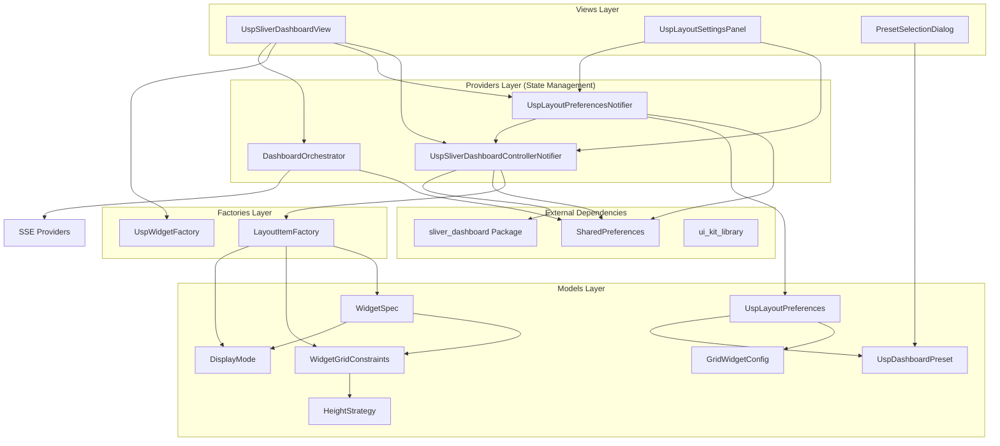
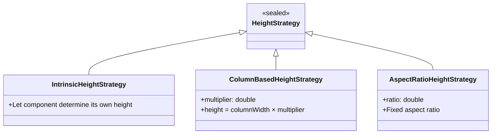
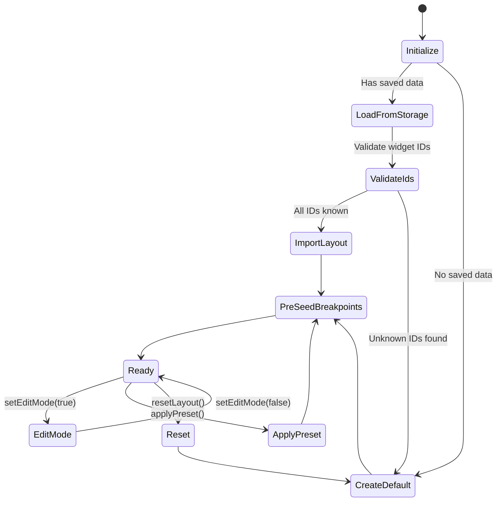
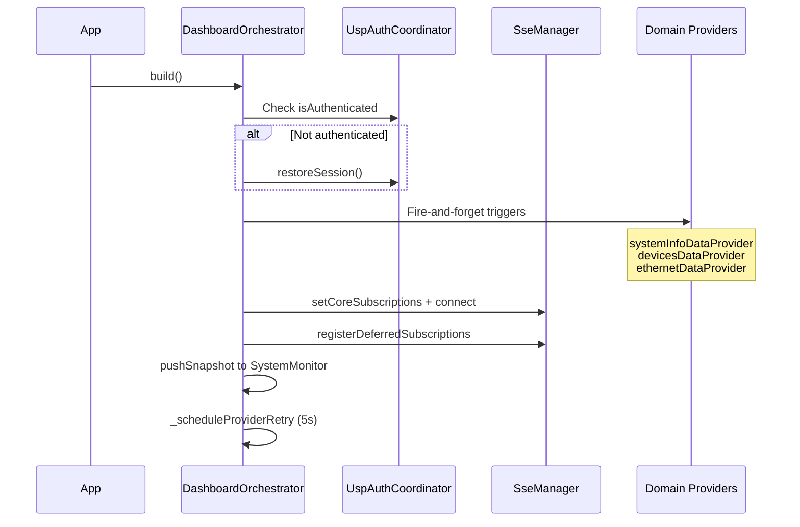
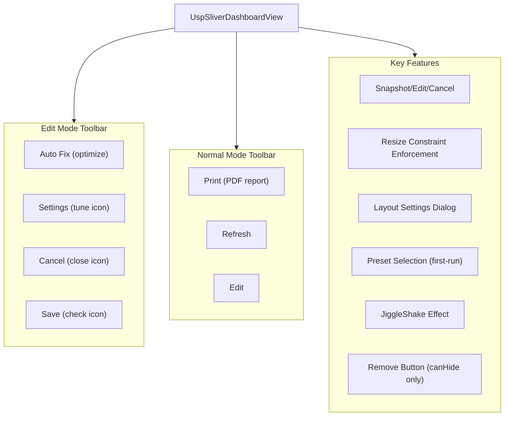
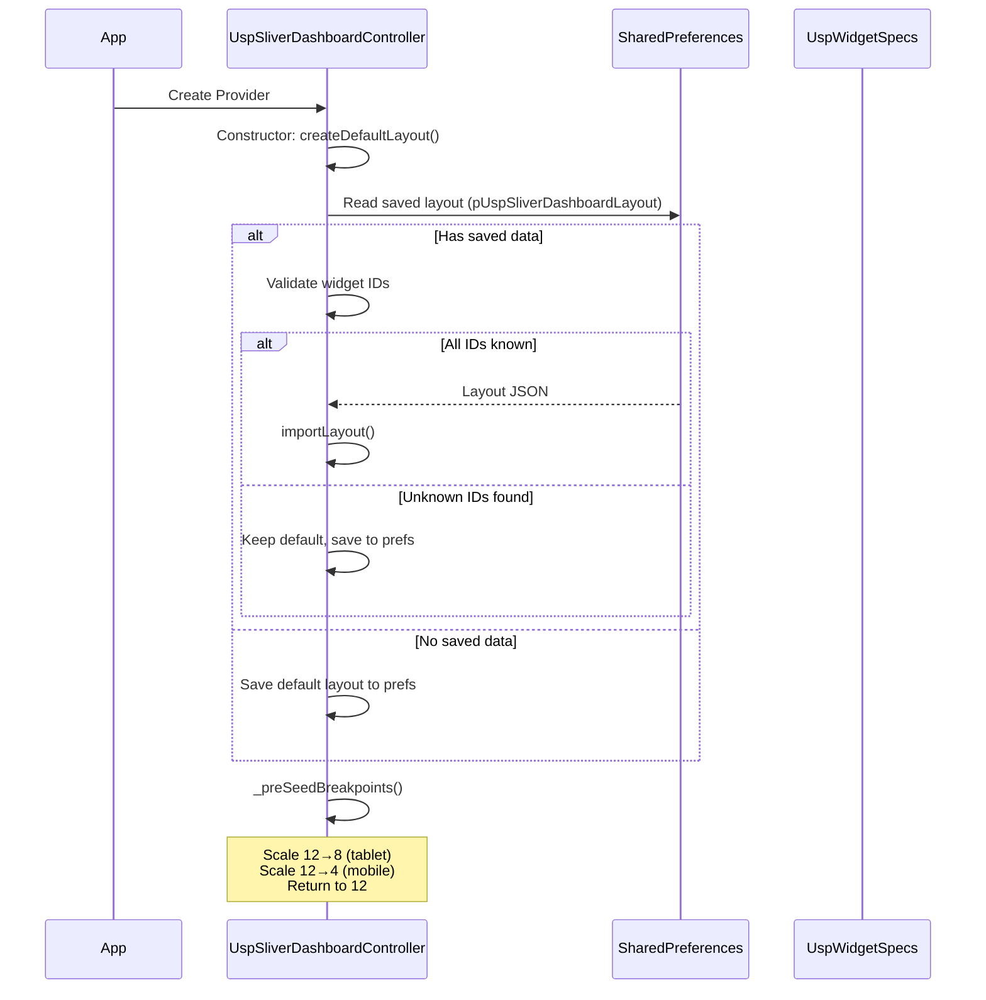
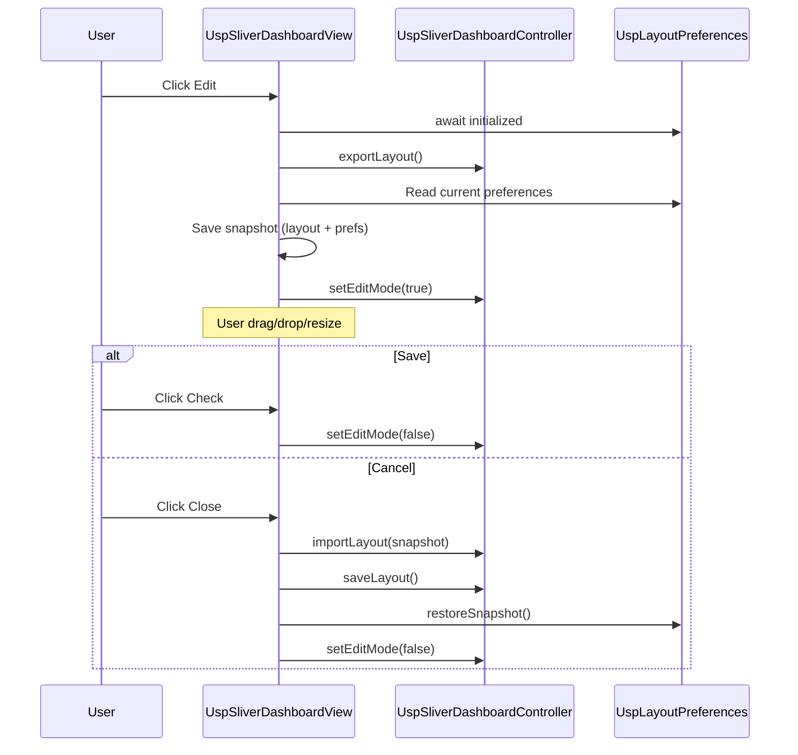
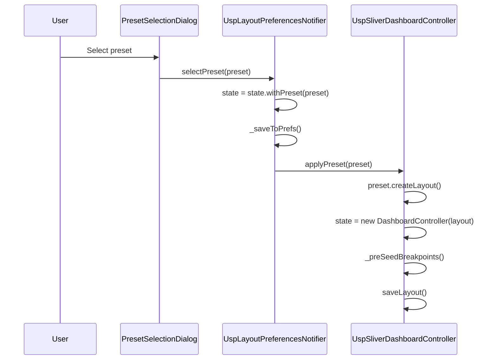
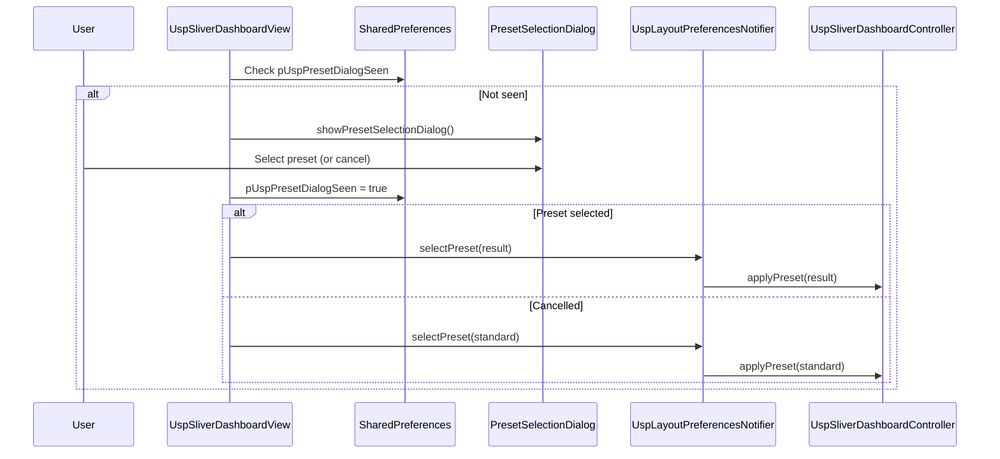

# Dashboard Custom Layout Comprehensive Report

This document integrates the System Architecture Analysis, Functional Implementation, Design Principles Evaluation, and In-depth Design Trade-offs for the PrivacyGUI Dashboard Custom Layout. It aims to provide a complete technical reference for developers, testers, and architects.

> **Last Updated**: 2026-03-23 — Aligned with USP Dashboard implementation (v2.x).

---

# Part 1: System Architecture Analysis

## 1. System Architecture Overview


```mermaid
flowchart TD
    subgraph Views["Views Layer"]
        SDV["UspSliverDashboardView"]
        DLSP["UspLayoutSettingsPanel"]
        PSD["PresetSelectionDialog"]
    end

    subgraph Providers["Providers Layer (State Management)"]
        SDCP["UspSliverDashboardControllerNotifier"]
        DPP["UspLayoutPreferencesNotifier"]
        DO["DashboardOrchestrator"]
    end

    subgraph Factories["Factories Layer"]
        LIF["LayoutItemFactory"]
        DWF["UspWidgetFactory"]
    end

    subgraph Models["Models Layer"]
        WS["WidgetSpec"]
        WGC["WidgetGridConstraints"]
        HS["HeightStrategy"]
        DM["DisplayMode"]
        DLP["UspLayoutPreferences"]
        UDP["UspDashboardPreset"]
        GWC["GridWidgetConfig"]
    end

    subgraph External["External Dependencies"]
        SP["SharedPreferences"]
        SliverPkg["sliver_dashboard Package"]
        UIKit["ui_kit_library"]
    end

    SDV --> SDCP
    SDV --> DPP
    SDV --> DWF
    SDV --> DO
    DLSP --> SDCP
    DLSP --> DPP
    PSD --> UDP

    SDCP --> LIF
    SDCP --> SP
    SDCP --> SliverPkg

    DPP --> SP
    DPP --> DLP
    DPP --> SDCP

    DO --> SP
    DO --> SSE["SSE Providers"]

    LIF --> WS
    LIF --> WGC
    LIF --> DM

    DLP --> GWC
    DLP --> UDP

    WS --> WGC
    WS --> DM
    WGC --> HS
```

---

## 2. Core Components

### 2.1 Models Layer

#### 2.1.1 `DisplayMode`

**File**: `lib/page/dashboard/models/display_mode.dart`

Defines three display density levels for components:

| Mode | Description |
|------|-------------|
| `compact` | Minimal display, key information only |
| `normal` | Default standard display |
| `expanded` | Full information display |

> **Current status**: USP widgets use `DisplayMode.normal` only. Multi-mode switching is deferred to a future iteration.

---

#### 2.1.2 `HeightStrategy`

**File**: `lib/page/dashboard/models/height_strategy.dart`

Uses **sealed class** for type-safe pattern matching:


```mermaid
classDiagram
    class HeightStrategy {
        <<sealed>>
    }
    class IntrinsicHeightStrategy {
        +Let component determine its own height
    }
    class ColumnBasedHeightStrategy {
        +multiplier: double
        +height = columnWidth × multiplier
    }
    class AspectRatioHeightStrategy {
        +ratio: double
        +Fixed aspect ratio
    }

    HeightStrategy <|-- IntrinsicHeightStrategy
    HeightStrategy <|-- ColumnBasedHeightStrategy
    HeightStrategy <|-- AspectRatioHeightStrategy
```

**Factory Methods**:
- `HeightStrategy.intrinsic()` — Content-adaptive
- `HeightStrategy.columnBased(multiplier)` — Based on column width multiplier
- `HeightStrategy.strict(rows)` — Fixed row count (semantic alias for `columnBased`)
- `HeightStrategy.aspectRatio(ratio)` — Fixed ratio

---

#### 2.1.3 `WidgetGridConstraints`

**File**: `lib/page/dashboard/models/widget_grid_constraints.dart`

Constraint system based on a **12-column layout**:

| Property | Description |
|----------|-------------|
| `minColumns` | Minimum columns (1-12) |
| `maxColumns` | Maximum columns |
| `preferredColumns` | Default/preferred columns |
| `minHeightRows` | Minimum height in rows |
| `maxHeightRows` | Maximum height in rows |
| `heightStrategy` | Height calculation strategy |

**Key Methods**:
- `scaleToMaxColumns(target)` — Scale proportionally to target column count
- `scaleMinToMaxColumns(target)` — Scale min columns proportionally
- `scaleMaxToMaxColumns(target)` — Scale max columns proportionally
- `getPreferredHeightCells()` — Calculate preferred height in cells
- `getHeightRange()` — Get height range (min, max)

---

#### 2.1.4 `WidgetSpec`

**File**: `lib/page/dashboard/models/widget_spec.dart`

Complete specification for each Dashboard component:

```dart
class WidgetSpec {
  final String id;                    // Unique identifier
  final String displayName;           // Display name
  final String? description;          // Description
  final Map<DisplayMode, WidgetGridConstraints> constraints;  // Constraints per mode
  final WidgetGridConstraints? defaultConstraints;  // Fallback constraints
  final bool canHide;                 // Whether can be hidden
  final List<WidgetRequirement> requirements;  // Feature requirements
}
```

**Constraint Fallback Order** (`getConstraints(mode)`):
1. Mode-specific constraint from `constraints`
2. `defaultConstraints` (if set)
3. Normal mode constraint from `constraints`

**Requirement System (`WidgetRequirement`)**:
- `none` — No special requirements
- `vpnSupported` — Requires VPN feature support

---

#### 2.1.5 `UspWidgetSpecs`

**File**: `lib/page/dashboard/models/usp_widget_specs.dart`

Static definitions of all 17 USP Dashboard card specs. All constraints use `DisplayMode.normal` only, based on a 12-column layout with fixed slot height of 100px per row.

| # | ID | Display Name | Preferred (w×h) | Height Strategy | canHide |
|---|-----|-------------|:---:|:---:|:---:|
| 1 | `stats_panel` | Stats Panel | 12×1 | strict(1) | **false** |
| 2 | `device_info` | Device Info | 6×3 | strict(3) | **false** |
| 3 | `network_status` | WAN Status | 6×3 | strict(3) | **false** |
| 4 | `topology` | Network Topology | 6×5 | strict(5) | true |
| 5 | `lan_info` | LAN Info | 6×3 | strict(3) | true |
| 6 | `ethernet_ports` | Ethernet Ports | 6×3 | strict(3) | true |
| 7 | `system_status` | System Status | 6×5 | strict(5) | true |
| 8 | `connected_devices` | Connected Devices | 6×3 | intrinsic | true |
| 9 | `wifi_status` | WiFi Status | 6×4 | intrinsic | true |
| 10 | `time_settings` | Time Settings | 6×3 | strict(3) | true |
| 11 | `dhcp_reservations` | DHCP Reservations | 6×3 | intrinsic | true |
| 12 | `port_forwarding` | Port Forwarding | 6×3 | intrinsic | true |
| 13 | `network_health` | Network Health | 6×4 | strict(4) | true |
| 14 | `firewall_overview` | Firewall Overview | 6×4 | strict(4) | true |
| 15 | `wifi_performance` | WiFi Performance | 6×5 | strict(5) | true |
| 16 | `traffic_analysis` | Traffic Analysis | 6×5 | strict(5) | true |
| 17 | `device_analytics` | Device Analytics | 6×5 | strict(5) | true |

**Registry**: `UspWidgetSpecs.all` list + `getById(id)` lookup.

**Layout Helpers**:
- `createDefaultLayout()` — Creates the default 2-column layout for all 17 cards.
- `createLayoutForCards(cardIds)` — Creates a 2-column layout for a subset of cards (used by presets).
- `scaleLayout(layout, fromCols, toCols)` — Proportionally scales a serialised layout between breakpoints.

---

#### 2.1.6 `UspLayoutPreferences`

**File**: `lib/page/dashboard/models/usp_layout_preferences.dart`

User's Dashboard layout preferences:

```dart
class UspLayoutPreferences extends Equatable {
  final bool useCustomLayout;                          // Enable custom layout
  final Map<String, GridWidgetConfig> widgetConfigs;   // Widget configurations
  final UspDashboardPreset? selectedPreset;            // Current preset
  final bool hasSeenPresetDialog;                      // First-run flag
}
```

**Features**:
- Manage `DisplayMode` per widget
- Control widget visibility
- Widget ordering
- Track selected preset
- JSON serialization/deserialization
- Immutable `copyWith` pattern (via named methods: `setMode`, `setVisibility`, `withPreset`, etc.)

---

#### 2.1.7 `GridWidgetConfig`

**File**: `lib/page/dashboard/models/grid_widget_config.dart`

Per-widget user configuration:

```dart
class GridWidgetConfig extends Equatable {
  final String widgetId;       // Unique widget ID
  final int order;             // Sort order (0-based)
  final bool visible;          // Visibility toggle
  final DisplayMode displayMode;  // Display mode
  final int? columnSpan;       // Width in columns (1-12, null = default)
}
```

---

#### 2.1.8 `UspDashboardPreset`

**File**: `lib/page/dashboard/models/usp_dashboard_preset.dart`

Four curated layout presets, each with hand-crafted card positions:

| Preset | Cards | Description | Icon |
|--------|:-----:|-------------|------|
| `essential` | 6 | Core network info — ideal for everyday users | `dashboard_outlined` |
| `standard` | 12 | Common features at a glance — recommended | `grid_view` |
| `professional` | 17 | All cards enabled — for power users | `tune` |
| `monitoring` | 8 | Performance & analytics focused — for network admins | `monitor_heart` |

Each preset provides:
- `cardIds` — List of widget IDs included
- `createLayout()` — Hand-crafted `List<LayoutItem>` with optimised positions
- `displayName`, `description`, `icon` — UI metadata

**Preset Layouts**:

Essential (6 cards):
```
y=0:  StatsPanel (12×1)
y=1:  DeviceInfo (6×3)          | NetworkStatus (6×3)
y=4:  LanInfo (6×3)             | ConnectedDevices (6×4)
y=8:  WiFiStatus (12×6)
```

Standard (12 cards):
```
y=0:  StatsPanel (12×1)
y=1:  DeviceInfo (6×3)          | NetworkStatus (6×3)
y=4:  Topology (12×5)
y=9:  LanInfo (6×3)             | EthernetPorts (6×3)
y=12: SystemStatus (6×5)        | TrafficAnalysis (6×5)
y=17: ConnectedDevices (6×4)    | WiFiStatus (6×6)
y=23: TimeSettings (6×3)        | FirewallOverview (6×4)
```

Professional (17 cards):
```
y=0:  StatsPanel (12×1)
y=1:  DeviceInfo (6×3)          | NetworkStatus (6×3)
y=4:  NetworkHealth (6×4)       | SystemStatus (6×5)
y=9:  TrafficAnalysis (6×5)     | LanInfo (6×3)
y=14: EthernetPorts (6×3)       | ConnectedDevices (6×4)
y=18: Topology (6×5)            | DeviceAnalytics (6×5)
y=23: WiFiStatus (6×6)          | WiFiPerformance (6×5)
y=29: FirewallOverview (6×4)    | TimeSettings (6×3)
y=33: DhcpReservations (6×4)    | PortForwarding (6×4)
```

Monitoring (8 cards):
```
y=0:  StatsPanel (12×1)
y=1:  TrafficAnalysis (12×5)
y=6:  NetworkHealth (6×4)       | SystemStatus (6×5)
y=11: DeviceAnalytics (6×5)     | WiFiPerformance (6×5)
y=16: FirewallOverview (6×4)    | EthernetPorts (6×3)
```

---

### 2.2 Providers Layer

#### 2.2.1 `UspSliverDashboardControllerNotifier`

**File**: `lib/page/dashboard/providers/usp_layout_controller.dart`

Controller managing the drag-drop grid layout. Wraps `DashboardController` from `sliver_dashboard` package.


```mermaid
stateDiagram-v2
    [*] --> Initialize
    Initialize --> LoadFromStorage: Has saved data
    Initialize --> CreateDefault: No saved data

    LoadFromStorage --> ValidateIds: Validate widget IDs
    ValidateIds --> ImportLayout: All IDs known
    ValidateIds --> CreateDefault: Unknown IDs found
    CreateDefault --> PreSeedBreakpoints
    ImportLayout --> PreSeedBreakpoints
    PreSeedBreakpoints --> Ready

    Ready --> EditMode: setEditMode(true)
    EditMode --> Ready: setEditMode(false)

    Ready --> ApplyPreset: applyPreset()
    ApplyPreset --> PreSeedBreakpoints

    Ready --> Reset: resetLayout()
    Reset --> CreateDefault
```

**Key Methods**:

| Method | Function |
|--------|----------|
| `saveLayout()` | Save layout to SharedPreferences |
| `resetLayout()` | Reset to default layout and clear persisted data |
| `updateItemSize(id, w, h)` | Force update widget size (after resize constraint enforcement) |
| `addWidget(id)` | Add a widget at the bottom of the grid |
| `removeWidget(id)` | Remove a widget from the layout |
| `applyPreset(preset)` | Replace layout with a preset's hand-crafted layout |

**Initialization Flow**:
1. Constructor creates a `DashboardController` with `UspWidgetSpecs.createDefaultLayout()`
2. `_initializeLayout()` loads saved layout from SharedPreferences
3. Validates saved layout — rejects layouts with unknown widget IDs (removed from specs), accepts layouts with fewer cards (presets/customisation)
4. `_preSeedBreakpoints()` scales the 12-column layout to 8 (tablet) and 4 (mobile) column variants

**Persistence Key**: `pUspSliverDashboardLayout`

---

#### 2.2.2 `UspLayoutPreferencesNotifier`

**File**: `lib/page/dashboard/providers/usp_layout_preferences_provider.dart`

Manages Dashboard layout preferences with async init guard:

| Method | Function |
|--------|----------|
| `initialized` | `Future<void>` — completes when initial load is done (await before snapshots) |
| `toggleCustomLayout(enabled)` | Toggle custom layout; when OFF, also resets grid to default |
| `setVisibility(widgetId, visible)` | Set widget visibility |
| `restoreSnapshot(snapshot)` | Restore preferences from snapshot (edit mode cancel) |
| `selectPreset(preset)` | Select preset + apply its layout via controller |
| `markPresetDialogSeen()` | Mark first-run dialog as seen |
| `resetToDefaults()` | Reset everything to defaults |

**Persistence Key**: `pUspLayoutPreferences`

**Key Behaviour**: Toggling custom layout OFF also resets the grid layout via `uspSliverDashboardControllerProvider.resetLayout()`, ensuring locked mode always shows the default layout.

---

#### 2.2.3 `DashboardOrchestrator`

**File**: `lib/page/dashboard/orchestrator/dashboard_orchestrator.dart`

Coordinates auth, SSE, and domain provider initialization. **Not AutoDispose** — persists across tab switches.


```mermaid
sequenceDiagram
    participant App
    participant Orch as DashboardOrchestrator
    participant Auth as UspAuthCoordinator
    participant SSE as SseManager
    participant DP as Domain Providers

    App->>Orch: build()
    Orch->>Auth: Check isAuthenticated
    alt Not authenticated
        Orch->>Auth: restoreSession()
    end
    Orch->>DP: Fire-and-forget triggers
    Note over DP: systemInfoDataProvider<br/>devicesDataProvider<br/>ethernetDataProvider
    Orch->>SSE: setCoreSubscriptions + connect
    Orch->>SSE: registerDeferredSubscriptions
    Orch->>Orch: pushSnapshot to SystemMonitor
    Orch->>Orch: _scheduleProviderRetry (5s)
```

**Responsibilities**:
1. **Auth Check** — Verify USP session or restore from storage
2. **Domain Provider Init** — Fire-and-forget triggers (cards show per-card skeletons)
3. **SSE Bootstrap** — Connect + register subscriptions
4. **System Monitor** — Push initial snapshot when systemInfo arrives
5. **Retry Logic** — Auto-retry failed providers after 5s delay
6. **Refresh** — `refreshAll()` invalidates all domain providers + re-runs build

---

### 2.3 Factories Layer

#### 2.3.1 `LayoutItemFactory`

**File**: `lib/page/dashboard/providers/layout_item_factory.dart`

Converts `WidgetSpec` to `sliver_dashboard`'s `LayoutItem`:

```dart
static LayoutItem fromSpec(
  WidgetSpec spec, {
  required int x, y,
  int? w, h,
  DisplayMode displayMode = DisplayMode.normal,
})
```

**Conversion Logic**:
- Width: `w ?? constraints.preferredColumns`
- Height: `h ?? constraints.getPreferredHeightCells(columns: preferredWidth)`
- Constraints: `minW`, `maxW`, `minH`, `maxH` propagated from spec

**IoC Pattern**: Does NOT resolve dynamic constraints internally. Callers provide pre-resolved `WidgetSpec` instances.

---

#### 2.3.2 `UspWidgetFactory`

**File**: `lib/page/dashboard/factories/usp_widget_factory.dart`

Unified Widget construction factory:

- `buildWidget(id)` — Maps widget ID to card widget via switch expression
- `shouldWrapInCard(id)` — Always returns `false` (USP cards wrap themselves in `AppCard`)
- `getSpec(id)` — Get widget spec by ID

**Card Widget Mapping** (17 cards):

| ID | Widget Class | Source Feature |
|----|-------------|----------------|
| `stats_panel` | `UspStatsPanel` | dashboard/views/components |
| `device_info` | `UspDeviceInfoCard` | admin/cards |
| `network_status` | `UspNetworkStatusCard` | internet_settings/cards |
| `topology` | `UspNetworkTopologyCard` | topology/cards |
| `lan_info` | `UspLanInfoCard` | local_network/cards |
| `ethernet_ports` | `UspEthernetPortsCard` | local_network/cards |
| `system_status` | `UspSystemStatusCard` | dashboard/views/components |
| `connected_devices` | `UspConnectedDevicesCard` | devices/cards |
| `wifi_status` | `UspWifiStatusCard` | wifi_settings/cards |
| `time_settings` | `UspTimeSettingsCard` | admin/cards |
| `dhcp_reservations` | `UspDhcpReservationsCard` | local_network/cards |
| `port_forwarding` | `UspPortForwardingCard` | port_forwarding/cards |
| `traffic_analysis` | `UspTrafficAnalysisCard` | dashboard/views/components |
| `device_analytics` | `UspDeviceAnalyticsCard` | dashboard/views/components |
| `network_health` | `UspNetworkHealthCard` | dashboard/views/components |
| `firewall_overview` | `UspFirewallOverviewCard` | firewall/cards |
| `wifi_performance` | `UspWifiPerformanceCard` | wifi_settings/cards |

Cards are self-contained: they read data from domain-specific Riverpod providers internally and wrap themselves in `AppCard`.

---

### 2.4 Views Layer

#### 2.4.1 `UspSliverDashboardView`

**File**: `lib/page/dashboard/views/usp_sliver_dashboard_view.dart`

Main drag-drop Dashboard view:


```mermaid
flowchart TD
    subgraph EditMode["Edit Mode Toolbar"]
        AF["Auto Fix (optimize)"]
        ST["Settings (tune icon)"]
        CC["Cancel (close icon)"]
        SV["Save (check icon)"]
    end

    subgraph NormalMode["Normal Mode Toolbar"]
        PR["Print (PDF report)"]
        RF["Refresh"]
        ED["Edit"]
    end

    subgraph Features["Key Features"]
        SE["Snapshot/Edit/Cancel"]
        RC["Resize Constraint Enforcement"]
        LS["Layout Settings Dialog"]
        PD["Preset Selection (first-run)"]
        JJ["JiggleShake Effect"]
        RB["Remove Button (canHide only)"]
    end

    SDV["UspSliverDashboardView"]
    SDV --> EditMode
    SDV --> NormalMode
    SDV --> Features
```

**Grid Configuration**:
- Fixed slot height: `120px` per row
- Slot aspect ratio: computed dynamically from available width
- Spacing: `AppSpacing.lg` between cards
- Breakpoints: `{0: uiKitColumns}` (adapts to `context.currentMaxColumns`)

**Edit Mode Features**:
1. **Enter Edit** — Await `initialized` on preferences, then snapshot current layout and preferences
2. **Cancel Edit** — Restore snapshot + save to SharedPreferences
3. **Save Edit** — Exit edit mode (layout auto-saved on each drag/resize)
4. **Auto Fix** — `controller.optimizeLayout()` to fill gaps
5. **Resize Constraint** — `_handleResizeEnd()` enforces min/max constraints with error SnackBar
6. **Remove Widget** — Red close button (top-left), only for `canHide == true` widgets
7. **JiggleShake** — Cards shake with randomized direction/timing for organic feel

**First-Run Preset Dialog**:
- On `initState`, checks `pUspPresetDialogSeen` flag in SharedPreferences
- Shows `PresetSelectionDialog` if not seen
- Defaults to `standard` preset if user cancels

**Polling Providers**: Eagerly watches `uspTrafficAnalysisProvider`, `uspDeviceAnalyticsProvider`, and `uspSystemMonitorProvider` so they start fetching immediately regardless of card visibility.

---

#### 2.4.2 `UspLayoutSettingsPanel`

**File**: `lib/page/dashboard/views/components/settings/usp_layout_settings_panel.dart`

Settings panel shown in edit mode (via tune icon):

1. **Instructions** — Info card with drag-drop/resize guide text
2. **Preset Selection** — Shows current preset with "Change" button → opens `PresetSelectionDialog`
3. **Available Widgets** — Lists unused widgets (built-in and app widgets) with "Add" button to re-add them
4. **Reset Layout** — Resets all preferences to defaults

**Dialog Return Values**: `'reset'`, `'toggle_off'`, `'preset_changed'` — used by the view to exit edit mode when layout is replaced.

---

#### 2.4.3 `PresetSelectionDialog`

**File**: `lib/page/dashboard/views/dialogs/preset_selection_dialog.dart`

Modal dialog for choosing a dashboard preset:
- Displays all 4 presets as selectable cards with icon, name, card count badge, and description
- Animated selection highlight (primary color border + background tint)
- Returns selected `UspDashboardPreset` or `null` on cancel
- Non-dismissible (`barrierDismissible: false`)

---

#### 2.4.4 `JiggleShake`

**File**: `lib/page/dashboard/views/components/effects/jiggle_shake.dart`

Edit mode visual feedback animation:
- `AnimationController` with 140ms duration
- Rotation range: ±0.5° (configurable via `degrees` parameter)
- Randomized direction (`startPositive` coin flip)
- Staggered start delays (0–50ms) for organic feel
- Optimized: returns static child when inactive

---

## 3. Data Flow

### 3.1 Layout Initialization


```mermaid
sequenceDiagram
    participant App
    participant SDCP as UspSliverDashboardController
    participant SP as SharedPreferences
    participant UWS as UspWidgetSpecs

    App->>SDCP: Create Provider
    SDCP->>SDCP: Constructor: createDefaultLayout()
    SDCP->>SP: Read saved layout (pUspSliverDashboardLayout)
    alt Has saved data
        SDCP->>SDCP: Validate widget IDs
        alt All IDs known
            SP-->>SDCP: Layout JSON
            SDCP->>SDCP: importLayout()
        else Unknown IDs found
            SDCP->>SDCP: Keep default, save to prefs
        end
    else No saved data
        SDCP->>SDCP: Save default layout to prefs
    end
    SDCP->>SDCP: _preSeedBreakpoints()
    Note over SDCP: Scale 12→8 (tablet)<br/>Scale 12→4 (mobile)<br/>Return to 12
```

### 3.2 Edit Mode Flow


```mermaid
sequenceDiagram
    participant User
    participant SDV as UspSliverDashboardView
    participant SDCP as UspSliverDashboardController
    participant DPP as UspLayoutPreferences

    User->>SDV: Click Edit
    SDV->>DPP: await initialized
    SDV->>SDCP: exportLayout()
    SDV->>DPP: Read current preferences
    SDV->>SDV: Save snapshot (layout + prefs)
    SDV->>SDCP: setEditMode(true)

    Note over SDV: User drag/drop/resize

    alt Save
        User->>SDV: Click Check
        SDV->>SDCP: setEditMode(false)
    else Cancel
        User->>SDV: Click Close
        SDV->>SDCP: importLayout(snapshot)
        SDV->>SDCP: saveLayout()
        SDV->>DPP: restoreSnapshot()
        SDV->>SDCP: setEditMode(false)
    end
```

### 3.3 Preset Selection Flow


```mermaid
sequenceDiagram
    participant User
    participant Dialog as PresetSelectionDialog
    participant DPP as UspLayoutPreferencesNotifier
    participant SDCP as UspSliverDashboardController

    User->>Dialog: Select preset
    Dialog->>DPP: selectPreset(preset)
    DPP->>DPP: state = state.withPreset(preset)
    DPP->>DPP: _saveToPrefs()
    DPP->>SDCP: applyPreset(preset)
    SDCP->>SDCP: preset.createLayout()
    SDCP->>SDCP: state = new DashboardController(layout)
    SDCP->>SDCP: _preSeedBreakpoints()
    SDCP->>SDCP: saveLayout()
```

---

## 4. Responsive Layout Scaling

### 4.1 Breakpoint Pre-Seeding

The controller pre-seeds the `DashboardController`'s internal per-slot-count cache with proportionally scaled layouts for tablet and mobile breakpoints.

Without this, `DashboardController.setSlotCount` falls back to `correctBounds`, which only shifts items left without scaling widths — breaking the two-column layout at tablet widths.

**Method**: `_preSeedBreakpoints()` in `UspSliverDashboardControllerNotifier`

**Steps**:
1. Export the 12-column layout
2. Scale to 8 columns (tablet): `w=6` → `w=4`, preserving two-column pairs
3. Scale to 4 columns (mobile): All cards → `w=4` (full-width single-column stacking)
4. Return to 12 columns

### 4.2 Scaling Logic (`UspWidgetSpecs.scaleLayout`)

```dart
static List<dynamic> scaleLayout(
  List<dynamic> layout, int fromCols, int toCols,
)
```

| Target | Width Logic | Position Logic | Constraints |
|--------|------------|----------------|-------------|
| Mobile (≤4) | Force `w = toCols` | Force `x = 0` | Scaled proportionally |
| Tablet (>4) | `(w * toCols / fromCols).round().clamp(1, toCols)` | `(x * toCols / fromCols).round()` | Scaled proportionally |

Overflow protection: if `newX + newW > toCols`, shifts item left; if still negative, forces full-width.

---

## 5. Design Patterns Summary

| Pattern | Application | Description |
|---------|-------------|-------------|
| **IoC (Inversion of Control)** | `LayoutItemFactory` | Does not resolve dynamic constraints; callers provide pre-resolved specs |
| **Factory Pattern** | `LayoutItemFactory`, `UspWidgetFactory` | Centralized construction logic |
| **Strategy Pattern** | `HeightStrategy` | Interchangeable height calculation |
| **Snapshot/Memento** | Edit Mode | Support undo/cancel operations |
| **Repository Pattern** | SharedPreferences access | Data persistence abstraction |
| **Preset/Template** | `UspDashboardPreset` | Curated layout starting points |
| **Orchestrator** | `DashboardOrchestrator` | Coordinates auth, SSE, and domain provider lifecycle |
| **Immutable State** | `UspLayoutPreferences`, `GridWidgetConfig` | All updates via `copyWith` / named methods |

---

## 6. File Structure

```
lib/page/dashboard/
├── models/
│   ├── display_mode.dart                  # Display mode enum
│   ├── height_strategy.dart               # Height strategy sealed class
│   ├── widget_grid_constraints.dart       # Grid constraints
│   ├── widget_spec.dart                   # Widget spec
│   ├── grid_widget_config.dart            # Single widget config
│   ├── usp_widget_specs.dart              # All 17 widget specs + layout helpers
│   ├── usp_layout_preferences.dart        # Layout preferences
│   └── usp_dashboard_preset.dart          # 4 preset definitions + layouts
│
├── providers/
│   ├── usp_layout_controller.dart         # Layout controller (StateNotifier)
│   ├── usp_layout_preferences_provider.dart  # Preferences provider (Notifier)
│   ├── layout_item_factory.dart           # Layout item factory
│   └── pdf_report_data_provider.dart      # PDF report data aggregator
│
├── factories/
│   └── usp_widget_factory.dart            # Widget ID → Card widget mapping
│
├── views/
│   ├── usp_sliver_dashboard_view.dart     # Main dashboard view
│   ├── dashboard_shell.dart               # Shell with bottom navigation
│   ├── components/
│   │   ├── _components.dart               # Barrel export
│   │   ├── effects/
│   │   │   └── jiggle_shake.dart          # Edit mode shake animation
│   │   ├── settings/
│   │   │   └── usp_layout_settings_panel.dart  # Settings panel
│   │   ├── usp_stats_panel.dart           # Stats panel card
│   │   ├── usp_system_status_card.dart    # System status card (4 tabs)
│   │   ├── usp_traffic_analysis_card.dart # Traffic analysis card
│   │   ├── usp_device_analytics_card.dart # Device analytics card
│   │   └── usp_network_health_card.dart   # Network health card
│   └── dialogs/
│       └── preset_selection_dialog.dart   # Preset picker dialog
│
└── orchestrator/
    └── dashboard_orchestrator.dart         # Auth + SSE + domain provider coordination
```

**Additional card widgets** (feature-specific directories):
```
lib/page/admin/cards/usp_device_info_card.dart
lib/page/admin/cards/usp_time_settings_card.dart
lib/page/devices/cards/usp_connected_devices_card.dart
lib/page/firewall/cards/usp_firewall_overview_card.dart
lib/page/internet_settings/cards/usp_network_status_card.dart
lib/page/local_network/cards/usp_lan_info_card.dart
lib/page/local_network/cards/usp_ethernet_ports_card.dart
lib/page/local_network/cards/usp_dhcp_reservations_card.dart
lib/page/port_forwarding/cards/usp_port_forwarding_card.dart
lib/page/topology/cards/usp_network_topology_card.dart
lib/page/wifi_settings/cards/usp_wifi_status_card.dart
lib/page/wifi_settings/cards/usp_wifi_performance_card.dart
```

---

## 7. Persistence

### 7.1 SharedPreferences Keys

**File**: `lib/constants/pref_key.dart`

```dart
const pUspLayoutPreferences = 'usp_layout_preferences';
const pUspPresetDialogSeen = 'usp_preset_dialog_seen';
const pUspSliverDashboardLayout = 'usp_sliver_dashboard_layout';
```

### 7.2 Layout Serialization Format

JSON array of layout items:
```json
[
  {
    "id": "stats_panel",
    "x": 0, "y": 0, "w": 12, "h": 1,
    "minW": 6, "maxW": 12.0,
    "minH": 1, "maxH": 2.0
  }
]
```

### 7.3 Preferences Serialization Format

```json
{
  "useCustomLayout": true,
  "widgetConfigs": {
    "device_info": {
      "widgetId": "device_info",
      "order": 1,
      "visible": true,
      "displayMode": "normal",
      "columnSpan": 6
    }
  },
  "selectedPreset": "standard",
  "hasSeenPresetDialog": true
}
```

---

## 8. Key Technical Points

### 8.1 Constraint Enforcement

`_handleResizeEnd()` in the view clamps widget dimensions to spec min/max constraints after each resize. Shows an error SnackBar when constraints are violated.

### 8.2 Layout Validation

On load, the controller rejects layouts containing unknown widget IDs (widgets removed from specs). Layouts with fewer cards than the full spec are valid — they come from presets or user customisation.

### 8.3 Snapshot Restoration

Snapshots layout and preferences when entering edit mode; fully restores on cancel. The preferences provider exposes an `initialized` future to prevent race conditions where the snapshot captures default state before SharedPreferences load completes.

### 8.4 12-Column Responsive System

All constraints are based on a 12-column design. The `scaleLayout` helper proportionally scales to 8 (tablet) and 4 (mobile) columns. Pre-seeding ensures `DashboardController` has cached layouts for all breakpoints.

### 8.5 Polling Provider Eager Init

The view eagerly watches `uspTrafficAnalysisProvider`, `uspDeviceAnalyticsProvider`, and `uspSystemMonitorProvider` so they start fetching immediately, regardless of whether their cards are scrolled into view.

---
---

# Part 2: Design Principles & Testability Evaluation

## 1. Design Principles Assessment (SOLID)

### Single Responsibility Principle (SRP) — Excellent
*   **`WidgetSpec`**: Solely responsible for defining static component specifications and constraints, containing no business logic.
*   **`LayoutItemFactory`**: Focuses strictly on transforming specifications (`WidgetSpec`) into layout items (`LayoutItem`), keeping responsibilities clear and single.
*   **`UspSliverDashboardControllerNotifier`**: Manages runtime layout state (positions, dimensions), persistence, and breakpoint pre-seeding. Does not handle UI rendering.
*   **`UspWidgetFactory`**: Responsible for UI component construction and mapping, separated from layout logic.
*   **`DashboardOrchestrator`**: Coordinates auth, SSE, and domain provider lifecycle. Does not own domain data — all data lives in Layer 1 providers.
*   **`UspDashboardPreset`**: Encapsulates preset metadata and hand-crafted layouts, separated from controller logic.

### Open/Closed Principle (OCP) — Good
*   Adding new widgets only requires:
    1. Defining the spec in `UspWidgetSpecs`
    2. Adding a case in `UspWidgetFactory.buildWidget()`
    3. Adding the card ID to relevant presets in `UspDashboardPreset`
    — without modifying core layout logic or controllers.
*   `HeightStrategy` uses sealed classes. While this limits external extension, it provides excellent type safety and compile-time checking for the finite set of layout strategies required.
*   Preset system allows adding new presets by extending the enum without modifying existing code.

### Dependency Inversion Principle (DIP) — Good
*   `LayoutItemFactory` acts on pre-resolved `WidgetSpec` instances via IoC, rather than depending directly on concrete Providers.
*   `UspLayoutPreferencesNotifier` communicates with the layout controller through Riverpod provider references, not direct coupling.
*   Card widgets are self-contained and read from domain-specific providers, not from the dashboard controller.

---

## 2. Testability Assessment

The overall architecture exhibits high testability due to pure logic separation and clear state boundaries.

| Component | Testability | Description |
|-----------|-------------|-------------|
| **`LayoutItemFactory`** | ★★★★★ (High) | Pure function `fromSpec` with no external dependencies. |
| **`WidgetGridConstraints`** | ★★★★★ (High) | Simple data class; scaling and height calculation are easy to verify. |
| **`UspWidgetSpecs`** | ★★★★★ (High) | Static constants; tests ensure all widgets have valid constraints. |
| **`UspLayoutPreferences`** | ★★★★★ (High) | Pure immutable model with JSON serialization — fully testable. |
| **`UspDashboardPreset`** | ★★★★★ (High) | `createLayout()` returns deterministic `List<LayoutItem>` — easy to assert. |
| **`UspSliverDashboardController`** | ★★★★ (Med-High) | Depends on `SharedPreferences`, but mockable with `setMockInitialValues`. |
| **`UspLayoutPreferencesNotifier`** | ★★★★ (Med-High) | Depends on `Ref` and `SharedPreferences`, testable with `ProviderContainer`. |
| **`DashboardOrchestrator`** | ★★★ (Medium) | Depends on auth, SSE, and domain providers — requires integration test setup. |

---

## 3. Current Status & Gaps

### Identified Test Gaps
1.  **Missing `LayoutItemFactory` Tests**:
    - Verify `fromSpec` correctly maps constraints to `LayoutItem` fields.
    - Verify fallback behaviour when constraints for the requested `DisplayMode` are missing.
    - Verify width/height override logic (`w`/`h` parameters).
2.  **Missing `WidgetGridConstraints` Tests**:
    - Verify scaling logic from 12 columns to 8/4 columns.
    - Verify height calculation for all strategy types.
3.  **Missing `UspLayoutPreferences` Tests**:
    - Verify JSON serialization/deserialization round-trip.
    - Verify preset handling and `hasSeenPresetDialog` flag.
4.  **Missing `UspDashboardPreset` Tests**:
    - Verify each preset's `createLayout()` produces valid layouts (correct card count, no overlaps, within grid bounds).
    - Verify `cardIds` lists match `UspWidgetSpecs.all` subset.
5.  **Missing `UspWidgetSpecs.scaleLayout` Tests**:
    - Verify proportional scaling for 12→8 and 12→4.
    - Verify mobile full-width forcing.
    - Verify overflow protection.
6.  **Missing `UspSliverDashboardController` Integration Tests**:
    - Verify `addWidget` / `removeWidget` / `updateItemSize` update state and trigger save.
    - Verify `applyPreset` replaces layout correctly.
    - Verify layout validation rejects unknown IDs.

## 4. Recommended Actions

Priority order for test coverage:
1. `UspWidgetSpecs.scaleLayout` — ensures responsive layouts work correctly
2. `LayoutItemFactory.fromSpec` — ensures spec-to-layout conversion is correct
3. `UspDashboardPreset.createLayout` — ensures presets produce valid layouts
4. `UspLayoutPreferences` JSON round-trip — ensures persistence works
5. `UspSliverDashboardController` integration — ensures CRUD + persistence

Recommended test files:
- `test/page/dashboard/models/usp_widget_specs_test.dart`
- `test/page/dashboard/providers/layout_item_factory_test.dart`
- `test/page/dashboard/models/usp_dashboard_preset_test.dart`
- `test/page/dashboard/models/usp_layout_preferences_test.dart`
- `test/page/dashboard/providers/usp_layout_controller_test.dart`

---
---

# Part 3: Design Deep Dive & Parameters

## 1. Widget Grid Constraints Deep Dive

`WidgetGridConstraints` defines the behavioral limits of a component within the 12-column grid system.

### 1.1 Width Parameters (Columns)

All values are based on a **12-column system**.

| Parameter | Description | Detailed Usage |
|:---:|:---:|:---|
| **`minColumns`** | **Minimum Columns** | **Shrink Limit**. The widget width will never go below this value during user resize or responsive scaling, ensuring content readability. |
| **`maxColumns`** | **Maximum Columns** | **Grow Limit**. Limits how wide a widget can get, preventing small widgets from stretching excessively. |
| **`preferredColumns`** | **Preferred/Default** | **Initial Width**. 1. Default width when adding widget. 2. Restored width on layout reset. 3. Base calculation width for layout generation. |

### 1.2 Height Parameters (Rows)

Height units are **Grid Cells** (120px per cell), not pixels.

| Parameter | Description | Detailed Usage |
|:---:|:---:|:---|
| **`minHeightRows`** | **Minimum Height Rows** | **Vertical Shrink Limit**. Ensures enough vertical space to display core content. |
| **`maxHeightRows`** | **Maximum Height Rows** | **Vertical Grow Limit**. Prevents users from stretching widgets too tall. |
| **`heightStrategy`** | **Height Strategy** | **Preferred Height Algorithm**. How to calculate the default height when width changes? |

### 1.3 HeightStrategy Types

| Strategy | Parameter | Description | Use Case |
|:---|:---:|:---|:---|
| **`Strict`** | `rows` (double) | **Fixed Rows**. Height remains constant in row units, regardless of width. | Lists, text-heavy widgets where height is independent of width. |
| **`ColumnBased`** | `multiplier` | **Width Multiplier**. `Height = Width * Multiplier`. Height scales proportionally with width. | Blocks needing visual weight maintenance; wider means taller. |
| **`AspectRatio`** | `ratio` | **Aspect Ratio**. `Width / Height = Ratio`. Strictly maintains shape. | Topology views or image-based widgets to prevent distortion. |
| **`Intrinsic`** | None | **Content Adaptive**. Height determined by content (falls back to `minHeightRows.clamp(2, 6)` in Grid). | List-based widgets (Connected Devices, DHCP Reservations, WiFi Status). |

> **Note**: In the current USP implementation, most cards use `strict(n)` or `intrinsic()`. `AspectRatio` and `ColumnBased` are available but not actively used yet.

---

## 2. Relationship between HeightStrategy and Min/Max Height (FAQ)

### 2.1 Is it Duplicate Design?
**No, it differentiates between "Ideal Value" and "Boundary Values".**

*   **`HeightStrategy` (Ideal/Default Value)**: Defines the "perfect" or "default" height when **no external constraints** are applied.
    *   *Example: "This chart looks best at a 4:3 aspect ratio."*
*   **`min/maxHeightRows` (Boundary Values)**: Defines the **allowable range** during resizing.
    *   *Example: "Regardless of ratio, height cannot be less than 1 row or more than 6 rows."*

**Why do we need both?**
If we only had Min/Max, the system wouldn't know what height to assign when a widget is "Added" or "Reset" (Should it be min? max? or average?). `HeightStrategy` provides this initial anchor point.

### 2.2 When Strategy is Used vs When Factory Override is Used

Three key scenarios:

#### **Scenario A: Preset / Default Layout (Uses Factory Override)**
*   **Context**: When a preset's `createLayout()` generates the initial layout.
*   **Behavior**: The designer manually specifies specific heights to make cards fit perfectly.
*   **Code**:
    ```dart
    _item('device_info', x: 0, y: 1, w: 6, h: 3);
    ```
*   **Conclusion**: `HeightStrategy` is **ignored** in favor of the designer's "puzzle logic".

#### **Scenario B: User Adds Widget (Uses HeightStrategy)**
*   **Context**: User re-adds a previously removed widget from the Settings panel.
*   **Behavior**: Widget is appended at the bottom. The system does not specify `h` — relies on strategy.
*   **Code** (`UspSliverDashboardController.addWidget`):
    ```dart
    LayoutItemFactory.fromSpec(spec, x: 0, y: maxY, displayMode: DisplayMode.normal);
    // No w or h passed — uses HeightStrategy
    ```
*   **Conclusion**: **Uses `HeightStrategy`** to calculate the most suitable initial size.

#### **Scenario C: Display Mode Switching (Future — Uses HeightStrategy)**
*   **Context**: When multi-mode support is implemented, switching from `Compact` to `Normal` invalidates the old height.
*   **Behavior**: System uses strategy to calculate new height for the target mode.
*   **Conclusion**: **Uses `HeightStrategy`** to determine the height for the new mode.

### 2.3 Why doesn't Width (Columns) need a Strategy?

**Core Reason: Grid Systems are typically "Width-Dominant".**

1.  **Width is the "Independent Variable"**: Width is usually dictated by the external environment (Screen Size) or user intent (Manual Resizing). It doesn't need complex internal calculation.
2.  **Height is the "Dependent Variable"**: Height accommodates the consequences of the chosen Width. When Width narrows, text wraps and images shrink, requiring Height to extend downwards.

---

## 3. Design Trade-offs

### 3.1 Why not just use `preferredRows`? (Like `preferredColumns`)

This touches on the choice between **Static Values** and **Dynamic Algorithms**.

#### **Reason 1: Height often depends on Width (Aspect Ratio Dependency)**
*   For a map/topology widget, a static `preferredRows = 4` looks fine at `w=4` (square), but at `w=8` creates a crushed rectangle.
*   Using `AspectRatioStrategy(1.0)` ensures height auto-adjusts with width changes.

#### **Reason 2: Content-Dependent Height**
*   Intrinsic widgets (Connected Devices, DHCP Reservations) need height based on content count.
*   A static `preferredRows` would require scattered conditional logic in the layout layer.
*   `HeightStrategy.intrinsic()` encapsulates this inside the constraint system.

### 3.2 Why not use Layout Factory's preferred values for Scenarios B/C?
*   **Scenario A** (Preset Layout): The designer has a "God View" of the entire canvas, knowing exact heights for puzzle alignment.
*   **Scenarios B/C** (Runtime): The widget is added dynamically. The system doesn't know the surrounding context. The safest default is the component's "Nature (`HeightStrategy`)", letting it appear in its most optimal intrinsic form.

---
---

# Part 4: Testing Strategy & Implementation

## 1. Methodology

The Dashboard Custom Layout adopts the "Test Pyramid" strategy, focusing heavily on unit tests for pure logic components, supplemented by integration tests for critical paths.

### 1.1 Test Levels
1.  **Unit Tests**:
    *   **Goal**: Target pure functions and data models with no external dependencies.
    *   **SUT**: `LayoutItemFactory`, `WidgetGridConstraints`, `UspLayoutPreferences`, `UspWidgetSpecs.scaleLayout`, `UspDashboardPreset.createLayout`.
    *   **Advantage**: Extremely fast execution, covers all boundary conditions.
2.  **Integration Tests**:
    *   **Goal**: Verify component interactions and side effects, especially data persistence.
    *   **SUT**: `UspSliverDashboardController` + `SharedPreferences (Mock)`, `UspLayoutPreferencesNotifier` + `ProviderContainer`.
    *   **Advantage**: Ensures critical user features (Save, Load, Reset, Preset Apply) function correctly.

---

## 2. Implementation Details

### 2.1 Models Layer Testing

*   **`WidgetGridConstraints`**:
    *   Verify `scaleToMaxColumns`: Proportional scaling across Desktop (12), Tablet (8), Mobile (4).
    *   Verify `getPreferredHeightCells`: Correct height for all strategy types.
    *   Verify `getHeightRange`: Correct min/max tuple.
*   **`UspLayoutPreferences`**:
    *   Verify JSON round-trip: `toJson` → `fromJson` preserves all fields.
    *   Verify preset handling: `withPreset`, `withPresetDialogSeen`.
    *   Verify visibility and mode updates: `setVisibility`, `setMode`.
*   **`UspDashboardPreset`**:
    *   Verify `cardIds` is a valid subset of `UspWidgetSpecs.all`.
    *   Verify `createLayout()` produces correct card count matching `cardIds.length`.
    *   Verify no layout overlaps (no two items share the same grid cells).

### 2.2 Factories / Helpers Layer Testing

*   **`LayoutItemFactory`**:
    *   Verify `fromSpec`: Transformation from `WidgetSpec` to `LayoutItem`, including constraint propagation.
    *   Verify Override Logic: Passing manual `w`/`h` correctly overrides HeightStrategy defaults.
    *   Verify fallback: Missing `DisplayMode` falls back to default 4×2 item.
*   **`UspWidgetSpecs.scaleLayout`**:
    *   Verify 12→8 scaling: `w=6` becomes `w=4`, `x=6` becomes `x=4`.
    *   Verify 12→4 scaling: All items become `w=4`, `x=0`.
    *   Verify overflow protection: `newX + newW > toCols` correction.
    *   Verify constraint scaling: `minW`/`maxW` scaled proportionally.

### 2.3 Integration Layer Testing

*   **`UspSliverDashboardController`**:
    *   **Environment**: Use `SharedPreferences.setMockInitialValues` for disk storage.
    *   **CRUD**: Test `addWidget`, `removeWidget`, `updateItemSize`.
    *   **Preset Apply**: Verify `applyPreset` replaces layout and pre-seeds breakpoints.
    *   **Validation**: Verify unknown widget IDs trigger reset.
    *   **Reset**: Verify `resetLayout` clears persisted data and restores default.

---

## 3. How to Run Tests

```bash
# Run all Dashboard related tests
flutter test test/page/dashboard/

# Run specific test files
flutter test test/page/dashboard/models/usp_widget_specs_test.dart
flutter test test/page/dashboard/providers/layout_item_factory_test.dart
flutter test test/page/dashboard/models/usp_dashboard_preset_test.dart
flutter test test/page/dashboard/models/usp_layout_preferences_test.dart
flutter test test/page/dashboard/providers/usp_layout_controller_test.dart
```

---
---

# Part 5: User Workflows

## 1. First-Time User Experience


```mermaid
sequenceDiagram
    participant User
    participant View as UspSliverDashboardView
    participant SP as SharedPreferences
    participant Dialog as PresetSelectionDialog
    participant Prefs as UspLayoutPreferencesNotifier
    participant Ctrl as UspSliverDashboardController

    View->>SP: Check pUspPresetDialogSeen
    alt Not seen
        View->>Dialog: showPresetSelectionDialog()
        User->>Dialog: Select preset (or cancel)
        View->>SP: pUspPresetDialogSeen = true
        alt Preset selected
            View->>Prefs: selectPreset(result)
            Prefs->>Ctrl: applyPreset(result)
        else Cancelled
            View->>Prefs: selectPreset(standard)
            Prefs->>Ctrl: applyPreset(standard)
        end
    end
```

## 2. Customization Flow

1. Click **Edit** button → Enter edit mode (snapshot captured)
2. **Drag** cards to reorder
3. **Resize** cards using corner handles (constraint-enforced with SnackBar feedback)
4. **Remove** cards via red close button (only for `canHide == true` widgets)
5. Click **Settings** (tune icon):
   - Change preset → replaces entire layout
   - Re-add available widgets
   - Reset to defaults
6. Click **Auto Fix** to optimize layout (fill gaps)
7. **Save** (check icon) or **Cancel** (close icon → restores snapshot)

## 3. Responsive Behavior

| Breakpoint | Columns | Behavior |
|:---:|:---:|:---|
| Desktop (≥1200px) | 12 | Full 2-column grid, drag-drop editing |
| Tablet (768–1199px) | 8 | Proportionally scaled, 2-column preserved |
| Mobile (<768px) | 4 | Full-width single-column stacking |

---
---

# Part 6: External Dependencies

## 1. sliver_dashboard Package

**Version**: ^0.9.0

**Key Classes Used**:
- `DashboardController` — Grid state management
- `SliverDashboard` — Sliver-based grid widget
- `DashboardOverlay` — Drag-drop overlay renderer
- `LayoutItem` — Grid item model (id, x, y, w, h, constraints)
- `GridStyle` — Visual styling for edit mode grid

**Features Utilized**:
- Drag-and-drop with live preview
- Resize handles with constraint enforcement
- Responsive breakpoint caching (`setSlotCount`)
- Layout import/export (JSON serialization)
- Edit mode toggle
- Layout optimization (`optimizeLayout`)

## 2. ui_kit_library

**Source**: External Git repository

**Components Used**:
- `AppCard`, `AppText`, `AppButton`, `AppIconButton`
- `AppDialog`, `AppPopupMenu`, `AppGap`
- `AppSpacing`, `AppIcon`
- Layout helpers: `context.currentMaxColumns`, `context.pageMargin`
- Dialog helper: `showAppDialog`

## 3. SharedPreferences

**Keys** (defined in `lib/constants/pref_key.dart`):
- `pUspLayoutPreferences` — Widget configs, preset selection, custom layout toggle
- `pUspPresetDialogSeen` — First-run dialog flag
- `pUspSliverDashboardLayout` — Serialized grid layout JSON
