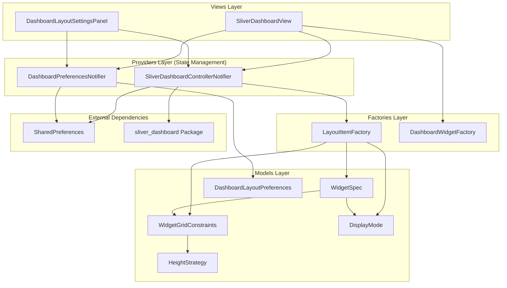
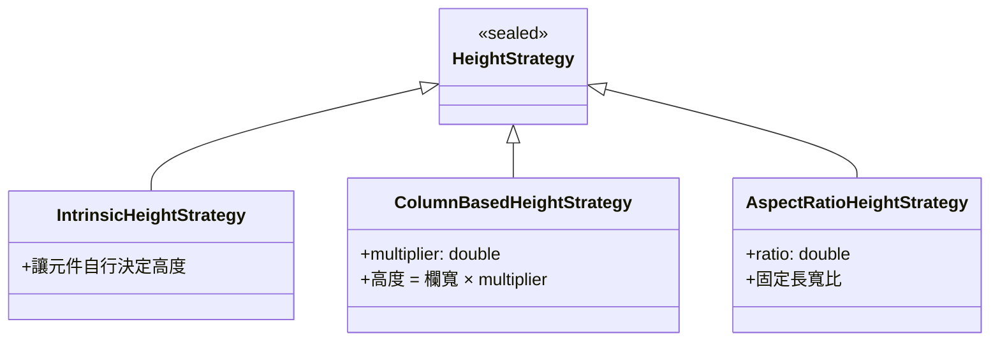
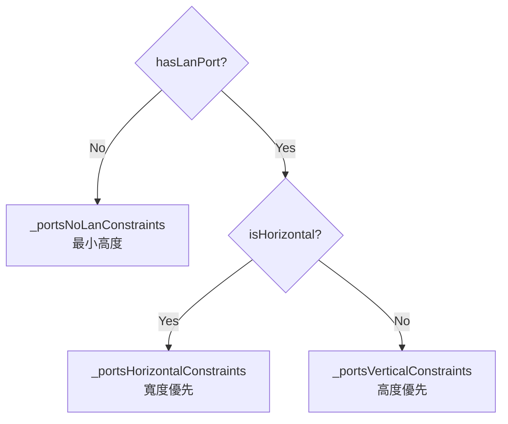
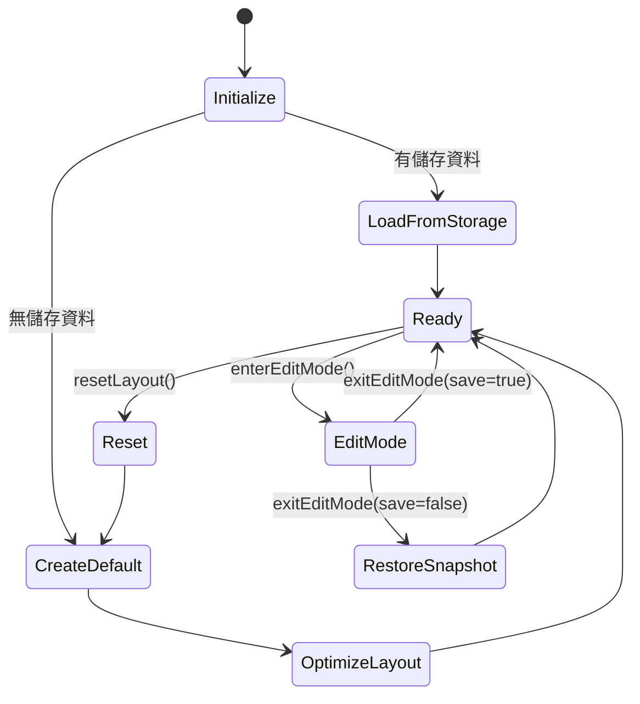
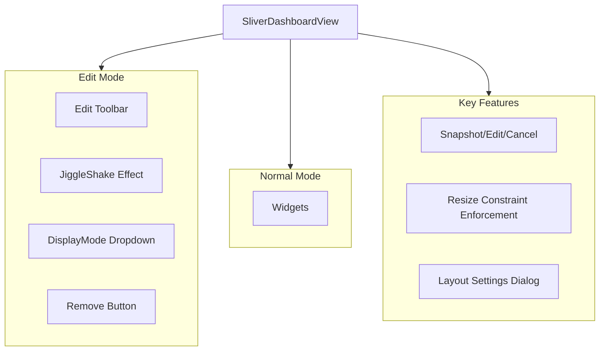
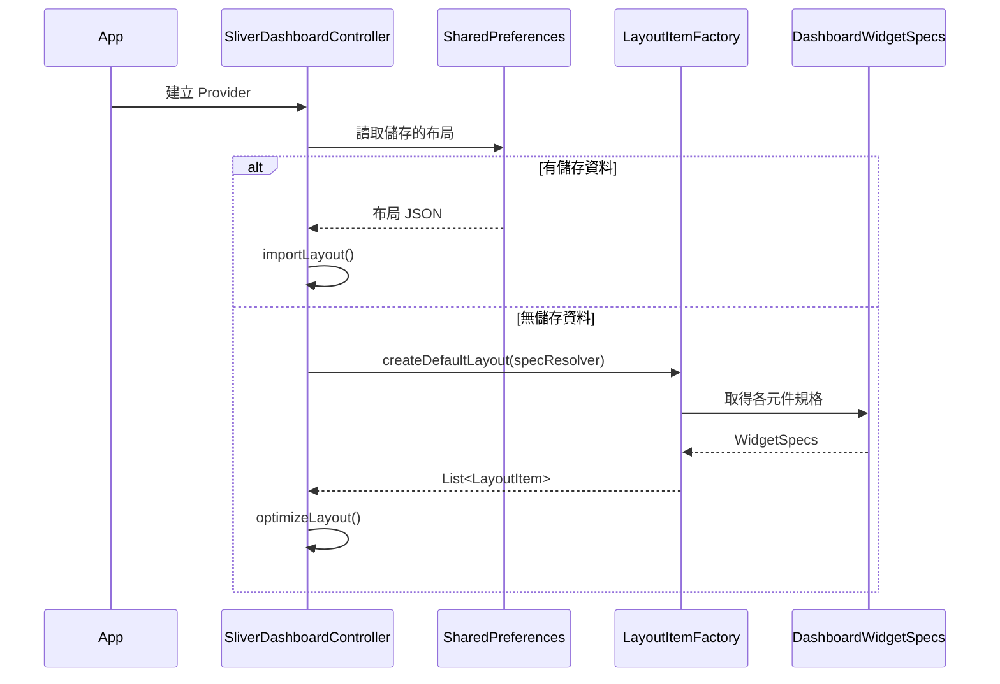
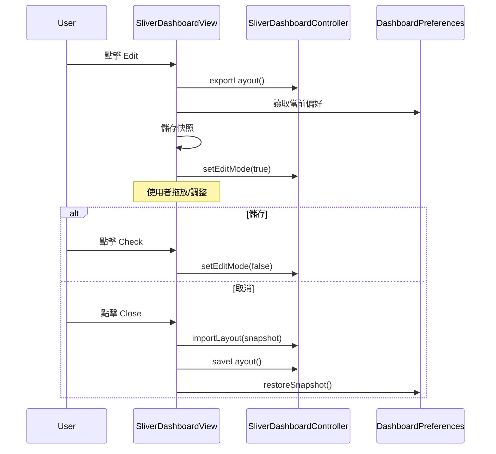

# Dashboard Custom Layout 綜合架構分析報告

本文件整合了 PrivacyGUI Dashboard Custom Layout 的系統架構分析、實作功能、設計原則評估以及深度的設計辯證，旨在提供開發者、測試人員與架構師完整的技術參考。

---

# 第一部分：系統架構分析 (System Architecture)

## 1. 系統架構概覽



---

## 2. 核心組件詳解

### 2.1 Models Layer

#### 2.1.1 `DisplayMode` (顯示模式)

**檔案**: `lib/page/dashboard/models/display_mode.dart`

定義三種元件顯示密度：

| Mode | 說明 |
|------|-----|
| `compact` | 精簡顯示，僅呈現關鍵資訊 |
| `normal` | 預設標準顯示 |
| `expanded` | 展開顯示，完整資訊 |

---

#### 2.1.2 `HeightStrategy` (高度計算策略)

**檔案**: `lib/page/dashboard/models/height_strategy.dart`

使用 **sealed class** 確保型別安全：



**Factory Methods**:
- `HeightStrategy.intrinsic()` - 內容自適應
- `HeightStrategy.columnBased(multiplier)` - 基於欄寬倍數
- `HeightStrategy.strict(rows)` - 固定行數 (語意別名)
- `HeightStrategy.aspectRatio(ratio)` - 固定比例

---

#### 2.1.3 `WidgetGridConstraints` (網格約束)

**檔案**: `lib/page/dashboard/models/widget_grid_constraints.dart`

基於 **12 欄布局** 的約束系統：

| Property | 說明 |
|----------|-----|
| `minColumns` | 最小佔用欄數 (1-12) |
| `maxColumns` | 最大佔用欄數 |
| `preferredColumns` | 預設/偏好欄數 |
| `minHeightRows` | 最小高度行數 |
| `maxHeightRows` | 最大高度行數 |
| `heightStrategy` | 高度計算策略 |

**關鍵方法**:
- `scaleToMaxColumns(target)` - 按比例縮放到目標欄數
- `getPreferredHeightCells()` - 計算偏好高度格數
- `getHeightRange()` - 取得高度範圍 (min, max)

---

#### 2.1.4 `WidgetSpec` (元件規格)

**檔案**: `lib/page/dashboard/models/widget_spec.dart`

每個 Dashboard 元件的完整規格定義：

```dart
class WidgetSpec {
  final String id;                    // 唯一識別符
  final String displayName;           // 顯示名稱
  final String? description;          // 描述
  final Map<DisplayMode, WidgetGridConstraints> constraints;  // 各模式約束
  final bool canHide;                 // 是否可隱藏
  final List<WidgetRequirement> requirements;  // 功能需求
}
```

**需求系統 (`WidgetRequirement`)**:
- `none` - 無特殊需求
- `vpnSupported` - 需要 VPN 功能支援

---

#### 2.1.5 `DashboardWidgetSpecs` (元件規格集合)

**檔案**: `lib/page/dashboard/models/dashboard_widget_specs.dart`

靜態定義所有 Dashboard 元件規格：

| Category | Widgets |
|----------|---------|
| **Standard Widgets** | `internetStatus`, `networks`, `wifiGrid`, `quickPanel`, `portAndSpeed`, `vpn` |
| **Atomic Widgets** (Custom Layout) | `internetStatusOnly`, `masterNodeInfo`, `ports`, `speedTest`, `networkStats`, `topology`, `wifiGrid`, `quickPanel`, `vpn` |

**動態約束 - Ports Widget**:



透過 `getPortsSpec()` 方法動態選擇約束。

---

#### 2.1.6 `DashboardLayoutPreferences` (布局偏好)

**檔案**: `lib/page/dashboard/models/dashboard_layout_preferences.dart`

使用者的 Dashboard 布局偏好設定：

```dart
class DashboardLayoutPreferences {
  final bool useCustomLayout;                          // 是否啟用自訂布局
  final Map<String, GridWidgetConfig> widgetConfigs;   // 元件配置
}
```

**功能**:
- 管理各元件的 `DisplayMode`
- 控制元件可見性
- 元件排序
- JSON 序列化/反序列化 (含舊版格式遷移)

---

### 2.2 Providers Layer

#### 2.2.1 `SliverDashboardControllerNotifier`

**檔案**: `lib/page/dashboard/providers/sliver_dashboard_controller_provider.dart`

管理拖放網格布局的控制器：



**關鍵方法**:

| Method | 功能 |
|--------|------|
| `saveLayout()` | 儲存布局到 SharedPreferences |
| `resetLayout()` | 重置為預設布局 |
| `updateItemConstraints()` | 更新元件約束 |
| `updateItemSize()` | 強制更新元件尺寸 |
| `addWidget()` | 新增元件 |
| `removeWidget()` | 移除元件 |

**IoC 模式 - WidgetSpecResolver**:

```dart
typedef WidgetSpecResolver = WidgetSpec Function(WidgetSpec defaultSpec);
```

用於在組合根 (Composition Root) 注入動態約束邏輯。

---

#### 2.2.2 `DashboardPreferencesNotifier`

**檔案**: `lib/page/dashboard/providers/dashboard_preferences_provider.dart`

管理 Dashboard 布局偏好：

| Method | 功能 |
|--------|------|
| `setWidgetMode()` | 設定元件顯示模式 |
| `toggleCustomLayout()` | 切換自訂布局 |
| `restoreSnapshot()` | 還原快照 |
| `resetWidgetModes()` | 重置顯示模式 |

---

### 2.3 Factories Layer

#### 2.3.1 `LayoutItemFactory`

**檔案**: `lib/page/dashboard/providers/layout_item_factory.dart`

將 `WidgetSpec` 轉換為 `sliver_dashboard` 的 `LayoutItem`：

```dart
static LayoutItem fromSpec(
  WidgetSpec spec, {
  required int x, y,
  int? w, h,
  DisplayMode displayMode,
})
```

**預設布局**:

```
┌─────────────┬─────────────┬─────────────┐
│ Internet    │   Master    │ Quick Panel │ y=0
│  (4x2)      │   (4x4)     │   (4x3)     │
├─────────────┤             ├─────────────┤ y=2
│             │             │ NetworkStats│
│   Ports     │             │   (4x2)     │ y=3
│   (4x6)     ├─────────────┼─────────────┤ y=4
│             │  SpeedTest  │  Topology   │
│             │   (4x4)     │   (4x4)     │
├─────────────┴─────────────┴─────────────┤ y=10
│           WiFi Grid (8x2)               │
└─────────────────────────────────────────┘
```

---

#### 2.3.2 `DashboardWidgetFactory`

**檔案**: `lib/page/dashboard/factories/dashboard_widget_factory.dart`

統一的 Widget 建構工廠：

- `buildAtomicWidget()` - 根據 ID 建構 Widget
- `shouldWrapInCard()` - 判斷是否需要 AppCard 包裝
- `getSpec()` - 取得元件規格

---

### 2.4 Views Layer

#### 2.4.1 `SliverDashboardView`

**檔案**: `lib/page/dashboard/views/sliver_dashboard_view.dart`

主要的拖放 Dashboard 視圖：



**Edit Mode 功能**:
1. **進入編輯** - 快照當前布局和偏好
2. **取消編輯** - 還原快照
3. **儲存編輯** - 保存變更
4. **調整大小約束** - `_handleResizeEnd()` 強制執行 min/max 約束

---

#### 2.4.2 `DashboardLayoutSettingsPanel`

**檔案**: `lib/page/dashboard/views/components/settings/dashboard_layout_settings_panel.dart`

設定面板功能：
- 切換 Standard/Custom 布局
- 顯示隱藏的元件並允許新增
- 重置布局到預設值

---

## 3. 資料流程

### 3.1 布局初始化



### 3.2 編輯模式



---

## 4. 設計模式總結

| Pattern | 應用位置 | 說明 |
|---------|---------|------|
| **IoC (Inversion of Control)** | `WidgetSpecResolver` | 動態約束注入 |
| **Factory Pattern** | `LayoutItemFactory`, `DashboardWidgetFactory` | 集中建構邏輯 |
| **Strategy Pattern** | `HeightStrategy` | 可替換的高度計算策略 |
| **Snapshot/Memento** | Edit Mode | 支援取消操作 |
| **Repository Pattern** | SharedPreferences 存取 | 資料持久化抽象 |

---

## 5. 檔案結構

```
lib/page/dashboard/
├── models/
│   ├── display_mode.dart              # 顯示模式 enum
│   ├── height_strategy.dart           # 高度策略 sealed class
│   ├── widget_grid_constraints.dart   # 網格約束
│   ├── widget_spec.dart               # 元件規格
│   ├── dashboard_widget_specs.dart    # 所有元件規格定義
│   ├── dashboard_layout_preferences.dart  # 布局偏好
│   └── grid_widget_config.dart        # 單一元件配置
│
├── providers/
│   ├── sliver_dashboard_controller_provider.dart  # 布局控制器
│   ├── dashboard_preferences_provider.dart        # 偏好 Provider
│   └── layout_item_factory.dart                   # 布局項目工廠
│
├── factories/
│   └── dashboard_widget_factory.dart   # Widget 建構工廠
│
├── views/
│   ├── sliver_dashboard_view.dart      # 主視圖
│   └── components/
│       └── settings/
│           └── dashboard_layout_settings_panel.dart  # 設定面板
│
└── strategies/                          # (其他布局策略)
```

---

## 6. 關鍵技術點

### 6.1 約束強制執行

在 `_handleResizeEnd()` 中實現約束保護，確保元件不會被調整到超出規格範圍。

### 6.2 動態 Ports 約束

根據硬體狀態 (是否有 LAN 連接、是否水平布局) 動態選擇不同的約束集。

### 6.3 快照還原機制

進入編輯模式時儲存布局和偏好快照，取消時完整還原。

### 6.4 12 欄響應式系統

所有約束基於 12 欄設計，可自動縮放到不同螢幕寬度。

---
---

# 第二部分：設計原則與可測試性評估 (Design Principles & Testability)

## 1. 設計原則評估 (SOLID)

### 單一職責原則 (SRP) - **符合 (Excellent)**
*   **`WidgetSpec`**: 僅負責定義元件的靜態規格與約束，不包含業務邏輯。
*   **`LayoutItemFactory`**: 專注於將規格 (`WidgetSpec`) 轉換為布局項目 (`LayoutItem`)，職責單一且清晰。
*   **`SliverDashboardControllerNotifier`**: 專注於管理布局的運行時狀態 (位置、尺寸) 與持久化，不處理元件內容渲染。
*   **`DashboardWidgetFactory`**: 負責 UI 元件的建構與映射，與布局邏輯分離。

### 開放/封閉原則 (OCP) - **符合 (Good)**
*   新增元件只需在 `DashboardWidgetSpecs` 新增定義並在 `DashboardWidgetFactory` 增加 case，無需修改核心布局邏輯或控制器。
*   `HeightStrategy` 使用 sealed class，雖限制了外部擴充，但對於有限的布局策略來說提供了極佳的型別安全與編譯時檢查，符合當前需求。

### 依賴反轉原則 (DIP) - **符合 (Good)**
*   `LayoutItemFactory` 透過 `WidgetSpecResolver` 函式介面注入動態約束邏輯 (如 Ports 的硬體狀態依賴)，而非直接依賴具體的 Provider 或 Store。這使得工廠邏輯完全解耦，易於測試。

---

## 2. 可測試性評估

整體架構的可測試性極高，主要歸功於核心邏輯的純函數化與狀態分離。

| 組件 | 可測試性 | 說明 |
|------|----------|------|
| **`LayoutItemFactory`** | ⭐⭐⭐⭐⭐ (高) | 核心方法如 `fromSpec` 與 `createDefaultLayout` 為純函數 (Pure Functions)，無外部依賴，極易編寫單元測試。 |
| **`WidgetGridConstraints`** | ⭐⭐⭐⭐⭐ (高) | 簡單的資料類別，約束計算邏輯 (`scaleToMaxColumns`) 易於驗證。 |
| **`DashboardWidgetSpecs`** | ⭐⭐⭐⭐⭐ (高) | 靜態常數定義，可透過測試確保所有元件都定義了所有 DisplayMode 的約束，防止遺漏。 |
| **`SliverDashboardController`** | ⭐⭐⭐⭐ (中高) | 依賴 `SharedPreferences` 與 `Ref`，但透過 Riverpod 的 `ProviderContainer` 與 Mock SharedPreferences 即可輕鬆進行整合測試。 |

---

## 3. 現狀分析與缺口

雖然架構本身非常利於測試，但目前的程式碼庫中**嚴重缺乏針對此模組的單元測試**。

### 已發現的測試缺口
1.  **缺少 `LayoutItemFactory` 測試**: 
    - 驗證預設布局生成是否正確。
    - 驗證 `fromSpec` 是否正確處理所有 DisplayMode 的約束轉換。
    - 驗證動態 Ports 約束解析 (`WidgetSpecResolver`) 的行為。
2.  **缺少 `WidgetGridConstraints` 測試**:
    - 驗證 12 欄到 8/4 欄的縮放邏輯是否符合預期。
    - 驗證高度計算策略 (`HeightStrategy`)。
3.  **缺少 `DashboardLayoutPreferences` 測試**:
    - 驗證 JSON 序列化/反序列化，特別是舊版資料遷移的兼容性。
    - 驗證排序與可見性切換邏輯。
4.  **缺少 `SliverDashboardController` 整合測試**:
    - 驗證 `addWidget` / `removeWidget` / `updateItemConstraints` 是否正確更新狀態並觸發儲存。
    - 驗證優化布局算法 (`optimizeLayout`) 是否有效填補空隙。

## 4. 建議行動

由於核心邏輯 (`LayoutItemFactory`) 是純函數，建議優先補足此部分的單元測試，以確保布局基礎穩固。

建議新增以下測試檔案：
- `test/page/dashboard/providers/layout_item_factory_test.dart`
- `test/page/dashboard/models/widget_grid_constraints_test.dart`
- `test/page/dashboard/models/dashboard_layout_preferences_test.dart`

---
---

# 第三部分：設計深度分析 (Design Deep Dive)

## 1. 架構重複設計與依賴分析

經過深入分析，目前的設計**在程式碼層面沒有顯著的重複依賴**，但在**資料模型與狀態管理**上採取了「雙軌並行」的策略，這是一個權衡後的設計選擇。

### 1.1 雙軌布局狀態 (Dual Layout State)
系統同時維護兩套布局狀態，分別服務不同的使用情境：

1.  **Standard Layout (標準布局)**:
    -   **狀態來源**: `DashboardPreferences` (`order`, `columnSpan`, `visible`)。
    -   **特點**: 響應式流式布局 (Flow/List)，自動適應裝置。
    -   **元件**: 主要使用 `Composite Widgets` (如 `internet_status` 包含路由器資訊)。
2.  **Custom Layout (自訂布局)**:
    -   **狀態來源**: `SliverDashboardController` (儲存於獨立的 JSON key)。
    -   **特點**: 自由拖放網格 (Bento Grid)，絕對位置 (`x`, `y`) 與尺寸 (`w`, `h`)。
    -   **元件**: 主要使用 `Atomic Widgets` (如 `internet_status_only` 與 `master_node_info` 分離)。

### 1.2 潛在的重複與共享 (Partial State Sharing)
這裡存在一個設計上的微妙之處：**部分元件共享狀態，部分則否**。

*   **獨立狀態元件**: 
    *   標準布局使用 `PortAndSpeed` (整合型)，自訂布局使用 `Ports` + `SpeedTest` (分離型)。
    *   **結果**: 它們 ID 不同，因此 DisplayMode 互不影響。這是正確的，因為分離後的元件顯示邏輯與整合型不同。
*   **共享狀態元件**:
    *   `WiFi Grid`, `Quick Panel`, `VPN` 在兩種布局中 ID 相同。
    *   **結果**: 若使用者在「自訂布局」中將 WiFi Grid 切換為 `Compact` 模式，切換回「標準布局」時，WiFi Grid **也會變成 Compact 模式**。
    *   **分析**: 這不是程式碼重複，而是**預期的使用者體驗設計**。這確保了通用元件的一致性，但開發者需注意這種交互影響。

### 1.3 `GridWidgetConfig` 與 `LayoutItem` 的關係
*   `GridWidgetConfig.columnSpan`: 僅用於 **Standard Layout** 的寬度控制。
*   `LayoutItem.w`: 僅用於 **Custom Layout** 的寬度控制。
*   **結論**: 雖然看似儲存了兩個「寬度」，但因為應用於完全不同的布局演算引擎 (Flow vs Grid)，所以不算是重複依賴，而是針對不同布局策略的專用設定。

---

## 2. Widget Grid Constraints 參數詳解

`WidgetGridConstraints` 定義了元件在 12 欄網格系統中的行為限制。

### 2.1 寬度相關參數 (Columns)

所有數值皆基於 **12 欄 (12-column system)** 為基準。

| 參數名稱 | 中文說明 | 詳細用途 |
|:---:|:---:|:---|
| **`minColumns`** | **最小欄數** | **縮小的極限**。<br>當使用者嘗試縮小元件，或在響應式計算中螢幕變窄時，元件寬度均不會小於此數值，以確保內容可讀性。 |
| **`maxColumns`** | **最大欄數** | **放大的極限**。<br>限制元件最大能佔據多寬，避免某些小型元件 (如開關) 被拉得太長而比例失衡。 |
| **`preferredColumns`** | **偏好/預設欄數** | **初始寬度**。<br>1. 當元件被「新增」到 Dashboard 時的預設寬度。<br>2. 當執行「重置布局」時恢復的寬度。<br>3. 在 Standard Layout 中作為計算基礎寬度。 |

### 2.2 高度相關參數 (Rows)

高度單位為 **Grid Cells (網格單元)**，並非像素。

| 參數名稱 | 中文說明 | 詳細用途 |
|:---:|:---:|:---|
| **`minHeightRows`** | **最小高度行數** | **垂直縮小的極限**。<br>確保元件有足夠的垂直空間顯示核心內容，不會被壓扁到無法閱讀。 |
| **`maxHeightRows`** | **最大高度行數** | **垂直放大的極限**。<br>防止使用者將元件拉得過高，導致版面破碎或空白過多。 |
| **`heightStrategy`** | **高度計算策略** | **決定「偏好高度」的算法**。<br>當寬度改變時，如何自動決定預設高度？詳細請見下表。 |

### 2.3 HeightStrategy 策略詳解

| 策略類型 | 參數 | 說明 | 適用情境 |
|:---|:---:|:---|:---|
| **`Strict`** | `rows` (double) | **固定行數**。<br>無論寬度多少，高度總是維持固定的行數。 | 適用於列表、文字型元件，高度與寬度無關，只需固定空間顯示內容。 |
| **`ColumnBased`** | `multiplier` | **寬度倍率**。<br>`Height = Width * Multiplier`。<br>高度隨寬度等比縮放。 | 適用於需要維持視覺份量的區塊，寬度越寬，高度越高。 |
| **`AspectRatio`** | `ratio` | **長寬比**。<br>`Width / Height = Ratio`。<br>嚴格維持圖片或圖表的比例。 | 適用於 `Topo View` 或包含圖片的元件，確保圖形不變形。 |
| **`Intrinsic`** | 無 | **內容自適應**。<br>高度由內容決定 (但在 Grid 系統中通常會 fallback 到 minHeight)。 | 較少用於固定網格，通常用於 Standard Layout。 |

---

## 3. HeightStrategy 與 Min/Max Height 的關係 (FAQ)

### 3.1 是否為重複設計？
**不是重複設計，而是「理想值」與「邊界值」的區別。**

*   **`HeightStrategy` (理想值/預設值)**: 定義元件在**不受外力干擾下**，最「完美」或「預設」的高度是多少。
    *   *例如：「這個圖表最好顯示為 4:3 比例。」*
*   **`min/maxHeightRows` (邊界值)**: 定義元件**在調整過程中**，允許存在的範圍。
    *   *例如：「不管圖表比例如何，高度都不能小於 1 行，也不能大於 6 行。」*

**為什麼需要兩者並存？**
如果只有 Min/Max，系統無法知道當元件被「新增」或「重置」時，應該給它多少高度 (是給最小值？最大值？還是中間值？)。`HeightStrategy` 提供了這個初始的錨點。

### 3.2 HeightStrategy 的具體使用案例分析

您的觀察非常敏銳！`LayoutItemFactory` 確實允許傳入 `w` 和 `h` 來覆蓋預設值。這引出了「**情境式預設 (Contextual Default)**」與「**元件原生預設 (Intrinsic Component Default)**」的區別。

以下是三個關鍵場景，說明系統何時使用 Strategy，何時使用 Factory Override：

#### **場景 A：預設布局初始化 (使用 Factory Override)**
*   **情境**: 當使用者第一次打開 App，或點擊「重置布局」時。
*   **行為**: 雖然每個元件都有自己的 `HeightStrategy` (理想高度)，但為了讓所有元件在畫面上像拼圖一樣完美契合 (Bento Grid)，設計師在 `createDefaultLayout` 中**手動指定了特定高度**。
*   **程式碼**:
    ```dart
    // 雖然 InternetStatus 的 Strategy 可能建議高度為 2
    // 但為了配合右邊的 QuickPanel，設計師強制設定為 2
    items.add(fromSpec(spec, ..., h: 2)); 
    ```
*   **結論**: 此時 `HeightStrategy` **被忽略**，以設計師的「拼圖邏輯」為準。

#### **場景 B：使用者新增元件 (使用 HeightStrategy)**
*   **情境**: 使用者手動刪除某個元件後，從「隱藏清單」按 `+` 把元件加回來。
*   **行為**: 當元件被「加回來」時，它不再屬於那個完美的預設拼圖，而是作為一個獨立個體加入。此時系統不會指定 `h`，而是讓元件自己決定。
*   **程式碼**: (`SliverDashboardController.addWidget`)
    ```dart
    // 不傳入 w 或 h，完全依賴 Strategy
    LayoutItemFactory.fromSpec(spec, ...); 
    ```
*   **結論**: 此時 **使用 `HeightStrategy`** 計算該元件最適合的初始大小。

#### **場景 C：切換顯示模式 (使用 HeightStrategy)**
*   **情境**: 使用者覺得 `Compact` 模式太小，手動切換成 `Normal` 模式。
*   **行為**: 舊的 `Compact` 高度已不再適用。系統需要知道 `Normal` 模式下該元件「應該」長怎樣。
*   **程式碼**: (`SliverDashboardView._updateDisplayMode`)
    ```dart
    // 取得新模式的 Constraints 並計算 Strategy 建議高度
    final preferredH = constraints.getPreferredHeightCells(...);
    // 更新元件尺寸
    ```
*   **結論**: 此時 **使用 `HeightStrategy`** 來決定新模式下的高度。

### 3.3 總結
*   **`LayoutItemFactory` (Manual Override)**: 代表 **「整體布局的考量」**。為了排版整齊，可能會暫時無視個別元件的完美比例。
*   **`HeightStrategy` (Component Native)**: 代表 **「元件自身的考量」**。當元件獨立存在或變形時，它用來宣告自己「最舒服」的樣子。

---

## 4. 設計辯證 (Design Trade-offs)

### 4.1 為什麼不直接使用 `preferredRows`？ (類似 `preferredColumns`)
您提到了一個很好的替代方案：既然寬度有 `preferredColumns`，為什麼高度不直接給一個 `preferredRows` 整數就好？

這涉及了 **靜態數值 (Static Value) vs 動態算法 (Dynamic Algorithm)** 的設計選擇。

#### **原因一：高度往往依賴寬度 (Aspect Ratio Dependency)**
網格系統中，寬度通常是「自變量」(使用者決定拉多寬)，而高度是「應變量」。
*   **案例 (Topology 拓樸圖)**:
    *   這是一個如同地圖般的元件，需要維持視野比例。
    *   假設我們設定死板的 `preferredRows = 4`。
    *   當寬度是 4 欄時，4x4 (正方形) 看起來不錯。
    *   但當使用者拉寬到 8 欄時，如果高度還是維持 `preferredRows = 4`，變成 8x4 (扁長方形)，內部的拓樸圖就會被壓扁或留白過多。
    *   **解決方案**: 使用 `AspectRatioStrategy(1.0)`，當寬度變 8 時，高度自動計算為 8，維持完美比例。

#### **原因二：硬體狀態的動態性 (Dynamic Hardware State)**
*   **案例 (Ports 連接埠)**:
    *   Ports 元件的高度取決於 **LAN 孔數量**。
    *   **有 LAN 孔**: 需要兩排顯示 (WAN + LAN)，高度較高。
    *   **無 LAN 孔 (Mesh Node)**: 只需要一排顯示 (WAN/Backhaul)，高度減半。
    *   如果只用靜態的 `preferredRows`，我們必須在程式碼中寫很多 `if (hasLan) 4 else 2` 的邏輯。
    *   **解決方案**: `HeightStrategy.intrinsic()` 允許元件根據內部內容 (是否有 LAN) 回報高度，將邏輯封裝在元件內部，而不是 Layout 外部。

### 4.2 場景 B/C 為何不使用 Layout Factory 的希望值？
`LayoutItemFactory` 的確可以透過 `h` 參數傳入希望值，但在 **場景 B (新增)** 與 **場景 C (模式切換)** 中，我們通常缺乏「上下文 (Context)」。

*   **在場景 A (預設布局)**: 設計師像畫畫一樣，全盤掌握所有元件的位置，所以此時有「上帝視角」，可以強制指定 `Internet` 高度為 2 以對齊右邊的 `QuickPanel`。
*   **在場景 B/C**: 這是「執行期 (Runtime)」，元件是動態被加進來的。系統不知道它旁邊是誰，也不知道使用者的意圖。此時最安全的做法，就是回歸元件的「本性 (`HeightStrategy`)」，讓元件以最自然的型態出現，再由使用者自行調整。

### 4.3 那為什麼寬度 (Columns) 不需要 Strategy？
您可能會問：「為什麼高度這麼複雜，寬度卻只要一個 `preferredColumns` 數字？」

**核心原因：網格系統通常是「寬度主導 (Width-Dominant)」的。**

在現代響應式設計 (Responsive Design) 中：

1.  **寬度是「自變量 (Independent Variable)」**：
    *   寬度通常由 **外部環境** (螢幕大小) 或 **使用者意圖** (手動拉寬) 決定。
    *   例如：在手機上，寬度被強制限制為 100%；在平板上可能是 50%。
    *   因此，寬度不需要複雜的內部計算，它通常是「被給定」或「被限制」的 (Min/Max Constraints)。

2.  **高度是「應變量 (Dependent Variable)」**：
    *   高度是為了 **配合寬度** 而產生的結果。
    *   當寬度變窄 (手機) 時，文字會斷行，圖片會縮小，為了顯示完整內容，高度必須 **向下延伸**。
    *   這就是為什麼高度需要 `Strategy` (算法)，因為它必須隨時回答：「在寬度變成的 X 的現在，我需要多高才能活下去？」

---

# 第四部分：測試策略與實作 (Testing Strategy & Implementation)

## 1. 測試方法論 (Methodology)

Dashboard Custom Layout 採用「測試金字塔 (Test Pyramid)」策略，重點覆蓋純邏輯組件的單元測試，並輔以關鍵路徑的整合測試。

### 1.1 測試層級
1.  **Unit Tests (單元測試)**:
    *   **目標**: 針對無外部依賴的「純函數 (Pure Functions)」與「資料模型 (Data Models)」。
    *   **SUT (System Under Test)**: `LayoutItemFactory`, `WidgetGridConstraints`, `DashboardLayoutPreferences`.
    *   **優勢**: 執行速度極快，能覆蓋所有邊界條件 (例如 12 欄縮放算法、JSON 遷移)。
2.  **Integration Tests (整合測試)**:
    *   **目標**: 驗證組件間的互動與副作用 (Side Effects)，特別是資料持久化。
    *   **SUT**: `SliverDashboardController` + `SharedPreferences (Mock)`.
    *   **優勢**: 確保「儲存」、「讀取」、「重置」等使用者關鍵功能正常運作。

---

## 2. 測試實作詳情

### 2.1 Models Layer Testing
針對資料模型的邏輯驗證：

*   **`WidgetGridConstraints`**:
    *   驗證 `scaleToMaxColumns`: 確保在 Desktop (12), Tablet (8), Mobile (4) 不同欄數下，寬度能正確等比縮放。
    *   驗證 `HeightStrategy`: 確保所有策略 (`Strict`, `AspectRatio`, `Intrinsic`) 計算出的高度正確。
*   **`DashboardLayoutPreferences`**:
    *   驗證 JSON 序列化/反序列化：確保 `GridWidgetConfig` 正確存取。
    *   驗證 Legacy Migration：確保舊版 `widgetModes` 格式能無縫遷移到新版結構。

### 2.2 Factories Layer Testing
針對核心轉換邏輯的驗證：

*   **`LayoutItemFactory`**:
    *   驗證 `fromSpec`: 測試 `WidgetSpec` 到 `LayoutItem` 的轉換，包含 `min/max` 約束的傳遞。
    *   驗證 Override Logic: 測試手動傳入 `w`/`h` 時是否正確覆蓋預設值 (場景 A)。
    *   驗證 `createDefaultLayout`: 確保預設布局包含正確的元件清單與初始位置。
    *   驗證 IoC 注入: 測試 `WidgetSpecResolver` 能否成功注入動態約束 (例如模擬 Ports 硬體狀態)。

### 2.3 Integration Layer Testing
針對控制器與儲存層的互動驗證：

*   **`SliverDashboardController`**:
    *   **環境模擬**: 使用 `mocktail` 模擬 Riverpod `Ref`，使用 `SharedPreferences.setMockInitialValues` 模擬磁碟儲存。
    *   **CRUD 驗證**: 測試 `addWidget` 與 `removeWidget` 是否同時更新記憶體狀態 (`state`) 與磁碟儲存 (`SharedPreferences`).
    *   **約束更新**: 測試 `updateItemConstraints`，驗證當新約束的 `minW` 大於當前 `w` 時，是否自動觸發 `clamp` 機制修正尺寸。
    *   **重置流程**: 驗證 `resetLayout` 是否正確清除磁碟資料並恢復預設布局。

---

## 3. 如何執行測試

使用 Flutter 標準測試指令執行：

```bash
# 執行所有 Dashboard 相關測試
flutter test test/page/dashboard/

# 執行特定測試檔案
flutter test test/page/dashboard/providers/layout_item_factory_test.dart
flutter test test/page/dashboard/models/widget_grid_constraints_test.dart
flutter test test/page/dashboard/providers/sliver_dashboard_controller_test.dart
```

---

## 4. 驗證結果

截至最新版本，所有針對 Custom Layout 的單元測試與整合測試皆已通過，確認了架構的穩定性與正確性。
