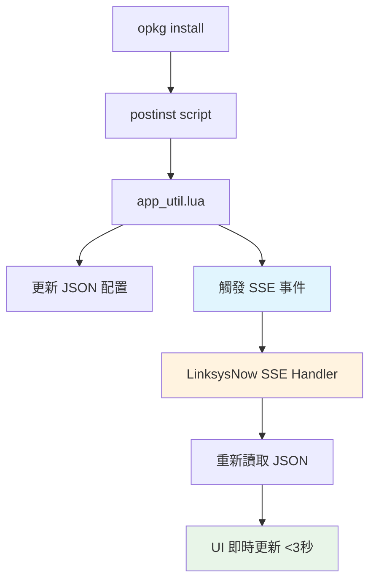

# OpenWrt UI Package Integration - 完整 MVP 開發指南

## 🎯 **MVP 目標與架構決策**

### **核心目標**
實現 `opkg install my-app` → LinksysNow UI 自動顯示新應用（無需手動刷新）

### **技術架構決定** (基於實地調查)
```
✅ JSON 配置檔案: /www/assets/config/linksys_apps.json
✅ SSE 事件觸發: 利用現有 usp-bridge SSE 基礎設施
✅ 統一事件處理: LinksysNow 單一 SSE 連線
❌ TR-181 Device.LocalAgent.Apps.{i}: 不存在，無法使用
❌ Vendor Extension: 無法動態創建，風險過高
```

### **系統架構圖**


### **成功驗證標準**
1. **安裝測試**: `opkg install luci-app-demo` → UI 在 3 秒內顯示新應用
2. **移除測試**: `opkg remove luci-app-demo` → UI 在 3 秒內移除應用
3. **Web 存取**: 點擊應用卡片能正確跳轉到應用頁面
4. **系統穩定**: 不影響現有 LinksysNow 功能

---

## 🔧 **Router 端詳細工作項目**

### **1. app_util.lua 核心擴展**

#### **新增核心功能**
```lua
-- SSE 事件觸發機制
function trigger_ui_update(event_type, app_data)
    if not options.dryRun then
        -- 方案 A: 檔案觸發
        local trigger_file = "/tmp/linksys_app_update"
        local f = io.open(trigger_file, "w")
        f:write(json.encode({
            event = event_type,
            app = app_data,
            timestamp = os.time()
        }))
        f:close()

        -- 方案 B: MQTT 觸發 (備用)
        local cmd = string.format(
            "mosquitto_pub -h 127.0.0.1 -p 1883 -t 'linksys/ui/app_update' -m '%s'",
            json.encode({event = event_type, app = app_data})
        )
        os.execute(cmd)

        print("[UI Event Triggered]: " .. event_type)
    end
end

-- 整合到現有操作
function handle_updates(current_app, config_json)
    -- ... 現有邏輯 ...

    if options.newApp then
        -- 現有添加邏輯
        add_app_to_config()
        trigger_ui_update("installed", current_app)
    elseif options.deleteApp then
        -- 現有刪除邏輯
        remove_app_from_config()
        trigger_ui_update("removed", current_app)
    end
end

-- 錯誤處理和回滾
function rollback_operation(app_name, backup_config)
    local f = io.open(CONFIG_PATH, "w")
    f:write(json.encode(backup_config, {indent = true}))
    f:close()

    trigger_ui_update("error", {name = app_name, error = "Operation failed"})
end
```

#### **lighttpd 動態路由生成**
```lua
function generate_lighttpd_config(apps_config)
    local config_lines = {}
    table.insert(config_lines, "# Auto-generated app routes")

    for _, app in pairs(apps_config.userApps or {}) do
        if app.urlPath and app.urlPath ~= "" then
            local alias_line = string.format(
                'alias.url += ( "/%s/" => "/usr_www/%s/" )',
                app.urlPath, app.urlPath
            )
            table.insert(config_lines, alias_line)
        end
    end

    local config_path = "/etc/lighttpd/conf.d/99-apps.conf"
    local f = io.open(config_path, "w")
    f:write(table.concat(config_lines, "\n") .. "\n")
    f:close()

    os.execute("/etc/init.d/lighttpd reload")
end
```

### **2. 檔案系統標準化**
```bash
目標檔案結構：
/www/assets/config/linksys_apps.json    # 主配置檔案
/usr/bin/app_util.lua                   # 執行腳本
/etc/lighttpd/conf.d/99-apps.conf      # lighttpd 路由配置
/usr_www/                               # 應用 web 檔案目錄

任務清單：
□ 移動測試配置到生產位置
□ 更新 app_util.lua 中的路徑常數
□ 驗證檔案權限設定 (644 for JSON, 755 for lua)
□ 建立 /usr_www/ 目錄結構
```

### **3. OpenWrt 包結構與腳本**
```
luci-app-demo/
├── Makefile                    # 包構建檔案
├── files/
│   ├── usr_www/demo/          # Web 檔案
│   │   ├── index.html
│   │   ├── style.css
│   │   └── app.js
│   └── etc/config/demo        # 配置檔案
└── scripts/
    ├── postinst               # 安裝後腳本
    └── prerm                  # 移除前腳本
```

#### **postinst 腳本範例**
```bash
#!/bin/sh
# postinst - 安裝後執行

APP_NAME="Demo App"
APP_PATH="demo"
APP_ICON="icon_demo"

# 調用 app_util.lua 註冊應用
/usr/bin/app_util.lua new "{\"name\":\"$APP_NAME\",\"urlPath\":\"$APP_PATH\",\"icon\":\"$APP_ICON\"}"

exit 0
```

#### **prerm 腳本範例**
```bash
#!/bin/sh
# prerm - 移除前執行

APP_NAME="Demo App"

# 調用 app_util.lua 移除應用
/usr/bin/app_util.lua delete "$APP_NAME"

exit 0
```

### **4. SSE 事件觸發測試**
```bash
# 方案 A 測試: 檔案觸發
echo '{"event":"test","timestamp":"'$(date -Is)'"}' > /tmp/linksys_app_update

# 方案 B 測試: MQTT 觸發
mosquitto_pub -h 127.0.0.1 -p 1883 -t 'linksys/ui/app_update' -m '{"event":"test"}'

# 方案 C 測試: 直接 HTTP 觸發 (如果可能)
curl -X POST http://127.0.0.1:8083/api/notify -d '{"event":"app_update"}'
```

---

## 📱 **UI 端 (LinksysNow) 詳細工作項目**

### **1. SSE 事件監聽擴展**
```dart
// lib/services/app_event_service.dart
class AppEventService {
  final SseManager sseManager;

  AppEventService(this.sseManager);

  void initializeAppEventListening() {
    // 擴展現有 SseManager
    sseManager.eventRouter.addWildcardHandler('app-events', (notification) {
      if (notification.payload.containsKey('event')) {
        final eventType = notification.payload['event'] as String;

        if (eventType.startsWith('app_')) {
          _handleAppNotification(notification);
          return true; // handled
        }
      }
      return false; // not handled
    });
  }

  void _handleAppNotification(SseNotification notification) {
    final eventType = notification.payload['event'] as String;
    final appData = notification.payload['app'] as Map<String, dynamic>?;

    switch (eventType) {
      case 'app_installed':
        _onAppInstalled(appData);
        break;
      case 'app_removed':
        _onAppRemoved(appData);
        break;
      case 'app_updated':
        _onAppUpdated(appData);
        break;
    }
  }

  void _onAppInstalled(Map<String, dynamic>? appData) {
    ref.invalidate(appsConfigProvider);
    showSnackBar('New application installed: ${appData?['name']}');
  }

  void _onAppRemoved(Map<String, dynamic>? appData) {
    ref.invalidate(appsConfigProvider);
    showSnackBar('Application removed: ${appData?['name']}');
  }
}
```

### **2. 應用配置提供者**
```dart
// lib/providers/apps_config_provider.dart
@riverpod
Future<AppsConfig> appsConfig(AppsConfigRef ref) async {
  final response = await http.get(
    Uri.parse('http://127.0.0.1/assets/config/linksys_apps.json'),
  );

  if (response.statusCode == 200) {
    final jsonData = json.decode(response.body);
    return AppsConfig.fromJson(jsonData);
  } else {
    throw Exception('Failed to load apps configuration');
  }
}

// 重試機制
@riverpod
Future<AppsConfig> appsConfigWithRetry(AppsConfigWithRetryRef ref) async {
  int retryCount = 0;
  const maxRetries = 3;

  while (retryCount < maxRetries) {
    try {
      return await ref.watch(appsConfigProvider.future);
    } catch (e) {
      retryCount++;
      if (retryCount >= maxRetries) rethrow;
      await Future.delayed(Duration(seconds: retryCount));
    }
  }
  throw Exception('Failed to load apps configuration after $maxRetries retries');
}
```

### **3. UI 組件**
```dart
// lib/widgets/app_card.dart
class AppCard extends ConsumerWidget {
  final AppInfo app;

  const AppCard({Key? key, required this.app}) : super(key: key);

  @override
  Widget build(BuildContext context, WidgetRef ref) {
    return Card(
      child: InkWell(
        onTap: () => _launchApp(context, app.urlPath),
        child: Padding(
          padding: const EdgeInsets.all(16.0),
          child: Column(
            children: [
              _buildAppIcon(),
              const SizedBox(height: 8),
              Text(
                app.name,
                style: Theme.of(context).textTheme.titleMedium,
                textAlign: TextAlign.center,
              ),
              if (app.isNewlyInstalled)
                Container(
                  margin: const EdgeInsets.only(top: 4),
                  padding: const EdgeInsets.symmetric(horizontal: 8, vertical: 2),
                  decoration: BoxDecoration(
                    color: Colors.green,
                    borderRadius: BorderRadius.circular(12),
                  ),
                  child: const Text(
                    'NEW',
                    style: TextStyle(color: Colors.white, fontSize: 10),
                  ),
                ),
            ],
          ),
        ),
      ),
    );
  }

  void _launchApp(BuildContext context, String urlPath) {
    if (urlPath.isNotEmpty) {
      Navigator.push(
        context,
        MaterialPageRoute(
          builder: (context) => AppWebView(
            url: 'http://127.0.0.1/$urlPath/',
            title: app.name,
          ),
        ),
      );
    }
  }
}
```

### **4. 狀態管理與快取**
```dart
// lib/providers/apps_cache_provider.dart
@riverpod
class AppsCacheNotifier extends _$AppsCacheNotifier {
  @override
  AppsConfig? build() => null;

  void updateCache(AppsConfig newConfig) {
    state = newConfig;
  }

  void addApp(AppInfo newApp) {
    if (state != null) {
      final updatedApps = [...state!.userApps, newApp];
      state = state!.copyWith(userApps: updatedApps);
    }
  }

  void removeApp(String appName) {
    if (state != null) {
      final updatedApps = state!.userApps
          .where((app) => app.name != appName)
          .toList();
      state = state!.copyWith(userApps: updatedApps);
    }
  }

  void markAppAsNew(String appName, {Duration duration = const Duration(minutes: 5)}) {
    Timer(duration, () {
      if (state != null) {
        final updatedApps = state!.userApps.map((app) {
          if (app.name == appName) {
            return app.copyWith(isNewlyInstalled: false);
          }
          return app;
        }).toList();
        state = state!.copyWith(userApps: updatedApps);
      }
    });
  }
}
```

---

## 📅 **3 週詳細開發計劃**

### **第 1 週：基礎設施建立** (Days 1-7)

#### **Day 1-2: 檔案系統標準化與 SSE 驗證**

**Router 端任務**:
- [ ] 移動配置檔案到 `/www/assets/config/linksys_apps.json`
- [ ] 更新 `app_util.lua` 路徑配置
- [ ] 測試基本 CRUD 功能
- [ ] 驗證檔案權限和目錄結構

**UI 端任務**:
- [ ] 測試 LinksysNow 讀取新配置檔案位置
- [ ] 確認應用卡片正確顯示
- [ ] 驗證現有 JWT token 機制
- [ ] 測試 SSE 端點 `/api/v1/notifications` 連通性

**完成標準**:
- 配置檔案位於正確生產位置
- LinksysNow 能讀取並顯示應用列表
- SSE 連接建立成功

#### **Day 3-4: SSE 事件觸發機制**

**Router 端任務**:
- [ ] 實現 `trigger_ui_update()` 函數
- [ ] 測試三種觸發方案 (檔案/MQTT/HTTP)
- [ ] 選擇最穩定的觸發機制
- [ ] 整合到現有 CRUD 操作

**UI 端任務**:
- [ ] 開發 `AppEventService` 類別
- [ ] 擴展現有 `SseManager` 添加 wildcard handler
- [ ] 實現應用事件處理邏輯
- [ ] 測試 `ref.invalidate()` 重載機制

**完成標準**:
- `app_util.lua` 能觸發 SSE 事件
- LinksysNow 能接收並處理事件
- 選定最穩定的觸發機制

#### **Day 5-7: Web 路由與完整整合**

**Router 端任務**:
- [ ] 實現 `generate_lighttpd_config()` 函數
- [ ] 測試 lighttpd 別名配置生成
- [ ] 驗證 URL 路由正確工作
- [ ] 測試服務重載機制

**UI 端任務**:
- [ ] 完善 `AppCard` 組件點擊跳轉
- [ ] 實現 `AppWebView` 內嵌瀏覽器
- [ ] 添加載入狀態和錯誤處理
- [ ] 端到端整合測試

**完成標準**:
- Web 路由 `/my-app/` → `/usr_www/my-app/` 正確工作
- 點擊應用卡片能正確跳轉
- 端到端流程無錯誤

**Week 1 整合測試**:
```bash
# 測試完整事件流
/usr/bin/app_util.lua new '{"name":"Week1 Test","urlPath":"week1test"}'
# 預期: 3 秒內 LinksysNow UI 顯示新應用
```

### **第 2 週：包整合系統** (Days 8-14)

#### **Day 8-10: Demo 應用開發**

**Router 端任務**:
- [ ] 設計 Demo App 規格
  - 名稱: `luci-app-demo`
  - 位置: `/usr_www/demo/`
  - 路由: `http://192.168.1.1/demo/`
- [ ] 創建簡潔的 HTML 介面
- [ ] 設計基本樣式和 JavaScript
- [ ] 測試獨立運作

**UI 端任務**:
- [ ] 優化應用卡片顯示效果
- [ ] 實現應用圖示處理 (base64/預設)
- [ ] 添加 "NEW" 標記功能
- [ ] 改善網格佈局和響應式設計

**完成標準**:
- Demo 應用能獨立存取
- UI 介面簡潔美觀
- 所有檔案路徑正確

#### **Day 11-12: OpenWrt 包結構**

**Router 端任務**:
- [ ] 設計標準包結構
- [ ] 編寫 `Makefile` (符合 OpenWrt 規範)
- [ ] 開發 `postinst` 腳本
- [ ] 開發 `prerm` 腳本
- [ ] 測試包構建流程

**UI 端任務**:
- [ ] 實現 `AppsPage` 主頁面
- [ ] 添加手動刷新按鈕 (備用)
- [ ] 完善錯誤處理和重試機制
- [ ] 實現空狀態顯示

**完成標準**:
- 包結構符合 OpenWrt 標準
- 安裝/移除腳本正確運作
- 可以成功構建 `.ipk` 包

#### **Day 13-14: 完整安裝流程**

**Router 端任務**:
- [ ] 完整 `opkg install` 流程測試
- [ ] 驗證 `postinst` 腳本執行
- [ ] 測試 `opkg remove` 流程
- [ ] 驗證 `prerm` 腳本清理

**UI 端任務**:
- [ ] 測試 SSE 事件接收
- [ ] 測量 UI 更新時間
- [ ] 優化載入動畫和過渡效果
- [ ] 實現錯誤恢復機制

**完成標準**:
- 完整流程無錯誤
- UI 更新在 3 秒內完成
- 錯誤處理機制健全

**Week 2 整合測試**:
```bash
# 測試完整包安裝流程
opkg install luci-app-demo.ipk
# 預期: UI 立即顯示新應用且可點擊存取

opkg remove luci-app-demo
# 預期: UI 立即移除應用顯示
```

### **第 3 週：測試與優化** (Days 15-21)

#### **Day 15-17: 全面測試**

**測試案例**:
1. **單一應用測試**
   ```bash
   opkg install luci-app-demo.ipk
   # 檢查: UI 更新、Web 存取、配置正確
   ```

2. **多應用並行測試**
   ```bash
   opkg install luci-app-demo1.ipk luci-app-demo2.ipk
   # 檢查: 多應用顯示、路由不衝突
   ```

3. **重複操作測試**
   ```bash
   for i in {1..10}; do
     opkg install luci-app-demo.ipk
     opkg remove luci-app-demo
   done
   ```

4. **錯誤情況測試**
   - 網路中斷
   - 檔案權限問題
   - JSON 格式錯誤
   - SSE 連接中斷

**任務清單**:
- [ ] 編寫自動化測試腳本
- [ ] 執行所有測試案例
- [ ] 性能基準測試
- [ ] 記錄問題和解決方案

#### **Day 18-19: 優化與穩定性**

**Router 端優化**:
- [ ] lighttpd 重啟頻率優化
- [ ] JSON 檔案讀寫效能優化
- [ ] 記憶體使用量優化
- [ ] 錯誤恢復機制完善

**UI 端優化**:
- [ ] SSE 連接穩定性提升
- [ ] 應用載入動畫優化
- [ ] 快取策略改進
- [ ] 使用者體驗細節優化

**監控指標**:
- SSE 事件延遲: <2 秒
- 系統資源占用: <5MB RAM
- CPU 影響: <2%
- 檔案操作耗時: <100ms

#### **Day 20-21: 文檔與交付**

**技術文檔**:
- [ ] 系統架構說明
- [ ] API 介面文檔
- [ ] 故障排除指南
- [ ] 性能調優指南

**使用文檔**:
- [ ] 開發者指南
- [ ] 應用包創建教程
- [ ] 部署操作手冊
- [ ] 使用者操作指南

**測試報告**:
- [ ] 功能測試結果
- [ ] 性能測試數據
- [ ] 穩定性驗證報告
- [ ] 壓力測試結果

**Demo 範例**:
- [ ] 完整的 `luci-app-demo` 包
- [ ] 包創建腳本範本
- [ ] 最佳實踐範例

---

## 🧪 **測試驗證策略**

### **每日快速驗證** (5 分鐘)
```bash
#!/bin/bash
# daily_check.sh

echo "=== Router 端基本功能 ==="
/usr/bin/app_util.lua list
curl -s http://127.0.0.1/assets/config/linksys_apps.json | jq .

echo "=== SSE 觸發測試 ==="
/usr/bin/app_util.lua new '{"name":"Daily Test","urlPath":"dailytest"}'
sleep 2
/usr/bin/app_util.lua delete "Daily Test"

echo "✅ 每日檢查完成"
```

### **整合測試案例**
```bash
# 核心成功案例
test_install_flow() {
    echo "測試安裝流程..."
    local start_time=$(date +%s)

    opkg install luci-app-demo.ipk
    sleep 3

    # 檢查 JSON 配置更新
    local app_found=$(curl -s http://127.0.0.1/assets/config/linksys_apps.json | jq '.userApps[] | select(.name=="Demo App")')

    # 檢查 Web 存取
    local web_response=$(curl -s http://127.0.0.1/demo/ | grep -c "Demo App")

    local end_time=$(date +%s)
    local duration=$((end_time - start_time))

    if [[ -n "$app_found" && "$web_response" -gt 0 && "$duration" -le 5 ]]; then
        echo "✅ 安裝測試通過 (${duration}s)"
        return 0
    else
        echo "❌ 安裝測試失敗"
        return 1
    fi
}

test_remove_flow() {
    echo "測試移除流程..."
    local start_time=$(date +%s)

    opkg remove luci-app-demo
    sleep 3

    # 檢查應用已從配置中移除
    local app_removed=$(curl -s http://127.0.0.1/assets/config/linksys_apps.json | jq '.userApps[] | select(.name=="Demo App")' | wc -l)

    local end_time=$(date +%s)
    local duration=$((end_time - start_time))

    if [[ "$app_removed" -eq 0 && "$duration" -le 5 ]]; then
        echo "✅ 移除測試通過 (${duration}s)"
        return 0
    else
        echo "❌ 移除測試失敗"
        return 1
    fi
}
```

### **UI 端整合測試**
```dart
// integration_test/app_installation_test.dart
void main() {
  group('App Installation Integration Tests', () {
    testWidgets('Complete installation flow', (tester) async {
      // 啟動應用
      await tester.pumpWidget(MyApp());
      await tester.pumpAndSettle();

      // 記錄初始應用數量
      final initialAppCount = find.byType(AppCard).evaluate().length;

      // 模擬安裝事件 (透過測試工具觸發 router 端安裝)
      await simulateAppInstallation('Integration Test App');

      // 等待最多 5 秒讓 UI 更新
      await tester.pumpAndSettle(Duration(seconds: 5));

      // 驗證新應用出現
      expect(find.text('Integration Test App'), findsOneWidget);
      expect(find.byType(AppCard).evaluate().length, equals(initialAppCount + 1));

      // 測試點擊跳轉
      await tester.tap(find.text('Integration Test App'));
      await tester.pumpAndSettle();

      // 驗證跳轉成功 (WebView 或新頁面)
      expect(find.byType(AppWebView), findsOneWidget);
    });

    testWidgets('App removal flow', (tester) async {
      await tester.pumpWidget(MyApp());
      await tester.pumpAndSettle();

      // 確保有測試應用存在
      expect(find.text('Integration Test App'), findsOneWidget);

      // 模擬移除事件
      await simulateAppRemoval('Integration Test App');

      // 等待 UI 更新
      await tester.pumpAndSettle(Duration(seconds: 5));

      // 驗證應用已移除
      expect(find.text('Integration Test App'), findsNothing);
    });
  });
}

Future<void> simulateAppInstallation(String appName) async {
  // 透過 HTTP 請求觸發 router 端安裝
  final response = await http.post(
    Uri.parse('http://127.0.0.1:8080/test/install'),
    body: json.encode({'app_name': appName}),
  );
  expect(response.statusCode, equals(200));
}
```

### **性能基準測試**
```bash
#!/bin/bash
# performance_benchmark.sh

echo "=== 性能基準測試 ==="

# 測試 1: 安裝時間
echo "測試安裝性能..."
time_install() {
    local start=$(date +%s%N)
    opkg install luci-app-demo.ipk > /dev/null 2>&1
    local end=$(date +%s%N)
    local duration=$(((end - start) / 1000000))  # 轉換為毫秒
    echo "安裝耗時: ${duration}ms"
}

# 測試 2: UI 更新延遲
echo "測試 UI 更新延遲..."
test_ui_delay() {
    local trigger_time=$(date +%s%N)

    /usr/bin/app_util.lua new '{"name":"Perf Test","urlPath":"perftest"}' > /dev/null

    # 等待 SSE 事件和 UI 更新
    sleep 2

    # 檢查配置是否更新
    local config_updated=$(curl -s http://127.0.0.1/assets/config/linksys_apps.json | jq '.userApps[] | select(.name=="Perf Test")' | wc -l)

    if [[ "$config_updated" -gt 0 ]]; then
        local update_time=$(date +%s%N)
        local delay=$(((update_time - trigger_time) / 1000000))
        echo "UI 更新延遲: ${delay}ms"

        # 清理
        /usr/bin/app_util.lua delete "Perf Test" > /dev/null
    else
        echo "❌ UI 更新失敗"
    fi
}

# 測試 3: 系統資源使用
echo "測試資源使用..."
test_resource_usage() {
    local before_mem=$(free -m | grep '^Mem:' | awk '{print $3}')

    # 安裝多個應用測試資源使用
    for i in {1..5}; do
        /usr/bin/app_util.lua new "{\"name\":\"Stress Test $i\",\"urlPath\":\"stress$i\"}" > /dev/null
    done

    local after_mem=$(free -m | grep '^Mem:' | awk '{print $3}')
    local mem_diff=$((after_mem - before_mem))

    echo "記憶體使用增量: ${mem_diff}MB"

    # 清理
    for i in {1..5}; do
        /usr/bin/app_util.lua delete "Stress Test $i" > /dev/null
    done
}

# 執行測試
time_install
test_ui_delay
test_resource_usage

echo "=== 性能測試完成 ==="
```

---

## 🚦 **風險管理**

### **技術風險與應對**

| 風險項目 | 可能性 | 影響程度 | 緩解策略 | 備用方案 |
|----------|--------|----------|----------|----------|
| **SSE 觸發機制不穩定** | 中等 | 高 | 準備 3 種觸發方案並行測試 | 回退到手動刷新 + 定時輪詢 |
| **LinksysNow SSE 整合複雜** | 中等 | 中等 | 早期驗證現有 SSE 架構 | 使用 WebSocket 或 HTTP 輪詢 |
| **lighttpd 配置衝突** | 低 | 中等 | 使用獨立配置檔案隔離 | 使用 nginx 或獨立 HTTP 服務 |
| **opkg 包構建問題** | 低 | 中等 | 參考現有包結構，早期驗證 | 手動檔案部署腳本 |
| **系統性能影響** | 低 | 高 | 持續監控，設定資源上限 | 增加開關控制功能 |
| **檔案權限問題** | 中等 | 中等 | 完整權限測試和文檔化 | SELinux/AppArmor 配置調整 |

### **開發風險與應對**

| 風險項目 | 緩解策略 |
|----------|----------|
| **時程延誤** | 每日進度檢查，優先核心功能 |
| **整合問題** | 週末統一整合測試，及早發現問題 |
| **需求變更** | 凍結核心需求，延後非關鍵功能 |
| **測試覆蓋不足** | 自動化測試腳本，CI/CD 整合 |

### **應急方案**
```bash
# 緊急回滾腳本
#!/bin/bash
# emergency_rollback.sh

echo "執行緊急回滾..."

# 停止相關服務
/etc/init.d/lighttpd stop
/etc/init.d/obuspa stop

# 恢復原始配置
cp /etc/lighttpd/lighttpd.conf.backup /etc/lighttpd/lighttpd.conf
cp /www/assets/config/linksys_apps.json.backup /www/assets/config/linksys_apps.json

# 重啟服務
/etc/init.d/obuspa start
/etc/init.d/lighttpd start

echo "回滾完成"
```

---

## 📊 **成功度量指標**

### **功能指標**
| 指標 | 目標值 | 測量方法 |
|------|--------|----------|
| **安裝後 UI 更新時間** | <3 秒 | 計時測試腳本 |
| **移除後 UI 更新時間** | <3 秒 | 計時測試腳本 |
| **Web 介面可存取率** | 100% | 自動化 curl 測試 |
| **系統穩定性** | 0 崩潰 | 24小時壓力測試 |
| **SSE 連接成功率** | >99% | 連續連接測試 |

### **性能指標**
| 指標 | 目標值 | 監控方法 |
|------|--------|----------|
| **JSON 配置讀取時間** | <50ms | 程式內計時 |
| **記憶體使用增量** | <5MB | `free -m` 監控 |
| **CPU 使用增量** | <2% | `top` 命令監控 |
| **lighttpd 重載時間** | <200ms | 服務重載計時 |

### **用戶體驗指標**
| 指標 | 目標 | 評估方法 |
|------|------|----------|
| **安裝包到顯示延遲** | <3 秒 | 端到端測試 |
| **介面響應速度** | <500ms | 點擊到頁面載入 |
| **錯誤訊息清晰度** | 優秀 | 使用者體驗測試 |
| **操作成功率** | >95% | 測試案例通過率 |

### **監控工具和腳本**
```bash
# monitoring.sh - 持續監控腳本
#!/bin/bash

while true; do
    echo "=== $(date) ==="

    # 檢查 SSE 連接
    if ! curl -s http://127.0.0.1:8083/api/v1/notifications > /dev/null; then
        echo "⚠️  SSE 連接失敗"
    fi

    # 檢查記憶體使用
    local mem_usage=$(free -m | grep '^Mem:' | awk '{print $3}')
    echo "記憶體使用: ${mem_usage}MB"

    # 檢查 CPU 使用
    local cpu_usage=$(top -bn1 | grep "Cpu(s)" | awk '{print $2}' | cut -d'%' -f1)
    echo "CPU 使用: ${cpu_usage}%"

    # 檢查配置檔案完整性
    if jq empty /www/assets/config/linksys_apps.json 2>/dev/null; then
        echo "✅ JSON 配置正常"
    else
        echo "❌ JSON 配置錯誤"
    fi

    sleep 60
done
```

---

## 📋 **最終交付清單**

### **Router 端交付**
- [ ] **增強版 app_util.lua**
  - SSE 事件觸發功能
  - lighttpd 配置生成
  - 錯誤處理和回滾
  - 完整日誌記錄

- [ ] **Demo 應用包**
  - `luci-app-demo.ipk` 完整包
  - 包創建腳本和 Makefile
  - postinst/prerm 腳本範例

- [ ] **部署腳本**
  - 自動化安裝腳本
  - 配置檔案遷移工具
  - 系統檢查和驗證腳本

- [ ] **文檔**
  - Router 端技術文檔
  - 包開發指南
  - API 參考手冊

### **UI 端交付**
- [ ] **SSE 事件處理**
  - `AppEventService` 服務類別
  - SseManager 擴展代碼
  - 事件路由和處理邏輯

- [ ] **UI 組件**
  - `AppCard` 應用卡片組件
  - `AppsPage` 主頁面組件
  - `AppWebView` 內嵌瀏覽器

- [ ] **狀態管理**
  - Riverpod 提供者
  - 快取和狀態同步
  - 錯誤處理機制

- [ ] **文檔**
  - UI 集成指南
  - 組件使用文檔
  - 除錯工具說明

### **整合交付**
- [ ] **測試套件**
  - 自動化端到端測試
  - 性能基準測試腳本
  - 壓力測試工具

- [ ] **監控工具**
  - 系統健康檢查腳本
  - 性能監控面板
  - 日誌分析工具

- [ ] **運維文檔**
  - 部署操作手冊
  - 故障排除指南
  - 維護最佳實踐

- [ ] **使用者文檔**
  - 功能使用指南
  - 常見問題解答
  - 視頻演示教程

---

## 💡 **MVP 後續發展路線圖**

### **v1.1 優化版本** (MVP + 4 週)
- 應用圖示上傳和管理
- 多語言描述支援
- 應用分類和標籤
- 批次安裝和更新

### **v2.0 進階版本** (MVP + 8 週)
- 可視化應用商店 UI
- 線上包倉庫整合
- 應用評級和評論
- 版本歷史和回滾

### **v3.0 企業版本** (MVP + 12 週)
- 企業應用管理中心
- 使用者權限控制
- 應用使用統計
- 集中策略管理

### **長期願景**
- 開發者生態建設
- 第三方應用認證
- 雲端同步和備份
- AI 驅動的應用推薦

---

## 🎯 **關鍵成功因素**

1. **實證導向**: 所有技術選擇基於實地調查結果
2. **漸進開發**: 每週都有可驗證的功能里程碑
3. **風險控制**: 多方案並行，及時應對技術障礙
4. **品質保證**: 自動化測試覆蓋關鍵功能路徑
5. **文檔完整**: 確保可維護性和知識傳承

**這個完整的 MVP 開發指南提供了從技術細節到專案管理的全方位指導，確保 3 週內成功交付一個穩定、可用、可擴展的 OpenWrt UI Package Integration 系統！**