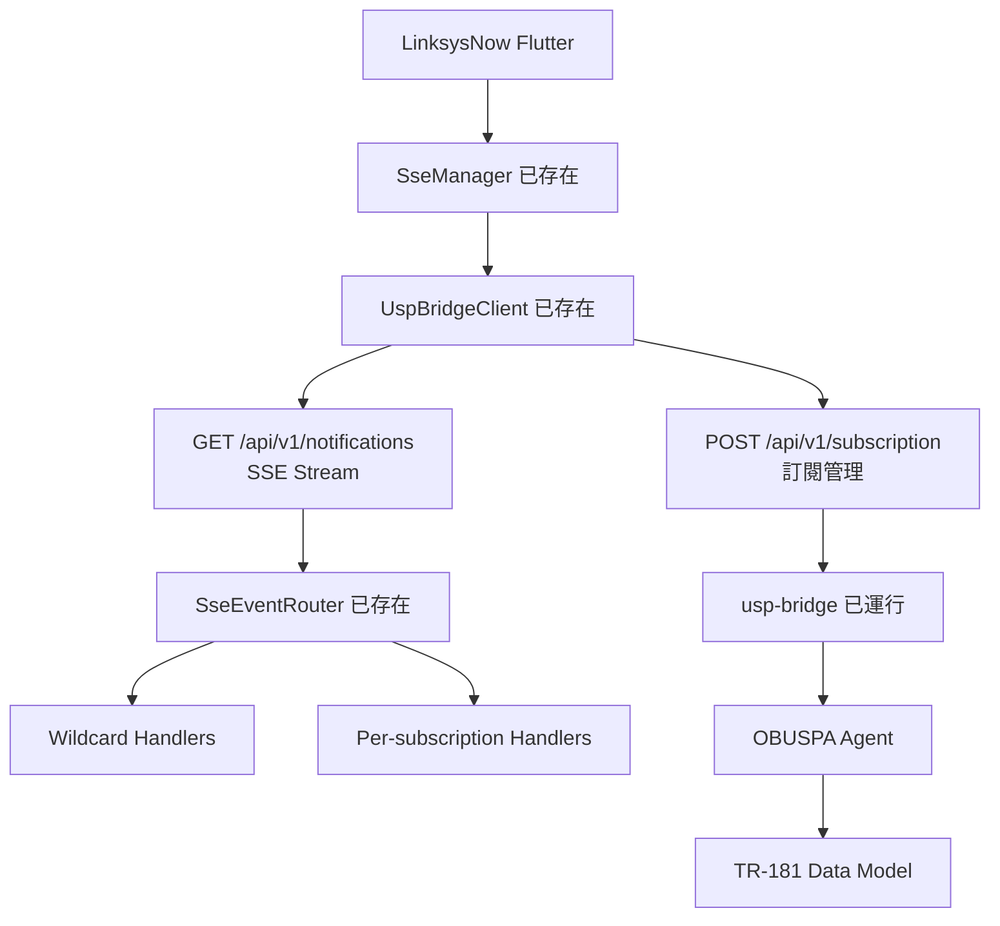

# USP-Bridge SSE - 完美解決方案

## 🎯 **重大突破**

LinksysNow 原始碼文檔證實了 **usp-bridge 確實提供完整的 SSE 基礎設施**，而且我們可以完美利用！

## 🔑 **認證和端點詳情**

### **JWT Token 獲取**
```dart
// LinksysNow 中已存在
final token = UspService.sessionToken;  // 從 WASM client 讀取
```

### **正確的 SSE 端點**
```bash
# SSE 事件流 (已在 LinksysNow 中使用)
GET http://127.0.0.1:8083/api/v1/notifications
Authorization: Bearer <JWT_TOKEN>
Accept: text/event-stream

# 訂閱管理 (已在 LinksysNow 中使用)
POST http://127.0.0.1:8083/api/v1/subscription
{
  "action": "register",
  "subscription_id": "my-custom-subscription",
  "NotifType": "ValueChange",
  "ReferenceList": "Device.LocalAgent.Apps."
}
```

## 🏗️ **LinksysNow 現有 SSE 架構**



## 🚀 **我們的完美整合方案**

### **1. 創建自定義 TR-181 路徑 (建議)**
```bash
# 在 TR-181 data model 中創建應用管理路徑
Device.LocalAgent.Apps.{i}.Name
Device.LocalAgent.Apps.{i}.Status
Device.LocalAgent.Apps.{i}.InstallTime
Device.LocalAgent.Apps.{i}.Link
```

### **2. app_util.lua 觸發 TR-181 變更**
```lua
-- 替代 MQTT，直接寫入 TR-181
function trigger_ui_update(event_type, app_data)
    if not options.dryRun then
        -- 寫入 TR-181 data model (透過 OBUSPA)
        local cmd = string.format(
            "ubus call obuspa set '{\"path\":\"Device.LocalAgent.Apps.1.Name\",\"value\":\"%s\"}'",
            app_data.name
        )
        os.execute(cmd)

        print("[ TR-181 Updated: " .. app_data.name .. " ]")
    end
end
```

### **3. LinksysNow 訂閱應用變更 (零新增基礎設施)**
```dart
// 在現有的 SSE bootstrap 中添加我們的訂閱
final appSubscriptions = [
  SseSubscriptionRecord(
    id: 'linksys-apps-valuechange',
    notifType: 'ValueChange',
    referenceList: 'Device.LocalAgent.Apps.',
    createdAt: DateTime.now(),
  ),
  SseSubscriptionRecord(
    id: 'linksys-apps-objectcreation',
    notifType: 'ObjectCreation',
    referenceList: 'Device.LocalAgent.Apps.',
    createdAt: DateTime.now(),
  ),
];

// 利用現有的 SseManager
final manager = ref.read(sseManagerProvider);
for (final sub in appSubscriptions) {
  await manager.registry.register(
    subscriptionId: sub.id,
    notifType: sub.notifType,
    referenceList: sub.referenceList,
  );
}
```

### **4. 處理應用事件 (利用現有 Wildcard Handler)**
```dart
// 添加到現有的 SseEventRouter wildcard handlers
manager.eventRouter.addWildcardHandler('apps-handler', (notification) {
  if (notification.payload.containsKey('param_path')) {
    final path = notification.payload['param_path'] as String;

    if (path.startsWith('Device.LocalAgent.Apps.')) {
      // 處理應用相關變更
      _handleAppNotification(notification);
      return true; // handled
    }
  }
  return false; // not handled
});

void _handleAppNotification(SseNotification notification) {
  // 重新讀取應用配置
  ref.invalidate(appsConfigProvider);

  // 顯示通知
  showSnackBar('New application installed!');
}
```

## 🎯 **完美方案的優勢**

### **1. 零額外基礎設施**
- ✅ 利用現有 usp-bridge SSE
- ✅ 利用現有 LinksysNow SseManager
- ✅ 利用現有 TR-181 data model
- ✅ 不需要新建任何服務

### **2. 系統一致性**
- ✅ 使用標準 USP/TR-181 架構
- ✅ 與 LinksysNow 其他功能完全一致
- ✅ 遵循現有的事件處理模式

### **3. 開發效率**
- ✅ 可能幾小時內完成
- ✅ 不需要學習新的協議或 API
- ✅ 完全利用現有代碼和模式

## 📅 **實現時程**

### **Phase 1: 驗證現有 SSE (1 小時)**
```bash
# 測試現有認證和 SSE 連接
curl -H "Authorization: Bearer <JWT>" \
     -H "Accept: text/event-stream" \
     http://127.0.0.1:8083/api/v1/notifications
```

### **Phase 2: TR-181 路徑設計 (2 小時)**
- 決定應用資料在 TR-181 中的結構
- 測試透過 OBUSPA 寫入資料

### **Phase 3: app_util.lua 整合 (2 小時)**
- 修改 app_util.lua 寫入 TR-181
- 測試觸發 SSE 事件

### **Phase 4: LinksysNow 監聽 (2 小時)**
- 添加應用相關訂閱到現有 bootstrap
- 實現 wildcard handler
- 測試端到端流程

**總計**: **約 1 天完成完整的即時更新功能**！

## 💡 **關鍵洞察**

這個解決方案完美體現了**「不要重新發明輪子」**的原則：

1. **LinksysNow 已有完整 SSE 客戶端**
2. **usp-bridge 已提供穩定 SSE 服務**
3. **TR-181 是標準的資料模型**
4. **我們只需要添加我們的資料和訂閱**

## 🚦 **下一步測試**

讓我們先測試能否正確存取 usp-bridge SSE：

```bash
# 1. 從 LinksysNow 中提取 JWT token
# 2. 測試 SSE 連接
# 3. 驗證 TR-181 資料寫入
# 4. 確認 SSE 事件觸發
```

這確實是**最優雅的解決方案**！感謝您指出 usp-bridge 的存在，這完全改變了整個架構設計！🙏