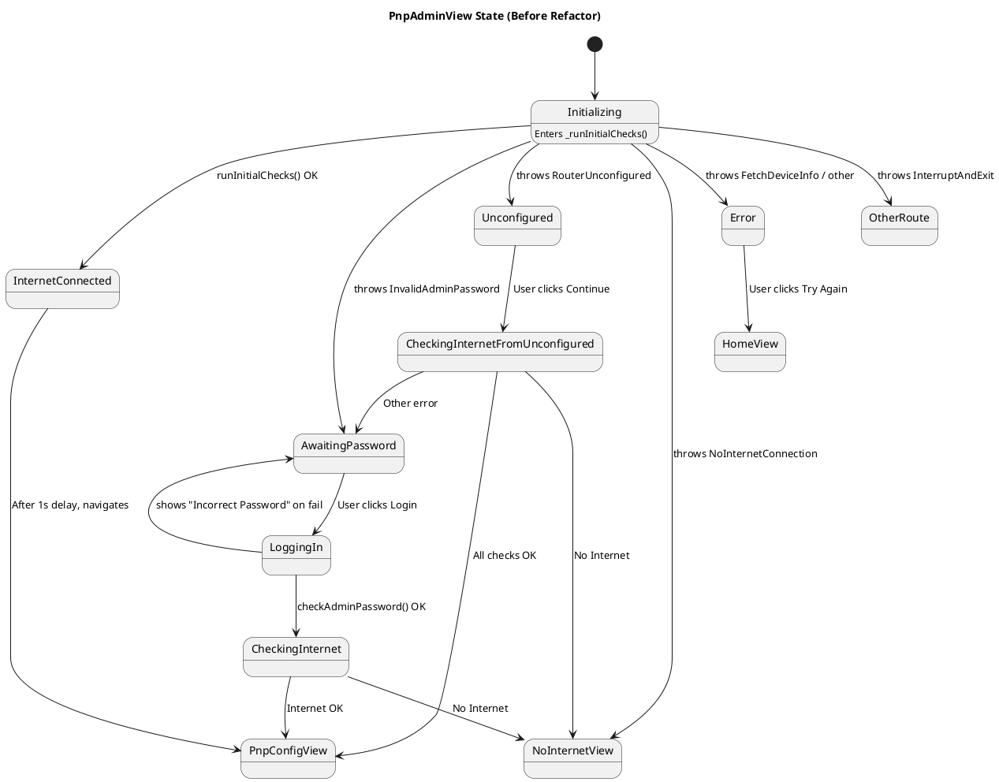
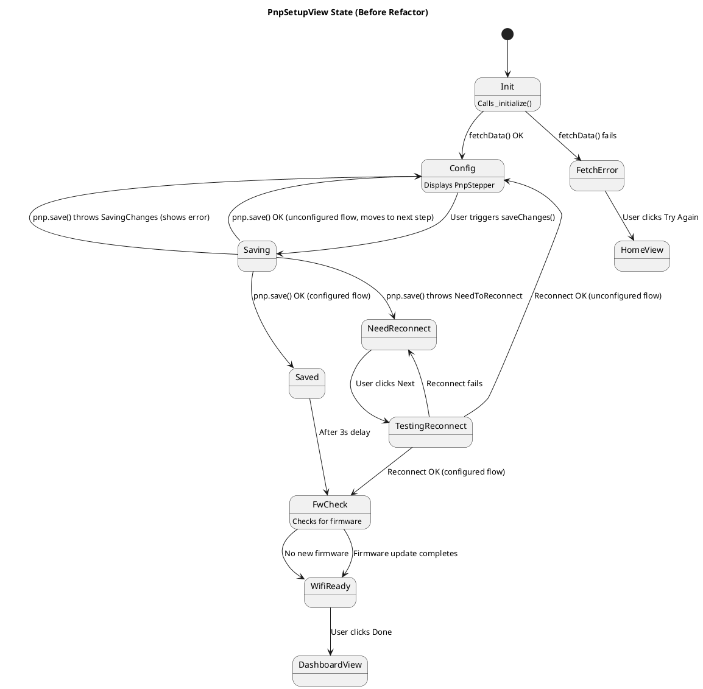
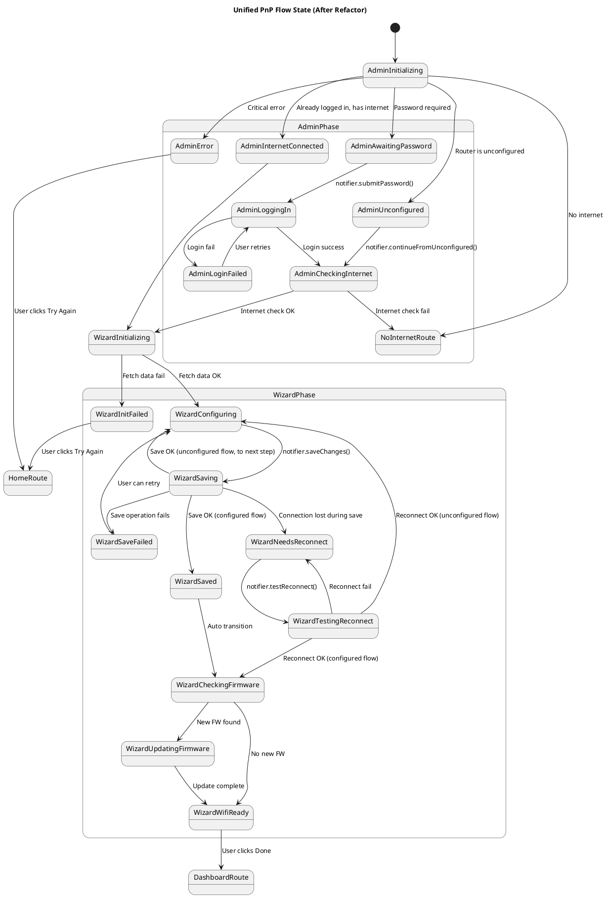

# PnP (Plug and Play) 流程狀態機文檔

本文檔旨在通過狀態圖（State Diagram）來描述 PnP 流程在重構前後的變化。這有助於理解現有流程的複雜性，並展示重構後架構的優勢。

## 重構前狀態圖 (As-Is State Diagram)

在重構之前，PnP 流程的狀態邏輯分散在 `PnpAdminView` 和 `PnpSetupView` 兩個獨立的 `StatefulWidget` 中，並依賴大量的本地旗標（flags）和 `try-catch` 異常處理來控制 UI 流程。

### 1. `PnpAdminView` 流程

此視圖作為 PnP 流程的“守門員”，其狀態轉換高度依賴於 `runInitialChecks` 方法拋出的各種異常，導致流程分散且難以追蹤。

### 2. `PnpSetupView` 流程

此視圖是核心的設定精靈，其狀態由 `_PnpSetupStep` 枚舉和多個布林旗標（如 `_needToReconnect`, `_fetchError`）共同決定。狀態轉換邏輯混合在用戶交互、異步回調和外部事件監聽中，使其非常複雜。

---

## 重構後狀態圖 (To-Be State Diagram)

重構的目標是將所有狀態和轉換邏輯集中到 `PnpNotifier` 中，並使用一個統一的 `PnpFlowStatus` 枚舉來顯式定義流程中的每一個狀態。UI 層只負責響應狀態並渲染，不再包含任何流程控制邏輯。

這樣做使得整個 PnP 流程變成一個單一、線性和可預測的狀態機。

