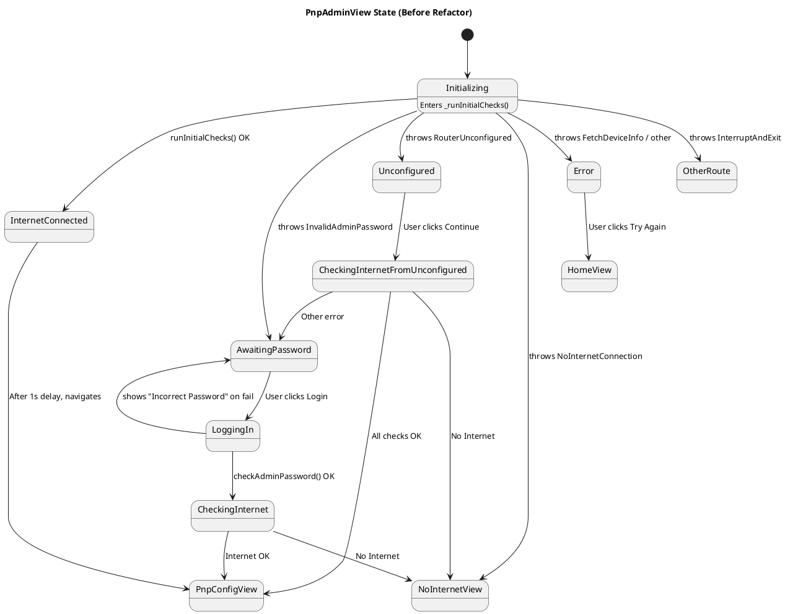
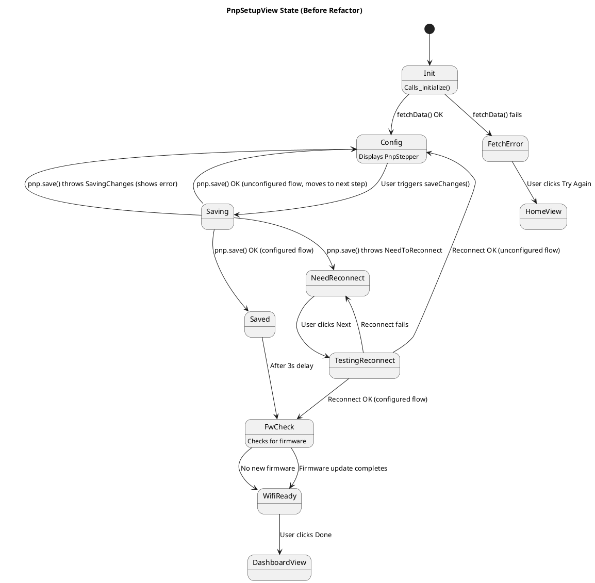
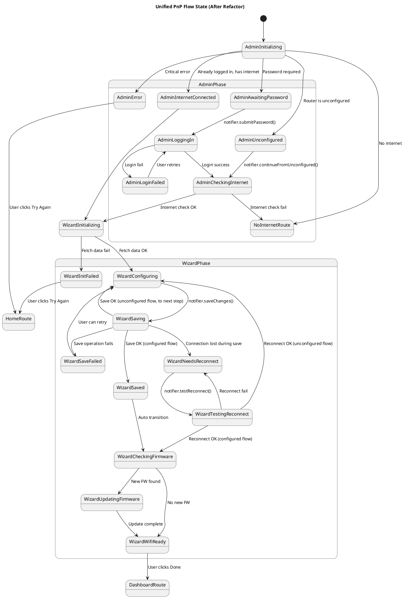

# PnP (Plug and Play) Flow State Machine Document

This document aims to describe the changes in the PnP process before and after refactoring using State Diagrams. This helps in understanding the complexity of the existing process and demonstrates the advantages of the refactored architecture.

## As-Is State Diagram (Before Refactor)

Before the refactor, the state logic of the PnP process was scattered across two separate `StatefulWidget`s, `PnpAdminView` and `PnpSetupView`. It relied on numerous local flags and `try-catch` exception handling to control the UI flow.

### 1. `PnpAdminView` Flow

This view acts as the "gatekeeper" for the PnP process. Its state transitions are highly dependent on various exceptions thrown by the `runInitialChecks` method, leading to a decentralized and hard-to-track flow.

### 2. `PnpSetupView` Flow

This view is the core setup wizard. Its state is determined by the `_PnpSetupStep` enum and multiple boolean flags (e.g., `_needToReconnect`, `_fetchError`). The state transition logic is mixed with user interactions, asynchronous callbacks, and external event listeners, making it very complex.

---

## To-Be State Diagram (After Refactor)

The goal of the refactor is to centralize all state and transition logic into a `PnpNotifier`. A unified `PnpFlowStatus` enum will be used to explicitly define every state in the process. The UI layer will only be responsible for reacting to the state and rendering, without containing any flow control logic.

This approach transforms the entire PnP process into a single, linear, and predictable state machine.

