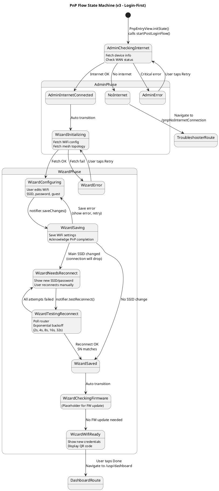
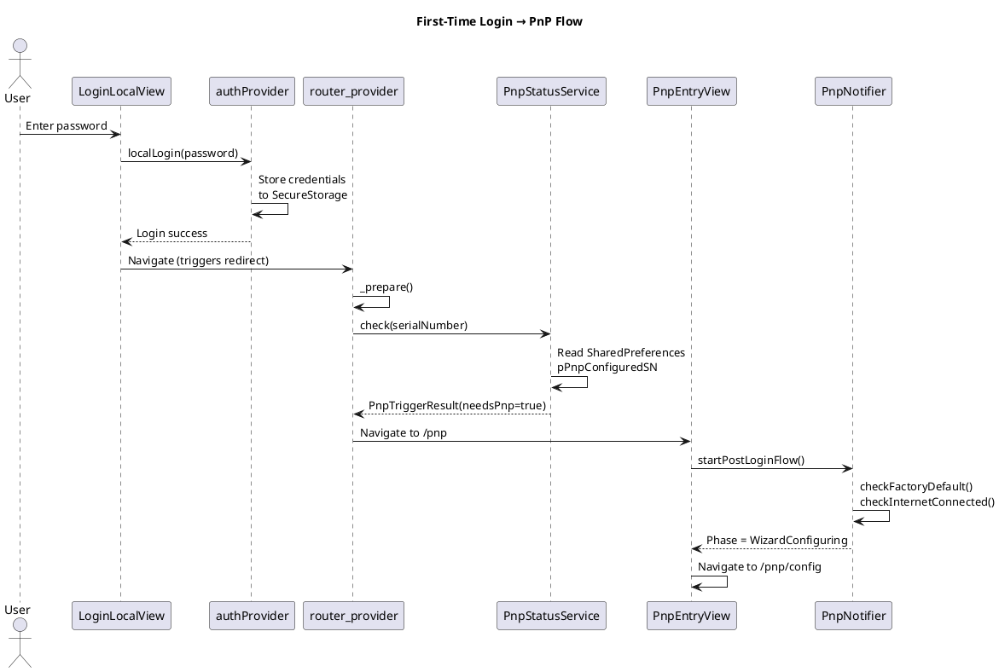

# PnP (Plug and Play) Flow State Machine Document

This document describes the PnP process state machine. Updated for v3 Login-First Architecture (2026-05).

## Change Log

### v3 (2026-05) — Login-First Architecture
- Removed: `AdminInitializing`, `AdminUnconfigured`, `AdminAwaitingPassword`, `AdminLoggingIn`, `AdminLoginFailed`
- Entry point changed: Login Page → `AdminCheckingInternet` (user already authenticated)
- PnP trigger: `router_provider._prepare()` calls `PnpStatusService.check()` after login

---

## Current State Diagram (v3)

The PnP flow is now a **post-login** state machine. User authentication is handled by `LoginLocalView` before entering PnP.

```plantuml
@startuml
title PnP Flow State Machine (v3 - Login-First)

' ═══════════════════════════════════════════════════════════════
' Entry: User already logged in via LoginLocalView
' router_provider._prepare() → PnpStatusService.check()
' If needsPnp=true → navigate to /pnp (PnpEntryView)
' ═══════════════════════════════════════════════════════════════

[*] --> AdminCheckingInternet : PnpEntryView.initState()\ncalls startPostLoginFlow()

state AdminPhase {
    AdminCheckingInternet : Fetch device info\nCheck WAN status
    AdminCheckingInternet --> AdminInternetConnected : Internet OK
    AdminCheckingInternet --> NoInternet : No internet
    AdminCheckingInternet --> AdminError : Critical error

    AdminInternetConnected --> WizardInitializing : Auto transition
    AdminError --> AdminCheckingInternet : User taps Retry
}

NoInternet --> TroubleshooterRoute <<end>> : Navigate to\n/pnpNoInternetConnection

state WizardPhase {
    WizardInitializing : Fetch WiFi config\nFetch mesh topology
    WizardInitializing --> WizardConfiguring : Fetch OK
    WizardInitializing --> WizardError : Fetch fail

    WizardConfiguring : User edits WiFi\nSSID, password, guest
    WizardConfiguring --> WizardSaving : notifier.saveChanges()

    WizardSaving : Save WiFi settings\nAcknowledge PnP completion
    WizardSaving --> WizardNeedsReconnect : Main SSID changed\n(connection will drop)
    WizardSaving --> WizardSaved : No SSID change
    WizardSaving --> WizardConfiguring : Save error\n(show error, retry)

    WizardSaved --> WizardCheckingFirmware : Auto transition

    WizardNeedsReconnect : Show new SSID/password\nUser reconnects manually
    WizardNeedsReconnect --> WizardTestingReconnect : notifier.testReconnect()

    WizardTestingReconnect : Poll router\nExponential backoff\n(2s, 4s, 8s, 16s, 32s)
    WizardTestingReconnect --> WizardSaved : Reconnect OK\nSN matches
    WizardTestingReconnect --> WizardNeedsReconnect : All attempts failed

    WizardCheckingFirmware : (Placeholder for FW update)
    WizardCheckingFirmware --> WizardWifiReady : No FW update needed

    WizardWifiReady : Show new credentials\nDisplay QR code
    WizardError --> WizardInitializing : User taps Retry
}

WizardWifiReady --> DashboardRoute <<end>> : User taps Done\nNavigate to /usp/dashboard

@enduml
```

---

## Phase Definitions

### AdminPhase (PnpEntryView)

| Phase | Description | Triggers |
|-------|-------------|----------|
| `AdminCheckingInternet` | Entry point. Fetch device info, check WAN status. | `startPostLoginFlow()` |
| `AdminInternetConnected` | WAN up with valid IP. Ready for wizard. | Internet check success |
| `AdminError` | Critical error during admin phase. | Exception in `startPostLoginFlow()` |
| `NoInternet` | WAN down or no IP. Route to troubleshooter. | Internet check failed |

### WizardPhase (PnpSetupView)

| Phase | Description | Triggers |
|-------|-------------|----------|
| `WizardInitializing` | Fetching WiFi SSIDs, APs, mesh topology. | Enter from `AdminInternetConnected` |
| `WizardConfiguring` | User editing form. Holds `PnpWifiConfig` + `meshNodes`. | Fetch success |
| `WizardSaving` | Saving WiFi changes to router. | `saveChanges()` |
| `WizardSaved` | Save complete, no SSID change. | Save success (no reconnect needed) |
| `WizardNeedsReconnect` | Main WiFi SSID changed. Connection dropped. | Save success (SSID changed) |
| `WizardTestingReconnect` | Polling router after reconnect. | `testReconnect()` |
| `WizardCheckingFirmware` | Placeholder for firmware update check. | After save/reconnect complete |
| `WizardWifiReady` | Setup complete. Show credentials + QR. | No FW update needed |
| `WizardError` | Recoverable error during wizard. | Exception in wizard operations |

### Troubleshooter Phases (ModemRestart / ISP)

| Phase | Description |
|-------|-------------|
| `ModemRestartCountdown` | 150s countdown while modem reboots |
| `ModemRestartCheckingInternet` | Polling internet after modem restart (30 attempts) |
| `IspSaving` | Saving ISP settings with progress steps |

---

## Removed Phases (v3)

The following phases were removed in v3 Login-First Architecture:

| Phase | Reason |
|-------|--------|
| `AdminInitializing` | Login now handled by `LoginLocalView` |
| `AdminUnconfigured` | Factory default detection removed (all routers have automaster) |
| `AdminAwaitingPassword` | Password input moved to `LoginLocalView` |
| `AdminLoggingIn` | Login logic moved to `authProvider` |
| `AdminLoginFailed` | Login error handling moved to `LoginLocalView` |

---

## Sequence Diagram: First-Time Login → PnP

```plantuml
@startuml
title First-Time Login → PnP Flow

actor User
participant LoginLocalView
participant authProvider
participant router_provider
participant PnpStatusService
participant PnpEntryView
participant PnpNotifier

User -> LoginLocalView : Enter password
LoginLocalView -> authProvider : localLogin(password)
authProvider -> authProvider : Store credentials\nto SecureStorage
authProvider --> LoginLocalView : Login success

LoginLocalView -> router_provider : Navigate (triggers redirect)
router_provider -> router_provider : _prepare()
router_provider -> PnpStatusService : check(serialNumber)
PnpStatusService -> PnpStatusService : Read SharedPreferences\npPnpConfiguredSN
PnpStatusService --> router_provider : PnpTriggerResult(needsPnp=true)

router_provider -> PnpEntryView : Navigate to /pnp
PnpEntryView -> PnpNotifier : startPostLoginFlow()
PnpNotifier -> PnpNotifier : checkFactoryDefault()\ncheckInternetConnected()
PnpNotifier --> PnpEntryView : Phase = WizardConfiguring
PnpEntryView -> PnpEntryView : Navigate to /pnp/config

@enduml
```

---

## Legacy State Diagram (Pre-v3)

For historical reference, the pre-v3 state diagrams are preserved in git history. Key differences:

1. **Pre-v3**: `PnpAdminView` handled both login and internet check
2. **v3**: Login separated to `LoginLocalView`, `PnpEntryView` only checks internet
3. **Pre-v3**: Factory default detection via `checkRouterConfigured()`
4. **v3**: All routers treated as configured (automaster), PnP trigger via `PnpStatusService`
