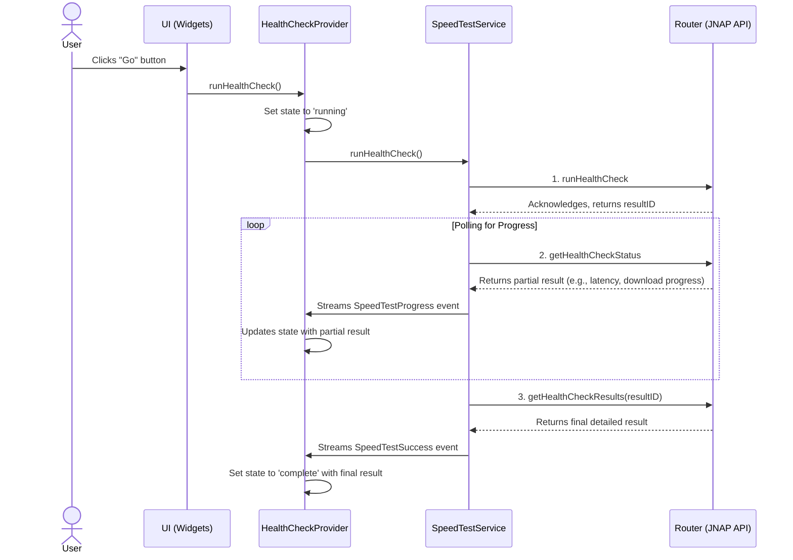

# Speed Test Feature Specification

## 1. Overview

The Speed Test feature allows users to measure their internet connection's performance directly from the router. It measures latency (ping), download speed, and upload speed. The feature provides a real-time animated display during the test and shows the final results upon completion. It also maintains a history of recent tests.

This document outlines the technical implementation and architecture of the Speed Test feature.

## 2. Architecture and Data Flow

The feature is built using the Riverpod state management library and follows a reactive data flow pattern.

1.  **UI (Views/Widgets)**: The user initiates the test from the `SpeedTestWidget` or `SpeedTestSelectionView`. The UI listens to state changes from the `HealthCheckProvider` and updates itself to reflect the current status (idle, running, complete, error).
2.  **State Management (`HealthCheckProvider`)**: This provider manages the state of the speed test (`HealthCheckState`). When a test is started, it calls the `SpeedTestService` and subscribes to its event stream. It processes events (`SpeedTestProgress`, `SpeedTestSuccess`, `SpeedTestFailure`) and updates its own state, which in turn updates the UI.
3.  **Service Layer (`SpeedTestService`)**: This service encapsulates the logic for communicating with the router's JNAP (JSON-based Network Administration Protocol) API. It orchestrates the entire test process:
    *   **Initiation**: Sends a `runHealthCheck` command to the router.
    *   **Polling**: Periodically sends a `getHealthCheckStatus` command to get real-time progress. It streams these progress updates back to the `HealthCheckProvider`.
    *   **Finalization**: Once polling is complete, it sends a `getHealthCheckResults` command to fetch the final, detailed results.
4.  **Data Models**: Immutable data models are used to represent state (`HealthCheckState`), UI data (`SpeedTestUIModel`), and API responses (`SpeedTestResult`).

## 3. State Management

The state is managed by `HealthCheckProvider` and represented by the `HealthCheckState` class.

### `HealthCheckState` Properties

*   `status`: `HealthCheckStatus` (idle, running, complete) - The overall status of the test.
*   `step`: `HealthCheckStep` (latency, downloadBandwidth, uploadBandwidth, error, success) - The current stage of the test.
*   `meterValue`: `double` - The raw value (in Kbps) used to drive the animated meter.
*   `result`: `SpeedTestUIModel?` - The current (partial or final) results formatted for the UI.
*   `errorCode`: `SpeedTestError?` - If an error occurs, this holds the specific error type.

## 4. Service Layer: `SpeedTestService`

This service is the bridge between the app and the router's API.

### Key Methods

*   `runHealthCheck()`: Returns a `Stream<SpeedTestStreamEvent>`. This is the main method that orchestrates the test.
*   `_initiateHealthCheck()`: Starts the test on the router.
*   `_pollHealthCheckProgress()`: Polls for progress until the test is complete.
*   `_fetchFinalResult()`: Fetches the final results after polling finishes.
*   `_mapResultToUIModel()`: A pure function that converts the raw API data (`SpeedTestResult`) into a display-friendly format (`SpeedTestUIModel`).

## 5. UI Components

*   **`SpeedTestSelectionView`**: A page that allows the user to choose between the internal "Internet to Router" test and an external, web-based test. The availability of these options depends on router capabilities and network connection status.
*   **`SpeedTestView`**: The main page for the internal speed test. It combines the `SpeedTestWidget` with a `_buildHistoryPanel` that shows a list of past results.
*   **`SpeedTestWidget`**: The core UI component. It is highly stateful and displays different content based on the `HealthCheckState`:
    *   **Idle State**: Shows a large "Go" button within a static meter.
    *   **Running State**:
        *   Uses `AnimatedMeter` to show a live gauge.
        *   Displays the current step (e.g., "Download").
        *   Shows live bandwidth and an animated ping value.
    *   **Complete State**:
        *   Displays the final Download and Upload speeds in a `_resultCard`.
        *   Shows detailed information (latency, server ID, timestamp).
        *   Provides a "Test Again" button.
    *   **Error State**: Displays a user-friendly error message based on the `SpeedTestError` code.

## 6. Error Handling

Errors are caught at multiple levels:

1.  The `SpeedTestService` catches JNAP API errors, timeouts, or unexpected data and wraps them in a `SpeedTestFailure` event.
2.  The `HealthCheckProvider` receives this event and updates the `HealthCheckState` with `status = complete`, `step = error`, and the corresponding `errorCode`.
3.  The `SpeedTestWidget` observes the state and, upon seeing an `errorCode`, displays the appropriate error message from its `errorView` builder.
