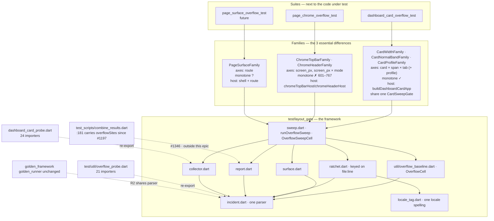
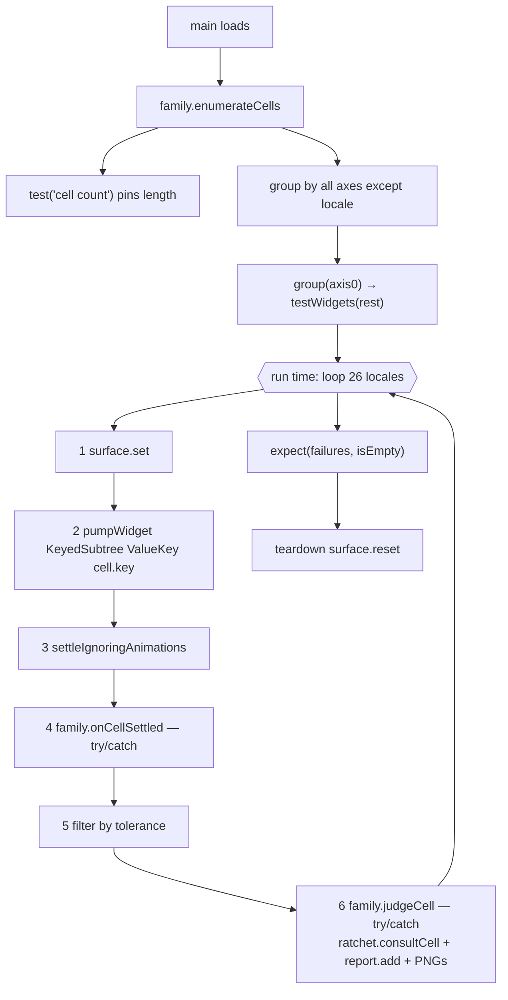

# Overflow Gate — Framework Architecture

> **This document is for maintaining the framework.** To just run the gate, read
> a failure and see a picture of what broke, read
> [overflow_gate_usage.md](overflow_gate_usage.md) instead.

**Last Updated: 2026-08-24** · Refactor proposal for the #1183 gate family · Status: **agreed and ticketed as epic #1335 (13 tickets: #1336–#1345, #1351, #1348, #1349 — #1346 left the epic on 2026-08-22, §9.4, and #1361 was opened outside it). §6's cell↔test mapping decided 2026-08-20; §10 Q2 and Q4 closed 2026-08-21; R4's direction corrected against the code (§1.3, §9.2); R5 added and §1.2's cost table re-measured 2026-08-21 (§9.3); the local-versus-CI scout matrix recorded 2026-08-21 and its consequence narrowed to the scout alone on 2026-08-22 (§8, §9.2, §9.4). Implementation started 2026-08-21: #1337 (baselines), #1336 (R1, tags), #1338 (R2's parser), **#1351 (the gate's last call into the golden parser), #1340 (surface + collector) and #1341 (the ratchet re-key)** have all landed on `fix/1314-1328-chrome-overflow`. **R2 is therefore complete on the gate side**, and #1339's golden half was split out of R2 on 2026-08-21 (§3.5) — on a "cannot be verified on a developer machine" claim §3.5 has since corrected; the split still stands, for sequencing. **#1356 (this branch's review) then landed seven fixes across the landed work** — the sixteenth family difference (§2), the site key's portability, the ratchet entry's shape and integrity rules (§3, §5 contract 4), the `-dirty` stamp's scope, and one product defect in the collapsed header — and every count in §1.2 and §6 is re-measured against it. **#1342 then landed the runner itself** (`test/layout_gate/sweep.dart` + `families/page_chrome_family.dart`), with the chrome suite as its first consumer: 1,248 cells proved identical against the committed baseline, the #1328 fix reverted locally to prove the sweep still fails, and §1.2 re-measured again. **#1343 then ported the largest surface** — the three card sweeps, 1,898 of the gate's 3,587 baseline cells, onto that runner via `families/dashboard_card_family.dart` + `families/dashboard_card_gate.dart`, with `check card` reporting 1,917 cells identical and the suite falling 1,921 → 99 tests; §1.2 and §6 are re-measured against it (2026-08-22) and §6's table now carries a landed column. Stacked on `fix/1314-1328-chrome-overflow`, carrying one accepted conflict with PR #1325 (§9.1). **#1344 and #1345 then closed R3** — the forced-form and popup sweeps, in one pass over one shared `CardSweepCell`, with `check popup` byte-identical at 347 cells and `check forced_form` 75 cells carrying the six `|locale=en` renames §2's rule forces; all four sweeps are now declared through the runner and every count in §1.2 is re-measured. **R4 then left this epic on 2026-08-22 — see §9.4.** The gate is the guard and golden is the scout (§8), and a scout-side deliverable sitting inside a guard-side epic had put a three-hour CI round-trip in front of the epic's own acceptance: #1346 is now a standalone golden-facing ticket, #1339 stays as a gate-side finishing ticket with an offline verification, and one coupling this document had recorded as harmless — the gate's fixtures living under `test/golden_test/` — is ticketed on its own as #1361.** **`dev-2.7.0` was merged into `fix/1314-1328-chrome-overflow` on 2026-08-24, and the gate grew by 29 cells without anyone editing a sweep**: #1325 gave `dhcp_reservations` a `normalAbove: 369`, which both `CardNormalBandFamily` (one coordinate per threshold per tab × 26 locales, +26) and `ForcedCompactFloorFamily` (`selectableForms` reads that field, +3) enumerate from. Both `expectedCellCount` pins fired, which is what they are required rather than defaulted for (§4 of `sweep.dart`); the four baselines are re-captured at **card 1,943 · popup 347 · forced_form 78 · chrome 1,248 = 3,616 rows**, a purely additive diff of 29 new rows with none removed and none changed, verified `check`-identical on two runs minutes apart to prove #1321's now-relative lease fixture is byte-stable. The card suite's mutation table was re-executed against the merged code and its scope fixed (§9.3), §1.2 and §6 are re-measured against the merged tree (**5,310 in the whole gate, and all 87 above R3's 5,223 accounted for**), the density suite's own ledger is re-measured (row A 66 → 18, all of it R3's regrouping), and **F9 — #1348's one unrunnable mutation — was finally run**: reverting #1321's fixture fix is caught by 2 tests out of 1,362 and by no swept cell at all (§9.5). **#1364 then closed R5's one surviving mutation, and #1366 closed the two further shapes of it that closing turned up** (both 2026-08-24): a premise a family holds in `onCardSettled` is deletable in silence, so all three shapes are now values on `CardSweepCell` — `expectedDensity`, `widgetPremises` and `openWith` — checked by `CardOverflowFamily.onCellSettled` and pinned family-by-family in `families/dashboard_card_gate_test.dart`, whose oracle went 11 cases → 28. F11 is the one worth reading: an emptied hook left the popup sweep 80 of 80 green *and* `check popup` reporting 347 cells identical while 78 of them measured a tree another family already covers, which is the first coverage loss in this epic that the coverage baseline is structurally blind to. All four baselines stay byte-identical at 3,616 across both tickets — they change what the gate asserts, not what it measures (§9.5). **#1361 then removed the last coupling this document had recorded as harmless** (2026-08-24): the shared card fixtures and provider-override builders now live in `test/mocks/`, so no test outside `test/golden_test/` imports anything inside it — 19 real importers rather than the ticket's 15 and 12 files rather than 8, because `dev-2.7.0` added four more importers in the two days the ticket sat open. Suite and gate totals unchanged, all four baselines `check`-identical (§9.4). **#1349 then
took the framework's first surface outside the dashboard** (2026-08-24): two whole pages —
`dhcp` and `wifi_settings` — swept at 8 screen widths × 26 locales through one
parameterised family, 416 cells, a fifth baseline, and **the runner needed no change at
all** (§11.4). What the pilot was for was the number, and the number is **37.7ms per
cell** — neither of §10 Q5's two candidate profiles, ~6× a chrome cell and ~4.5× cheaper
than a golden full-page pump — so **these two pages graduate into the PR gate and pages do
not graduate as a class** (§11.3): the 42 remaining page-view files are 5m29s of pump CPU
— more than twice the whole gate's current wall clock — landing between 1.6× and 3.0× on it. The pilot also
found a real defect on its way in, at 320px and 601px in `ar`/`ru`, which golden CI
structurally cannot see because it sweeps 480 and 1280 where the card is clean (§8).

**The first cell this gate has ever lost, and it is a correction** (#1367, 2026-08-25).
`forced_form.skeleton|variant=stats` measured a box production never produced:
`stats_panel` is the one card with no popup path at all (its `minColumns: 6` floors it at
288px, above `kPopupBelow`), so no width the grid chose put that skeleton under a popup
scope. #1367 then replaced the panel's row-wide skeleton with a per-tile one and left
`CardSkeleton.stats()` with no production caller, so the variant and its cell are gone:
**forced_form 78 → 77**, the dataset **4,032 → 4,031**, and the sweep's
`expectedCellCount` pin is what required this paragraph rather than allowing the row to
vanish. The panel's own loading and error branches are swept at the 288px box the grid
really gives it, in `usp_stats_panel_test.dart` — which is a `layout-gate` carrier (**46 →
47**) and deliberately not an `overflow` one, per §5's rule that the tag means a
registered sweep with a frozen baseline.

**Ticket map.** R1 → #1336 ✅ · R2 → #1338 (parser) ✅, #1351 (retire the gate's dependency on the golden parser) ✅, #1340 (surface/collector) ✅ · R3 → #1342 (runner, proved on chrome) ✅, #1341 (ratchet) ✅, #1343 (main card sweep) ✅, #1344 (forced-form) ✅, #1345 (popup) ✅ · **R4 → gone; it left this epic on 2026-08-22 (§9.4)** — #1346 is a standalone golden-facing ticket, and #1339 (retire the golden framework's own parser) stays as a gate-side finishing ticket whose verification is offline rather than CI-bound (§3.5) · **R5 → #1348 (acceptance)** · **pilot → #1349** · plus **#1361**, the fixture-decoupling ticket §9.4 opened. Plus #1337, which has its own document rather than a section here: a byte-stable baseline capture, because R3's "compared cell-by-cell against a pre-port run" names a comparison without naming a mechanism, and 1,898 cells cannot be diffed by eye. **#1337 is implemented and its four baselines are captured at `4fb1ac5e-dirty`** (that sha plus #1337 itself — a baseline cannot name the commit containing it; `chrome` was re-captured at `785c6f67-dirty` when #1356 took the action count out of its cell ids and unified the locale spelling, a pure rename proved row-for-row) — see [overflow_baselines.md](overflow_baselines.md); R3 and R5 both consume `./tool/overflow_baseline.sh check`.

**Two steps this document did not have (added 2026-08-21).** R1–R3 as written verify that each port matches its own baseline, which is necessary and not sufficient: a refactor that makes 3,800 cells run faster and quieter while measuring less satisfies all of it. So **R5 (#1348)** re-runs the card suite's existing mutation table against the ported code and adds one *executed* mutation per framework invariant — the precedent being that table's own row 1, where a real defect was killed by 26 of 26 `network_health` tab-0 cases while the main width sweep, the largest thing in the file, saw nothing (§9.3, which also records which of that table's counts no longer reconcile). And the **pilot (#1349)** is now ticketed inside the epic rather than deferred past it, gated on R5, with §10 Q5 as its deliverable.

## Purpose

The #1183 overflow gate grew into two independent frameworks that measure the
same thing. `test/page/dashboard/cards/dashboard_card_overflow_test.dart` (the
card sweep) and `test/page/shell/page_chrome_overflow_test.dart` (the chrome
sweep, #1314/#1328) share exactly one file — `test/util/overflow_probe.dart` —
and re-invent twelve other things between them. (Written of the pre-refactor
tree. Since #1338/#1340 the shared spine is three files under `test/layout_gate/`,
still reached through that path, which is now a re-export; the parser, the
collector and the surface have left the re-invented list. Since #1341/#1342 it is
six — `incident`, `collector`, `surface`, `locale_tag`, `ratchet`, `sweep` — plus
`families/`, and the chrome sweep reaches all of them rather than one.) A third path,
`test/golden_test/golden_framework/golden_runner.dart`, parses the same overflow
string a third way and then discards its own verdict.

This document records the alignment that established which differences are
essential and which are accidental, the architecture that absorbs the accidental
set, and the migration order that gets there without a red intermediate state.

**It is a refactor, not a feature.** Nothing here adds a surface to the gate. The
pages pilot depends on it and is deliberately sequenced after it (§9), because
adding a third family to two frameworks would produce three.

**Companion documents**

| Document | Role |
|---|---|
| [overflow_baselines.md](overflow_baselines.md) | **#1337, landed.** The mechanism R3 and R5 compare against: `./tool/overflow_baseline.sh check <sweep>`. Baselines for the four dashboard-and-chrome sweeps are captured at `4fb1ac5e-dirty`, before any port — `chrome` re-captured at `785c6f67-dirty` for #1356's cell-id fixes, all four re-captured at `25d1b8ed-dirty` for the `dev-2.7.0` merge, and a fifth (`page`, 416 cells) captured at `69079cb0-dirty` for #1349. Also **`render <sweep>`**, which reads a committed baseline into an MD/HTML coverage report without running anything — the only report that works for all five sweeps, since §5's card report is card-shaped — and **`shoot <sweep> <pattern>`**, which photographs cells and links them into a report of its own run — by cell-id pattern, the only way to see what a cell the gate calls `clean` actually renders as, or as `shoot <sweep> failed`, exactly the cells that run failed (§7). |
| [../dashboard/dashboard_density_design.md](../dashboard/dashboard_density_design.md) | How the card family's 560 → 27 → 0 allowlist was eliminated; the measurements the card axes rest on. |
| [../dashboard/dashboard_framework_overflow_investigation.md](../dashboard/dashboard_framework_overflow_investigation.md) | How a declared spec constraint becomes a real `BoxConstraints`. |
| [overflow_gate_usage.md](overflow_gate_usage.md) | **The operator's guide.** Nothing on this page is needed to find an overflow — send anyone whose first question is "how do I run it" there instead of here. |
| [../../.claude/skills/layout-gate/SKILL.md](../../.claude/skills/layout-gate/SKILL.md) | How to operate and extend the gate today — triage, allowlist, new card, new probe. Renamed from `dashboard-overflow-gate` 2026-08-25 (§10 open question 3). Its "adding a new probe" section is superseded by §3 here once R3 lands. |

---

## 1. What exists today

### 1.1 The two frameworks, aligned

| Aspect | Card sweep (#1183) | Chrome sweep (#1314/#1328) | Verdict |
|---|---|---|---|
| cell↔test mapping | 1 cell = 1 `testWidgets` | 1 test = N cells (inner loop over locale × mode) | accidental |
| Axis source | derived from grid geometry (`narrowestRealizationOf`) | hand-written width list | **essential** |
| Monotonicity in width | yes — narrowest realization is the worst case | no — the failure band is 601–767px | **essential** |
| Host construction | shared `buildDashboardCardApp` in a probe util | private `_topBarHost` / `_headerHost` in the suite | **essential** |
| Fresh render tree | one test per cell | `ValueKey(cellKey)` on the host root | accidental |
| Overflow collection | `probeCardOverflow` → `runWithOverflowCollection` | `collectOverflow` directly | accidental |
| Surface set (`setSurfaceSize` + `view.physicalSize` + `devicePixelRatio`) | inside the probe, 2 sites | hand-copied **7** times in the suite | accidental — **closed at #1340**: one `setLayoutSurface` |
| Surface reset | none | `_resetSurfaceAfter` teardown | accidental (the second was right) — **closed at #1340**: the primitive registers the teardown itself, so the card path resets too |
| Tolerance | `const _tolerancePx = kOverflowTolerancePx` | inline `> kOverflowTolerancePx` | accidental |
| Locale filter | `_targetLocales` + `--dart-define=LOCALE` | always all 26 | accidental |
| Ratchet | `known_overflows.json` + dead-exemption detection | none | accidental — **re-keyed on `file:line` at #1341**, **bounded by `maxOverflowPx` at #1356's review** (`test/layout_gate/ratchet.dart`); dead-entry detection is now one `tearDownAll` verdict over the whole run, suppressed when the run was filtered (§5 contract 4) |
| Report | `OverflowReportItem` → MD/HTML/PNG dumps | none | accidental |
| Failure surface | `fail()` per cell with a remediation paragraph | aggregated `failures` list + `expect(isEmpty, reason:)` | accidental (the second reads better for locale-driven defects) |
| Localizations access | not needed (`find.textContaining` on markers) | `localizationsByTag` preloaded in `setUpAll` | accidental |
| Readability assertions | 7 separate suites | inline in the same file | accidental |
| Tag | `layout-gate` + `overflow` | `layout-gate` + `overflow` | same |

Fifteen differences; three are essential.

**Four of the accidental rows are closed as of 2026-08-21** — the parser (#1338),
the surface set and the surface reset (#1340) and the ratchet key (#1341). The
table is kept as the diagnosis the epic was scoped from rather than rewritten to
the current tree; each row now says where it landed.

**A sixteenth difference surfaced at review and is closed too (#1356): the two
families spelled one locale two ways.** The three card sweeps each defined
`zh_TW` privately; the chrome sweep called `Locale.toLanguageTag()` and got
`zh-TW`. It is not on the table above because it is not visible from either suite
— each was self-consistent — and it took the committed datasets sitting next to
each other to show. It matters twice: the four baselines are grepped by hand
(`overflow_baselines.md` §2), and the ratchet matches the tag a sweep hands it
against locale lists a human wrote, so once #1342 puts the chrome sweep on the
runner a `zh-TW` would silently match no entry and read as "not deferred". Now
`localeTag()` in `test/layout_gate/locale_tag.dart`, imported by all four — and by
`sweep.dart`, which reaches it rather than `Locale.toLanguageTag()` for exactly
this reason. `sweep_test.dart` pins the `zh_TW` spelling so that "simplifying" it
back is a red test rather than a silent re-key of 4,032 rows.

```
  dashboard_card_overflow_test.dart      page_chrome_overflow_test.dart      golden_runner.dart
  844 lines · 1898 sweep cells           707 lines · ~1468 pumps             31 golden configs
  (1041 at #1343 → 496 after)            (721 at #1342 → 418 after)
  ═══════════════════════════════        ═══════════════════════════         ══════════════════
  locale   --dart-define filter          locale   all 26, always             locale   CI-injected
  tolerance  const _tolerancePx          tolerance  inline                   tolerance  NONE
  ratchet    known_overflows.json        ratchet    –                        ratchet    –
  report     OverflowReportItem→MD/HTML  report     –                        report     overflow_warnings.json
  fresh tree 1 cell = 1 test             fresh tree ValueKey(cellKey)        fresh tree n/a
  surface    inside probeCardOverflow    surface    3 lines × 7 copies       surface    golden device
  host       buildDashboardCardApp       host       _topBarHost/_headerHost  host       ShellType
  axes       card × span × tab × locale  axes       width × locale × mode    axes       device × locale
        │                                        │                                    │
        └────────────┬───────────────────────────┘                                    │
                     ▼                                                                ▼
        ┌────────────────────────────┐                          ┌──────────────────────────────┐
        │ test/util/overflow_probe   │                          │ golden_framework/            │
        │ worst side                 │  ◄── the only sharing    │ overflow_diagnostics         │
        │ tolerance 2.0px            │                          │ first side · no tolerance    │
        │ unparseable → ∞ (loud)     │                          │ + file:line  ◄── UNIQUE      │
        └────────────────────────────┘                          └──────────────────────────────┘
                                                                               │
                                                       pass/fail discarded (:373–391 `return;`) — correct
                                                       file:line survives into the report rows, at
                                                       combine_results.dart:181 — since #1197, NOT lost
                                                       what stays screen-keyed is golden CI's collector
```

**The chrome column is now history, as of #1342.** Six of its rows moved to the
framework and the file is 721 → 419 lines — the diagram's `707` was measured at
`c4070eb9`, before #1351 and #1356 added to the file: `tolerance inline` and
`fresh tree ValueKey(cellKey)` and `surface 3 lines × 7 copies` are
`runOverflowSweep`'s, `host` and `axes` moved to
`families/page_chrome_family.dart`, and `locale all 26, always` is now the runner's
inner loop rather than a hand-written pair of nested `for`s. What remains in the
suite is the seven tests whose oracle is not "did a `RenderFlex` overflow" — the
readability assertions the sweep cannot make.

**The card column is history too, as of #1343**, and it took two files rather
than one. `1,041 → 496` lines in the suite, with the sweep's declaration now three
`runOverflowSweep` calls; the enumeration and the per-cell verdict moved to
`families/dashboard_card_family.dart` (435 lines, **three** families — the dataset
already keyed `card.width` / `card.normal_band` / `card.profile` separately, and
`family.name` *is* that key), and everything the runner has no opinion about moved
to `families/dashboard_card_gate.dart` (528 lines): the ratchet consult, the
report row, the PNG pair, the coverage counters and the failure prose. Ten of the
table's rows are that file — `Ratchet`, `Report`, `Locale filter`, `Tolerance`,
`Failure surface`, `cell↔test mapping`, `Fresh render tree`, `Overflow
collection`, `Surface set`, `Surface reset` — which is why the card port was
sequenced last and alone.

**The golden column changed in exactly one row, at #1339: its parser.** Everything
else about it — no tolerance, no ratchet, pass/fail discarded, one report file
appended per suite — is by design and untouched, because it is a scout and not a
gate. What went is the *second reading of the string*: the box on the right of the
diagram above no longer exists, `golden_runner.dart` calls the box on the left, and
what is left in its place (`golden_framework/overflow_record.dart`) decides the
record's shape and parses nothing. So "the only sharing" in that diagram is now the
whole of the parse, and the diagram's `+ file:line ◄── UNIQUE` has been true of the
left box since #1338.

The swap kept the golden report byte-identical except where it was meant not to.
Two differences, both attributed: a two-sided overflow now reports its **worst**
side rather than its first (the reason the merge happened at all — a 41px right
overflow was being recorded as 0.5px bottom), and a sub-pixel amount in exponent
form now parses instead of being dropped. Verified offline against a real captured
report, `test/fixtures/golden_overflow_warnings.json` — 16 records over 6 dumps, all
unchanged — with the two-sided case pinned separately against a live SDK string,
since no record in the corpus names two sides. Byte-identity was deliberately not
the criterion: §3.5's rule is that every difference is attributable, and an
unattributable one is a defect.

### 1.2 The measured cost model

Measured on this branch 2026-08-20, every row re-measured 2026-08-21, again
2026-08-22 after #1343, again the same day after #1344/#1345, once more the same
day for **#1348's acceptance**, again on **2026-08-24 at the `dev-2.7.0` merge**, and
every row once more the same day for **#1349's page pilot** (§11) — the table below is
that last run, and the parenthesised figures are what each row read before it:

| Suite | `flutter test` tests | Pumped cells | Wall clock | Per cell |
|---|---|---|---|---|
| Card sweep (one file) | **102** (99 pre-merge, 1,921 pre-#1343) | 1,924 | 17s (**21s** wall) | **8.8ms** |
| Chrome sweep (one file) | **57** (31 pre-#1342) | ~1,468 | 9s (**14s** wall) | **6.1ms** |
| Popup sweep (one file) | **80** (354 pre-#1345) | 347 | 4s (**8s** wall) | — |
| Forced-form sweep (one file) | **37** (38 pre-#1367, 37 pre-merge, 80 pre-#1344) | 77 | 1s (**6s** wall) | — |
| **Page sweep (one file, new at #1349)** | **19** | 416 + 52 guard pumps | 15s (**20s** wall) | **33–38ms** |
| The five overflow sweeps (5 files, named) | **295** (296 pre-#1367, 277 pre-#1349, 273 pre-merge) | 4,031 rows † | 25s (**32s** wall) | — |
| The same five via `--tags overflow` | **295** | 4,031 rows † | 1m48s (**2m03s** wall) | — |
| Whole `layout-gate` family (47 files) | **1,440** (1,428 pre-#1339, 1,414 pre-`shoot`, 1,379 pre-#1349, 1,368 after #1364, 1,362 at the merge, 1,299 pre-merge) | > 4,300 | 2m06s (2m12s pre-#1339, 1m52s pre-#1349) | — |
| Whole PR gate (`./run_tests.sh`) | **5,405** (5,410 pre-#1339 — *down* 5, see below; 5,384 before `shoot`, 5,362 before the baseline reporter, 5,343 same session with the page suite moved aside, 5,327 pre-#1349, 5,316 after #1364, 5,310 at the merge, 5,223 pre-merge) | — | 2m49s (2m52s pre-#1339) | — |
| Full-page golden (for contrast) | 6 | 6 | ~1s | ~170ms |

† **Dataset rows, not sweep cells**, and the two differ by design. The five committed
baselines hold 1,943 + 347 + 77 + 1,248 + 416 = 4,031 rows, of which the *sweeps* pump
4,011 and **20 are hand-written guards that pump a real card and record their coordinate
anyway** — `card.tab_registry` (6), `card.single_view` (12), `card.profile_data` (1) and
`popup.exempt` (1). Each is in the dataset for the same stated reason, and it is the
reason this column is rows: they are what decides how much the sweeps cover (which tabs
are registered, whether an untabbed card really is untabbed, whether the profile's data
reached the tree, whether the one card exempted from the popup sweeps still deserves to
be). A port that dropped one would diff clean while taking a guard with it. The page
sweep adds no guard *of this kind* — its premise is a *value* on the case, pinned by an
oracle outside the `overflow` tag (§11.4), which is the #1364/#1366 shape rather than
this footnote's. Its one hand-written test is a **readability** guard (§7), and it
deliberately names no cell: it never installs the collector, so the `page` baseline
stays 416 rows and the 20 above stays 20.

**Only the gate row moved for the baseline reporter** (`overflow_baseline.sh render`,
[overflow_baselines.md](overflow_baselines.md) §1): +22 tests in
`test/test_scripts/overflow_baseline_test.dart`, which is a plain script test —
strings in, strings out, no binding and no pump. So `--tags overflow` stays **296**,
`layout-gate` was unmoved by it at **1,414**, every cell count is untouched, and the
clock column is left as the quiet-session figures above rather than replaced by the
3m04s the verifying run measured under contention. A reporter that reads a committed
dataset cannot change what the gate measures; if any row but the last one had moved,
that would have been the finding.

**`shoot` then moved the gate and PR-gate rows and nothing else** (measured
2026-08-25): 1,414 → **1,428** and 5,384 → **5,410**. The gate's +14 is all in
`test/layout_gate/sweep_test.dart`, which carries `layout-gate` and not `overflow`:
twelve cases with the dump itself (7 in `83e90159`, 5 in `58a0b245`) and two with the
manifest's commit stamp. The suite's +26 is those plus twelve script-test cases in
`test/test_scripts/overflow_baseline_test.dart` (7 + 1 with the dump, 4 with the stamp),
which is untagged. Worth stating because the epic record carried the gate as **1,419 by
arithmetic** for a day and it should have read 1,426 — the estimate added one of the two
`shoot` commits and missed the other, while the suite's arithmetic over the same commits
was right. Both are now measured. `--tags overflow` stays **296** and all five baselines
stay identical: a dump that is off by default cannot change what a sweep enumerates, and
a `failed` shoot reproduced all 4,032 rows to prove it.

**#1339 is the first entry that moves the PR-gate row *down*** (measured
2026-08-25): the gate goes 1,428 → **1,440** while the suite goes 5,410 → **5,405**.
Deleting a parser deletes its oracle, and the deleted oracle was larger than what
replaced it: `+12 −27 +10`. The **+12** is `overflow_probe_test.dart`, which carries
`layout-gate` — so all of the gate's gain and none of its loss lands there, which is
why the two rows move in opposite directions. The **−27** and **+10** are both in
`test/test_scripts/`, which is untagged. Read the sign, not the size: a suite count
that falls is normally the shape of lost coverage, and here it is the shape of a
duplicate that no longer needs pinning twice — the 27 are accounted for one by one
in §3.5, and `--tags overflow` stays **296** with all five baselines identical
because nothing a sweep enumerates was touched.

**The whole table moved at #1343, and only the test-count column.** The pumped
cells are unchanged — 1,898 in the card sweep, `check card` identical at 1,917
dataset rows — which is the entire claim a port is signed off against. Per-cell
cost is unchanged too, at the top of the band it already occupied: the runner
pumps the same host at the same surface, and a loop over 26 locales inside one
`testWidgets` costs what 26 `testWidgets` did. The four sweeps were then **590**
(`99 + 354 + 80 + 57`), the family **1,615** across **41** files (the forty-first
being `families/dashboard_card_gate_test.dart`, the gate's own oracle, `layout-gate`
and deliberately not `overflow`), and the gate **5,539** — which is
`7,339 − 1,921 + 99 + 11 + 11` exactly: the card suite's regrouping, plus 11 new
cases in `sweep_test.dart` for the judge hook and the three-way count decision, plus
the gate oracle's 11.

**#1344 and #1345 moved the same column and nothing else, and this time not even
the oracles.** Popup goes **354 → 80** and forced-form **80 → 37**, so the four
sweeps read **273** (`99 + 80 + 37 + 57`), the family **1,298** and the gate
**5,222** — each exactly 317 lower, with no new test written anywhere: both ports
are pure regrouping over an unchanged runner. The cells are unchanged at 347 and 75,
which is what the two ports are signed off against (`./tool/overflow_baseline.sh
check popup forced_form`); `popup` is byte-identical and `forced_form` differs in
exactly the six ids §2's locale rule renames. The two `--tags overflow` clocks read
higher than #1343's despite less work, which is the noise the paragraph below warns
about: almost all of that time is compiling the 313 files the tag then skips.

**#1348 re-measured all four clock rows and found the test counts stationary and
one claim in this section wrong.** Stationary: the four sweeps are still
`99 + 80 + 57 + 37 = 273` per file, and all four baselines are byte-identical at the
R3 tip — card 1,917, popup 347, forced-form 75, chrome 1,248, **3,587 dataset rows**,
`./tool/overflow_baseline.sh check` exit 0. The family reads **1,299** and the gate
**5,223**, each exactly one higher than #1345's, and the one is named: the
tolerance-boundary case R5 wrote (§9.3). So the whole of R3 reconciles with no
residue — `7,339 − 1,822 + 22 − 274 − 43 + 1 = 5,223`, where the four terms after
the subtraction are the three ports' regroupings and the oracle cases each of them
needed.

**The `dev-2.7.0` merge moved five rows, and all 87 tests it added are named.** The
gate goes **5,223 → 5,310**, and the arithmetic closes with no residue:
`+71` in six new suites (`usp_node_detail_backhaul_overflow_test` 25,
`usp_device_detail_speed_card_overflow_test` 20, `usp_dhcp_reservations_density_test`
14, `static_route_dialog_test` 6, `di_test` 3,
`dashboard_card_semantics_absorption_test` 3), `+12` net across five existing
suites, and `+4` in the sweeps themselves — card `99 → 102`, forced-form `37 → 38`.
Those last four are the only ones this epic owns, and three of them are #1321
arriving: **one** new `card.normal_band` coordinate (`dhcp_reservations`'s threshold,
+26 cells) and **two** hand-written fixture-freshness tests. The forced-form `+1` is
`selectableForms` reading the same field. Nothing was written for the merge.

**#1364 and #1366 then added 17 tests and moved nothing else** — `5,310 → 5,316 → 5,327`,
and the family `1,362 → 1,368 → 1,379`. All 17 are oracle cases in
`families/dashboard_card_gate_test.dart` (**11 → 17 → 28**), and the four sweep rows are
stationary at `102 + 80 + 38 + 57 = 277` with all four baselines byte-identical at 3,616.
That split is the whole shape of both tickets: they move a premise out of a hook body and
into a value the framework checks, so the assertions grow and the measurements do not
(§9.5).

**The two new card-file tests are the entire defence of the fixture they guard**, and
F9 is what measured that (§9.5): they are the only two tests in 1,362 that notice
#1321's fix being reverted. A sweep cannot see it, because a stale lease renders
*less* text and narrower never overflows.

**#1349 added 35 tests and a fifth sweep, and the split is 19 / 16 by the same rule.**
The gate goes **5,327 → 5,362**, the family **1,379 → 1,414** and the sweeps
**277 → 296** — `+35` in all three, so the whole ticket is two new files and no test
moved anywhere else. **19** in the new
`test/page/_shared/page_surface_overflow_test.dart` (16 coordinate tests — 8 widths × 2
pages — one `cell count` pin per family, which `runOverflowSweep` requires, and the
readability guard of §7, which pumps 52 trees and names no cell), and
**16** in `test/layout_gate/families/page_surface_family_test.dart`, the family's oracle,
which carries `layout-gate` and deliberately **not** `overflow` — the fourth file on that
split, for the reason §4 gives. The `+35` is checkable from the other side, and was:
moving the sweep file aside and re-running `./run_tests.sh` in the same session reads
**5,343**, exactly 19 lower. The arithmetic §4 uses to check the split still closes at
the new numbers: `--tags overflow` selects **296** and naming the five sweep files selects
**296**, so the oracle did not quietly join the pre-commit run. Two rows above are new in
kind rather than in size, though: **the page row is the first per-cell figure in this
table outside the 5–10ms band** (37.7ms, ~6× a chrome cell), and it is the number §10 Q5
had been open for. §11 is that measurement and what was decided from it.

**The clocks did not move with the work, again.** +29 cells and +63 tests inside the
`layout-gate` tag cost 6 seconds (2m00s → 2m06s), and `--tags overflow` reads *3
seconds faster* than at #1348 while selecting 4 more tests. The bill is loading 323
suites, which is the paragraph below.

**#1349 is the first exception, and only in one row.** `--tags layout-gate` goes
**1m52s → 2m06s** for +416 cells and the guard's +52 pumps, and +14s is within three
seconds of what that work costs at the per-cell figures below (~17s) — the first ticket
in this epic whose new work is visible in a clock at all, because it is the first whose
cells are not 6–9ms ones. The other two rows behave as before and in opposite
directions: naming the sweep files goes **22s → 25s** for the same 416 cells, because
`flutter test` parallelises suites and the page file runs alongside the card file rather
than after it; and `--tags overflow` reads **1m52s → 1m48s**, *faster* while measuring
15% more, which is the load-dominated noise this section keeps warning about. Read
together, those three say the same thing the projection in §11.3 rests on: a page's cost
shows up in a saturated run and disappears into a parallel one, so the number to plan the
gate against is the CPU cost per cell, not the clock of whichever selection happened to
be measured.

**How much noise, measured: about 10% of wall, which is more than some of the deltas
above.** Every clock in this section was taken twice on the same tree — once when the
sweeps landed and once after the readability guard, +1 test — and the two passes read
`--tags layout-gate` 2m19s / 2m14s, `--tags overflow` 1m57s / 2m03s and the whole gate
3m04s / 2m49s wall. So a delta of a few seconds in this table is not a finding, and the
one delta that *is* a finding (the layout-gate row) is one because it exceeds that band
and because the CPU that explains it was measured independently (§11.2).

Wrong: **the tag's cost is not a function of how much it selects.** Selecting 273
tests costs 1m57s and selecting 1,299 costs 2m03s — a **4.8× difference in work for a
4% difference in clock** — because in both cases the tool loads all **317** suites to
read their `@Tags`, and loading is the bill. (Re-measured at the merge: **277** costs
2m08s and **1,362** costs 2m12s, against **323** suites. The ratio held while both
sides of it moved, which is what makes it a property of the tool rather than of this
epic. And again at #1349: **296** costs 2m03s and **1,414** costs 2m14s, against **325**
suites — a **4.8× difference in work for 9%** of clock. The first pass over the same tree
read 1m57s and 2m19s, i.e. 19%, so what widened at #1349 is somewhere between 9% and
19%: the page cells are the first ones heavy enough to put real time on the larger side
of the ratio, and the amount is inside the ±10% band the noise paragraph above
measures.) The JSON reporter separates the two
halves cleanly: under `--tags overflow` the last of the 273 tests finishes at
**48.8s** and the run continues to **115.3s**, so **66.5s — 58% of the run — is
spent loading files after the last measured cell**. Under `--tags layout-gate` there
is no such tail (last test 120.3s, done 120.3s), not because the tag is cheaper but
because its 41 files are spread through the load order — 44 since the merge and 46 since
#1349, neither of which changed the shape. Naming the four files loads 4 suites and costs
**25.4s**, of which 22.9s is the tests (**28s / 22s** at the merge; **27.7s / 23s** for
five files at #1349).

**Re-measured 2026-08-21.** Test counts are deterministic and are what the
tickets assert on; wall clock is not, because `flutter test` parallelises suites
across cores — read that column as an order of magnitude. The two `overflow` rows
now carry both clocks, because they differ by more than the noise: the first is
what `flutter test` prints, the second what the shell sees, and the gap is the
package resolution and build the tool does before it starts counting.

- The card sweep was **1,921** tests, not 1,922, so the file's non-sweep remainder
  is 23, not 24 (§6). Since #1343 it is **99** — `73 + 3 + 23`, the third term
  being one mandatory `cell count` test per family, which §6's projection of 96 did
  not foresee because #1342 made that pin a required parameter rather than an
  optional one.
- **The 2,386 row was mislabelled, not wrong.** It is the four *sweeps*
  (1,921 + 80 + 354 + 31 = 2,386, the `--tags overflow` pre-commit selector of
  §4), not the 39-file family, which measured **3,362** — 3,340 before #1356's
  review, which added 19 to `ratchet_test.dart` and 3 to
  `overflow_probe_test.dart`. Both rows now appear, because R1's two tags select
  exactly these two sets and the tickets assert on each separately. Since #1342
  they read **2,412** (`1,921 + 80 + 354 + 57`) and **3,415** across **40** files
  — the fortieth being `sweep_test.dart`, the runner's own oracle, which carries
  `layout-gate` and deliberately **not** `overflow` (§4: that tag means "pumps
  cells and asserts zero overflow", and this file is a framework self-test). Since
  #1343 they read **590** (`99 + 80 + 354 + 57`) and **1,615** across **41**, the
  forty-first being `families/dashboard_card_gate_test.dart` on the same split, for
  the same reason. Since #1344/#1345 they read **273** (`99 + 37 + 80 + 57`) and
  **1,298** across the same 41 files — the two ports added no file, because a
  family is not a suite (§1.1: `test/layout_gate/families/` carries no `@Tags`).
- **#1342 moved the chrome sweep's visible test count *up*, from 24 to 50, and
  §6's policy is why.** The cells are unchanged at 1,248 — proved row for row —
  but the suite had been grouping by width only: 12 top-bar tests of 26 locales
  and 12 header tests of 78 (3 modes × 26 locales). The policy is one test per
  *non-locale coordinate*, and `mode` is an axis, so the header's 12 tests became
  36 and the two pinned cell-count tests brought the file to **57** with its 7
  non-sweep tests. Worth stating plainly because §6's card table moves the other
  way (1,898 → 73): the rule is not "fewer tests", it is "locale aggregated and
  every other axis visible" — which for chrome meant un-aggregating an axis it had
  been hiding.
- **Selecting by tag costs 1m57s where naming the four files costs 25.4s**, for the
  identical test set — 273 since #1344/#1345, re-measured 2026-08-22 for #1348
  (2m09s / 27s earlier that day; 590 and 1m43s / 26s after #1343; 2,412 and 1m43s /
  28s after #1342; 2,386 and 1m53s / 32s at #1336; **296 and 2m03s / 32.1s at #1349**,
  where the selection grew by a whole sweep and the ratio stayed at 3.8×). The tag's cost barely moved
  while the sweeps' own work fell, which is the point of the paragraph above: almost
  all of that time is compiling files it then skips. `@Tags` is read by loading a
  suite, so the tag compiles all 317 test files in order to skip 313 of them (**323
  and 319** since the merge, **325 and 320** since #1349). The
  selection is exactly right either way, so the tag is correct for a pre-commit
  run and for `tool/run_overflow_test.sh` — both of which must not miss a fifth
  sweep — and naming the file is correct for an inner loop. **#1336's ticket text
  claimed "about half a minute" for the tag; that figure belongs to the filename
  path.** #1348 closed this: the filename path is **25.4s**, so "the 30-second
  pre-commit run" is true of it and has been measured five times; the tag path is
  **4.6× that**, and no ticket in this epic has ever measured it below 1m43s. A gate
  whose advertised cost is the wrong path by a factor of five is a gate people stop
  running, which is why this is a row in the table rather than a footnote.
- The gate total **7,339 is exact** as of #1342, and moves with the
  tickets: 7,144 when the epic was written, 7,200 after #1337's baseline
  instrumentation, 7,217 after #1338's 17 parser tests (14, plus 3 pinning
  `toString()` after review found its output change untested), 7,221 after #1351
  (+4: one emitter test and three pinning the record's keys and types), 7,229 after
  #1340 (+8, the surface primitive's own group), 7,258 after #1341 (+29,
  `ratchet_test.dart`), 7,260 after that ticket's review (+2, pinning that `@` in
  a path is a site and that a whitespace key is rejected for the reason it really
  was — see Invariant 2's second count correction), and **7,286 after #1356's
  review (+26)**: +19 in `ratchet_test.dart` (1 for the site key's portability, 5
  for the fixture's integrity rules, 13 for the `maxOverflowPx` ceiling), +3 in
  `overflow_probe_test.dart` (an unmapped path is not silently kept), +4 in
  `test/test_scripts/overflow_baseline_test.dart` (the `-dirty` stamp's pathspec
  and the wrapper's flag surface). Then **7,339 after #1342 (+53)**: +27 in
  `sweep_test.dart` (the runner's oracle — 23, plus 4 from this ticket's own
  review: three pinning the group/test names and one for invariant 3's build-phase
  half) and +26 in the chrome suite, for the regrouping reason above. The whole run
  is green at that total.
  §6's projection therefore read `7,339 − 1,898 + 73 = 5,514`, **not the 5,319
  the epic's acceptance criterion and #1348 still name** — whoever runs #1348 must
  re-derive it from the total standing at that moment rather than assert on 5,319.
  Every ticket in this epic has moved this number, which is the whole reason it is
  a subtraction rather than a literal.
  **#1343 landed at 5,539, and the 25 above 5,514 are all new oracle cases**: the
  regrouping cost 1,822 (`1,921 − 99`, not 1,825, because the count pin is per
  family and there are three), and it bought 11 in `sweep_test.dart` and 11 in
  `dashboard_card_gate_test.dart` — the last 3 of those written during the port's
  own review, for the empty-enumeration branch it found. So the projection was accurate to the four rows
  it was a claim about, and short by the tests the port itself had to write —
  which is the shape every remaining ticket's estimate should be read in.
  **R3 finished at 5,223, measured by #1348**, and every test that disappeared is
  accounted for by a named regrouping: `−1,822` card, `−274` popup (`354 − 80`),
  `−43` forced-form (`80 − 37`), against `+22` of oracle (11 + 11) and `+1` for the
  tolerance boundary. Read against the criterion's literal, the gate is **96 lower
  than the 5,319 it names** — and the difference is not lost coverage, it is three
  ports the criterion was written before. This is the last time this document
  restates that: the number to assert on is the subtraction, and #1348 is where the
  subtraction was finally checked against a run.

The per-file sweep counts behind that row — main **1,921 → 99**, popup
**354 → 80**, forced-form **80 → 37**, chrome **31 → 57** — are each a port's
baseline, so R3's four tickets (#1342–#1345) each own one of them. **All four are
now spent**, and what a port is signed off against is the *cell* count, not the
test count (1,248 · 1,917 · 347 · 75, `./tool/overflow_baseline.sh check chrome card
popup forced_form`) — the two counts moved in opposite directions on chrome and the
same direction on the other three, which is the whole reason the baselines exist
rather than a test-count assertion.

Two things follow, and both were previously mis-stated:

1. **Per-cell cost is the same order in both frameworks** (5–10ms). An earlier
   reading of "31 tests / 8s = 260ms" mistook a per-*test* figure for a
   per-*cell* one and produced a phantom 26× gap. The chrome sweep is in fact the
   cheaper of the two per measurement, because its hosts are provider-free while
   the card hosts stand up `kitchenSinkOverrides` and a
   `FallbackFontResolver`-wrapped theme.
2. **The 170ms figure belongs to the golden runner, not to overflow.** It is the
   right proxy for a *full page with its orchestrator*, and the wrong proxy for a
   chrome-style probe. The pages budget therefore stays open, and the pilot's job
   is to measure which of the two a real page resembles.

The card sweep's cells decompose perfectly: **74 non-locale coordinates × exactly 26
locales each = 1,924**, with no ragged group — first verified 2026-08-21 at 73 × 26 =
1,898 by grouping the JSON reporter's test names, and the merge added the 74th
coordinate without disturbing the shape (`1,924 + 19` hand-written guards `= 1,943`
dataset rows, `check card` exit 0). This is what makes §6's regrouping a clean cut,
and the ratio is the one figure in this section that has never needed correcting —
only re-adding.

### 1.3 The third path: a source location measured and then flattened

`golden_runner.dart:373–391` hooks `FlutterError.onError`, recognises the
overflow, builds a record via `buildOverflowRecord(...)`, and returns — justified
in-place by "overflow in golden tests is cosmetic (visible in the golden image
itself)". `tearDownAll` at `:72` writes `goldens/overflow_warnings.json` (`:420`).

**Corrected 2026-08-21, against the code.** An earlier revision of this section
read that as a verdict "thrown away". Two things are wrong with that:

1. The `return` discards only the **pass/fail verdict**, and §8 argues it should
   keep doing exactly that — advisory is the right setting for a scout. The
   *record*, `file:line` included, is captured faithfully and written out.
2. The record is then parsed by `test_scripts/overflow_details.dart` into
   `OverflowDetail{widget, file, line, pixels, side, message, occurrences}` — a
   **richer** row than the gate's own card-shaped `OverflowReportItem`, which
   carries no source location at all. The direction R4 was written in was therefore
   backwards: it is the gate that needs to learn the golden side's join column,
   not the reverse, and #1338/#1343 already deliver it. (R4 itself left the epic on
   2026-08-22 — §9.4.)

**Corrected again 2026-08-22: the site is not lost in this repo either.** An
earlier revision of this section put the loss at
`test_scripts/combine_results.dart:178`, which is one line above what that file
actually does:

```dart
final sites = overflowDetails[goldenName] ?? const [];
test['hasOverflow'] = sites.isNotEmpty;                          // :178
test['overflowSites'] = sites.map((s) => s.toJson()).toList();   // :181
```

`:181` landed 2026-08-07 with #1197 (`83758c5c`, PR #1209) and carries widget /
file / line / pixels / side / occurrences into every report row;
`generate_gallery_report.dart:629` and `html_generate_functions.dart:649` both
consume it. The report layer therefore **already emits the join column**, and the
first acceptance criterion #1346 was written with is already met.

What is screen-keyed is the **consumer**, and it lives in the other repo: golden
CI's day-over-day collector (`PrivacyGUI-golden-ci`,
`triage-agent/collector.py:190`) reads `hasOverflow` and keys its diff on
`{tsName}|{locale}|{deviceType}` — which is why one source location multiplies
into hundreds of rows, and why that collector's new-overflow issue creation is
**held in code** (`:543-549`) against a ~361-issue blast.

That pipeline is not idle. It runs in the golden CI repo across 26 locales and
four devices (`desktop1280`, `desktop1241`, `phone480`, `phone320` — more devices
than the local defaults, which declare no `locales:` at all and fall back to
`[Locale('en')]` at `golden_test_config.dart:85`), and it has already produced
roughly 135 ticketed coordinates:

- **#1302** (open): 15 coordinates collapsing to **5 source locations** across
  devices / shared / statistics / topology, every one locale-driven (`fr`,
  `fr_CA`, `fi`).
- **120 further coordinates** in admin, all at `firmware_update_card.dart:77`
  across 10 locales.
- One site is in ui_kit (`app_dialog.dart:95`) and therefore not fixable from
  this repo (constitution Article XIV).
- One site (`usp_node_detail_view.dart:467`) was found by a human, not the
  pipeline, because no fixture sets `lastContactTime`.

So the question the refactor has to answer is not "how do we detect page-level
overflow" — that already happens daily — and not "why is a measured signal
advisory" either, since §8 concludes advisory is correct for the scout. It is
**"why can the two datasets not be compared"**, and the answer is a key choice in
the collector rather than a missing column in this repo. §8 is the shape that
comparison would take.

**And it is no longer this epic's question (2026-08-22, §9.4).** Making the two
datasets comparable is worth doing and its benefit lands entirely on golden CI's
triage; the gate's own correctness does not depend on it. Keeping it here made the
guard's acceptance wait on the scout's pipeline, so §1.3 is now a diagnosis this
document records and #1346 owns standalone.

---

## 2. Essential versus accidental

The three essential differences are all about *what is being measured*, and none
of them should be abstracted away:

1. **Where the axes come from.** The card family derives width from production
   grid geometry, so a card added to `UspWidgetSpecs.all` is swept automatically.
   The chrome family enumerates a literal width list, because there is no
   geometry to derive it from — the widths that matter are breakpoints.
2. **Whether overflow is monotone in width.** The card sweep pumps one width per
   span and calls it exhaustive, and that argument is only sound because wider is
   never worse *within a form* (`narrowestRealizationOf`'s doc carries the proof,
   bounded by `kEnumerationSlackPx` = 0.5px, a quarter of the tolerance). Chrome
   has no such property: `menu_holder.dart:79` renders the top nav as
   `SizedBox.shrink()` at ≤600px, so #1328's failure band is 601–767px with clean
   water on both sides. A framework that assumed either property would be wrong
   for one of its families.
3. **How one cell's host is built.** A card needs the factory, tab pinning,
   density scope and the kitchen-sink fixture. The top bar needs a `GoRouter`
   ancestor, a mounted `Navigator` under `uspShellNavigatorKey`, and an
   `ExcludeSemantics` around it. These have nothing in common and never will.

Everything else on the list is the same problem solved twice.

---

## 3. Target architecture

### 3.1 Layers

Files **do not move**. `app_test_fonts.dart` has 28 importers,
`dashboard_card_probe.dart` has 24, `overflow_probe.dart` has 21; relocating them
means touching ~70 files for no behavioural gain. The new layer is additive and
the old paths re-export from it.

**Counts re-measured 2026-08-21** (files carrying an `import` of the path, which
is what a relocation would have to edit; an earlier revision wrote 20 in this
paragraph and 22 in the §3.2 diagram, counting different things). `overflow_probe.dart`
had **22** importers at #1338 and has **21** since #1351: `test/util/overflow_baseline.dart`
now imports `test/layout_gate/incident.dart` directly, because reaching the parser
through the shim would put it in a cycle with `collector.dart` — the one importer
the whole R2 sequence moved, and it moved for a reason the re-export cannot serve.

```
   SUITES ─ stay next to the code under test
   test/page/dashboard/cards/          test/page/shell/              test/page/<future>/
   dashboard_card_overflow_test        page_chrome_overflow_test     page_surface_overflow_test
          │ runOverflowSweep(                  │                              │
          │   CardWidthFamily(gate))           │                              │
          ▼                                    ▼                              ▼
  ┌──────────────────────────────────────────────────────────────────────────────────┐
  │ FAMILIES ─ own the three essential differences, and only those                    │
  │ test/layout_gate/families/                                                        │
  │                                                                                  │
  │   CardWidthFamily              ChromeTopBarFamily ─┐      PageSurfaceFamily       │
  │   CardNormalBandFamily         axes  screen_px     │ two  axes  route            │
  │   CardProfileFamily            ChromeHeaderFamily ─┘      monotone ? (pilot)     │
  │   axes  card × span × tab      axes  screen_px × mode     host  shell + route    │
  │         (+ profile)            monotone ✗ (601–767)       geometry  –            │
  │   monotone in width ✓          host  chromeTopBarHost /                          │
  │   host  buildDashboardCardApp        chromeHeaderHost                            │
  │   geometry  grid math          geometry  literal list                            │
  │        └─ CardSweepGate ◄── the run-level state the runner has no opinion on:    │
  │           ratchet · report rows · PNGs · declared/measured counters              │
  └──────────────────────────────────────────────────────────────────────────────────┘
                                    │ extends OverflowSurfaceFamily
                                    │   name / axisNames / enumerateCells / onCellSettled
                                    │   + judgeCell / enumerationGaps  (defaulted, #1343)
                                    ▼
  ┌──────────────────────────────────────────────────────────────────────────────────┐
  │ test/layout_gate/  FRAMEWORK ─ absorbs the twelve accidental differences          │
  │                                                                                  │
  │   sweep.dart       runOverflowSweep   declares tests; never awaited              │
  │                    OverflowSweepCell  key = ordered axes, then locale            │
  │   surface.dart     set + reset        once                                       │
  │   ratchet.dart     file:line → {locales, maxOverflowPx} + dead-entry detection   │
  │   locale_tag.dart  localeTag()          one spelling of a locale: zh_TW           │
  │   report.dart      base row + family extension columns                           │
  │   collector.dart   runWithOverflowCollection / collectOverflow / settle           │
  │   incident.dart    ONE parser: worst side + tolerance 2.0 + ∞ + file:line         │
  └──────────────────────────────────────────────────────────────────────────────────┘
            ▲                              ▲                          ▲
            │ re-export                    │ re-export                │ R2: shares the parser
   test/util/overflow_probe.dart   dashboard_card_probe.dart    golden_framework/
   (22 importers unchanged)         (26 importers unchanged)     (golden_runner unchanged;
                                                                  #1339 finishes the swap;
                                                                  the report rows are #1346's,
                                                                  outside this epic — §9.4)
```

<details>
<summary>Same diagram as mermaid (for GitHub rendering)</summary>



</details>

**One file sits at a layer its path does not name, and #1349 made it visible.**
`test/util/detail_view_probe.dart` (#1302) is not a framework re-export like the two
probes in the bottom row — it is a **suite-level** asset, the hand-written form of a
sweep, kept in `test/util/` only because its two callers share it. That is why it may
import a family: since #1349 it calls `pageSurfaceHost` from
`families/page_surface_family.dart` instead of keeping the second copy of that tree
its own header warned about, which is a *suites → families* edge (the diagram's top
arrows), not an upward edge out of the framework. Read as a `test/util/*` file it
looks like a layer inversion; read as what it is, it is the same edge every sweep
file has. The host stays in `families/`, where this section puts host construction,
and if `detail_view_probe.dart` ever grows a third caller the honest fix is to move
the file next to the suites rather than to move the host down.

### 3.2 The two core types

**As landed in #1342** (`test/layout_gate/sweep.dart`). The sketch this section
originally carried is kept below it, because the two differences between them are
both decisions rather than drift.

```dart
/// One measurable coordinate: enough to pump exactly one tree, plus a stable
/// identity for the dataset, the freshness key and the test name.
class OverflowSweepCell {
  /// The non-locale coordinate, in reading order — insertion order is the id.
  /// e.g. {'card': 'device_info', 'width': '191', 'tab': '2'}
  final Map<String, Object?> axes;
  final Locale locale;
  final Size surfaceSize;
  final Widget Function() build;
}

abstract class OverflowSurfaceFamily {
  /// 'chrome.top_bar' / 'card.width' — the `<baseline>.<group>` the dataset,
  /// the ratchet and the report are all namespaced by.
  String get name;

  /// Ratchet key order and report column order. The first axis becomes the
  /// enclosing `group` name — see §5 for why that is a contract.
  List<String> get axisNames;

  Iterable<OverflowSweepCell> enumerateCells();

  /// Runs once the cell has settled, still inside the overflow collector.
  /// This is the readability slot; see §7 on why it has no default.
  Future<void> onCellSettled(WidgetTester tester, OverflowSweepCell cell);
}
```

Two deviations from the sketch, both forced by work that landed after it was
written:

1. **The name is `OverflowSweepCell`, not `OverflowCell`.** #1337 had already
   taken that name for the *dataset's* coordinate
   (`test/util/overflow_baseline.dart`: a sweep name and its axes, and nothing
   about how to render one), and it is what four committed baselines and three
   unported sweeps are keyed on. A duplicate definition is the one thing Dart
   will not tolerate, and renaming the dataset's type would have meant editing
   the sweeps this ticket is not porting. `overflowSweepBaselineCell()` is the
   one-line bridge between them, so there is exactly one place the two can
   disagree — and `overflowSweepCellId()` is single-sourced through it, which is
   what keeps the `KeyedSubtree` key and the baseline row key literally the same
   string.
2. **`axes` is an ordered `Map`, and `locale` is not in it.** The sketch's
   `List<(String, String)>` and a `Map` have the same ordered-projection
   property in Dart (insertion order is preserved and is what the id is built
   from), and the map reads better at the call site. Keeping locale *out* of the
   axes is the load-bearing half: §6's policy has to single locale out to group
   by "every axis except locale", and a magic axis name would be a second
   spelling of the same fact. `overflowSweepEnumerationProblems()` reports a
   family that declares `locale` as an axis for exactly this reason.

A family answers two questions and no others: **which coordinates exist**, and
**how one coordinate becomes a host widget**. Geometry, the monotonicity
argument, and host scaffolding all stay inside the family, which is why the three
essential differences need no abstraction at all.

**One family per widget, not per suite.** The sketch shows a single
`PageChromeFamily`; the tree has `ChromeTopBarFamily` and `ChromeHeaderFamily`,
because the chrome suite measures two widgets with unrelated hosts and different
axes (`screen_px` versus `screen_px × mode`), and #1337's dataset already records
them as two groups. One class would have had to carry a widget discriminator as an
axis — the `OverflowReportItem`-demands-a-`cardId` mistake of §1.1, in the other
direction.

### 3.3 The runner

**As landed in #1342:**

```dart
runOverflowSweep(
  family: const ChromeTopBarFamily(),
  expectedCellCount: 312,           // required — §6's only defence
  tolerancePx: kOverflowTolerancePx,
);
```

The sketch it replaces took an `OverflowSweepConfig` object carrying `ratchet:`
and `report:` as well:

```dart
runOverflowSweep(OverflowSweepConfig(
  family: DashboardCardFamily(),
  tolerancePx: kOverflowTolerancePx,
  ratchet: OverflowRatchet.fromFixture(),   // #1341; path defaults to
                                            // kKnownOverflowsFixturePath
  report: cardReportRowBuilder,   // optional
));
```

**Named parameters, and no ratchet or report yet — both deliberate.** The chrome
family needs neither hook, and #1343 is where they take shape with the only family
that has them (`known_overflows.json`, PNG dumps, `OverflowReportItem`). An unused
hook is a guess with no way to be wrong, and #1341 already landed the ratchet as a
module the runner can call when there is a caller to shape the call. The config
*object* goes the same way: two required parameters and one defaulted do not need a
wrapper type, and the wrapper is cheap to introduce in #1343 if three more arrive.
What is **not** deferred is `expectedCellCount` — required from the first family,
because it is what §6's regrouping trades away.

**The names a coordinate produces are their own function**, `overflowSweepNames`,
returning `(group:, test:)`. Extracted at #1342's review rather than left inline:
§5 contract 1 is a promise about a *name*, and a promise buried in a closure inside
a `for` loop can only be checked by reading a test report. It also fixed a real
defect — the names were first recovered by `split(' ')` on the human-readable
coordinate label, which would have named the group after the first *word* of any
axis value containing a space. Nothing forbids one: `chrome.header`'s mode axis read
`mode=viewing, local (3 actions)` until #1356, and #1356 made only the **id**
prose-free, not the label. The oracle now pins both the contract and the spaced
value.

It must be a **top-level declarative function**, shaped like
`runViewGoldenTests(GoldenTestConfig)` — it *declares* tests. A helper you
`await` inside one `testWidgets` cannot work here: Flutter reports each
`RenderFlex`'s overflow once per render-object lifetime, so a loop inside a
single test silently drops every measurement after the first unless something
forces a fresh subtree. Making the runner a declaration keeps that decision in
the framework's hands (§3.4, invariant 1).

### 3.4 The three invariants the framework owns

```
╔═ DECLARATION TIME ═ main() runs once; there is no tester yet ═════════════════╗
║  runOverflowSweep(config)                                                     ║
║    │                                                                          ║
║    ├─ family.enumerateCells()             ◄── the family is the only axis      ║
║    │     └─ 1,638 + 208 + 52 OverflowSweepCell  authority                      ║
║    │                                                                          ║
║    ├─ test('cell count')                 ◄── pins enumerateCells().length      ║
║    │     └─ the only defence against silent coverage loss (§6)                 ║
║    │     └─ or markTestSkipped, when family.enumerationGaps() is non-empty:     ║
║    │        a LOCALE-filtered run must not pin a subset (#1343)                ║
║    │                                                                          ║
║    ├─ group by every axis except locale   ◄── framework policy, fixed          ║
║    │     └─ 73 groups × 26 locales                                             ║
║    │                                                                          ║
║    └─ per group: group(axis0) { testWidgets(remaining axes) { … } }            ║
║                      └─ card id stays a group prefix                           ║
║                         contract: run_overflow_test.sh:162 --name "$CARD_ID"    ║
╚═══════════════════════════════════════════════════════════════════════════════╝

╔═ RUN TIME ═ one testWidgets = 26 cells ═══════════════════════════════════════╗
║  for locale in 26:                                                            ║
║    ┌────────────────────────────────────────────── owned by the framework ──┐ ║
║    │ 1  surface.set(cell.surfaceSize)                                       │ ║
║    │ 2  pumpWidget( KeyedSubtree(key: ValueKey(cell.key),   ◄── INVARIANT 1 │ ║
║    │                             child: cell.build()) )                     │ ║
║    │ 3  settleIgnoringAnimations(tester)                                    │ ║
║    │ 4  try  family.onCellSettled(tester, cell)   ◄── readability slot      │ ║
║    │    catch → record as this cell's failure     ◄── INVARIANT 3           │ ║
║    │ 5  incidents.where((i) => i.pixels > tolerance)                        │ ║
║    │ 6  try  family.judgeCell(tester, cell, verdict)  ◄── ONE hook (#1343)  │ ║
║    │    catch → record as this cell's failure         ◄── INVARIANT 3       │ ║
║    │      └─ default: any significant incident = a failure line             │ ║
║    │      └─ CardSweepGate: ratchet.consultCell(file:line, locale)          │ ║
║    │                     + report.add(baseRow) + the PNG pair               │ ║
║    └────────────────────────────────────────────────────────────────────────┘ ║
║  expect(failures, isEmpty, reason: '… in N locale(s): …')                     ║
║  teardown: surface.reset()                                    ◄── INVARIANT 2 ║
╚═══════════════════════════════════════════════════════════════════════════════╝
```

<details>
<summary>Same lifecycle as mermaid</summary>



</details>

**Invariant 1 — every cell host is wrapped in `KeyedSubtree(key: ValueKey(cell.key))`.**
Both existing frameworks dodge the once-per-render-object reporting rule, by
different means (a fresh test / a hand-written `cellKey`). Handing the dodge to
the framework makes it impossible to forget, and it upgrades "multiple pumps in
one test" from a trap to a safe operation — which the card family needs, because
its adjusted-screenshot capture re-pumps inside the same test.

**Landed 2026-08-21 (#1342), and it is load-bearing rather than defensive.** The
key is `overflowSweepCellId()`, which is the same string the baseline record is
keyed on — one identity, so a port cannot let the freshness key and the dataset key
drift apart. Proved by mutation: deleting the `KeyedSubtree` from
`measureOverflowCell` fails exactly one test, `sweep_test.dart`'s *INVARIANT 1: the
same shape overflows again in the same test*, with "the second cell must get its
own render objects" — and leaves the other 22 green, which is what makes it a
killer rather than a coincidence. The chrome family's `cellKey` parameter survives
for the suite's seven non-sweep tests, which pump many trees per test for oracles
of their own and are not on the runner.

**Invariant 2 — the surface is set and reset in one place.** The three-line
surface dance appeared **thirteen** times across the gate's measuring paths:
seven in the chrome suite, twice in the card probe, once inside the shared
`collectOverflow`, once in the stats-section probe, once in the popup-form gate
and once in the SNR render-parity gate — and only two of those paths reset it
afterwards. A width leaking into the next test silently measures the wrong
viewport.

**Landed 2026-08-21 (#1340).** All thirteen are `setLayoutSurface(tester, size)`
in `test/layout_gate/surface.dart`, which registers the restore itself, so the
paths that never had a teardown gain one and no caller of the spine can opt out.
There is deliberately no standalone reset primitive: every site that reset also
set, so a second entry point would be the "one place" this invariant forbids. The
chrome suite's private `_resetSurfaceAfter` is gone and its baseline is unchanged
(`./tool/overflow_baseline.sh check chrome`, 1,248 cells identical).

Two count corrections, both worth keeping because each was a different mistake.
An earlier revision wrote "eight times in the chrome suite": the total of ten was
right, the split was not — the eighth copy was in `collectOverflow`, which is a
materially different fact, because that one was already shared and simply was not
reset for the card half. Then ten itself proved short: the review of #1340 found
three more, in `stats_section_probe.dart`, `card_popup_form_test.dart` and
`wifi_snr_render_parity_test.dart`. Two of the three reset nothing at all, so
they were leaks of exactly the kind this invariant is about, and the first sat
twenty lines under a header that already credited the shared layer with owning
the restore.

**Where the invariant stops.** It binds the paths that reach the gate's spine —
anything that pumps through `runWithOverflowCollection` / `collectOverflow`, or
imports `overflow_probe.dart` to size a card. Five `layout-gate` carriers still
write the triple by hand (`card_density_scope_test.dart`,
`usp_info_row_test.dart`, `card_form_toolbar_test.dart`,
`usp_wifi_status_card_legibility_test.dart`, `dhcp_card_test_harness.dart`) and
are deliberately left: they collect no overflows and do not otherwise depend on
`test/layout_gate/`, so porting them would add a dependency on the spine to buy
consistency alone. `overflow_probe_test.dart` keeps one copy on purpose — it is
the dirty-all-three fixture the primitive is measured against.

**Invariant 3 — a per-cell exception is recorded as that cell's failure.** This
is the precondition that makes the locale inner loop safe: one locale throwing a
non-overflow exception must not take the other 25 down with it. Roughly ten lines,
and without them §6's regrouping trades reporting quality for isolation.

**Landed 2026-08-21 (#1342).** `measureOverflowCell` never throws for anything the
cell did; it returns a verdict carrying the error, and the aggregated failure
changes verb — `overflowed or threw … (1 threw)` — because "overflowed at 640px in
1 locale(s)" would be a lie about a tree that never finished building, and the two
are remediated differently: a layout to fix versus a fixture or a host to fix. The
oracle asserts both halves in one test: the throwing locale fails *and* the next
locale is still measured.

**"Exception" is two mechanisms, and a `catch` only sees one of them** — found by
#1342's own review. A host that fails while *building* does not propagate: Flutter
reports it through `FlutterError.onError`, `collector.dart` forwards anything that
is not an overflow to the binding, and `pumpWidget` returns as though nothing
happened. Left there, the cell's baseline row is written **unflagged** — the
`measured-and-clean` reading `overflow_baselines.md` §2 calls the dangerous one,
for a tree that never built — and the grouped test fails later with a bare stack
instead of the aggregated reason. So the runner claims the pending exception
(`tester.takeException()`, after the hook) and re-throws it, which routes it into
the same verdict as any other and tells the collector to flag the row `threw`. The
oracle covers this as a second case, and it is mutation-checked: delete the two
lines and the case fails with exactly the stack the fix removes. Any future family
whose hosts can fail to build inherits this for free; #1343's, which stands up a
provider scope per cell, is the one that will use it.

### 3.5 One parser

**Closed 2026-08-25 by #1339 — one parser, repo-wide.** The table and the
narrative below are kept as the diagnosis, not rewritten to the current tree; the
landing notes at the end of the section say what is now true.

Two independent parsers of the same string existed, and each had what the other
lacked:

| | `test/util/overflow_probe.dart` | `golden_framework/overflow_diagnostics.dart` (#1197) |
|---|---|---|
| Side chosen | worst | first |
| Tolerance | `kOverflowTolerancePx` = 2.0 | none |
| Unparseable | `double.infinity` — fails loud | failure-tolerant |
| Source location | — | **`file:line`, with path normalisation** |

The merged parser keeps the loud-failure behaviour, the worst side and the
tolerance, and absorbs `file:line`.

**Landed 2026-08-21 (#1338), and "exactly one" is not true yet.** The merge lives
at `test/layout_gate/incident.dart` and `overflow_probe.dart` re-exports it, so
its 22 importers are untouched. Call sites still reach the second parser, and they
split into two groups that do **not** belong in one ticket:

| | Call site | Verifiable locally? |
|---|---|---|
| **gate side** (#1351) ✅ | `test/util/overflow_baseline.dart:185` spread `parseOverflowSource` into every baseline record — the *only* parser coupling between the gate family and the golden framework, and the reason that file imported it at all | **yes** — `./tool/overflow_baseline.sh check` |
| **golden side** (#1339) | `golden_runner.dart` uses its own copy; #1339 deletes it and points the runner here | **yes, offline** — corrected 2026-08-22, see below |

The gate side is a byte-for-byte no-op today, and provably so: all 3,587 rows
across the four frozen baselines are `clean`, with `-` in every incident column,
so nothing exercises the source fields. What changes is only the shape of a row a
*future* overflow would write — `parseOverflowSource` returns
`Map<String, String>`, so `line` serializes quoted, while `OverflowIncident.line`
is an `int`. (An earlier revision of this section called that "rewrites rows in a
dataset #1337 froze byte-for-byte". It does not; the dataset has no such row.)

**#1339's verification is offline — corrected 2026-08-22.** The row above read
"**no** — needs golden-ci artifacts" until this date, which confused *producing*
the data with *verifying against* it. The golden runner preserves the raw
diagnostics strings verbatim: `_writeOverflowReport` at `golden_runner.dart:458`
writes `{'records': …, 'logs': […]}`, and `combine_results.dart:201` carries that
table into the published report as `overflowLogs`. Both parsers are pure functions
of that string, so the difference between them — the golden copy takes the *first*
overflow side it matches, the gate's takes the *worst* — is diffed by running the
two over a stored `logs` array on a developer machine. That is not a weaker check
than a live CI diff, it is a stronger one: a diff of two report runs is polluted by
suite-completion append order, by `logIndex` drift, and by the lost-record race
`golden_runner.dart:404-415` documents and accepts, none of which touch a parser.

**Consequence for sequencing.** Nothing in R2, R3 or R5 depends on the golden
side. Re-checked 2026-08-24: of the **44** `layout-gate` files, **six** import
`golden_framework`, and all six import only `mocks/` (four distinct modules) — and
that residual import is the one real code coupling left, ticketed as **#1361** on
2026-08-22 (§9.4). Both figures were 39 and four on 2026-08-21; the `dev-2.7.0`
merge moved them, and the two new importers arrived without anyone deciding to add
a dependency on golden's fixtures, which is #1361's case restated by arithmetic.
Doing the gate side of the parser separately — split out as **#1351** on
2026-08-21 — took golden-ci off R2's and R3's critical path entirely, and #1339
finishing the job is now a gate-side tail rather than a gate to anything.

**The gate side landed 2026-08-21 (#1351).** `overflow_baseline.dart` reads
`OverflowIncident.file` / `.line` / `.widget` instead of calling the golden
parser, and `grep -rn parseOverflowSource test/` now finds callers only in
`overflow_diagnostics.dart` and its own test. Verified exactly as predicted:
`./tool/overflow_baseline.sh check` exits 0 on all four sweeps, 3,587 cells
identical. The `runDirectory` parameter of `overflowBaselineRecordLine` was
**removed** rather than left unused — an ignored parameter still reads as "this is
what the recorded paths are relative to", and nothing would have caught it
becoming false.

So the epic's "exactly one parser of Flutter's overflow string exists in the repo"
is now met **inside the gate family** — one parser is canonical and one runs — and
partially met repo-wide: `golden_runner.dart` still uses the copy, which is what
#1339 finishes.

**The golden side landed 2026-08-25 (#1339), and the criterion is now met
repo-wide.** `overflow_diagnostics.dart` is deleted. `golden_runner.dart` imports
`golden_framework/overflow_record.dart`, which builds the report record — which
keys, in which order, which omitted — and parses nothing;
`grep -rn 'RegExp' test/golden_test/ test/util/ test/layout_gate/ | grep -i 'pixels\|overflowed'`
returns `incident.dart` and nothing else.

Four things about the swap are worth carrying, because none of them was visible
from the ticket:

1. **The verification data did not exist and had to be made.** #1339 asked for the
   comparison to run offline against a real `overflow_warnings.json`, without
   saying where one comes from — and the two committed golden coordinates
   (`phone480`, `desktop1280`) produce **zero** overflows, so there was nothing to
   compare. `golden_runner.dart:43` takes `--dart-define=screens=<width>` and
   synthesises a device from it, which is how golden CI got `screen1080` on
   2026-08-24; the same define captured 16 records over 6 dumps locally, now frozen
   at `test/fixtures/golden_overflow_warnings.json` with its provenance. It must
   never be regenerated: it is the *old* parser's output, and regenerating it with
   the new one would compare the new parser against itself.
2. **The corpus cannot exercise the difference the ticket is about.** All 16
   messages name exactly one side, so first-side → worst-side cannot arise in any
   of them. That is the finding, not a gap — it says the swap is invisible on real
   data — and the attribution rule is still written as executable code over the
   corpus, with the two-sided case pinned separately against a live SDK string
   (`ConstraintsTransformBox`, the one shifted box carrying
   `DebugOverflowIndicatorMixin`; `Stack` and `OverflowBox` report nothing).
3. **`pixels` in that report is a *String*, and that decided the design.**
   `test_scripts/overflow_details.dart:61,110` renders it verbatim into a badge and
   into a site key, so `"18"` becoming `"18.0"` is user-visible churn on every
   record. A mirror of Flutter's `_formatPixels` cannot fix it — precision is
   chosen from the *unrounded* value, so `10.04` prints `10` and re-formats as
   `10.0` — which is why `OverflowIncident.pixelsText` carries the matched clause's
   own text. A field on the shared parser for the benefit of the advisory caller
   was the cheaper of the two honest options.
4. **The advisory opt-out is a null check, deliberately.** The shared default for
   an unreadable message is loud (`unparseablePixels` = ∞, which survives every
   tolerance). The report judges nothing, so it omits the amount instead — spelled
   as `if (incident.pixelsText != null)` at the one call site, not as a tolerance
   argument or a lenient mode. A future gate-side caller cannot inherit the
   leniency by omission; it has to write the same three lines and own them.

The deleted parser's oracle held **27 tests** — and counting them is the fifth
finding, because the obvious count is wrong. `grep -c "test("` says 22; five of
the cases are `testWidgets`, and the two that matter most (the real-dump parse,
and all four record-shape cases) are among them. The first draft of this section
said 22, and the error surfaced only when the suite measured **5,404** against a
predicted 5,409 — the gap closing exactly at `5,410 + 11 − 27 + 10`. A count that
reconciles is worth more than a count that is merely plausible, and this one only
reconciled after the recount. (The committed figure is **5,405**: the recount is
what turned up the third porting gap below, and porting it added the twelfth
oracle case.)

None of the 27 was deleted with the parser. **15 were already covered case for
case** by `overflow_probe_test.dart`. Of the other 12: **4 moved** there with the
dump transforms they exercise (`stripEphemeralIds` → `stripOverflowObjectIds`),
**3 were ported** there because nothing covered them — a malformed `1.2.3` amount,
a percent-encoded non-ASCII run directory, and a pub-cache path that is *itself*
percent-encoded; that last one is an ordering case (the decode has to precede the
`/.pub-cache/git/` lookup, or a developer whose home directory has a space in it
gets a SHA-carrying absolute path as an allowlist key), and the space and the
pub-cache collapse had each been tested alone but never together. **1 was
superseded** by the behaviour change: `keeps the first side when one overflow
reports two` is now false on purpose, so it was replaced by the assertion that the
worst side wins rather than retired quietly. The remaining **4** stayed behind as
`overflow_record_test.dart` — the record's shape, the key order, the opt-out, and
the fixture comparison.

Counting them before deciding is what kept the swap from arriving with a 27-test
hole or 27 duplicated tests. Recounting them *after* is what found the third gap,
which a coverage number alone would never have shown: the case existed, it was
deliberate, and it was about to be deleted as redundant.

`file:line` is not decoration, and it earns its place here for **one** reason: it
is the correct ratchet key. A coordinate-keyed allowlist invalidates wholesale
whenever a layout is rearranged, whereas a source-location key survives it — which
is why #1341 rekeyed the fixture and why `deadEntryFailure` can tell a moved
exemption from a fixed one.

It *also* happens to be a column golden CI's advisory findings could be joined on
(§8), and until 2026-08-22 this paragraph stated both roles in one breath. That
fusion is how a scout-side deliverable entered a guard-side epic: the two roles
have different owners. The ratchet key is verified by `./tool/overflow_baseline.sh
check` on a laptop; the join is verified by a triage pipeline in another repo,
three hours per round trip. Only the first is this epic's (§9.4).

**But the key is not the whole entry, and #1356's review is where that was
noticed.** The very property that makes `file:line` durable — one location is
rendered by every cell that reaches it — is what makes a bare exemption there too
broad: the coordinate key at least implied *one card at one width*, whereas
`lib/…/view.dart:120` alone says "an overflow of any size at this line, in these
locales, is fine". A 40px defect deferred under a ticket would then absorb a 400px
one arriving later at the same widget, and the gate would report it to whoever
read the log as that ticket's known debt. So an entry is now an object with two
required fields:

```json
"lib/page/x/view.dart:120": {"locales": ["de"], "maxOverflowPx": 41}
```

Three consequences worth carrying into #1342–#1345:

- **The magnitude is required, not optional.** The first entry written under a
  deadline would have omitted it and every entry after would have copied that one.
  The pre-#1356 bare list is refused by name, with the object to write in its
  place printed in the message.
- **The ceiling is checked with `kOverflowTolerancePx` of slack on top**, because
  the gate already has exactly one noise floor and a second number would be a
  second thing to keep true. Every message that mentions an allowance prints both
  halves, so the slack is never found only by reading source.
- **The question a caller can ask changed shape.** `isAllowlisted` takes the
  magnitude as a required argument, so the incomplete question ("is this site
  listed?") is no longer askable; the locale-only question has its own name,
  `ceilingBreaches`, because a breach needs the *opposite* remediation from an
  unlisted site — fix or raise the ceiling, not "add the tag" the entry already
  names.

The committed fixture is `{"tracking": {}, "allowlist": {}}` under either shape,
so none of this was a migration.

---

## 4. Tags

`layout-gate` is carried by **46 test files** (a 47th mention, at
`test/golden_test/flutter_test_config.dart:9`, is a comment) — 38 until #1341
added `test/layout_gate/ratchet_test.dart`, which carries `layout-gate` **only**:
it pumps no cell, so the `overflow` pre-commit selector has nothing to gain from
it. Only **9** of the 46 have "overflow" in the filename, and only **5** carry the
`overflow` tag; the rest are density, readability, form and gesture, layout blocks,
probe self-tests, the ratchet oracle and render-parity gates. Renaming the tag to
`overflow` would therefore mislabel **37** files.

The `dev-2.7.0` merge is what took 39 to 44, and it widened the gap the paragraph
above is about: two of the five new carriers *are* named `*_overflow_test.dart`
(`usp_node_detail_backhaul_overflow_test.dart`,
`usp_device_detail_speed_card_overflow_test.dart`) and neither carries the
`overflow` tag, because neither is one of the sweeps the pre-commit selector
names. So "overflow in the filename" and "in the `overflow` tag" have drifted
further apart, in both directions — 9 files named for it, 5 tagged with it, and no
file in either set implied by the other.

**#1349 added one of each kind, which is the cleanest illustration of the split
this section has.** Its sweep, `test/page/_shared/page_surface_overflow_test.dart`,
is named for overflow and tagged with it; its oracle,
`test/layout_gate/families/page_surface_family_test.dart`, is neither named for it nor
tagged with it and is nonetheless what makes the sweep's 416 cells mean anything
(§11.4). Both are `layout-gate`, so both block the PR — which is the property that
matters, and the reason the two tags are not a hierarchy.

`dart_test.yaml` documents the tag's real meaning — since #1336 landed, in the
name as well as the comment:

```yaml
  # Defensive widget gates that must run in the PR test command (#1183), said in
  # the name since #1336: a PR-blocking defensive layout gate. All 46 carriers
  # are one — density, readability, form and gesture, layout-block, probe
  # self-test, ratchet oracle, sweep-runner oracle, card-gate oracle,
  # page-family oracle, render-parity and overflow. […]
  # NOT excluded by run_tests.sh's --exclude-tags="golden||loc||ui", so a
  # failure here blocks the PR — and tagging one of these `golden`, `loc` or
  # `ui` instead is how a gate leaves the PR command in silence.
  layout-gate:
```

(Abridged — the file also records *when* each count moved, so that a file arriving
with the wrong tag is noticed rather than merged in silence. It read 39 when this
section was written, 44 at the merge and 46 since #1349.)

Dart test tags are a set, not a hierarchy, so the answer is two tags:

| Tag | Applied to | Purpose |
|---|---|---|
| `layout-gate` | all 46 files (39 before #1342 added `sweep_test.dart`; 40 before #1343 added `families/dashboard_card_gate_test.dart`; 41 until the `dev-2.7.0` merge on 2026-08-24 brought three files written against the retired `dashboard-card` name, whose tag had to be renamed by hand — the merge is green either way, which is what makes the carrier count in `dart_test.yaml` worth keeping; 44 until #1349 added the page sweep and its oracle the same day) | "PR-blocking defensive layout gate" — the semantics the comment already describes |
| `overflow` | the sweep files only, as `@Tags(['layout-gate', 'overflow'])` | the fast pre-commit selector |

**The split is checked by arithmetic, not by inspection** (#1342): `--tags overflow`
measures **296** (277 before #1349, 590 after #1343, 2,412 before it), which is exactly
what naming the five sweep files measures, so the framework's own oracles —
`sweep_test.dart`, `families/dashboard_card_gate_test.dart` and
`families/page_surface_family_test.dart` — are provably outside that
selector. Had all three picked up `overflow`, the tag run would read 379
(`296 +39 +28 +16`); when this paragraph was written there were two of them and the
figure was 636 (`590 +35 +11`).
The check is the *equality*, not either literal: both numbers move with every port,
and what must hold is that they move together.

That arithmetic covers the **standalone** readability suites, which are separate
files carrying `layout-gate` alone. It does **not** reach the readability
assertions that live *inside* a sweep file: `@Tags` is a library annotation, so the
chrome suite's seven non-sweep tests carry `overflow` with the rest of their file
and are part of that count — as are the card suite's 23 (**25** since the merge), which is why #1343 left them
in place rather than splitting the file. The tag therefore means "every test in a file that
pumps cells", not "only cell measurements" — and the AC's requirement is about the
suites whose *whole* oracle is legibility, which is what the file split gives.
Prising the seven out would mean a second file sharing the chrome family, which
buys a tidier tag at the cost of splitting one widget's coverage across two
suites.

Both must be declared in `dart_test.yaml`. Neither appears in `run_tests.sh`'s
`--exclude-tags="golden||loc||ui"` (lines 80 / 92 / 96), so both stay
PR-blocking — gating comes from *not being excluded*, which is also why tagging a
sweep `ui` or `loc` would remove it from the gate silently.

`flutter test --tags overflow` becomes the local pre-commit run. `tool/run_overflow_test.sh:18`
drops its hardwired `TARGET_TEST` in favour of the tag.

---

## 5. Contracts that must survive the refactor

1. **`run_overflow_test.sh:162` filters by test name** — `--name "$CARD_ID"`,
   which resolves today through the `group('${spec.id} overflow')` wrapper. The
   card id must remain a group-name prefix. Generating the enclosing group from
   `axisNames.first` satisfies this by construction.

   **Landed 2026-08-21 (#1342), and #1343 should know the exact shape.** The group
   name is the first axis as `name=value`, not the bare value — chrome's groups are
   `screen_px=320`, so the card family's will be `card=connected_devices`. Checked
   against the script rather than assumed: it appends `--name "$CARD_ID"`
   unanchored (`tool/run_overflow_test.sh:199` — **the `:162` above is stale**, from
   before #1336 rewrote the selection), and `flutter test --name` is a substring
   match, so `-c connected_devices` still resolves through the `card=` prefix. An
   anchored or equality-based filter would not, so the prefix is a real constraint
   on #1343 and not merely a tidy convention. **Held at #1343**: the card id is now
   the enclosing `group('card=<id>')`, so the substring still resolves — verified by
   running `-c network_health` and getting 10 tests rather than 99.

   **This contract is why two non-sweep tests were renamed**, which #1343's AC5
   (*"the 23 non-sweep tests in the file are untouched"*) did not anticipate. Both
   profile guards named the card *after* the rest of the name
   (`tab 2 exists on wifi_performance`, `triband data reaches the render (tab 2)`),
   so `-c wifi_performance` selected the 52 profile cells but not the two tests that
   say those cells are pumping the profile at all. They now lead with the card id.
   Nothing they assert changed, and the dataset is keyed on cell ids rather than test
   names, which is why `check card` stayed identical across the rename — but a test
   name *is* the `-c` interface, so this is a deliberate change to it and not a
   tidy-up.
2. **`--dart-define=LIST_CARDS`** (`:133`) prints the registry and returns early.
   Keep it as a family capability, not a framework one.
3. **`--dart-define=LOCALE` / `MIN_SCREEN` / `DUMP`** stay honoured; they are the
   dump tooling's only interface.
4. **`test/fixtures/known_overflows.json`** currently holds
   `{"tracking": {}, "allowlist": {}}` — zero tolerance is already fact, not
   aspiration. Nine `.dart` files name it, but it has exactly **one real reader**:
   `dashboard_card_overflow_test.dart:98`. The five further mentions in that same
   file are remediation text inside failure messages, and the ten mentions spread
   across the other eight files are comments. Re-keying it on `file:line` is
   therefore a one-file change plus a documentation pass.

   **Landed 2026-08-21 (#1341), and the prediction held.** The one real reader is
   now `test/layout_gate/ratchet.dart`, which took the card sweep's place in that
   set of nine; the sweep names the path through `kKnownOverflowsFixturePath` and
   no longer contains the literal at all. **Since #1343 the sweep does not load it
   either**: `CardSweepGate.loadRatchet()` does, from the suite's `setUpAll`, and the
   five remediation mentions moved with it into `families/dashboard_card_gate.dart`. The **fixture bytes did not change** —
   both maps are empty under either key shape, so there was nothing to migrate, and
   an empty allowlist still means zero tolerance. Two behaviours changed and are
   worth carrying forward into #1342–#1345:

   * **A key the ratchet cannot parse now throws** (`OverflowRatchetFormatException`,
     from `setUpAll`, once) instead of being read as "not allowlisted". A leftover
     `card|width|tab[@profile]` key gets its own message naming the old shape. The
     pre-#1341 loader wrapped the load in `catch (e) { print(...) }`, and a printed
     warning inside a 1,898-test run is not a signal — and since #1343 that run
     prints 99 test names, which makes a stray warning easier to see and the throw
     no less necessary.
   * **Dead-entry detection moved from the cell to the run.** One source location
     can be rendered by many cells, so a clean cell no longer proves an entry is
     dead; the verdict is taken once in `tearDownAll` over the union of observed
     sites, and it is **suppressed entirely** when the run measured less than the
     full sweep (`LOCALE`, `MIN_SCREEN`, or a `--name` / `-c` filter, which the
     suite detects by counting declared against measured cells). What that gives up
     is granularity and timing, both stated on `OverflowRatchet.deadEntryFailure`:
     `FlutterError.onError` only ever observes overflows, so "this site rendered
     here and fitted" is unobservable, and a false "dead" verdict on a partial run
     would be strictly worse than a later true one.

   **#1356's review changed the entry itself**, and again the bytes did not move
   because both maps are empty. Three rules the fixture now enforces at load, each
   of which would otherwise be a way for an exemption to say more than its author
   meant:

   * **An entry is one exemption plus the reason for it.** `"tracking"` and
     `"allowlist"` must name the same sites. A note with no exemption documents
     debt the gate is not carrying; an exemption with no note says nothing about
     whether it is deferred debt or an accident, which is the state a ratchet
     exists to prevent. Both are refused by name.
   * **An exemption carries a ceiling** — `{"locales": […], "maxOverflowPx": N}`,
     both required. §3's paragraph on the key has the argument.
   * **`"*"` is checked by which locales are missing, not how many were seen.**
     The dead-entry report compares the sweep's declared locale set against what
     actually overflowed and names the gap, because the two sets are not drawn
     from one vocabulary: a single tag observed outside the declared set makes the
     counts equal while a covered locale never overflowed at all — an over-broad
     `"*"` surviving on arithmetic.

   Dead-entry reporting gained the mirror of the ceiling too: an allowance nothing
   in the run came close to is slack a regression can land in, so it is reported
   with the number to tighten it to. An unparseable measurement is evidence for
   neither side and does not trigger it.
5. **`test/util/app_test_fonts.dart` is shared with `test/golden_test/flutter_test_config.dart`
   deliberately**, so that both font loaders answer "how wide is this text"
   identically. Do not fork it. `test/util/test_viewports.dart` is the second file of
   that shape (#1361, §9.4): the golden `GoldenDevice` sizes and the DHCP card tests'
   `phoneSize` are the same two constants, for the same reason — a measurement shared
   with the baselines is only shared while there is one copy of it.

---

## 6. The cell↔test mapping decision

**Decided 2026-08-20: the framework always groups by every axis except locale, and
loops locale inside one test.** The visible test count is not the figure of merit —
the usefulness of the signal is.

Rationale: locale is universally the highest-cardinality and most aggregatable
axis, and an aggregated failure (`top bar overflowed at 640px in 7 locale(s)`)
is materially easier to act on than seven separate red tests that each have to be
opened. Invariant 3 removes the isolation cost that would otherwise make this a
trade.

Measured consequences for the card sweep:

| | Before | Projected | **Landed (#1343)** |
|---|---|---|---|
| Pumped cells in the main sweep | 1,898 | 1,898 (unchanged) | **1,898 ✓** |
| Per-cell assertions (tolerance, ratchet, report row) | 1,898 | 1,898 (unchanged) | **1,898 ✓** |
| `flutter test` tests, main sweep | 1,898 | 73 | **73 ✓** |
| `cell count` pins | 0 | 1 | **3** — required per family, and there are three |
| Other tests in the same file (tab registry 18, normal-band meta 3, profile guards 2) | 23 | 23 (untouched) | **23 ✓** |
| Tests in the file | 1,921 | 96 | **99** |
| `./run_tests.sh` total | 7,339 | 5,514 | **5,539** |

**Re-measured at the `dev-2.7.0` merge (2026-08-24), and four of the seven rows
moved** — none of them by a decision this table records. Pumped cells and per-cell
assertions **1,898 → 1,924**, main-sweep tests **73 → 74**, other tests in the file
**23 → 25**, the file **99 → 102**, `./run_tests.sh` **5,539 → 5,310**. The count
pins stay at 3. The decomposition still closes: `74 + 3 + 25 = 102`. Everything in
that list is #1321 arriving through `UspWidgetSpecs` — one threshold produced the
74th coordinate, and the two new file-level tests are the fixture-freshness pair
(§9.5's F9 is what they are worth).

Every figure in the first two columns was re-measured 2026-08-21; the third was
measured 2026-08-22, after the port. The decomposition is exact — 73 non-locale
coordinates × exactly 26 locales, no ragged group — so this is a clean regrouping
and not a merge of unlike things, and the totals close without a remainder:
`1,898 + 23 = 1,921` before, `73 + 3 + 23 = 99` after.

**Two rows landed above the projection, and both are additions rather than
misses.** The count pin is one per family, not one per file, because #1342 made
`expectedCellCount` a required parameter — and the card sweep is three families,
since the dataset keys `card.width` / `card.normal_band` / `card.profile`
separately and `family.name` is that key. And the gate total is 22 above 5,514
because the port wrote its own oracles: 11 cases in `sweep_test.dart` for the
`judgeCell` hook and the three-way count decision, 11 in
`families/dashboard_card_gate_test.dart` for the ratchet consult, the failure prose
and the declared-vs-measured arithmetic. The four rows this table was a claim about
are exact; what it did not predict is the cost of proving them.

**Only the last row moves with unrelated work**, and it has moved seven times
already: 7,144 when this table was written, 7,200 after #1337, 7,217 after #1338,
7,221 after #1351, 7,229 after #1340, 7,260 after #1341, 7,286 after #1356's
review, 7,339 after #1342, **5,539 after #1343**, **5,222 after #1344/#1345**,
**5,223 after #1348** and **5,310 after the `dev-2.7.0` merge** (§1.2, where the 87
are itemised). The four
rows above it are properties of the card sweep and are the ones a port is signed
off against; the gate total is a subtraction from whatever the suite measures on
the day, so #1348 must re-derive it rather than assert on the literal 5,319 the
epic's acceptance criterion still names. The last two ports moved it downward only
— 317 (`274 + 43`) of pure regrouping, and no oracle of their own, because the
runner they stand on was already proved by #1342 and #1343 and neither port grew it.

The non-sweep remainder is worth naming exactly, because it is what the port must
leave alone: **18** tab-registry meta-tests (six cards asserting their tab count,
twelve asserting they are single-view), the **3** `normal band coverage`
meta-tests, and **2** profile guards. The mutation table is a comment, not a test —
an earlier revision of this table counted it and put the remainder at 24.

**25 since the merge**, and the two arrivals are a different kind of test from the
other 23: `$_sharedFixturePath has no DateTime literal` greps the fixture's own
source, and `dhcp_reservations renders it (tab 0)` counts three duration strings in a
pumped card. Neither measures a box. They are here because #1321 proved a fixture can
go stale silently and every cell keep reporting clean — so the file now guards its
inputs as well as its geometry, and F9 (§9.5) is the measurement that says those two
are the *only* guard.

**The two profile guards are one existence check and one data-profile test**, which
is not what the ticket and this section said (*"2 triband existence checks … no
data-profile test lives in this file"*, corrected here after #1343's review). The
first pins that the tab a profile sweeps still exists on the card; the second pumps
the profile at one desktop coordinate in `en` and asserts its markers reach the
tree. The second is the load-bearing one — it is what stops the 52 `card.profile`
cells from pumping the default fixture and reporting green, which is why
`CardProfileFamily.onCardSettled` is empty rather than re-checking it 52 times. The
total of 23 was right either way; the itemisation that says what must be left alone
was not.

**The risk this creates, and the mitigation.** Visible test count falls by 96%.
After that, "deliberately regrouped" and "accidentally stopped enumerating 800
cells" look identical in the report. That is the failure mode #1321 already
demonstrated in another form: a DHCP fixture whose lease expired in 2024 turned a
red gate green and nothing said so. Hence the `test('cell count')` in §3.4 —
`family.enumerateCells().length` pinned as a literal, in the same spirit as
`dashboard_card_probe_geometry_test.dart` pinning the column mapping. **Without
that test this section's change is not safe to make.**

**Landed 2026-08-21 (#1342) as `expectedCellCount`, a required parameter** — not a
defaulted one and not derived, since `widths.length * locales.length` would be the
enumeration restating itself. The same test also runs
`overflowSweepEnumerationProblems()`, which closes the three holes underneath the
count: a cell that does not carry the declared axes or carries them out of order
(the id is the axes in insertion order, so either renames every cell), two cells
sharing one id (the second is counted but not measured — it overwrites the first's
row and its freshness key), and a family declaring `locale` as an axis. A count of
312 means 312 measurements only while all of that holds.

**#1343 found the one case where pinning the count is the wrong thing to do**, and
it is the case the card sweep introduced: `--dart-define=LOCALE=de` narrows the
enumeration itself, so a 1,638-cell pin fails on a run that is behaving exactly as
its operator asked. Neither branch of the obvious fix is acceptable — a pin
computed from the filter is the enumeration restating itself, which is what
`expectedCellCount` exists to prevent, and dropping the pin under a filter silently
turns the only defence against coverage loss off. So the family answers
`enumerationGaps()`, and a non-empty answer makes the count test **skip with the
reason in it**: both counts, every gap, and the sentence that matters — *the pin is
a claim about the whole sweep, so it is not checked here; run the sweep unfiltered
before reading a green count as coverage.* This is `OverflowRatchet.coverageSkipNote`'s
rule applied one level up, and for the same reason: a narrowed run must not be able
to *assert* anything about coverage, in either direction.

**That skip opened one hole, and #1343's review closed it.** A gap explains
measuring *less* than the pin; it never explains measuring nothing.
`--dart-define=LOCALE=zz` matches no shipped locale, so `cardSweepLocales` is empty,
all three families multiply out to **zero** cells, and every pin would skip with a
perfectly accurate note — a green suite that rendered nothing at all. So the
decision is three-way, not two (`overflowSweepCountAction` in `sweep.dart`): pin,
skip, or **fail** when the enumeration is empty against a non-zero pin. It is a pure
function precisely because the count test cannot be observed — `runOverflowSweep`
declares it at top level and no test can assert that another test skipped — so the
decision is the part made reachable, and `sweep_test.dart` covers all three
branches.

**One over-breadth is accepted and named**: `CardSweepGate.enumerationGaps()` is
gate-global, so a `MIN_SCREEN` that only moves `card.width`'s widths also skips the
pins for `card.normal_band` and `card.profile`. That errs toward skipping a check
rather than failing a legitimate run, which is the safe direction here, and the two
defines are dump-tooling interfaces that no CI run passes. Per-family gaps would be
the fix if a third narrowing ever lands.

**The policy is not "fewer tests", and the first port proves it.** Chrome's sweeps
went 24 → 50 visible tests at 1,248 unchanged cells, because its header had been
aggregating `mode` — an axis — inside a per-width test, and the policy groups by
every axis except locale (§1.2). The card sweep moves the other way, 1,898 → 73
(**landed 2026-08-22, #1343**). Both are the same rule applied to
differently-shaped suites.

Cost: the card sweep loses 1,898 per-locale test names in favour of 73 group
names plus aggregated reasons. Reversible, but reverting means touching every
family again.

---

## 7. What the framework deliberately does not absorb

- **Grid geometry** (`dashboard_card_probe.dart`'s math and its monotonicity
  proof) — card-family private. Forcing a card-shaped model onto non-card
  surfaces is exactly how `OverflowReportItem` came to demand `cardId`,
  `columnSpan` and `recCols` from things that have no span.
- **The normal-band groups, the tab-registry meta-tests and the profile guards**
  (23 tests: 18 + 3 + 2, itemised in §6) — hand-written `group`s in the card suite, not part of any
  sweep. The mutation table is a *comment* in the same file rather than a test,
  and R5 (#1348) is what keeps it honest.
- **The readability probes** (7 suites) — they keep `layout-gate` and do **not**
  get `overflow`. Their oracle is a different question ("is it still legible")
  and merging the two would blur both.

  But `onCellSettled` is a **required** parameter with no default, because a
  sweep that only checks overflow can be fully green while text is truncated to
  nothing — measured: four cards pass at 191px rendering unreadably, and the
  gate is blind to it by construction.

  **What "required" buys is the declaration, not the assertion** — §9.5 measured
  the difference and #1364 closed it. An emptied body was killed by nothing at
  all: 102 of 102 card tests green, all four baselines identical, while paired
  with the normal band's threshold mutation the killers fell from 10 to 1 and 234
  cells measured a form their coordinate did not name. The fix was to stop asking
  the body for the one premise that is a value: `CardSweepCell.expectedDensity`
  (plus the reason it holds) is declared per cell and checked by
  `CardOverflowFamily.onCellSettled` for all six card families, which is the move
  `expectedCellCount` made for coverage. So the two empty bodies are now distinct
  by construction — a cell declaring no premise is *answering* — and the pairing
  is back to 10 killers with the family's reason quoted in each.

  Writing `(t, c) async {}` is therefore still allowed, and still has to say why
  in its doc comment: everything a declared value cannot carry — readability,
  structure, gesture — remains the family's business, and #1240 AC1 owns the four
  unreadable cards above.

  **#1349 is the first family to decline per-cell readability with a reason that had
  to be argued rather than asserted, and the argument cost it a guard.** A page-wide
  ellipsis check fires on the many labels that are *designed* to ellipsize (device
  names, SSIDs, lease hostnames), so the verdict would be unactionable; and the one
  string a page owns itself, `UiKitPageView`'s title, is `maxLines: 1` inside a
  `Tooltip`, so asserting on it is a test that cannot fail. What the decline does
  **not** cover is a site the pilot's own fix changed: the `Flexible` in
  `usp_dhcp_reservations_detail_card.dart` turned an overflow into a *wrap*, which is
  precisely the degradation this section exists to catch and which every cell in the
  family is blind to. So that site carries a hand-written guard in the sweep file —
  both widths the defect appeared at, all 26 locales, `isTextClipped` and
  `hasSplitToken`, and its own premise pinning that some locale really does wrap
  (16 of the 52 coordinates do; `ar` onto four lines). The pattern to copy is not
  "pages decline readability"; it is **decline the sweep, guard the site you
  changed**.

  **Both blindnesses named above were also invisible in every artifact the family
  produced**, which is a separate problem from being unasserted. The card sweep's
  PNG pair is written downstream of `if (significant.isEmpty) return null`, so a
  green tree yields zero images and there was nothing to *look at* for a cell that
  passed. `./tool/overflow_baseline.sh shoot <sweep> <pattern>` (#1337's fourth
  subcommand, [overflow_baselines.md](overflow_baselines.md) §1) photographs cells
  by cell-id pattern rather than by verdict, and links them into a report of the
  same run: `shoot card 'px=191|tab=0|locale=en'` is the four unreadable cards in
  nine images. It asserts nothing and changes nothing — the capture sits between the
  measurement and `judgeCell`, inside a `RepaintBoundary` *outside* the per-cell
  `KeyedSubtree`, and swallows its own errors because invariant 3 would otherwise
  attribute a mistyped directory to every cell. So it does not close #1240 AC1;
  it makes the manual half of that work possible at all.

  The verdict-driven selector, `shoot <sweep> failed`, is the same mechanism pointed
  the other way, and it is what a red sweep wants: exactly the cells that failed,
  photographed, beside the rows that failed them. It is worth naming here because it
  is the one mode that pays a structural cost — the boundary must exist before the
  pump, when no verdict does, so every cell is wrapped and most wrappers are
  discarded. That the wrapping moves nothing is not assumed: a `failed` shoot of all
  five sweeps at `83e90159-dirty` reproduced all 4,032 committed rows exactly.

---

## 8. Scout and guard, and the `file:line` join

```
        DISCOVER (scout)                                HOLD (guard)
   golden CI · separate repo                       local · pre-commit
   26 locales × 4 devices                          tag: overflow · 30s
   advisory · has baselines                        zero tolerance · no baseline
   oracle: "same as last time"                     oracle: "always 0"
   launderable via --update-goldens                not launderable; guards new pages
            │                                                ▲
            │ overflow_warnings.json → OverflowDetail          │ graduation rule:
            │ (carries file:line into the report rows          │ a surface earns a probe
            │  at combine_results.dart:181, since #1197)       │ only after it is at 0
            ▼                                                 │
   ┌──────────────────────────────────────────────────────────────────────────┐
   │  join key = file:line                                                    │
   │  ──────────────────────────────────────────────────────────────────       │
   │  in CI, not in the gate  → candidate for a new probe (~135 today)         │
   │  in both                 → the gate is doing its job                     │
   │  in the gate, not in CI  → the gate reaches where CI cannot (#1328's band)│
   └──────────────────────────────────────────────────────────────────────────┘
```

The two oracles are not redundant, and the difference is why both exist:

- **Overflow's correct answer is 0, always.** No reference image is needed, so it
  can guard a brand-new page, and nobody can launder it.
- **Golden's correct answer is "the same as last time."** It needs a baseline,
  which is what lets it discover territory nobody thought to probe — and also
  what lets whoever last ran `--update-goldens` bless a regression.

**The scout's two matrices are not the same, and only one of them finds anything.**
`golden_test_config.dart:85` falls back to `[Locale('en')]`, so a golden run on a
developer machine sweeps **one locale**; golden CI's `daily-verify.yml:90` calls
*this repo's* `run_golden_verify.sh -l <26 locales> -s 480,1280`, so it sweeps
**26**. (Corrected 2026-08-22: the difference is the locale list, not the device
list — `-s 480,1280` is byte-identical to `run_golden_verify.sh`'s own default, and
a suite declaring custom devices keeps them either way through `_resolveDevices`.
An earlier revision of this paragraph read "26 by four", which does not reconcile
with the workflow.) Measured 2026-08-21, the local run costs 2m13s and reports
**zero** overflow — `goldens/overflow_warnings.json` is not even created — because
every one of the ~135 coordinates that pipeline has found is locale-driven (`fr`,
`fr_CA`, `fi`).

So the scout has no local baseline to capture, and **verifying the scout's output
means verifying against a CI artifact**. That is a true statement about the scout,
and it is why #1337's baseline mechanism is scoped to the four local sweeps only.
It is *not* a constraint on this epic, and reading it as one was the mistake
corrected on 2026-08-22 (§9.4): the join in the box above is a triage improvement
whose whole benefit lands in the other repo, so it is owned by a golden-facing
ticket rather than by the guard. Nothing the guard asserts about itself needs a
golden run — which is what lets the epic's own acceptance (#1348) be a laptop
command instead of a three-hour round trip.

Advisory is the *right* setting for the scout and the *wrong* one for the guard.
The graduation rule follows: a surface gets a local probe only after it has been
fixed to zero. Adding a probe to a surface that still carries debt would force a
second allowlist into existence, which is precisely what the empty
`known_overflows.json` exists to avoid.

**The rule now has a second, independent justification, and it is a price** (#1349,
§11). It was written as a purity constraint — one ratchet, not two. The page pilot
measured what the constraint happens to buy: a whole page costs **7.8s** in the gate,
so the 42 remaining page views cost **5m29s** against a PR gate that is under three
minutes. Graduating a class of surfaces at once is not affordable at any level of
tidiness, so a per-surface opt-in is the only shape available — and the graduation
rule is what orders the queue. The two rules therefore compose rather than compete:
a surface joins when it is fixed, and the budget in §11.3 says when to stop adding.

**And the "in the gate, not in CI" cell of the box above has a second entry.** #1349
found `usp_dhcp_reservations_detail_card.dart:31` overflowing by up to 141px at 320px
and 601px, in `ar` and `ru`. The scout sweeps 480 and 1280; the card is clean at both,
so no amount of golden CI would have reported it. That is the concrete form of "the
gate reaches where CI cannot", and it is the first instance this mechanism found on
its own rather than confirmed after a bug report.

---

## 9. Migration

### 9.1 Branch position, and the one conflict that is accepted

The refactor is built **on top of `fix/1314-1328-chrome-overflow`**, not on
`dev-2.7.0`. That branch already carries #1314/#1328 and the chrome sweep — R3's
second input — so stacking removes any need to merge it first, and its PR is
deliberately deferred (decided 2026-08-20).

One dependency does not dissolve. **PR #1325 is open** (`fix(dashboard): stack the
DHCP Active Leases row and declare its threshold (#1321)`, base `dev-2.7.0`) and
modifies `dashboard_card_probe.dart`, `card_data_profiles.dart` and all three card
sweeps — which is every file R3's card port rewrites. The conflict is **accepted
and deferred**: R3 lands here first, and the merge is resolved once, when #1325
goes in. Whoever resolves it should treat #1325's side as authoritative for card
data and thresholds, and this branch's side as authoritative for structure.

### 9.2 The four steps

Each is individually green. R1–R4 were the original plan; **R5 was added
2026-08-21** because a port matching its own baseline is necessary and not
sufficient (§9.3). **R4 then left this epic on 2026-08-22** (§9.4), so the plan is
**R1 → R2 → R3 → R5 → pilot**: its row is kept below, struck through, because two
other rows refer to it and because the reason it left is the document's own
correction rather than a change of mind about the work.

| Step | Content | Verification |
|---|---|---|
| **R1** | Tag swap: the old card-shaped gate tag becomes `layout-gate` on 38 files (37 when this row was written; #1337 added the 38th); add `overflow` to the sweeps; `dart_test.yaml`; `run_overflow_test.sh` consumes the tag; prose (`SKILL.md` ×10, `dashboard_density_design.md` ×5, `dashboard_framework_overflow_investigation.md` ×1, `doc/theme/unicode_glyph_coverage_decision.md` ×1, `test/golden_test/flutter_test_config.dart:9` comment). No behavioural change. | `./run_tests.sh` reports the same total as before the swap; `flutter test --tags overflow` selects the four sweeps only |
| **R2** | `test/layout_gate/` spine: merged parser (with `file:line`), `surface.dart`, `collector.dart`; old paths re-export. Then **#1351** drops the gate's own last call into the golden parser (`overflow_baseline.dart:185`). Deleting the duplicate in `overflow_diagnostics.dart` and pointing `golden_runner.dart` at the shared one — with the advisory caller opting out of the loud-failure default **explicitly**, so a future gate caller cannot inherit tolerance by omission — **moved out of R2 on 2026-08-21 as #1339** (§3.5) — to R4, then out of the epic's critical path with it on 2026-08-22 (§9.4). The move itself stands: nothing in R2 or R3 needs the golden runner to have changed parsers. The *reason* recorded for it — "verifiable only against golden-ci artifacts" — was wrong, and §3.5 corrects it. Revised 2026-08-21: the chrome suite *does* change here, collapsing its seven hand-copied surface blocks, because otherwise this step has no verification signal of its own. The card suites still do not. **Landed 2026-08-21** (#1338 → #1351 → #1340). | family still green; count **7,229** after all three (7,217 at #1338 — its own 17 parser tests being the whole delta from #1337's 7,200 — then +4 at #1351 and +8 at #1340), and no existing test moved; `overflow_probe_test.dart` extended for the new fields, including a real Flutter overflow whose `file:line` is asserted against the line the `Row` is written on, 3 tests pinning `toString()`, and #1340's 8-test surface group whose six mutations all have recorded killers; chrome's failure set unchanged; #1351's and #1340's swaps both verified by `./tool/overflow_baseline.sh check` exiting 0 on all four sweeps, 3,587 cells identical — **entirely local**, since #1339 left with the golden runner (and, per §3.5, is verifiable locally too) |
| **R3** | `runOverflowSweep` + `OverflowSurfaceFamily`. Port **chrome first** (31 tests → 57, no ratchet, no report — the proof, **#1342, landed 2026-08-21**), then the ratchet re-key (**#1341, landed 2026-08-21 ahead of the runner** — it is a module extraction plus a key change, and neither needs `runOverflowSweep` to exist), then the card family last because it carries ratchet, report and PNG dumps: main sweep (1,921 tests, **#1343, landed 2026-08-22**), forced-form (80 → 37, **#1344**) and popup (354 → 80, **#1345**), both landed 2026-08-22 in one pass over one shared cell type. **Four tickets, not one** — see the note below the table. | `./tool/overflow_baseline.sh check <sweep>` exits 0 against #1337's pre-port baseline — cell counts and verdicts compared by diff, not by eye; `./run_tests.sh` legitimately drops by **1,822** (`1,921 − 99`) from whatever it measures at the time — **5,539** from #1342's 7,339, not the epic's literal 5,319 — with a `cell count` test per family pinning 1,638 / 208 / 52. **#1343 is verified and closed:** `check card` reports **1,917 cells identical**, the card suite is 99 tests green, `dashboard_card_gate_test.dart`'s 11 cases pin what a green sweep cannot reach (the ratchet's tolerate / block / ceiling-breach branches, the paste-ready entry, and declared-vs-measured), `sweep_test.dart` grew 11 for the `judgeCell` hook and the three-way count decision, and all four dump-tooling contracts of §5 were exercised end to end — `-l` still lists 18 cards, and `--name network_health --dart-define=LOCALE=de --dart-define=DUMP=3 --dart-define=MIN_SCREEN=400` still writes `overflow_report.html` and `.md`. **One path could not be exercised locally**: no card overflows today, so the PNG pair and the report row — both reached only when a cell has a significant incident — ran their surrounding code but never their bodies, exactly as before the port. **The port's own review then found four things the baseline diff could not**, all fixed before it landed: a narrowing that matches nothing left every pin skipped and the suite green over zero measurements (now `overflowSweepCountAction`'s third branch, with an oracle case); the report row judged its re-measured screenshot against `kOverflowTolerancePx` while the cell beside it used the sweep's `tolerancePx` (now carried on `OverflowCellVerdict`); `dart_test.yaml` still documented 40 carriers and 2,412 tests; and the three families each re-declared the `gate` field, the cached enumeration and the `enumerationGaps` delegate, where a fourth that forgot the last of those would have pinned a subset as the whole sweep (now a private `_CardFamily` base that also pays the `CardSweepCell` cast once). **#1342 is verified and closed:** `check chrome` reports 1,248 cells identical, its two counts are pinned as the literals 312 and 936, `sweep_test.dart`'s 27 cases pin the three invariants (invariant 1 and invariant 3's build-phase half each by an executed mutation), and the **negative check** — #1328's fix reverted in `lib/` while the ported sweep ran — put 601px red in 22 locales, 640px in 13 and 700px in 2 with 320/375/480/600 and 768–1280 all clean, which is the band §2 says is not monotone, recovered by the framework rather than by the hand-written suite. #1341's own share is verified without any of that: `ratchet_test.dart` proves the allowlisted-passes / not-allowlisted-fails / dead-entry-reported triple against a string, and the card sweep's 1,921 tests and its `card` baseline were both unchanged by it (#1343 then regrouped the tests and left the baseline alone). **#1344 and #1345 are verified and closed, in one pass:** `check popup` reports **347 cells identical** and `check forced_form` **75 cells with exactly six ids renamed** — the skeleton rows gaining the `|locale=en` the runner appends by construction, re-captured and stated in the ticket — the two suites are 37 and 80 tests green, `check card chrome` is still identical (the shared cell type moved without moving a measurement), and the gate falls to **5,222**. Neither port needed an oracle of its own: the runner and the three invariants were already proved at #1342/#1343, so the only new code is enumeration, and the baselines are what prove the enumeration. **The ports' own review found three things the baseline diff could not**, all fixed before they landed and none of them a measurement: the popup families re-derived each card's narrowest width *per cell* rather than per card, so a 26-locale family paid `narrowestCaseFor`'s 320-to-2560 scan 52 times per card at declaration (now one `_bandCells(locales)` both width-path families call, which is also the duplicated comprehension gone); the two dialog families each carried the same tap-and-assert body, where the argument for the tap being inside the hook is the thing that must be said once (now `_openPresentation`); and `forced_form_card_family.dart` was one line off `dart format`. `check popup` is identical across all three. **The residual risk these ports were reported with turned out not to be one.** The runner claims the binding's pending exception after `onCellSettled` where `probeCardOverflow` never did, and the review read that as "a benign pending exception from the dialog tap would newly fail". It cannot: an untaken pending exception fails the test it happened in either way — checked directly after the ports landed, bare and through `probeCardOverflow`'s own `after:` hook, both red. What the claim describes is a change to the **dataset**, which §3.4, the decision log and the oracle's own comment all had right: without the two lines the cell's row is written `clean` for a tree that threw, and the grouped test dies with a bare stack instead of an attributed failure. So there is nothing here for #1348 to carry — and the 78 tapped cells raise nothing today in any case |
| ~~**R4**~~ | ~~Report rows carry file / line / side / pixels / occurrences; plus #1339's parser deletion; plus a collector re-key in `PrivacyGUI-golden-ci`.~~ **Left this epic 2026-08-22 (§9.4)**, split in two. Its report half is **#1346, now standalone and golden-facing** — and its first acceptance criterion was already met by **#1197** (`83758c5c`, PR #1209), which has carried `overflowSites[]` at `combine_results.dart:181` since 2026-08-07, so what is left there is read-time normalisation, the join demonstration and the collector follow-up (§1.3). Its parser half is **#1339**, which stays a **gate-side finishing ticket** — one parser repo-wide is the gate's own invariant, and §3.5 shows its verification is offline. | #1339: both parsers run over a stored `logs` array, every difference attributed first-side → worst-side, **no golden run** (§3.5). #1346's verification is golden CI's and is no longer this epic's acceptance |
| **R5** | Acceptance (#1348). Part A: `./tool/overflow_baseline.sh check` exits 0 for all four sweeps against the committed baselines (`4fb1ac5e-dirty`; `chrome` `785c6f67-dirty`). Part B: every row of the card suite's existing mutation table re-run, plus one executed mutation per framework invariant — keyed subtree removed, surface teardown dropped, per-cell exception allowed to propagate, a coordinate dropped from `enumerateCells()`, tolerance at 1.9/2.1px, a dead allowlist entry, `onCellSettled` omitted, #1328's fix reverted. **#1342 offers four of those rows a recorded killer; whether R5 accepts them or re-derives them is #1348's call, not #1342's** — an inherited killer was executed against a framework one ticket old, and R5's job is to ask the question again of the framework three ports later. The four, with what killed each: keyed subtree removed (`sweep_test.dart` INVARIANT 1, and only that case); a per-cell exception propagating (INVARIANT 3, which also asserts the next locale is still measured); an error raised while *building* a host, which is invariant 3's other half and reaches the binding rather than any `catch` (INVARIANT 3's second case — removing `tester.takeException()` from the runner fails it with a bare stack, which is exactly the report the fix exists to prevent); and #1328 reverted (the 601/640/700 band, red in 22/13/2 locales). A fifth row changed shape rather than gaining a killer: `onCellSettled` omitted cannot be *executed* as a mutation, because the member is abstract and a family that skips it does not compile — so R5 should either record it as compile-time-enforced or replace it with a mutation that can run, e.g. a hook body emptied. Part C: §1.2's cost table re-measured. | every mutation has a recorded killer; a mutation killed by *nothing* becomes its own issue rather than vanishing from the table. **Verified 2026-08-22 (§9.5):** 18 mutations executed, all four baselines identical at 3,587 rows, the gate at 5,223 with every disappearance named, and §1.2's four clock rows re-measured. Two mutations survived. The significance filter's `>`/`>=` boundary was **closed** by one new oracle case rather than filed, because the ratchet grants the same figure inclusively and a flip would have made 2.0px unexemptable. An **emptied `onCellSettled` is killed by nothing at all**, and was filed as **#1364**: paired with row 3 it takes that sweep from 9 killers to 1, so the framework's guarantee was that the hook *runs*, not that it asserts. **#1364 closed it on 2026-08-24** by moving the one premise that is a value onto the cell (`CardSweepCell.expectedDensity`, checked for every card family), which restores the pairing to 10 killers and leaves all four baselines identical — §9.5. R5's own prediction about this row — "record it as compile-time-enforced or replace it with a mutation that can run" — resolved to both. **F9 then ran on 2026-08-24**, when the `dev-2.7.0` merge made #1348's one unrunnable row available: reverting #1321's DHCP fixture fix is killed by 2 tests of 1,362 and by **no swept cell**, so the nineteenth mutation is the one that found a structural blindness rather than confirming an invariant (§9.5). **F10 and F11 then ran the same day, aimed at #1364's own closing note, and reopened this row in two further shapes**: the `find.byType` two forced-form families held (emptied, killed by nothing; paired with a density fall-through defect, **7 killers → 0**, and the popup form being the *smaller* of the two forms is why the sweep still passes), and the tile-tap two popup families held — which was not an assertion at all but the **production of the measured surface**: emptied, the popup suite is 80 of 80 green *and* `check popup` reports 347 cells identical while 78 of them measure a tree another family already covers. **#1366 closed both on 2026-08-24** with `widgetPremises` / `openWith` on the cell, checked by the framework, and an oracle that pins which families declare them (17 cases → 28); the pairing is 7 killers again and all four baselines stay identical at 3,616 (§9.5) |

The pages pilot is sequenced after **R5** — the acceptance step, not merely the
last port — so that the third family arrives to one framework that has been proved
both invariant *and* still capable of failing. (This sentence read "not merely after
R4" while R4 was the last step; the point was always R5's mutation pass, and R4
leaving the epic does not move the pilot one ticket earlier.) Two pages only, one
cheap form page and one provider-heavy page, both at zero beforehand per §8's
graduation rule.

**R3 is four tickets** (#1341–#1345), not the one step the table's single row
suggests. The two secondary card files are not one sweep each: the forced-form
file holds three sweep shapes and the popup file another three, each with its own
axes and host, across ~1,050 lines. One ticket would not fit a single context
window.

**#1344 and #1345 in fact shared one seam and were done in one pass**, which the
split had not foreseen: both files' cells are the same shape as the card sweep's, so
both needed `CardSweepCell` widened the same way (a pinned density, a card override,
a screen height independent of the card's box). Two agents would have collided on
it. It moved to `families/card_sweep_cell.dart` with the new `CardOverflowFamily`
base — six families across three suites now depend on it, and #1343 had left it
inside `dashboard_card_family.dart`, whose own header says that file is the
enumeration and the verdict and nothing else. The move also broke the pre-existing
family↔gate import cycle, by lifting the PNG-dump key allocation out of the cell's
factory into `_CardFamily.newRepaintKey()` — behaviour-preserving, because the dump
is written from the report row and the report row is the width sweep alone.

**A local golden run produces nothing to compare, and only one of R4's halves
cared** (rewritten 2026-08-22; this paragraph asserted that *both* halves were
CI-bound, and that assertion is what put a three-hour round trip in front of this
epic's acceptance). The fact is unchanged: a full local golden run takes 2m13s and
writes **no `goldens/overflow_warnings.json` at all**, because the local run sweeps
one locale where CI sweeps 26 (§8) and every coordinate that pipeline has found is
locale-driven.

What follows from it is narrower than what was written. **#1346** does need CI data,
because its subject *is* the scout's rows — and it is now a standalone golden-facing
ticket, where that cost is ordinary rather than blocking. **#1339 does not.** Its
subject is a parser, the raw diagnostics strings are stored verbatim in
`overflow_warnings.json`'s `logs` array, and running two pure functions over a
stored string is not a CI operation (§3.5).

Either way the input must be normalised rather than trusted, and for reasons that
have nothing to do with where it is read: the merged parser reports the **worst**
side where the golden copy reported the **first**, so any multi-side incident
legitimately changes; and the file is written read-merge-append-write, so it is
never truncated, its record order is suite-completion order, and its `logIndex` is
an insertion-order integer. That is a stated precondition on #1346, and it is the
reason #1339's offline diff over `logs` is the *better* check rather than the
cheaper one.

### 9.3 Why R5 exists, and one thing it must not trust

R1–R3 each verify that a port reproduces its own baseline. That is necessary and
it is not sufficient, because **the cheapest way to pass all of it is to measure
less**: a framework that quietly stops enumerating a coordinate, stops resetting
the surface, or swallows a per-cell exception will match a baseline that was
captured from the same defect. Large, green and blind are not mutually exclusive.

#1337 closes the first of those three, and part of the third. Its dataset records a
clean cell as a *row*, so a coordinate that stops being enumerated is a missing row
the diff calls out as lost coverage; and each row states whether its pump finished,
so a cell that raised before laying anything out reads as `error` rather than as a
coordinate that fits — which is the same lie one level in, and the one an
exception-swallowing port would otherwise tell for free. What it cannot see is a
surface that leaks between cells, or an exception swallowed *below* the pump while
the tree still builds: both produce a full row set with the same verdicts. Those
need an executed mutation, which is Part B.

The precedent is in this repo already. The card suite's mutation table (a comment
block in `dashboard_card_overflow_test.dart`, five rows) exists because of exactly
this. Its row 1 mutates `usp_network_health_card` so a metric row takes a fixed
`width: 140` instead of `Expanded` — a real defect — and records that the main
width sweep saw **nothing**, while 26 of 26 `network_health` tab-0 normal-band
cases caught it. The biggest sweep in the file was the blind one.

**R5 must re-derive that table's case counts rather than trust them**, because
three of them no longer reconcile with the code:

| Row | Claim | Re-measured 2026-08-21 |
|---|---|---|
| 2 | normal-band sweep goes `208 → 130` | **exact** — 208 = network_health 78 + five single-coordinate cards × 26; dropping `normalAbove` removes the 78 |
| 3 | "208 of 208 sweep cases" | **exact** |
| 5 | threshold coordinates `8 → 6` | **exact** — 3 network_health tabs + 5 single-view cards; collapsing network_health to single-view gives 6 |
| 1 | "the 1,698-case main sweep", "3,213 other cases carrying the tag" | **does not reconcile.** The main sweep is 1,898 cells (1,690 outside the normal-band groups, 1,638 also outside triband), and the whole tagged family is 1,615 tests (3,270 when this row was written, before #1337; 3,300 after #1338; 3,340 measured 2026-08-21 after #1351, #1340 and #1341; 3,362 after #1356's review; 3,415 after #1342; **1,615 after #1343 regrouped the card sweep**) |

Rows 2, 3 and 5 are arithmetic against structures that still exist, and they are
exact. Row 1's two figures are cross-suite totals from an earlier state of the
tree, and re-running that mutation after the port will produce different numbers.
The row's *conclusion* — that the main sweep was blind to a defect a smaller group
caught — is what matters and is unaffected; the counts are not evidence any more.

**Re-derived on 2026-08-22, and the caution was right about more than row 1.** All
five rows were re-executed against the ported code and three of them gained killers
the pre-port table said they could not have — including row 2, whose entry argued the
cell count "stays green *if the pin is edited to match*". The re-derived table lives
where it is asserted (`dashboard_card_overflow_test.dart`, above the normal-band
group); the outcome is §9.5.

**Re-run a third time on 2026-08-24, at the `dev-2.7.0` merge, and this time the
scope was the finding.** #1325 gave `dhcp_reservations` a `normalAbove`, which is the
inventory four of the five rows are stated in terms of: seven thresholds at 9 card ×
tab coordinates and 234 normal-band cells, where #1348 measured six at 8 and 208. So
the rows were re-executed rather than re-derived by arithmetic, for the reason this
section gives about row 1 — and the re-execution found that **#1348 had counted two
rows in different scopes**. Row 1's killers were counted across three files; row 2's
in one. Fixing that is most of the movement: row 2 goes 4 → **18** killers and row 4
3 → **17**, against a scope now named in the table (eight paths, 427 tests, 27s), with
the eighteen readability and density satellites that also import the probe stated as
outside it. Two killers row 2 gains were already killable at #1348's re-run — #1344's
`forced_form.compact_floor` count and its partition test — and were simply not run;
`selectableForms` reads `normalAbove`, so deleting one un-picks a card two files away.
Row 4 gained one for a reason nobody chose: `dhcp_reservations` is the only card whose
threshold realizes below a 480px screen (369.0px @ 401), so the `kMinSupportedScreenWidth`
mutation now breaks `each threshold is realizable` too. Rows 1 and 5 are unchanged at 7
and 4, and row 3 moves 9 → 10 purely by the ninth coordinate.

### 9.4 R4 leaves the epic: the guard and the scout are decoupled (2026-08-22)

Reviewed on the principle that **overflow and golden are decoupled, not
interdependent** — the gate proves during development that a data flow produces no
overflow; golden verifies more broadly and produces the visual report. §8 already
said this, and the review's finding is that the *concept* layer agreed all along
while the *work-item* layer did not.

**What was already right.** The code direction is single, and was audited again:
`test/golden_test/` imports exactly one thing from outside itself,
`test/util/app_test_fonts.dart` — a neutral shared util, and the pattern this
section wants more of. Golden imports nothing from `test/layout_gate/`. #1351 had
already removed the gate's call into the golden parser. The epic's own framing was
right too: "It is a refactor, not a feature. Nothing here adds a surface to the
gate", and #1349 explicitly counts "too expensive — pages stay scout-only in golden
CI" as the pilot *succeeding*.

**Where the coupling actually was: three places, one root cause.** The root cause is
in §3.5 — `file:line` serves two roles, and one sentence stated them together. Role
(a) is the ratchet key, which is the gate's own correctness and is verified by a
laptop command. Role (b) is a join key between the scout's advisory rows and the
guard's verdicts, whose entire benefit lands on triage in `PrivacyGUI-golden-ci`.
Fusing them let (b) inherit (a)'s ownership:

| # | Where | Change |
|---|---|---|
| 1 | Epic **#1335**'s acceptance criterion "golden CI's advisory findings and the local gate's verdicts join on `file:line`" | **Removed** from the ACs, restated under Out of scope pointing at #1346. An epic's ACs are its definition of done, so a criterion that can only be checked in another repo's pipeline makes a three-hour round trip part of finishing the gate. The gate epic's ACs now contain only what is locally verifiable. |
| 2 | **R4** = #1339 + #1346, inside the gate epic | **Dissolved.** #1346 becomes standalone and golden-facing; #1339 stays as a gate-side finishing ticket ("exactly one parser repo-wide" is the gate's own invariant) with its verification restated as offline (§3.5). Roadmap: **R1–R3 ✅ → R5 (#1348) → pilot (#1349)**. |
| 3 | §8 and §9.2's "anything that verifies scout output has to be verified against a CI artifact" | **Split.** Kept as a fact about the scout; deleted as a constraint on this epic, since only #1346 has the scout's rows as its subject. Also corrected there: CI's difference from a local run is **26 locales**, not "26 by four" — `daily-verify.yml:90` passes `-s 480,1280`, the local default. |

Two facts found while auditing, both of which the tickets carried wrongly. **#1346's
first acceptance criterion was already met**: `overflowSites[]` has been on the
report rows since #1197 (`83758c5c`, PR #1209, 2026-08-07) at
`combine_results.dart:181`, and §1.3's "the site is lost at `:178`" was stale.
And **#1339 needs no CI artifact**, because `logs` preserves the raw diagnostics
strings verbatim (§3.5).

**The one real coupling left is the fixtures, and it is now #1361.** This
document had recorded the gate's `mocks/` import as harmless because it is only
`mocks/`. That is true of its blast radius and false of its shape: the shared card
fixtures and mock builders live *inside* `test/golden_test/`, so any test that wants
a realistic dashboard card has to reach into the golden suite for it. Measured
2026-08-22 — 18 files outside `test/golden_test/` name it, of which 2 are comments
and 1 is the parser's own test (#1339's subject), leaving **15 real importers: the
gate's `page_chrome_family.dart:58`, the two shared utils
(`kitchen_sink_overrides.dart:3-5`, `card_data_profiles.dart:3-4`), and 12
`test/page/**` widget tests** that have nothing to do with either oracle. The most
imported are `cards_test_data.dart` (6), `mock_dashboard_cards.dart` (5) and
`mock_common.dart` (5). CLAUDE.md's own convention is `test/mocks/test_data/` —
which exists and holds four files already — so #1361 moves the eight shared mocks
and fixtures there and has golden, the gate and the page tests each import it.
No behavioural change, and
afterwards neither oracle owns the other's fixtures. The target shape has a
precedent pointing the right way: `test/golden_test/flutter_test_config.dart:5`
imports `../util/app_test_fonts.dart`, a neutral util living outside both.

**#1361 landed 2026-08-24, and re-measuring first is what set its size.** The ticket's
scope was written on 2026-08-22 and the `dev-2.7.0` merge (§9.1) invalidated the count
two days later: **15 real importers became 19, and 8 files to move became 12.** The four
new importers are `usp_dhcp_reservations_density_test.dart`,
`usp_device_detail_speed_card_overflow_test.dart`,
`usp_node_detail_backhaul_overflow_test.dart` and `test/util/detail_view_probe.dart` —
none of them written with this ticket in view, which is the point: the coupling was
still spreading while the ticket to remove it sat open, and moving only the eight named
files would have left the AC2 grep dirty and the ticket looking done. So the four files
the new importers reach for moved too (`mock_devices`, `mock_topology`,
`devices_test_data`, `topology_test_data`).

Where they went, and why not all in one directory: `test/mocks/provider_overrides/` for
the **seven** mock builders (`mock_common.dart` exposes `commonOverrides()`,
`mock_dashboard_cards.dart` a set of `Fixed*DataNotifier`s — they build `List<Override>`,
not data) and `test/mocks/test_data/scenes/` for the **five** `*_test_data.dart`
fixtures. The `scenes/` subdirectory is not tidying: `test/mocks/test_data/` already
holds a `devices_test_data.dart` — 486 lines wrapping a `class DevicesTestData` of
static factories — and golden's is 172 lines of top-level scene instances
(`final wifiDevice1 = ClientDevice(...)`). Different shapes, same name, and the ticket
puts both consolidation and renaming out of scope, so a flat move would have had to pick
one of the two things it was told not to do. **30 files' imports were rewritten, 52
lines**, of which 12 files are golden's own — the direction is now golden → neutral,
like `app_test_fonts.dart`.

A **thirteenth** file moved for a different reason. `dhcp_card_test_harness.dart:7`
imported `golden_framework/golden_test_config.dart` — a 91-line framework header with
`GoldenTestConfig`, `ShellType` and `Interaction` in it — to read one thing:
`GoldenDevice.phone480.size`. It was the only non-fixture reason a page test named
`test/golden_test/` at all, and copying `Size(480, 800)` into the harness would have
silently ended the agreement the comment there claims ("shared with the golden suite so
both agree on 'mobile'"). Both sides now read `test/util/test_viewports.dart`;
`GoldenDevice` keeps the *names*, which are golden filename components and mean nothing
outside that suite. The gate's own widths are deliberately not in that file — §2's
enumerated `narrowestRealizationOf` has no viewport list to share, and offering it two
would invite back the sampled scan #1225 retired.

**What the move is verified not to have changed.** `./run_tests.sh` **5,327**,
`--tags layout-gate` **1,379**, all four baselines `check`-identical at card 1,943 ·
popup 347 · forced_form 78 · chrome 1,248 = **3,616**, `dart analyze test` 0 errors /
0 warnings. The AC2 grep returned, at the time of this move, **ten comment lines across
six files and exactly one import** — `test/test_scripts/overflow_diagnostics_test.dart:6`,
the golden parser #1339 has since retired (§3.5), which took that last import to
**zero**: the one remaining edge from `test/` into the golden suite is
`overflow_record_test.dart`'s import of the record builder, and the builder no longer
parses. Nothing else under `test/` reaches into the golden suite. One of the
comments is worth
keeping: `dashboard_card_overflow_test.dart` names the shared fixture's path in exactly
one place (`_sharedFixturePath`), which is why the F9 meta-tests that read the *file*
rather than a tree needed a one-line edit rather than a rewrite — the property #1321
asked for was written to survive this move, and did.

**Golden's own verdict is an argument, not a run.** The touched golden suites report
70 passed / 53 failed locally, and none of that is this move: all 489 baseline PNGs on
the machine predate 2026-08-23 while `dev-2.7.0` — #1325's card thresholds and #1301's
semantics work — landed on 2026-08-24, and the baselines are gitignored, so there is no
shared set to compare against. What makes the failures *provably* pre-existing is the
diff rather than the count: with renames detected, five of the seven moved mock builders
and four of the five moved fixtures are **0 changed lines**, and the three that differ
differ only inside `///` comments (a claim the move falsified, a path, a sibling path).
`GoldenDevice.phone480` still resolves to `Size(480, 800)`. A tree built from
byte-identical code at an identical viewport rasterizes identically, so no pixel diff
here is attributable to the move — which is the shape §9.5 keeps insisting on: the count
is not the evidence.

### 9.5 What R5 measured (#1348, 2026-08-22; F9 on 2026-08-24)

Nineteen mutations executed — each applied to the working tree, run, and reverted —
three of them also run *paired* with a real defect, because an invariant whose removal
is invisible on a clean tree is exactly the kind that gets refactored away. The two
tables live where they are asserted rather than here — the card suite's five rows above
its normal-band group, the framework's twelve in `sweep_test.dart`'s header — because a
table in a document is a claim and a table beside the assertion is a maintenance
obligation. This section is the outcome.

**Part A: the four sweeps measure what they measured.** `check` exits 0 on all four
against the committed baselines — card 1,917, popup 347, forced-form 75, chrome 1,248,
**3,587 rows, byte-identical**. Test counts are stationary per file (99 / 80 / 57 /
37) and every test that disappeared across R3 is explained by a named regrouping
(§1.2's `7,339 − 1,822 + 22 − 274 − 43 + 1 = 5,223`, measured, 0 failures).

**Part B: one invariant was worth nothing, and it is the one that looked safest.**
Emptying `onCellSettled` — leaving the hook declared and its body blank — is killed
by **nothing**: 99 of 99 card tests green, baseline identical, ratchet silent. The
member is abstract, so it cannot be *omitted*; `sweep.dart:60` and §7 above both read
that as the invariant being enforced, and it enforces only the declaration (both were
amended when #1364 landed — see the end of this section). What the
mutation
costs is measurable the moment it is paired with a second one: with the hook emptied,
the normal-band sweep's threshold mutation (row 3) drops from **9 killers to 1**. So
the density assertion is load-bearing and unprotected, and the honest form of the
claim is "the framework guarantees the hook runs; whether it asserts anything is the
family's business".

**Both halves were re-run after the merge, because the family grew a coordinate.**
`dhcp_reservations`' new `normalAbove` gave `CardNormalBandFamily` a ninth coordinate,
so every figure in the paragraph above is a measurement of a smaller sweep than the one
in the tree. Re-executed on 2026-08-24: the emptied hook is still killed by nothing
(**102 of 102** card tests green), and paired with row 3 the killers drop from **10 to
1** — the 9 coordinate tests go quiet, only `each threshold is realizable` notices, and
**234** cells keep measuring the wrong band. The numbers all moved and the finding did
not, which is the case for re-running a table instead of adjusting it: had it been
adjusted, "9 of 9" would have been arithmetic about code that no longer exists, and the
one figure worth knowing — that the gap widens as the family grows — would have been
invisible.

**Filed as #1364**, which is what #1348's last criterion asks for —
and the filing carries one fact the mutation pass turned up on its own: three families
empty this hook *deliberately* and say why in a doc comment
(`dashboard_card_family.dart:170` and `:374`, `forced_form_card_family.dart:254`), so
"require a non-empty body" is not available as a fix. Distinguishing a declared absence
from a deleted assertion is the ticket's actual problem, and #1364's option 2 — an
optional `expectedDensity` the runner checks, the move `expectedCellCount` already
made — is the one that does it by construction.

**#1364 landed 2026-08-24, and the row it closes had to be reinterpreted to be
closable.** Its AC1 asked that emptying `CardNormalBandFamily.onCardSettled` fail a
named test, which option 2 makes vacuous: the premise is now
`expectedDensity: CardDensity.normal` declared on each of the 234 cells with the reason
its width is the band's, checked by `checkCardDensityPremise` inside
`CardOverflowFamily.onCellSettled` (before the family's hook — two popup families open
a dialog that publishes a `CardDensityScope` of its own, so a check running afterwards
would read the presentation's form), and the body is *legitimately* empty. So the
criterion was read as the thing it was protecting: the premise cannot be deleted from
either side without a named failure. Both halves were executed. Emptying or deleting the
framework check fails `the declared form premise a tree in another form fails, naming
both and the reason`, alone; deleting `expectedDensity:` from `enumerate()` fails `the
declared form premise every normal-band cell declares normal, and says why`, alone —
both in `families/dashboard_card_gate_test.dart`, whose oracle went 11 cases → 17. A third
mutation was then aimed at the fix rather than at the old hook, because a *declared*
premise can still be vacuous: read the form with `selectedCardDensity`, whose absence
fallback is `normal`, and a tree that published no `CardDensityScope` at all satisfies the
one value this band declares — having read nothing. So the check reads
`publishedCardDensity`, which answers null instead, and `a tree with no scope at all
fails rather than reading normal` is what holds it. The
pairing was then re-run: the loosened `normalBandCaseFor` is killed by **10** again,
the same 9 coordinates plus `each threshold is realizable`, with the reason quoted in
each failure. And all four baselines stayed byte-identical at **3,616** cells, which is
the converse the ticket asked for — this changes what the gate asserts, not what it
measures. The three deliberate empties stay green, their reasons still in the source,
because a cell that declares no premise is never asked (one oracle case pins exactly
that). Left deliberately undone: the forced-form and popup families were **not** given a
declaration, since they pin their density and then assert something strictly stronger in
their hooks — the form's own widget is in the tree — so their premise is structural, not
a value. `ForcedCompactFloorFamily` is the one worth measuring later; nothing here
claims it was. **#1366 measured it, and the note above was too kind to the other five
families — see F10 and F11 below.**

**F10 and F11: the same hole in two more shapes, and one of them is invisible to the
baseline (#1366, landed 2026-08-24).** #1364's closing note above is what got measured,
and the finding is that "strictly stronger in their hooks" was an argument about what the
assertion *says*, not about whether anything requires it to exist. Two mutations, both
run against the merged tree:

* **F10, the structural premise.** Three families — `ForcedPopupTileFamily`,
  `ForcedCompactFloorFamily` and `PopupFormFamily` — each held a `find.byType` `expect`
  in `onCardSettled`. Emptying `ForcedCompactFloorFamily`'s two is killed by **nothing**:
  the forced-form suite is 38 of 38 green and the whole `layout-gate` tag 1,368 of 1,368.
  Paired with a density fall-through defect the pair goes from **7 killers to 0**. What makes this
  worse than #1364's row rather than a repeat of it: the popup form is *smaller* than the
  compact one, so a card that falls through to it fits the 261px box and passes every
  overflow assertion in the sweep while its content is gone. And `expectedDensity` — the
  #1364 fix — could not have covered it: these cells pin their own density, so the check
  would read back the override, while the defect publishes a scope the card obeys.
* **F11, the opener.** `PopupDialogFamily` and `PickedPopupDialogFamily`'s hooks were not
  asserting a premise at all; they were *tapping the tile open*, which is how the dialog's
  own layout gets inside the collection window. Emptied, the popup suite is **80 of 80
  green** and `./tool/overflow_baseline.sh check popup` reports **347 cells identical** —
  so **78 cells** silently re-measured the 122px tile `PopupFormFamily` already covers in
  all 26 locales, and the tool built for exactly this question could not see it. The cell
  id and the verdict are unchanged; only the surface behind the id moved. That is a
  second structural blindness in the dataset, and unlike F9's — which is to a *fixture*
  (§9.5 above) — this one is to the tree the cell pumps. A hook that produces its own
  subject is not an assertion that can be weakened; it is coverage that can be deleted.

**The fix is two more declarations, and a distribution oracle.**
`CardSweepCell.widgetPremises` is a list of `CardWidgetPremise.present`/`.absent` values,
each carrying the reason it exists; `CardSweepCell.openWith` is a `CardSurfaceOpener`.
Both are consumed by `CardOverflowFamily.onCellSettled` in a pinned order — density,
then widgets, then the opener, then the family's hook — because everything checking the
tree the cell pumped has to run before anything that pumps a second one, which is
#1364's reason for putting the density check first. `Type` rather than `Finder`, because
a finder is not `const` — and these are declared once beside the enumeration and shared
by every cell it produces, up to 234 of them. Six families declare neither,
deliberately, and are never asked.

**The oracle went 17 cases → 28, and eleven is not the interesting number.** Five pin the
mechanism (a required widget missing, a forbidden one present, both directions passing
together with the hook still running, a cell that declares none, and the failure naming
the premise's reason) and four pin the opener (it runs, it runs *before* the hook, a
failing premise stops it, a cell that declares none opens nothing). The two that carry
the ticket are the ones that pin **which families declare what**: the three premise
families against their named `const` lists, the other six declaring none; the two dialog
families against `kPresentationOpener`, and no other family carrying one. A declaration
is only enforceable if something pins its distribution — otherwise `widgetPremises:` is a
line a refactor deletes as quietly as it deleted the `expect` — and that is the same move
`expectedCellCount` makes for enumeration.

**Four mutations, each killed by name, with the sweeps green throughout.** Both
mechanisms were cut on both sides. Emptying `checkCardWidgetPremises` fails three cases
(`a required widget missing fails, naming it and the reason`, `a forbidden widget present
fails, and says the smaller form fits`, `a failing premise stops the opener`); deleting
`widgetPremises:` from one of the three enumerations fails `the three premise families
declare their structure, and say why`, alone; deleting the `await card.openWith?.open(…)`
line fails `the declared opener runs, and runs before the hook`; deleting `openWith:`
from the dialog cells fails `the two dialog families declare the presentation opener`,
alone. #1364's pairing was re-run and is **7 killers** again,
and all four baselines are byte-identical at **3,616** — the same converse #1364 asked
for, one ticket later.

**`onCardSettled` was kept, with all nine bodies now empty.** Not as ceremony: the three
premise shapes above are the ones that turned up, and a family whose claim is none of
them — neither a form, nor a widget's presence, nor a surface to open — needs somewhere
to put it, and the alternative is a fourth declaration invented before there is a
consumer for it. What changed is that an empty body is now the documented default rather
than a thing that might be a deletion, and the reason each family's is empty is written
where the body is.

**The other survivor was closed rather than filed.** Flipping the significance filter
from `pixels > tolerancePx` to `>=` killed nothing either: the existing 1px case
passes under both readings, and no cell in any of the four baselines overflows by
exactly 2.0px, so the dataset could not report the flip. A boundary no test names is a
boundary the next refactor picks — and the ratchet grants the same figure *inclusively*
(`coversMagnitude`: `pixels <= maxOverflowPx + kOverflowTolerancePx`), so a flip here
would make 2.0px a failure the allowlist cannot exempt. One oracle case now pins it
(the `+1` in the arithmetic above), and re-applying the mutation fails exactly that
case.

**Three findings that were not mutations.** (1) A dead allowlist entry and an
over-broad one are both caught only by the ratchet's `tearDownAll` close phase — the
sweep itself is fully green — which makes that phase, not the sweep, the thing an
exemption is audited by; a ceiling raised from 104px to 500px is invisible until it.
(2) Reverting #1328 in `lib/` **fails to compile** the chrome sweep, because
`page_chrome_overflow_test.dart:94` names `kTopNavLabelMinWidth`, the constant the fix
introduced: the gate is coupled to its fix at compile time, so that negative check has
to revert the behaviour and keep the constant. (3) Dropping a coordinate from
`enumerateCells()` is caught by the count pin *and* by the baseline's "no longer
measured" class — the two mechanisms §1.2 and #1337 each claim, confirmed to be
independent rather than one restated.

**The one row that was not runnable is now run, and it is the most interesting of the
nineteen.** #1321's stale DHCP fixture needed the fix present to revert, and PR #1325
was open; the `dev-2.7.0` merge brought it in, and F9 was executed on 2026-08-24.
Reverting the three `testDhcpClients` expiries to `DateTime(2024, 6, 16, ...)` is
killed by **2 tests out of 1,362** — a content assertion (three duration strings → 0)
and a grep of the fixture's own source — and **by no swept cell anywhere**. Every one
of the four sweeps goes green on the defect #1321 was filed for, because a stale lease
makes `leaseTimeFormatted` return the empty string, the trailing slot renders IP-only
~50px narrower than production's, and narrower never overflows. The density suite is
green by construction rather than by luck: it builds its own now-relative client and
never reads this fixture. So a 3,616-cell gate is structurally blind to its own
fixtures going stale, and what stands between it and #1321 recurring is two
hand-written tests that pump nothing. That is worth more than the eighteen rows that
confirmed an invariant works — and it is the argument for #1361 (the fixtures leaving
`test/golden_test/`) being a real ticket rather than tidiness.

**Observed versus predicted.** #1348's Part B named "tolerance at 1.9/2.1px" and
"`onCellSettled` omitted", and both came out differently from the ticket's
expectation. The tolerance pair is killed by **exactly one test each** — the literal
`kOverflowTolerancePx is still 2.0` pin, and nothing behavioural, because the oracle's
own cases overflow by 1px and by 100px and a ±0.1px move changes no verdict they
assert on. Only the gross variant (2.0 → 200.0) reaches five. So the constant's
*value* is defended by one hand-written literal while its *comparison* is defended by
behaviour, and it took three mutations to separate those two facts. `onCellSettled`
resolved into the compile-time case §9.2's R5 row anticipated **and** the emptied-body
mutation above, which is the half that runs. The ticket's cross-suite literals (5,319
and row 1's 1,698 / 3,213) were pre-port and are superseded by §1.2 rather than
asserted on.

---

## 10. Open questions

**Settled** — §6's cell↔test mapping (2026-08-20); the branch position with its
accepted #1325 conflict (§9.1); and, on 2026-08-21, Q2 (below), Q4 (families live
centrally under `test/layout_gate/families/`), plus one deviation agreed while
ticketing: R2 *does* touch the chrome suite, collapsing its eight hand-copied
surface blocks, because otherwise that step has no verification signal of its own.

**Still open**, each annotated with what it actually blocks:

1. **#1302's ~135 coordinates** — fixed one by one, or does an ownership table come
   first? Five source locations plus 120 admin coordinates at a single site is a
   small number of fixes and a large number of tickets. *Blocks nothing in R1–R3
   or R5; blocks the pilot's scope.*
2. ~~**Which repo holds the golden CI pipeline**~~ — **closed 2026-08-21.** The
   consumers of `overflow_warnings.json` are all in this repo:
   `test_scripts/overflow_details.dart`, `combine_results.dart` and
   `generate_gallery_report.dart`, each already covered by
   `test/test_scripts/overflow_details_test.dart`. `linksys/PrivacyGUI-golden-ci`
   only *runs* the golden suite (`daily-verify.yml:90` calls this repo's
   `run_golden_verify.sh`) and reads the finished report, so nothing here needs
   anything new from it; the collector re-key is a follow-up ticket in that repo,
   blocked by **#1346** rather than blocking it. **Re-read 2026-08-22 and the
   direction holds in code too:** golden-ci imports nothing from the gate, and the
   gate's only reach into golden was a `mocks/` import, ticketed as **#1361** and
   **landed 2026-08-24** — no test outside `test/golden_test/` imports anything
   inside it now (§9.4). *Blocks nothing.*
3. ~~**Does the skill get renamed?**~~ — **decided and done 2026-08-25:
   `.claude/skills/layout-gate/`.** The `dashboard-` prefix named three of the five
   sweeps and none of the other 41 `layout-gate` suites, so it was narrower than
   the skill's own "When to Use", whose first line is "a `layout-gate`-tagged test
   fails". `layout-gate` was picked over `overflow-gate` because it is the only
   candidate that already exists as an identifier in the code — the `dart_test.yaml`
   tag and the engine directory `test/layout_gate/` — and because it is what a red
   CI run prints, so the name you read is the name you type. `overflow-gate` would
   have matched this doc's filename while re-narrowing the skill to one oracle;
   the mismatch is in the `overflow_gate_*.md` filenames, not in the skill. The
   text was not card-shaped by the time the rename landed (#1349 had already put
   the page sweep, `render` and `shoot` in it); three measured drifts were fixed
   in the same change — `CardNormalBandFamily` 208 → **234** (#1364) in two places
   and the card suite's own test count 99 → **102**. *Blocks nothing.*
4. ~~**Where do family implementations live**~~ — **decided 2026-08-21, and
   implemented by #1342** (`test/layout_gate/families/page_chrome_family.dart`):
   centrally, under `test/layout_gate/families/`, so the families sit side by
   side and "only three differences are essential" stays checkable by reading them
   together. *Blocks nothing.*
5. ~~**Whether `page_surface` (full pages with orchestrators) is affordable**~~ —
   **closed 2026-08-24 by #1349 (§11).** Neither candidate profile: **37.7ms per
   cell**, ~6× a chrome cell and ~4.5× *cheaper* than golden's full-page pump. The
   answer is therefore split, and the split is the affordability answer rather than a
   hedge: **the two pilot pages graduate into the PR gate; pages do not graduate as a
   class.** One page is 7.8s and all 42 remaining are 5m29s, which is twice the whole
   2m43s gate's clock. The pilot also found a real overflow at 320px and 601px that
   golden CI structurally cannot see, which is what makes graduating worth 7.8s a
   page. *Blocks nothing; §11.3 carries the budget to re-read when a third page is
   proposed.*

### 10.1 Decisions taken unilaterally in this document

Recorded so they can be reversed cheaply now rather than discovered later.

| Decision | Where | Reversal cost |
|---|---|---|
| Tag names `layout-gate` and `overflow` | §4 | one sweep over 37 files plus prose |
| `overflow` tags the **4 sweeps only**, not the probe self-tests — the tag means "pumps cells and asserts zero overflow", not "everything a verdict depends on", which would slide back to the whole family | §4 | one line per file |
| New directory `test/layout_gate/`, parallel to `test/golden_test/` | §3.1 | a move plus a re-export update |
| `OverflowCell.coords` is `List<(String axis, String value)>` — a stringly-typed identity, chosen because the ratchet key, the test name and the report columns all need the same ordered projection. **Landed as `OverflowSweepCell.axes`, an ordered `Map<String, Object?>`** — same ordered projection, better call site (#1342, §3.2) | §3.2 | touches every family |
| The cell type is named **`OverflowSweepCell`**, because #1337 had already taken `OverflowCell` for the dataset's coordinate and three unported sweeps are keyed on it. Bridged by `overflowSweepBaselineCell()`, so the freshness key and the baseline key are one string | §3.2 | rename plus one bridge deleted, after the last sweep is ported |
| **`locale` is a field on the cell, not an axis** — §6's policy has to single it out, and a magic axis name would be a second spelling of the same fact. A family that declares it anyway is reported, not silently accepted | §3.2 | touches every family |
| **`runOverflowSweep` takes named parameters, not a config object, and has no `ratchet:`/`report:` yet** — deferred to #1343, the only family that has either. `expectedCellCount` is required from the first family, since it is what §6 trades away | §3.3 | additive: the wrapper and both hooks arrive with their first caller |
| **One family class per widget, not per suite** — `ChromeTopBarFamily` + `ChromeHeaderFamily`, because the two widgets have unrelated hosts and different axes, and #1337's dataset already records them as two groups | §3.2 | merge plus a widget discriminator axis, which re-keys every cell |
| **The runner takes the binding's pending exception** (`tester.takeException()`) and re-throws it, so a host that fails during *build* is that cell's failure rather than a bare stack over the whole group. Taken at #1342's review, on the argument that invariant 3 says "exception" and Flutter has two kinds | §3.4 | two lines; reverting restores the pre-#1342 behaviour, in which the cell's baseline row reads clean |
| **A group's name comes from the cell's axes, not from parsing the coordinate label** (`overflowSweepNames`) — a label is prose and an axis value may contain spaces | §3.3 | inline it back, and re-accept that a spaced value splits a group name |
| **A family with no axes still declares**, under a `(no axes)` group, rather than throwing while naming groups — the count test is what reports the problem, and a throw at load stops that report from running | §3.3 | one ternary |
| **One family class parameterised by a `PageSurfaceCase`, where chrome has one class per widget** — the exception to the row above, and it does not weaken it: two pages share a host and an axis, and what differs (route, fixture, premise) are *values*. Each instance still carries its own `name` and its own pinned count, which is what that row protects | §11.1 | split into one class per page, and the two `enumerateCells` bodies become copies of each other |
| **`kPageSweepWidths` is a literal list** — ui_kit's four margin step-ups, the 320px product floor, and golden CI's two coordinates. Content width is *not* monotone in screen width for a page, so there is no "narrowest realization" to derive it from; the list is pinned against `AppLayoutConfig.margin` by `page_surface_family_test.dart` instead | §11.1 | re-derive the list; every width added is 26 cells per page |
| **The page family's premise is `requires`/`forbids` on the case, not an assertion in `onCellSettled`'s body** — both pilot pages fall back to a loader, and a loader cannot overflow, so an emptied premise is 208 green cells over a spinner | §11.1 | the two lists move into the hook and become deletable in silence again |
| **Pages graduate one at a time, not as a class** — 7.8s each, 5m29s for all 42 remaining | §11.3 | none; it is a budget, to be re-read each time a page is added |
| **`pageSurfaceHost` is the one whole-page host, and `probeViewOverflow` delegates to it** rather than keeping the copy it had — the duplication its own header warned about had become real | §11.4 | re-inline the tree into `detail_view_probe.dart` and re-accept two copies |

---

## 11. The page pilot (#1349, measured 2026-08-24)

Q5's answer. The deliverable was a number and the decision it supports, not two
green suites — so this section is organised as which pages, what they cost, what
that buys, and what the framework had to change to accept them.

### 11.1 Which two pages, and why those two

§8's graduation rule set the boundary before anything else did: a surface earns a
local probe only after it has been fixed to zero, which excludes every area holding
the ~135 coordinates golden CI reports — devices, `_shared`, statistics, topology,
and admin's firmware-update page. What was left was picked to **bracket** the cost
range §1.2 records, because one page measured once produces a number with nothing
to compare it against:

| Sweep | Page | Picked as | Fixture |
|---|---|---|---|
| `page.dhcp` | `UspDhcpDetailView` | the plain-form, cheap end | populated reservations + leases |
| `page.wifi_settings` | `UspWifiSettingsView` | the provider-heavy, expensive end | quick-setup-off (four bands, not two aggregates) |

**Both are at zero and neither needed an allowlist entry — but only one of them was
at zero before the probe existed.** The ticket's AC asked for two pages already
clean, and offered a swap as the remedy if one turned out not to be; `page.dhcp`
turned out not to be, and #1349 fixed the card instead of swapping the page (§11.3
has the defect, the widths and the reasoning). So the graduation rule was satisfied
in **substance** — no page enters the gate carrying debt, and the allowlist is still
empty — and not in **sequence**. That distinction is stated here rather than buried
because this table is what a later reader will cite as evidence that §8's rule was
followed, and the honest form of the evidence is "fixed, then pinned, in one
change", not "was already clean".

The axis is the **screen width**, and its list is the one thing here a card sweep
would not recognise. For a card, overflow is monotone in width, so the narrowest
realization is the worst case and can be *derived*. For a page it is not, and not
for the chrome sweep's reason (a nav bar appearing at 601px) but for a sharper one:
`AppLayoutConfig.margin(width)` steps **up** at four breakpoints, so the content box
a page is granted gets **narrower as the screen gets wider** — 601px grants 537px of
content where 600px granted 568px, and 1241px grants 841px where 1240px granted
1,216px. There is no single worst width to derive, so `kPageSweepWidths` is a literal
list of all four step-ups plus the 320px product floor and golden CI's 480/1280 join
coordinates: **8 widths × 26 locales = 208 cells per page**, pinned as a literal in
the suite and pinned *against ui_kit* by `page_surface_family_test.dart`, which walks
321–2560px and fails if any width where the content box narrows is missing from the
list.

Two shape decisions, both recorded in §10.1: one family class parameterised by a
`PageSurfaceCase` rather than one class per page (two pages share a host and an axis;
route, fixture and premise are values), and the premise carried as
`requires`/`forbids` **on the case** rather than as assertions in `onCellSettled`'s
body. The second is #1364/#1366 applied before the fact rather than after: both pilot
pages open with `if (isLoading) return AppLoader()`, and a loader is a centred box
that cannot overflow at any width in any locale — so a drifted fixture does not turn
this sweep red, it turns 208 cells **green over a spinner**. That failure mode is
what `page_surface_family_test.dart` measures directly: it pumps a loader-only cell,
asserts the overflow verdict is clean, and asserts the cell fails anyway.

### 11.2 What a page costs

Measured 2026-08-24 on the tip of `fix/1314-1328-chrome-overflow`, green. Each sweep
was isolated with `--plain-name`, run three times, and the median taken; the control
is the same file with `--plain-name enumerates`, which declares both count tests and
pumps nothing, so subtracting it removes package resolution, build and font loading
and leaves the pumps:

| Sweep | Cells | `flutter test` clock | Shell wall (median of 3) | Wall − 3.41s control | **Per cell** |
|---|---|---|---|---|---|
| `page.dhcp` | 208 | 9s | 12.73s | 9.32s | **44.8ms** |
| `page.wifi_settings` | 208 | 5s | 9.49s | 6.08s | **29.2ms** |
| Both, one file | 416 | 14s | 19.10s | 15.69s | **37.7ms** |
| *control (no pumps)* | 0 | 0s | 3.41s | — | — |

The two isolated runs sum to 15.40s against the combined run's 15.69s, so the control
subtraction reconciles to within 2%.

**Re-measured after §7's readability guard landed in the same file, the same subtraction
reads 33.2ms**, and the difference is the session, not the code: `--plain-name "lays out
cleanly"` selects exactly the 16 coordinate tests and their 416 cells at 17.04s against a
3.22s control (medians of 3 again), where the first pass read 19.10s against 3.41s. So the
honest figure is a **band, 33–38ms**, and §11.3 plans against the top of it — every CPU
projection there is an upper bound rather than a best estimate. The band is also why the
per-page comparison in this section survives it: both pages were measured inside one
session, and it is their *ratio* that carries the finding below.

The guard itself costs **3.57s for 52 pumps — 68.7ms each**, twice a swept cell, and the
reason is which coordinates it pumps: 320px and 601px are the two narrowest content boxes
the page sweep visits, where dhcp's two tables wrap into the most lines. It is the
clearest evidence in this section that 37.7ms is a mean over a spread, not a per-page
constant.

**Against the two candidate profiles, the answer is neither.** A page costs
**~6× a chrome cell** (6.1ms) and **~4.3× a card cell** (8.8ms), and it is
**~4.5× cheaper than golden's full-page pump** (~170ms). The gap to golden is the
part worth naming, because it is what made the pilot worth running: golden's 170ms
buys a PNG comparison, and a sweep that only needs a layout verdict does not pay for
one.

It also reproduces the only prior measurement of a whole-page pump in this repo.
`usp_device_detail_speed_card_overflow_test.dart` carries the comment "Each cell
costs ~40ms", written for #1302 by a hand-written suite through a different code
path, months before this framework existed. 37.7ms against ~40ms is an independent
cross-check on both.

**The bracket inverted, and that is the pilot's second finding.** `page.dhcp` was
picked as the *cheap* end and is **1.5× more expensive** than the page picked as the
expensive one. Provider count is not the cost driver — laid-out widget count is:
dhcp renders two tables (a `LayoutBlock` plus four widgets per row, per row of
data), where wifi_settings renders four cards of fixed-arity tiles. So a future
page's cost **cannot be predicted from its provider graph** and has to be measured.
Any projection below that reads "37.7ms" is reading a mean of two, not a law.

### 11.3 The recommendation: these two graduate, the class does not

**What the pilot bought, concretely.** `page.dhcp` was *not* at zero when the sweep
first ran. It reported one source location —
`usp_dhcp_reservations_detail_card.dart:31`, a `Row(spaceBetween)` holding an
unbounded title against a rigid count-plus-button group — overflowing by **+113px
(`ar`) at 320px** and **+141px (`ar`) / +19px (`ru`) at 601px**. Golden CI sweeps 480
and 1280 only, and the card is clean at both. So this is the second recorded instance
of §8's **"in the gate, not in CI"** cell after #1328's band, and the first found by
the mechanism rather than by a bug report. It was fixed (a `Flexible` on the title,
landed with the suite, per §8's fix-first rule) and **no allowlist entry was added**.

Note which widths found it: the product floor and the *first margin step-up*. Neither
is a golden coordinate, and 601px is the width whose existence the non-monotonicity
argument in §11.1 is entirely about — the page overflowed *more* at 601px than at
320px, because above the mobile breakpoint the page lays its cards out two to a row
and each card's box is narrower than the full-width one. A width list derived from
"narrowest screen" would have found the 320px instance and missed the worse one.

**What it would cost to graduate the class.** There are **44** files matching
`lib/page/*/views/*_view.dart`, of which **37** are reachable from a `LinksysRoute`
builder in `lib/route/`. Two are swept. So:

| Scope | Pages | Cells | Added pump CPU | Serial bound on the gate | Interpolated at 0.32 wall-s/CPU-s |
|---|---|---|---|---|---|
| One more page | 1 | 208 | 7.8s | 2m51s | 2m46s |
| Five more | 5 | 1,040 | 39s | 3m22s (+24%) | 2m56s (+8%) |
| Eight more | 8 | 1,664 | 1m03s | 3m46s (+39%) | 3m03s (+12%) |
| Every remaining page-view file | 42 | 8,736 | 5m29s | **8m12s (3.0×)** | 4m28s (1.6×) |
| Every remaining *routed* view | 35 | 7,280 | 4m34s | 7m17s (2.7×) | 4m11s (1.5×) |

**Read the two right-hand columns as bounds and an interpolation, not as a forecast,
because the measurements bracket a factor of eight.** The CPU column is measured and
solid: 37.7ms per cell — the top of §11.2's 33–38ms band, so it is an upper bound — and
it is what a machine has to spend. Both wall columns are added to the gate's measured
2m43s. They are models of how that CPU lands, and this pilot's own 416 cells calibrate
both ends:

- **Serial bound** — the added CPU appended whole. That is what a single-core CI box
  pays, and it is also what *this* file will pay internally, since one suite runs its own
  tests in sequence: at 42 pages the page file alone is 5m29s of pumps and becomes the
  run's long pole no matter how many cores exist.
- **Free, at today's size.** The sharpest measurement available is a same-session A/B on
  the whole gate: with the page suite in place, **5,362 tests in 2m43s**; with the file
  moved aside, **5,343 in 2m44s**. The suite adds **+36s of user CPU** (238.3s → 274.3s)
  and **−1s of wall** (2m44s → 2m43s clock), i.e. its wall cost is
  under the ~10% session noise §1.2 measures.
  `flutter test` had 320-odd other suites to fill the cores with and this one filled an
  idle core. Under `--tags layout-gate`, where there is much less to overlap with, the
  same work costs **+14s** — a ratio near 0.8, close to serial.
- So the ratio is a property of the *selection*, and the interpolation column's 0.32 is a
  middle value between a measured ~0 and a measured ~0.8, not itself a measurement. It
  also has to decay upward as pump time approaches the rest of the run's — 8,736 cells
  cannot stay free when they exceed the whole current gate — which is exactly why the
  decision below is taken against the CPU column.

**So: the two pilot pages graduate into the PR gate, and pages do not graduate as a
class.** That decision does not depend on which bound is right, which is why it is
safe to take now: wholesale graduation costs **5m29s of CPU — more than twice the entire
gate's current wall clock** — to buy coverage of surfaces most of which are not at
zero yet anyway, and it lands somewhere between 1.6× and 3.0× on the clock. Per page
it is cheap under every model, and the graduation rule already forces the queue to be
walked one surface at a time.

**The budget is therefore a rate, not a total: 7.8s of pump CPU per page**, to be
re-read at each graduation rather than spent against a headroom number. Two thresholds
worth knowing, both from the CPU column since it is the measured one:

- The other four sweeps together pump ~28s (card 17.1s, chrome 7.6s, popup ~2.8s,
  forced-form ~0.6s). The pilot's file is already 19.3s of it — 15.7s of cells plus the
  readability guard's 3.6s — so the page suite passes *every other sweep combined* at
  **four pages**, two more than today, and comes within a second of it at three. An
  earlier revision of this section said "~8 pages is the outer edge before the page
  sweep costs more than every other sweep combined"; that number was read off the
  +36% wall column and the criterion it names is reached at four. Stated here as the
  correction, because it is the kind of number this document exists to keep honest.
- Past that the axes come under pressure, and neither is free to argue down: locale is
  what found both `ar` instances above, and the width list is what found the 601px one.

Two things to re-read when the third page lands, rather than deciding now:

1. **Which widths earn their 26 cells.** On these two pages, 480, 905, 1241, 1280,
   1441 and 1681 found nothing. That is one page pair, not evidence about a class —
   #1302's own worst desktop case was the 1241px pinch — so the list stays whole. But
   it is the first data point, and a third page is the second.
2. **Whether a page's cost tracks its widget count**, as §11.2's inversion suggests.
   Two points do not fit a line.

### 11.4 What the framework needed, which is the verdict on the abstraction

The AC asks for every change the third family required, because that list is what
says whether §3's abstraction was real or was two families in a trench coat.

**The runner needed no *behavioural* change.** Not one line of logic in
`test/layout_gate/sweep.dart`, `collector.dart`, `surface.dart`, `incident.dart`,
`ratchet.dart` or `locale_tag.dart` moved. A family with a new host shape, a
non-monotone axis and a premise kind neither existing family has (a page's *content*
rather than a card's form) declared through `runOverflowSweep` unmodified. The two
hooks it needed — `onCellSettled` for the premise, the default `judgeCell` for a
zero-tolerance verdict with no allowlist — were already the shape it needed.

The qualifier is load-bearing, and item 5 below is why: **twelve files under the
framework were edited, all of them in comments**. An earlier revision of this section
claimed "no edit to `test/layout_gate/sweep.dart`" flatly, which was false — the file
is edited at lines 246–252. The claim worth making is the narrower one.

What *did* change, in full:

1. **`tool/overflow_baseline.sh`: two lines** — `page` in `SWEEPS`, and its file in
   `suite_for`. A registry, not the framework; the extractor needed nothing, because
   it already splits a record's `page.dhcp` on the first dot exactly as it splits
   `card.width`. The new baseline is **416 rows**, taking the committed dataset to
   **4,032**.
2. **Two fixture files moved out of `test/golden_test/`** —
   `mock_wifi_settings.dart` → `test/mocks/provider_overrides/`, and
   `wifi_settings_test_data.dart` → `test/mocks/test_data/scenes/`, plus the one
   import line in the golden suite that referenced them. Not a framework change:
   it is #1361's rule (no test outside `test/golden_test/` imports anything inside
   it) meeting its first new consumer. `page.dhcp` needed no move, its fixtures
   having already been relocated by #1361 itself.
3. **`test/util/detail_view_probe.dart` lost its copy of the host tree** and now
   calls `pageSurfaceHost`. Not required by the family — required by that file's own
   header, which warns in one paragraph that two copies of this scaffolding would
   drift and would have had two copies of it in the next. Verified
   behaviour-preserving by re-running both #1302 suites, including their mutation
   ledgers: 45 of 45 green.
4. **One production fix**, `usp_dhcp_reservations_detail_card.dart` — see §11.3. Not
   a framework change either, but it is the reason the sweep is green rather than
   allowlisted, and it is what the pilot was for. It came with **one readability
   guard** in the sweep file, because the fix trades an overflow for a *wrap* and
   every cell in this family is blind to a wrap (skill rule 4; the family's
   `onCellSettled` doc records why the decline is per-cell only). 52 pumps, no cell
   named, so the `page` baseline stays 416 rows — `check page` identical.
5. **Twelve files of comment and count bookkeeping, and zero lines of logic.** The
   count this document tracks — how many suites carry `layout-gate`, how many tests
   the `overflow` tag selects, how many cells the baselines hold — is written down in
   twelve places, so a fifth sweep edits all twelve:
   `test/layout_gate/sweep.dart` (246–252), `sweep_test.dart`, `ratchet_test.dart`,
   `families/dashboard_card_gate.dart`, `families/dashboard_card_gate_test.dart`,
   `families/popup_card_family.dart`, `test/util/overflow_baseline.dart`,
   `test/util/overflow_baseline_test.dart`, `test_scripts/overflow_baseline.dart`,
   `dart_test.yaml`, `tool/run_overflow_test.sh` and this gate's skill doc. Verified
   mechanically rather than asserted: filtering each diff to non-comment lines leaves
   **0** in all of them except the extractor, whose two lines are the words "four
   sweeps" inside its own `usage:` help text. It is the cheapest kind of edit and the
   easiest to leave undone, which is the argument for keeping the counts — but it is
   also a real cost of a fifth family, and pretending the framework files were
   untouched would have been the third false claim in this section.

So the ledger is: **one two-line registry entry**, one rule's consequence, one
de-duplication the abstraction made unavoidable, one bug with its readability guard,
and a twelve-file comment sweep that carries no behaviour. Nothing in the runner's
logic — and the reason that sentence can be trusted is that the previous version of
it said something stronger and was wrong.
