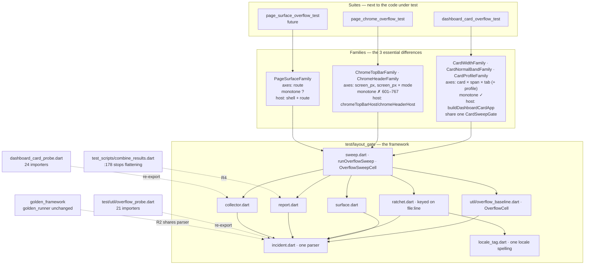
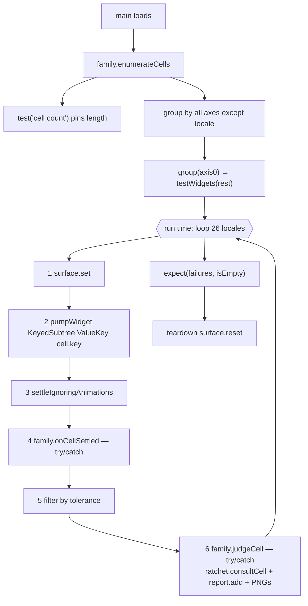

# Overflow Gate — Framework Architecture

**Last Updated: 2026-08-22** · Refactor proposal for the #1183 gate family · Status: **agreed and ticketed as epic #1335 (13 tickets: #1336–#1346, #1348, #1349). §6's cell↔test mapping decided 2026-08-20; §10 Q2 and Q4 closed 2026-08-21; R4's direction corrected against the code (§1.3, §9.2); R5 added and §1.2's cost table re-measured 2026-08-21 (§9.3); the local-versus-CI scout matrix and its consequence for R2/R4 verification recorded 2026-08-21 (§8, §9.2). Implementation started 2026-08-21: #1337 (baselines), #1336 (R1, tags), #1338 (R2's parser), **#1351 (the gate's last call into the golden parser), #1340 (surface + collector) and #1341 (the ratchet re-key)** have all landed on `fix/1314-1328-chrome-overflow`. **R2 is therefore complete on the gate side**, and #1339's golden half was split out of R2 into R4 on 2026-08-21 (§3.5), because it is the only part of R2 a developer machine cannot verify. **#1356 (this branch's review) then landed seven fixes across the landed work** — the sixteenth family difference (§2), the site key's portability, the ratchet entry's shape and integrity rules (§3, §5 contract 4), the `-dirty` stamp's scope, and one product defect in the collapsed header — and every count in §1.2 and §6 is re-measured against it. **#1342 then landed the runner itself** (`test/layout_gate/sweep.dart` + `families/page_chrome_family.dart`), with the chrome suite as its first consumer: 1,248 cells proved identical against the committed baseline, the #1328 fix reverted locally to prove the sweep still fails, and §1.2 re-measured again. **#1343 then ported the largest surface** — the three card sweeps, 1,898 of the gate's 3,587 baseline cells, onto that runner via `families/dashboard_card_family.dart` + `families/dashboard_card_gate.dart`, with `check card` reporting 1,917 cells identical and the suite falling 1,921 → 99 tests; §1.2 and §6 are re-measured against it (2026-08-22) and §6's table now carries a landed column. Stacked on `fix/1314-1328-chrome-overflow`, carrying one accepted conflict with PR #1325 (§9.1).**

**Ticket map.** R1 → #1336 ✅ · R2 → #1338 (parser) ✅, #1351 (retire the gate's dependency on the golden parser) ✅, #1340 (surface/collector) ✅ · R3 → #1342 (runner, proved on chrome) ✅, #1341 (ratchet) ✅, #1343 (main card sweep) ✅, #1344 (forced-form) ✅, #1345 (popup) ✅ · R4 → #1346 + #1339 (retire the golden framework's own parser — resequenced here 2026-08-21, see §3.5) · **R5 → #1348 (acceptance)** · **pilot → #1349**. Plus #1337, which has its own document rather than a section here: a byte-stable baseline capture, because R3's "compared cell-by-cell against a pre-port run" names a comparison without naming a mechanism, and 1,898 cells cannot be diffed by eye. **#1337 is implemented and its four baselines are captured at `4fb1ac5e-dirty`** (that sha plus #1337 itself — a baseline cannot name the commit containing it; `chrome` was re-captured at `785c6f67-dirty` when #1356 took the action count out of its cell ids and unified the locale spelling, a pure rename proved row-for-row) — see [overflow_baselines.md](overflow_baselines.md); R3 and R5 both consume `./tool/overflow_baseline.sh check`.

**Two steps this document did not have (added 2026-08-21).** R1–R4 as written verify that each port matches its own baseline, which is necessary and not sufficient: a refactor that makes 3,800 cells run faster and quieter while measuring less satisfies all of it. So **R5 (#1348)** re-runs the card suite's existing mutation table against the ported code and adds one *executed* mutation per framework invariant — the precedent being that table's own row 1, where a real defect was killed by 26 of 26 `network_health` tab-0 cases while the main width sweep, the largest thing in the file, saw nothing (§9.3, which also records which of that table's counts no longer reconcile). And the **pilot (#1349)** is now ticketed inside the epic rather than deferred past it, gated on R5, with §10 Q5 as its deliverable.

## Purpose

The #1183 overflow gate grew into two independent frameworks that measure the
same thing. `test/page/dashboard/cards/dashboard_card_overflow_test.dart` (the
card sweep) and `test/page/shell/page_chrome_overflow_test.dart` (the chrome
sweep, #1314/#1328) share exactly one file — `test/util/overflow_probe.dart` —
and re-invent twelve other things between them. (Written of the pre-refactor
tree. Since #1338/#1340 the shared spine is three files under `test/layout_gate/`,
still reached through that path, which is now a re-export; the parser, the
collector and the surface have left the re-invented list. Since #1341/#1342 it is
six — `incident`, `collector`, `surface`, `locale_tag`, `ratchet`, `sweep` — plus
`families/`, and the chrome sweep reaches all of them rather than one.) A third path,
`test/golden_test/golden_framework/golden_runner.dart`, parses the same overflow
string a third way and then discards its own verdict.

This document records the alignment that established which differences are
essential and which are accidental, the architecture that absorbs the accidental
set, and the migration order that gets there without a red intermediate state.

**It is a refactor, not a feature.** Nothing here adds a surface to the gate. The
pages pilot depends on it and is deliberately sequenced after it (§9), because
adding a third family to two frameworks would produce three.

**Companion documents**

| Document | Role |
|---|---|
| [overflow_baselines.md](overflow_baselines.md) | **#1337, landed.** The mechanism R3 and R5 compare against: `./tool/overflow_baseline.sh check <sweep>`. Baselines for all four sweeps are captured at `4fb1ac5e-dirty`, before any port — `chrome` re-captured at `785c6f67-dirty` for #1356's cell-id fixes. |
| [../dashboard/dashboard_density_design.md](../dashboard/dashboard_density_design.md) | How the card family's 560 → 27 → 0 allowlist was eliminated; the measurements the card axes rest on. |
| [../dashboard/dashboard_framework_overflow_investigation.md](../dashboard/dashboard_framework_overflow_investigation.md) | How a declared spec constraint becomes a real `BoxConstraints`. |
| [../../.claude/skills/dashboard-overflow-gate/SKILL.md](../../.claude/skills/dashboard-overflow-gate/SKILL.md) | How to operate the gate today. Its "adding a new probe" section is superseded by §3 here once R3 lands. |

---

## 1. What exists today

### 1.1 The two frameworks, aligned

| Aspect | Card sweep (#1183) | Chrome sweep (#1314/#1328) | Verdict |
|---|---|---|---|
| cell↔test mapping | 1 cell = 1 `testWidgets` | 1 test = N cells (inner loop over locale × mode) | accidental |
| Axis source | derived from grid geometry (`narrowestRealizationOf`) | hand-written width list | **essential** |
| Monotonicity in width | yes — narrowest realization is the worst case | no — the failure band is 601–767px | **essential** |
| Host construction | shared `buildDashboardCardApp` in a probe util | private `_topBarHost` / `_headerHost` in the suite | **essential** |
| Fresh render tree | one test per cell | `ValueKey(cellKey)` on the host root | accidental |
| Overflow collection | `probeCardOverflow` → `runWithOverflowCollection` | `collectOverflow` directly | accidental |
| Surface set (`setSurfaceSize` + `view.physicalSize` + `devicePixelRatio`) | inside the probe, 2 sites | hand-copied **7** times in the suite | accidental — **closed at #1340**: one `setLayoutSurface` |
| Surface reset | none | `_resetSurfaceAfter` teardown | accidental (the second was right) — **closed at #1340**: the primitive registers the teardown itself, so the card path resets too |
| Tolerance | `const _tolerancePx = kOverflowTolerancePx` | inline `> kOverflowTolerancePx` | accidental |
| Locale filter | `_targetLocales` + `--dart-define=LOCALE` | always all 26 | accidental |
| Ratchet | `known_overflows.json` + dead-exemption detection | none | accidental — **re-keyed on `file:line` at #1341**, **bounded by `maxOverflowPx` at #1356's review** (`test/layout_gate/ratchet.dart`); dead-entry detection is now one `tearDownAll` verdict over the whole run, suppressed when the run was filtered (§5 contract 4) |
| Report | `OverflowReportItem` → MD/HTML/PNG dumps | none | accidental |
| Failure surface | `fail()` per cell with a remediation paragraph | aggregated `failures` list + `expect(isEmpty, reason:)` | accidental (the second reads better for locale-driven defects) |
| Localizations access | not needed (`find.textContaining` on markers) | `localizationsByTag` preloaded in `setUpAll` | accidental |
| Readability assertions | 7 separate suites | inline in the same file | accidental |
| Tag | `layout-gate` + `overflow` | `layout-gate` + `overflow` | same |

Fifteen differences; three are essential.

**Four of the accidental rows are closed as of 2026-08-21** — the parser (#1338),
the surface set and the surface reset (#1340) and the ratchet key (#1341). The
table is kept as the diagnosis the epic was scoped from rather than rewritten to
the current tree; each row now says where it landed.

**A sixteenth difference surfaced at review and is closed too (#1356): the two
families spelled one locale two ways.** The three card sweeps each defined
`zh_TW` privately; the chrome sweep called `Locale.toLanguageTag()` and got
`zh-TW`. It is not on the table above because it is not visible from either suite
— each was self-consistent — and it took the committed datasets sitting next to
each other to show. It matters twice: the four baselines are grepped by hand
(`overflow_baselines.md` §2), and the ratchet matches the tag a sweep hands it
against locale lists a human wrote, so once #1342 puts the chrome sweep on the
runner a `zh-TW` would silently match no entry and read as "not deferred". Now
`localeTag()` in `test/layout_gate/locale_tag.dart`, imported by all four — and by
`sweep.dart`, which reaches it rather than `Locale.toLanguageTag()` for exactly
this reason. `sweep_test.dart` pins the `zh_TW` spelling so that "simplifying" it
back is a red test rather than a silent re-key of 3,587 rows.

```
  dashboard_card_overflow_test.dart      page_chrome_overflow_test.dart      golden_runner.dart
  844 lines · 1898 sweep cells           707 lines · ~1468 pumps             31 golden configs
  (1041 at #1343 → 496 after)            (721 at #1342 → 418 after)
  ═══════════════════════════════        ═══════════════════════════         ══════════════════
  locale   --dart-define filter          locale   all 26, always             locale   CI-injected
  tolerance  const _tolerancePx          tolerance  inline                   tolerance  NONE
  ratchet    known_overflows.json        ratchet    –                        ratchet    –
  report     OverflowReportItem→MD/HTML  report     –                        report     overflow_warnings.json
  fresh tree 1 cell = 1 test             fresh tree ValueKey(cellKey)        fresh tree n/a
  surface    inside probeCardOverflow    surface    3 lines × 7 copies       surface    golden device
  host       buildDashboardCardApp       host       _topBarHost/_headerHost  host       ShellType
  axes       card × span × tab × locale  axes       width × locale × mode    axes       device × locale
        │                                        │                                    │
        └────────────┬───────────────────────────┘                                    │
                     ▼                                                                ▼
        ┌────────────────────────────┐                          ┌──────────────────────────────┐
        │ test/util/overflow_probe   │                          │ golden_framework/            │
        │ worst side                 │  ◄── the only sharing    │ overflow_diagnostics         │
        │ tolerance 2.0px            │                          │ first side · no tolerance    │
        │ unparseable → ∞ (loud)     │                          │ + file:line  ◄── UNIQUE      │
        └────────────────────────────┘                          └──────────────────────────────┘
                                                                               │
                                                       pass/fail discarded (:373–391 `return;`) — correct
                                                       file:line discarded downstream, in THIS repo, at
                                                       test_scripts/combine_results.dart:178  ◄── the real loss
```

**The chrome column is now history, as of #1342.** Six of its rows moved to the
framework and the file is 721 → 419 lines — the diagram's `707` was measured at
`c4070eb9`, before #1351 and #1356 added to the file: `tolerance inline` and
`fresh tree ValueKey(cellKey)` and `surface 3 lines × 7 copies` are
`runOverflowSweep`'s, `host` and `axes` moved to
`families/page_chrome_family.dart`, and `locale all 26, always` is now the runner's
inner loop rather than a hand-written pair of nested `for`s. What remains in the
suite is the seven tests whose oracle is not "did a `RenderFlex` overflow" — the
readability assertions the sweep cannot make.

**The card column is history too, as of #1343**, and it took two files rather
than one. `1,041 → 496` lines in the suite, with the sweep's declaration now three
`runOverflowSweep` calls; the enumeration and the per-cell verdict moved to
`families/dashboard_card_family.dart` (435 lines, **three** families — the dataset
already keyed `card.width` / `card.normal_band` / `card.profile` separately, and
`family.name` *is* that key), and everything the runner has no opinion about moved
to `families/dashboard_card_gate.dart` (528 lines): the ratchet consult, the
report row, the PNG pair, the coverage counters and the failure prose. Ten of the
table's rows are that file — `Ratchet`, `Report`, `Locale filter`, `Tolerance`,
`Failure surface`, `cell↔test mapping`, `Fresh render tree`, `Overflow
collection`, `Surface set`, `Surface reset` — which is why the card port was
sequenced last and alone. The golden column is unchanged (#1339).

### 1.2 The measured cost model

Measured on this branch 2026-08-20, every row re-measured 2026-08-21, again
2026-08-22 after #1343, and again the same day after #1344/#1345:

| Suite | `flutter test` tests | Pumped cells | Wall clock | Per cell |
|---|---|---|---|---|
| Card sweep (one file) | **99** (1,921 pre-#1343) | 1,898 | ~21s | **11.0ms** |
| Chrome sweep (one file) | **57** (31 pre-#1342) | ~1,468 | ~8s | **5.4ms** |
| Popup sweep (one file) | **80** (354 pre-#1345) | 347 | ~5s | — |
| Forced-form sweep (one file) | **37** (80 pre-#1344) | 75 | ~1s | — |
| The four overflow sweeps (4 files, named) | **273** (590 pre-R3's last two) | > 3,000 | 19s (27s wall) | — |
| The same four via `--tags overflow` | **273** | > 3,000 | 1m53s (2m09s wall) | — |
| Whole `layout-gate` family (41 files) | **1,298** (1,615 pre-R3's last two) | > 3,800 | 1m55s (2m02s wall) | — |
| Whole PR gate (`./run_tests.sh`) | **5,222** (5,539 pre-R3's last two) | — | ~2m46s | — |
| Full-page golden (for contrast) | 6 | 6 | ~1s | ~170ms |

**The whole table moved at #1343, and only the test-count column.** The pumped
cells are unchanged — 1,898 in the card sweep, `check card` identical at 1,917
dataset rows — which is the entire claim a port is signed off against. Per-cell
cost is unchanged too, at the top of the band it already occupied: the runner
pumps the same host at the same surface, and a loop over 26 locales inside one
`testWidgets` costs what 26 `testWidgets` did. The four sweeps were then **590**
(`99 + 354 + 80 + 57`), the family **1,615** across **41** files (the forty-first
being `families/dashboard_card_gate_test.dart`, the gate's own oracle, `layout-gate`
and deliberately not `overflow`), and the gate **5,539** — which is
`7,339 − 1,921 + 99 + 11 + 11` exactly: the card suite's regrouping, plus 11 new
cases in `sweep_test.dart` for the judge hook and the three-way count decision, plus
the gate oracle's 11.

**#1344 and #1345 moved the same column and nothing else, and this time not even
the oracles.** Popup goes **354 → 80** and forced-form **80 → 37**, so the four
sweeps read **273** (`99 + 80 + 37 + 57`), the family **1,298** and the gate
**5,222** — each exactly 317 lower, with no new test written anywhere: both ports
are pure regrouping over an unchanged runner. The cells are unchanged at 347 and 75,
which is what the two ports are signed off against (`./tool/overflow_baseline.sh
check popup forced_form`); `popup` is byte-identical and `forced_form` differs in
exactly the six ids §2's locale rule renames. The two `--tags overflow` clocks read
higher than #1343's despite less work, which is the noise the paragraph below warns
about: almost all of that time is compiling the 313 files the tag then skips.

**Re-measured 2026-08-21.** Test counts are deterministic and are what the
tickets assert on; wall clock is not, because `flutter test` parallelises suites
across cores — read that column as an order of magnitude. The two `overflow` rows
now carry both clocks, because they differ by more than the noise: the first is
what `flutter test` prints, the second what the shell sees, and the gap is the
package resolution and build the tool does before it starts counting.

- The card sweep was **1,921** tests, not 1,922, so the file's non-sweep remainder
  is 23, not 24 (§6). Since #1343 it is **99** — `73 + 3 + 23`, the third term
  being one mandatory `cell count` test per family, which §6's projection of 96 did
  not foresee because #1342 made that pin a required parameter rather than an
  optional one.
- **The 2,386 row was mislabelled, not wrong.** It is the four *sweeps*
  (1,921 + 80 + 354 + 31 = 2,386, the `--tags overflow` pre-commit selector of
  §4), not the 39-file family, which measured **3,362** — 3,340 before #1356's
  review, which added 19 to `ratchet_test.dart` and 3 to
  `overflow_probe_test.dart`. Both rows now appear, because R1's two tags select
  exactly these two sets and the tickets assert on each separately. Since #1342
  they read **2,412** (`1,921 + 80 + 354 + 57`) and **3,415** across **40** files
  — the fortieth being `sweep_test.dart`, the runner's own oracle, which carries
  `layout-gate` and deliberately **not** `overflow` (§4: that tag means "pumps
  cells and asserts zero overflow", and this file is a framework self-test). Since
  #1343 they read **590** (`99 + 80 + 354 + 57`) and **1,615** across **41**, the
  forty-first being `families/dashboard_card_gate_test.dart` on the same split, for
  the same reason. Since #1344/#1345 they read **273** (`99 + 37 + 80 + 57`) and
  **1,298** across the same 41 files — the two ports added no file, because a
  family is not a suite (§1.1: `test/layout_gate/families/` carries no `@Tags`).
- **#1342 moved the chrome sweep's visible test count *up*, from 24 to 50, and
  §6's policy is why.** The cells are unchanged at 1,248 — proved row for row —
  but the suite had been grouping by width only: 12 top-bar tests of 26 locales
  and 12 header tests of 78 (3 modes × 26 locales). The policy is one test per
  *non-locale coordinate*, and `mode` is an axis, so the header's 12 tests became
  36 and the two pinned cell-count tests brought the file to **57** with its 7
  non-sweep tests. Worth stating plainly because §6's card table moves the other
  way (1,898 → 73): the rule is not "fewer tests", it is "locale aggregated and
  every other axis visible" — which for chrome meant un-aggregating an axis it had
  been hiding.
- **Selecting by tag costs 2m09s where naming the four files costs 27s**, for the
  identical test set — 273 since #1344/#1345, re-measured 2026-08-22 (590 and 1m43s
  / 26s after #1343; 2,412 and 1m43s / 28s after #1342; 2,386 and 1m53s / 32s at
  #1336). The tag's cost barely moved
  while the sweeps' own work fell, which is the point of the next paragraph: almost
  all of that 1m43s is compiling files it then skips. `@Tags` is read by loading a
  suite, so the tag compiles all 317 test files in order to skip 313 of them. The
  selection is exactly right either way, so the tag is correct for a pre-commit
  run and for `tool/run_overflow_test.sh` — both of which must not miss a fifth
  sweep — and naming the file is correct for an inner loop. **#1336's ticket text
  claimed "about half a minute" for the tag; that figure belongs to the filename
  path.**
- The gate total **7,339 is exact** as of #1342, and moves with the
  tickets: 7,144 when the epic was written, 7,200 after #1337's baseline
  instrumentation, 7,217 after #1338's 17 parser tests (14, plus 3 pinning
  `toString()` after review found its output change untested), 7,221 after #1351
  (+4: one emitter test and three pinning the record's keys and types), 7,229 after
  #1340 (+8, the surface primitive's own group), 7,258 after #1341 (+29,
  `ratchet_test.dart`), 7,260 after that ticket's review (+2, pinning that `@` in
  a path is a site and that a whitespace key is rejected for the reason it really
  was — see Invariant 2's second count correction), and **7,286 after #1356's
  review (+26)**: +19 in `ratchet_test.dart` (1 for the site key's portability, 5
  for the fixture's integrity rules, 13 for the `maxOverflowPx` ceiling), +3 in
  `overflow_probe_test.dart` (an unmapped path is not silently kept), +4 in
  `test/test_scripts/overflow_baseline_test.dart` (the `-dirty` stamp's pathspec
  and the wrapper's flag surface). Then **7,339 after #1342 (+53)**: +27 in
  `sweep_test.dart` (the runner's oracle — 23, plus 4 from this ticket's own
  review: three pinning the group/test names and one for invariant 3's build-phase
  half) and +26 in the chrome suite, for the regrouping reason above. The whole run
  is green at that total.
  §6's projection therefore read `7,339 − 1,898 + 73 = 5,514`, **not the 5,319
  the epic's acceptance criterion and #1348 still name** — whoever runs #1348 must
  re-derive it from the total standing at that moment rather than assert on 5,319.
  Every ticket in this epic has moved this number, which is the whole reason it is
  a subtraction rather than a literal.
  **#1343 landed at 5,539, and the 25 above 5,514 are all new oracle cases**: the
  regrouping cost 1,822 (`1,921 − 99`, not 1,825, because the count pin is per
  family and there are three), and it bought 11 in `sweep_test.dart` and 11 in
  `dashboard_card_gate_test.dart` — the last 3 of those written during the port's
  own review, for the empty-enumeration branch it found. So the projection was accurate to the four rows
  it was a claim about, and short by the tests the port itself had to write —
  which is the shape every remaining ticket's estimate should be read in.

The per-file sweep counts behind that row — main **1,921 → 99**, popup
**354 → 80**, forced-form **80 → 37**, chrome **31 → 57** — are each a port's
baseline, so R3's four tickets (#1342–#1345) each own one of them. **All four are
now spent**, and what a port is signed off against is the *cell* count, not the
test count (1,248 · 1,917 · 347 · 75, `./tool/overflow_baseline.sh check chrome card
popup forced_form`) — the two counts moved in opposite directions on chrome and the
same direction on the other three, which is the whole reason the baselines exist
rather than a test-count assertion.

Two things follow, and both were previously mis-stated:

1. **Per-cell cost is the same order in both frameworks** (5–10ms). An earlier
   reading of "31 tests / 8s = 260ms" mistook a per-*test* figure for a
   per-*cell* one and produced a phantom 26× gap. The chrome sweep is in fact the
   cheaper of the two per measurement, because its hosts are provider-free while
   the card hosts stand up `kitchenSinkOverrides` and a
   `FallbackFontResolver`-wrapped theme.
2. **The 170ms figure belongs to the golden runner, not to overflow.** It is the
   right proxy for a *full page with its orchestrator*, and the wrong proxy for a
   chrome-style probe. The pages budget therefore stays open, and the pilot's job
   is to measure which of the two a real page resembles.

The card sweep's 1,898 cells decompose perfectly: **73 non-locale coordinates ×
exactly 26 locales each**, with no ragged group — re-verified 2026-08-21 by
grouping the JSON reporter's test names, which put all 73 coordinates at exactly
26 locales and none at any other count. This is what makes §6's regrouping a
clean cut, and it is the one figure in this section that survived
re-measurement untouched.

### 1.3 The third path: a source location measured and then flattened

`golden_runner.dart:373–391` hooks `FlutterError.onError`, recognises the
overflow, builds a record via `buildOverflowRecord(...)`, and returns — justified
in-place by "overflow in golden tests is cosmetic (visible in the golden image
itself)". `tearDownAll` at `:72` writes `goldens/overflow_warnings.json` (`:420`).

**Corrected 2026-08-21, against the code.** An earlier revision of this section
read that as a verdict "thrown away". Two things are wrong with that:

1. The `return` discards only the **pass/fail verdict**, and §8 argues it should
   keep doing exactly that — advisory is the right setting for a scout. The
   *record*, `file:line` included, is captured faithfully and written out.
2. The record is then parsed by `test_scripts/overflow_details.dart` into
   `OverflowDetail{widget, file, line, pixels, side, message, occurrences}` — a
   **richer** row than the gate's own card-shaped `OverflowReportItem`, which
   carries no source location at all. The direction of R4 in §9.2 was therefore
   backwards: it is the gate that needs to learn the golden side's join column,
   not the reverse, and #1338/#1343 already deliver it.

The real loss is one step further down, in this repo, at
`test_scripts/combine_results.dart:178`:

```dart
final sites = overflowDetails[goldenName] ?? const [];
test['hasOverflow'] = sites.isNotEmpty;   // ← file:line dies here
```

Every consumer downstream is screen-keyed as a direct consequence. Golden CI's
day-over-day collector (`PrivacyGUI-golden-ci`, `triage-agent/collector.py`) keys
its overflow diff on `{tsName}|{locale}|{deviceType}`, which is why one source
location multiplies into hundreds of rows, and why that collector's new-overflow
issue creation is **held in code** against a ~361-issue blast.

That pipeline is not idle. It runs in the golden CI repo across 26 locales and
four devices (`desktop1280`, `desktop1241`, `phone480`, `phone320` — more devices
than the local defaults, which declare no `locales:` at all and fall back to
`[Locale('en')]` at `golden_test_config.dart:85`), and it has already produced
roughly 135 ticketed coordinates:

- **#1302** (open): 15 coordinates collapsing to **5 source locations** across
  devices / shared / statistics / topology, every one locale-driven (`fr`,
  `fr_CA`, `fi`).
- **120 further coordinates** in admin, all at `firmware_update_card.dart:77`
  across 10 locales.
- One site is in ui_kit (`app_dialog.dart:95`) and therefore not fixable from
  this repo (constitution Article XIV).
- One site (`usp_node_detail_view.dart:467`) was found by a human, not the
  pipeline, because no fixture sets `lastContactTime`.

So the question the refactor has to answer is not "how do we detect page-level
overflow" — that already happens daily — and not "why is a measured signal
advisory" either, since §8 concludes advisory is correct for the scout. It is
**"why can the two datasets not be compared"**, and the answer is one line that
collapses a list of sites to a boolean. §8 is the shape of the comparison.

---

## 2. Essential versus accidental

The three essential differences are all about *what is being measured*, and none
of them should be abstracted away:

1. **Where the axes come from.** The card family derives width from production
   grid geometry, so a card added to `UspWidgetSpecs.all` is swept automatically.
   The chrome family enumerates a literal width list, because there is no
   geometry to derive it from — the widths that matter are breakpoints.
2. **Whether overflow is monotone in width.** The card sweep pumps one width per
   span and calls it exhaustive, and that argument is only sound because wider is
   never worse *within a form* (`narrowestRealizationOf`'s doc carries the proof,
   bounded by `kEnumerationSlackPx` = 0.5px, a quarter of the tolerance). Chrome
   has no such property: `menu_holder.dart:79` renders the top nav as
   `SizedBox.shrink()` at ≤600px, so #1328's failure band is 601–767px with clean
   water on both sides. A framework that assumed either property would be wrong
   for one of its families.
3. **How one cell's host is built.** A card needs the factory, tab pinning,
   density scope and the kitchen-sink fixture. The top bar needs a `GoRouter`
   ancestor, a mounted `Navigator` under `uspShellNavigatorKey`, and an
   `ExcludeSemantics` around it. These have nothing in common and never will.

Everything else on the list is the same problem solved twice.

---

## 3. Target architecture

### 3.1 Layers

Files **do not move**. `app_test_fonts.dart` has 28 importers,
`dashboard_card_probe.dart` has 24, `overflow_probe.dart` has 21; relocating them
means touching ~70 files for no behavioural gain. The new layer is additive and
the old paths re-export from it.

**Counts re-measured 2026-08-21** (files carrying an `import` of the path, which
is what a relocation would have to edit; an earlier revision wrote 20 in this
paragraph and 22 in the §3.2 diagram, counting different things). `overflow_probe.dart`
had **22** importers at #1338 and has **21** since #1351: `test/util/overflow_baseline.dart`
now imports `test/layout_gate/incident.dart` directly, because reaching the parser
through the shim would put it in a cycle with `collector.dart` — the one importer
the whole R2 sequence moved, and it moved for a reason the re-export cannot serve.

```
   SUITES ─ stay next to the code under test
   test/page/dashboard/cards/          test/page/shell/              test/page/<future>/
   dashboard_card_overflow_test        page_chrome_overflow_test     page_surface_overflow_test
          │ runOverflowSweep(                  │                              │
          │   CardWidthFamily(gate))           │                              │
          ▼                                    ▼                              ▼
  ┌──────────────────────────────────────────────────────────────────────────────────┐
  │ FAMILIES ─ own the three essential differences, and only those                    │
  │ test/layout_gate/families/                                                        │
  │                                                                                  │
  │   CardWidthFamily              ChromeTopBarFamily ─┐      PageSurfaceFamily       │
  │   CardNormalBandFamily         axes  screen_px     │ two  axes  route            │
  │   CardProfileFamily            ChromeHeaderFamily ─┘      monotone ? (pilot)     │
  │   axes  card × span × tab      axes  screen_px × mode     host  shell + route    │
  │         (+ profile)            monotone ✗ (601–767)       geometry  –            │
  │   monotone in width ✓          host  chromeTopBarHost /                          │
  │   host  buildDashboardCardApp        chromeHeaderHost                            │
  │   geometry  grid math          geometry  literal list                            │
  │        └─ CardSweepGate ◄── the run-level state the runner has no opinion on:    │
  │           ratchet · report rows · PNGs · declared/measured counters              │
  └──────────────────────────────────────────────────────────────────────────────────┘
                                    │ extends OverflowSurfaceFamily
                                    │   name / axisNames / enumerateCells / onCellSettled
                                    │   + judgeCell / enumerationGaps  (defaulted, #1343)
                                    ▼
  ┌──────────────────────────────────────────────────────────────────────────────────┐
  │ test/layout_gate/  FRAMEWORK ─ absorbs the twelve accidental differences          │
  │                                                                                  │
  │   sweep.dart       runOverflowSweep   declares tests; never awaited              │
  │                    OverflowSweepCell  key = ordered axes, then locale            │
  │   surface.dart     set + reset        once                                       │
  │   ratchet.dart     file:line → {locales, maxOverflowPx} + dead-entry detection   │
  │   locale_tag.dart  localeTag()          one spelling of a locale: zh_TW           │
  │   report.dart      base row + family extension columns                           │
  │   collector.dart   runWithOverflowCollection / collectOverflow / settle           │
  │   incident.dart    ONE parser: worst side + tolerance 2.0 + ∞ + file:line         │
  └──────────────────────────────────────────────────────────────────────────────────┘
            ▲                              ▲                          ▲
            │ re-export                    │ re-export                │ R2: shares the parser
   test/util/overflow_probe.dart   dashboard_card_probe.dart    golden_framework/
   (22 importers unchanged)         (26 importers unchanged)     (golden_runner unchanged;
                                                                  R4 is one line down, in
                                                                  test_scripts/combine_results)
```

<details>
<summary>Same diagram as mermaid (for GitHub rendering)</summary>



</details>

### 3.2 The two core types

**As landed in #1342** (`test/layout_gate/sweep.dart`). The sketch this section
originally carried is kept below it, because the two differences between them are
both decisions rather than drift.

```dart
/// One measurable coordinate: enough to pump exactly one tree, plus a stable
/// identity for the dataset, the freshness key and the test name.
class OverflowSweepCell {
  /// The non-locale coordinate, in reading order — insertion order is the id.
  /// e.g. {'card': 'device_info', 'width': '191', 'tab': '2'}
  final Map<String, Object?> axes;
  final Locale locale;
  final Size surfaceSize;
  final Widget Function() build;
}

abstract class OverflowSurfaceFamily {
  /// 'chrome.top_bar' / 'card.width' — the `<baseline>.<group>` the dataset,
  /// the ratchet and the report are all namespaced by.
  String get name;

  /// Ratchet key order and report column order. The first axis becomes the
  /// enclosing `group` name — see §5 for why that is a contract.
  List<String> get axisNames;

  Iterable<OverflowSweepCell> enumerateCells();

  /// Runs once the cell has settled, still inside the overflow collector.
  /// This is the readability slot; see §7 on why it has no default.
  Future<void> onCellSettled(WidgetTester tester, OverflowSweepCell cell);
}
```

Two deviations from the sketch, both forced by work that landed after it was
written:

1. **The name is `OverflowSweepCell`, not `OverflowCell`.** #1337 had already
   taken that name for the *dataset's* coordinate
   (`test/util/overflow_baseline.dart`: a sweep name and its axes, and nothing
   about how to render one), and it is what four committed baselines and three
   unported sweeps are keyed on. A duplicate definition is the one thing Dart
   will not tolerate, and renaming the dataset's type would have meant editing
   the sweeps this ticket is not porting. `overflowSweepBaselineCell()` is the
   one-line bridge between them, so there is exactly one place the two can
   disagree — and `overflowSweepCellId()` is single-sourced through it, which is
   what keeps the `KeyedSubtree` key and the baseline row key literally the same
   string.
2. **`axes` is an ordered `Map`, and `locale` is not in it.** The sketch's
   `List<(String, String)>` and a `Map` have the same ordered-projection
   property in Dart (insertion order is preserved and is what the id is built
   from), and the map reads better at the call site. Keeping locale *out* of the
   axes is the load-bearing half: §6's policy has to single locale out to group
   by "every axis except locale", and a magic axis name would be a second
   spelling of the same fact. `overflowSweepEnumerationProblems()` reports a
   family that declares `locale` as an axis for exactly this reason.

A family answers two questions and no others: **which coordinates exist**, and
**how one coordinate becomes a host widget**. Geometry, the monotonicity
argument, and host scaffolding all stay inside the family, which is why the three
essential differences need no abstraction at all.

**One family per widget, not per suite.** The sketch shows a single
`PageChromeFamily`; the tree has `ChromeTopBarFamily` and `ChromeHeaderFamily`,
because the chrome suite measures two widgets with unrelated hosts and different
axes (`screen_px` versus `screen_px × mode`), and #1337's dataset already records
them as two groups. One class would have had to carry a widget discriminator as an
axis — the `OverflowReportItem`-demands-a-`cardId` mistake of §1.1, in the other
direction.

### 3.3 The runner

**As landed in #1342:**

```dart
runOverflowSweep(
  family: const ChromeTopBarFamily(),
  expectedCellCount: 312,           // required — §6's only defence
  tolerancePx: kOverflowTolerancePx,
);
```

The sketch it replaces took an `OverflowSweepConfig` object carrying `ratchet:`
and `report:` as well:

```dart
runOverflowSweep(OverflowSweepConfig(
  family: DashboardCardFamily(),
  tolerancePx: kOverflowTolerancePx,
  ratchet: OverflowRatchet.fromFixture(),   // #1341; path defaults to
                                            // kKnownOverflowsFixturePath
  report: cardReportRowBuilder,   // optional
));
```

**Named parameters, and no ratchet or report yet — both deliberate.** The chrome
family needs neither hook, and #1343 is where they take shape with the only family
that has them (`known_overflows.json`, PNG dumps, `OverflowReportItem`). An unused
hook is a guess with no way to be wrong, and #1341 already landed the ratchet as a
module the runner can call when there is a caller to shape the call. The config
*object* goes the same way: two required parameters and one defaulted do not need a
wrapper type, and the wrapper is cheap to introduce in #1343 if three more arrive.
What is **not** deferred is `expectedCellCount` — required from the first family,
because it is what §6's regrouping trades away.

**The names a coordinate produces are their own function**, `overflowSweepNames`,
returning `(group:, test:)`. Extracted at #1342's review rather than left inline:
§5 contract 1 is a promise about a *name*, and a promise buried in a closure inside
a `for` loop can only be checked by reading a test report. It also fixed a real
defect — the names were first recovered by `split(' ')` on the human-readable
coordinate label, which would have named the group after the first *word* of any
axis value containing a space. Nothing forbids one: `chrome.header`'s mode axis read
`mode=viewing, local (3 actions)` until #1356, and #1356 made only the **id**
prose-free, not the label. The oracle now pins both the contract and the spaced
value.

It must be a **top-level declarative function**, shaped like
`runViewGoldenTests(GoldenTestConfig)` — it *declares* tests. A helper you
`await` inside one `testWidgets` cannot work here: Flutter reports each
`RenderFlex`'s overflow once per render-object lifetime, so a loop inside a
single test silently drops every measurement after the first unless something
forces a fresh subtree. Making the runner a declaration keeps that decision in
the framework's hands (§3.4, invariant 1).

### 3.4 The three invariants the framework owns

```
╔═ DECLARATION TIME ═ main() runs once; there is no tester yet ═════════════════╗
║  runOverflowSweep(config)                                                     ║
║    │                                                                          ║
║    ├─ family.enumerateCells()             ◄── the family is the only axis      ║
║    │     └─ 1,638 + 208 + 52 OverflowSweepCell  authority                      ║
║    │                                                                          ║
║    ├─ test('cell count')                 ◄── pins enumerateCells().length      ║
║    │     └─ the only defence against silent coverage loss (§6)                 ║
║    │     └─ or markTestSkipped, when family.enumerationGaps() is non-empty:     ║
║    │        a LOCALE-filtered run must not pin a subset (#1343)                ║
║    │                                                                          ║
║    ├─ group by every axis except locale   ◄── framework policy, fixed          ║
║    │     └─ 73 groups × 26 locales                                             ║
║    │                                                                          ║
║    └─ per group: group(axis0) { testWidgets(remaining axes) { … } }            ║
║                      └─ card id stays a group prefix                           ║
║                         contract: run_overflow_test.sh:162 --name "$CARD_ID"    ║
╚═══════════════════════════════════════════════════════════════════════════════╝

╔═ RUN TIME ═ one testWidgets = 26 cells ═══════════════════════════════════════╗
║  for locale in 26:                                                            ║
║    ┌────────────────────────────────────────────── owned by the framework ──┐ ║
║    │ 1  surface.set(cell.surfaceSize)                                       │ ║
║    │ 2  pumpWidget( KeyedSubtree(key: ValueKey(cell.key),   ◄── INVARIANT 1 │ ║
║    │                             child: cell.build()) )                     │ ║
║    │ 3  settleIgnoringAnimations(tester)                                    │ ║
║    │ 4  try  family.onCellSettled(tester, cell)   ◄── readability slot      │ ║
║    │    catch → record as this cell's failure     ◄── INVARIANT 3           │ ║
║    │ 5  incidents.where((i) => i.pixels > tolerance)                        │ ║
║    │ 6  try  family.judgeCell(tester, cell, verdict)  ◄── ONE hook (#1343)  │ ║
║    │    catch → record as this cell's failure         ◄── INVARIANT 3       │ ║
║    │      └─ default: any significant incident = a failure line             │ ║
║    │      └─ CardSweepGate: ratchet.consultCell(file:line, locale)          │ ║
║    │                     + report.add(baseRow) + the PNG pair               │ ║
║    └────────────────────────────────────────────────────────────────────────┘ ║
║  expect(failures, isEmpty, reason: '… in N locale(s): …')                     ║
║  teardown: surface.reset()                                    ◄── INVARIANT 2 ║
╚═══════════════════════════════════════════════════════════════════════════════╝
```

<details>
<summary>Same lifecycle as mermaid</summary>



</details>

**Invariant 1 — every cell host is wrapped in `KeyedSubtree(key: ValueKey(cell.key))`.**
Both existing frameworks dodge the once-per-render-object reporting rule, by
different means (a fresh test / a hand-written `cellKey`). Handing the dodge to
the framework makes it impossible to forget, and it upgrades "multiple pumps in
one test" from a trap to a safe operation — which the card family needs, because
its adjusted-screenshot capture re-pumps inside the same test.

**Landed 2026-08-21 (#1342), and it is load-bearing rather than defensive.** The
key is `overflowSweepCellId()`, which is the same string the baseline record is
keyed on — one identity, so a port cannot let the freshness key and the dataset key
drift apart. Proved by mutation: deleting the `KeyedSubtree` from
`measureOverflowCell` fails exactly one test, `sweep_test.dart`'s *INVARIANT 1: the
same shape overflows again in the same test*, with "the second cell must get its
own render objects" — and leaves the other 22 green, which is what makes it a
killer rather than a coincidence. The chrome family's `cellKey` parameter survives
for the suite's seven non-sweep tests, which pump many trees per test for oracles
of their own and are not on the runner.

**Invariant 2 — the surface is set and reset in one place.** The three-line
surface dance appeared **thirteen** times across the gate's measuring paths:
seven in the chrome suite, twice in the card probe, once inside the shared
`collectOverflow`, once in the stats-section probe, once in the popup-form gate
and once in the SNR render-parity gate — and only two of those paths reset it
afterwards. A width leaking into the next test silently measures the wrong
viewport.

**Landed 2026-08-21 (#1340).** All thirteen are `setLayoutSurface(tester, size)`
in `test/layout_gate/surface.dart`, which registers the restore itself, so the
paths that never had a teardown gain one and no caller of the spine can opt out.
There is deliberately no standalone reset primitive: every site that reset also
set, so a second entry point would be the "one place" this invariant forbids. The
chrome suite's private `_resetSurfaceAfter` is gone and its baseline is unchanged
(`./tool/overflow_baseline.sh check chrome`, 1,248 cells identical).

Two count corrections, both worth keeping because each was a different mistake.
An earlier revision wrote "eight times in the chrome suite": the total of ten was
right, the split was not — the eighth copy was in `collectOverflow`, which is a
materially different fact, because that one was already shared and simply was not
reset for the card half. Then ten itself proved short: the review of #1340 found
three more, in `stats_section_probe.dart`, `card_popup_form_test.dart` and
`wifi_snr_render_parity_test.dart`. Two of the three reset nothing at all, so
they were leaks of exactly the kind this invariant is about, and the first sat
twenty lines under a header that already credited the shared layer with owning
the restore.

**Where the invariant stops.** It binds the paths that reach the gate's spine —
anything that pumps through `runWithOverflowCollection` / `collectOverflow`, or
imports `overflow_probe.dart` to size a card. Five `layout-gate` carriers still
write the triple by hand (`card_density_scope_test.dart`,
`usp_info_row_test.dart`, `card_form_toolbar_test.dart`,
`usp_wifi_status_card_legibility_test.dart`, `dhcp_card_test_harness.dart`) and
are deliberately left: they collect no overflows and do not otherwise depend on
`test/layout_gate/`, so porting them would add a dependency on the spine to buy
consistency alone. `overflow_probe_test.dart` keeps one copy on purpose — it is
the dirty-all-three fixture the primitive is measured against.

**Invariant 3 — a per-cell exception is recorded as that cell's failure.** This
is the precondition that makes the locale inner loop safe: one locale throwing a
non-overflow exception must not take the other 25 down with it. Roughly ten lines,
and without them §6's regrouping trades reporting quality for isolation.

**Landed 2026-08-21 (#1342).** `measureOverflowCell` never throws for anything the
cell did; it returns a verdict carrying the error, and the aggregated failure
changes verb — `overflowed or threw … (1 threw)` — because "overflowed at 640px in
1 locale(s)" would be a lie about a tree that never finished building, and the two
are remediated differently: a layout to fix versus a fixture or a host to fix. The
oracle asserts both halves in one test: the throwing locale fails *and* the next
locale is still measured.

**"Exception" is two mechanisms, and a `catch` only sees one of them** — found by
#1342's own review. A host that fails while *building* does not propagate: Flutter
reports it through `FlutterError.onError`, `collector.dart` forwards anything that
is not an overflow to the binding, and `pumpWidget` returns as though nothing
happened. Left there, the cell's baseline row is written **unflagged** — the
`measured-and-clean` reading `overflow_baselines.md` §2 calls the dangerous one,
for a tree that never built — and the grouped test fails later with a bare stack
instead of the aggregated reason. So the runner claims the pending exception
(`tester.takeException()`, after the hook) and re-throws it, which routes it into
the same verdict as any other and tells the collector to flag the row `threw`. The
oracle covers this as a second case, and it is mutation-checked: delete the two
lines and the case fails with exactly the stack the fix removes. Any future family
whose hosts can fail to build inherits this for free; #1343's, which stands up a
provider scope per cell, is the one that will use it.

### 3.5 One parser

Two independent parsers of the same string exist today, and each has what the
other lacks:

| | `test/util/overflow_probe.dart` | `golden_framework/overflow_diagnostics.dart` (#1197) |
|---|---|---|
| Side chosen | worst | first |
| Tolerance | `kOverflowTolerancePx` = 2.0 | none |
| Unparseable | `double.infinity` — fails loud | failure-tolerant |
| Source location | — | **`file:line`, with path normalisation** |

The merged parser keeps the loud-failure behaviour, the worst side and the
tolerance, and absorbs `file:line`.

**Landed 2026-08-21 (#1338), and "exactly one" is not true yet.** The merge lives
at `test/layout_gate/incident.dart` and `overflow_probe.dart` re-exports it, so
its 22 importers are untouched. Call sites still reach the second parser, and they
split into two groups that do **not** belong in one ticket:

| | Call site | Verifiable locally? |
|---|---|---|
| **gate side** (#1351) ✅ | `test/util/overflow_baseline.dart:185` spread `parseOverflowSource` into every baseline record — the *only* parser coupling between the gate family and the golden framework, and the reason that file imported it at all | **yes** — `./tool/overflow_baseline.sh check` |
| **golden side** (#1339) | `golden_runner.dart` uses its own copy; #1339 deletes it and points the runner here | **no** — needs golden-ci artifacts |

The gate side is a byte-for-byte no-op today, and provably so: all 3,587 rows
across the four frozen baselines are `clean`, with `-` in every incident column,
so nothing exercises the source fields. What changes is only the shape of a row a
*future* overflow would write — `parseOverflowSource` returns
`Map<String, String>`, so `line` serializes quoted, while `OverflowIncident.line`
is an `int`. (An earlier revision of this section called that "rewrites rows in a
dataset #1337 froze byte-for-byte". It does not; the dataset has no such row.)

**Consequence for sequencing.** Nothing in R2 or R3 depends on the golden side —
the only ticket that does is #1346, which needs the two sides measuring the same
way before it can join them on `file:line`. Verified 2026-08-21: of the 39
`layout-gate` files, four import `golden_framework`, and all four import only
`mocks/`. So #1339 is a prerequisite of **R4**, not of R2, and doing the gate side
separately — split out as **#1351** on 2026-08-21 — takes golden-ci off R2's
and R3's critical path entirely.

**The gate side landed 2026-08-21 (#1351).** `overflow_baseline.dart` reads
`OverflowIncident.file` / `.line` / `.widget` instead of calling the golden
parser, and `grep -rn parseOverflowSource test/` now finds callers only in
`overflow_diagnostics.dart` and its own test. Verified exactly as predicted:
`./tool/overflow_baseline.sh check` exits 0 on all four sweeps, 3,587 cells
identical. The `runDirectory` parameter of `overflowBaselineRecordLine` was
**removed** rather than left unused — an ignored parameter still reads as "this is
what the recorded paths are relative to", and nothing would have caught it
becoming false.

So the epic's "exactly one parser of Flutter's overflow string exists in the repo"
is now met **inside the gate family** — one parser is canonical and one runs — and
partially met repo-wide: `golden_runner.dart` still uses the copy, which is #1339
in R4.

`file:line` is not decoration. It is the correct ratchet key: a coordinate-keyed
allowlist invalidates wholesale whenever a layout is rearranged, whereas a
source-location key survives it. And it is the join column that makes golden CI's
advisory findings and the local gate's verdicts one comparable dataset (§8) —
which is what turns the graduation rule from something a person has to watch into
something a diff computes.

**But the key is not the whole entry, and #1356's review is where that was
noticed.** The very property that makes `file:line` durable — one location is
rendered by every cell that reaches it — is what makes a bare exemption there too
broad: the coordinate key at least implied *one card at one width*, whereas
`lib/…/view.dart:120` alone says "an overflow of any size at this line, in these
locales, is fine". A 40px defect deferred under a ticket would then absorb a 400px
one arriving later at the same widget, and the gate would report it to whoever
read the log as that ticket's known debt. So an entry is now an object with two
required fields:

```json
"lib/page/x/view.dart:120": {"locales": ["de"], "maxOverflowPx": 41}
```

Three consequences worth carrying into #1342–#1345:

- **The magnitude is required, not optional.** The first entry written under a
  deadline would have omitted it and every entry after would have copied that one.
  The pre-#1356 bare list is refused by name, with the object to write in its
  place printed in the message.
- **The ceiling is checked with `kOverflowTolerancePx` of slack on top**, because
  the gate already has exactly one noise floor and a second number would be a
  second thing to keep true. Every message that mentions an allowance prints both
  halves, so the slack is never found only by reading source.
- **The question a caller can ask changed shape.** `isAllowlisted` takes the
  magnitude as a required argument, so the incomplete question ("is this site
  listed?") is no longer askable; the locale-only question has its own name,
  `ceilingBreaches`, because a breach needs the *opposite* remediation from an
  unlisted site — fix or raise the ceiling, not "add the tag" the entry already
  names.

The committed fixture is `{"tracking": {}, "allowlist": {}}` under either shape,
so none of this was a migration.

---

## 4. Tags

`layout-gate` is carried by **39 test files** (a 40th mention, at
`test/golden_test/flutter_test_config.dart:9`, is a comment) — 38 until #1341
added `test/layout_gate/ratchet_test.dart`, which carries `layout-gate` **only**:
it pumps no cell, so the `overflow` pre-commit selector has nothing to gain from
it. Only **6** of the 39 have "overflow" in the filename; the rest are density,
readability, form and gesture, layout blocks, probe self-tests, the ratchet oracle
and render-parity gates. Renaming the tag to `overflow` would therefore mislabel
33 files.

`dart_test.yaml` documents the tag's real meaning — since #1336 landed, in the
name as well as the comment:

```yaml
  # Defensive widget gates that must run in the PR test command (#1183), said in
  # the name since #1336: a PR-blocking defensive layout gate. All 39 carriers
  # are one — density, readability, form and gesture, layout-block, probe
  # self-test, render-parity and overflow.
  # NOT excluded by run_tests.sh's --exclude-tags="golden||loc||ui", so a
  # failure here blocks the PR — and tagging one of these `golden`, `loc` or
  # `ui` instead is how a gate leaves the PR command in silence.
  layout-gate:
```

Dart test tags are a set, not a hierarchy, so the answer is two tags:

| Tag | Applied to | Purpose |
|---|---|---|
| `layout-gate` | all 41 files (39 before #1342 added `sweep_test.dart`; 40 before #1343 added `families/dashboard_card_gate_test.dart`) | "PR-blocking defensive layout gate" — the semantics the comment already describes |
| `overflow` | the sweep files only, as `@Tags(['layout-gate', 'overflow'])` | the fast pre-commit selector |

**The split is checked by arithmetic, not by inspection** (#1342): `--tags overflow`
measures **590** (2,412 before #1343), which is exactly what naming the four sweep
files measures, so the framework's own oracles — `sweep_test.dart` and
`families/dashboard_card_gate_test.dart` among them — are provably outside that
selector. Had both picked up `overflow`, the tag run would read 636 (`+35 +11`).
The check is the *equality*, not either literal: both numbers move with every port,
and what must hold is that they move together.

That arithmetic covers the **standalone** readability suites, which are separate
files carrying `layout-gate` alone. It does **not** reach the readability
assertions that live *inside* a sweep file: `@Tags` is a library annotation, so the
chrome suite's seven non-sweep tests carry `overflow` with the rest of their file
and are part of that 590 — as are the card suite's 23, which is why #1343 left them
in place rather than splitting the file. The tag therefore means "every test in a file that
pumps cells", not "only cell measurements" — and the AC's requirement is about the
suites whose *whole* oracle is legibility, which is what the file split gives.
Prising the seven out would mean a second file sharing the chrome family, which
buys a tidier tag at the cost of splitting one widget's coverage across two
suites.

Both must be declared in `dart_test.yaml`. Neither appears in `run_tests.sh`'s
`--exclude-tags="golden||loc||ui"` (lines 80 / 92 / 96), so both stay
PR-blocking — gating comes from *not being excluded*, which is also why tagging a
sweep `ui` or `loc` would remove it from the gate silently.

`flutter test --tags overflow` becomes the local pre-commit run. `tool/run_overflow_test.sh:18`
drops its hardwired `TARGET_TEST` in favour of the tag.

---

## 5. Contracts that must survive the refactor

1. **`run_overflow_test.sh:162` filters by test name** — `--name "$CARD_ID"`,
   which resolves today through the `group('${spec.id} overflow')` wrapper. The
   card id must remain a group-name prefix. Generating the enclosing group from
   `axisNames.first` satisfies this by construction.

   **Landed 2026-08-21 (#1342), and #1343 should know the exact shape.** The group
   name is the first axis as `name=value`, not the bare value — chrome's groups are
   `screen_px=320`, so the card family's will be `card=connected_devices`. Checked
   against the script rather than assumed: it appends `--name "$CARD_ID"`
   unanchored (`tool/run_overflow_test.sh:199` — **the `:162` above is stale**, from
   before #1336 rewrote the selection), and `flutter test --name` is a substring
   match, so `-c connected_devices` still resolves through the `card=` prefix. An
   anchored or equality-based filter would not, so the prefix is a real constraint
   on #1343 and not merely a tidy convention. **Held at #1343**: the card id is now
   the enclosing `group('card=<id>')`, so the substring still resolves — verified by
   running `-c network_health` and getting 10 tests rather than 99.

   **This contract is why two non-sweep tests were renamed**, which #1343's AC5
   (*"the 23 non-sweep tests in the file are untouched"*) did not anticipate. Both
   profile guards named the card *after* the rest of the name
   (`tab 2 exists on wifi_performance`, `triband data reaches the render (tab 2)`),
   so `-c wifi_performance` selected the 52 profile cells but not the two tests that
   say those cells are pumping the profile at all. They now lead with the card id.
   Nothing they assert changed, and the dataset is keyed on cell ids rather than test
   names, which is why `check card` stayed identical across the rename — but a test
   name *is* the `-c` interface, so this is a deliberate change to it and not a
   tidy-up.
2. **`--dart-define=LIST_CARDS`** (`:133`) prints the registry and returns early.
   Keep it as a family capability, not a framework one.
3. **`--dart-define=LOCALE` / `MIN_SCREEN` / `DUMP`** stay honoured; they are the
   dump tooling's only interface.
4. **`test/fixtures/known_overflows.json`** currently holds
   `{"tracking": {}, "allowlist": {}}` — zero tolerance is already fact, not
   aspiration. Nine `.dart` files name it, but it has exactly **one real reader**:
   `dashboard_card_overflow_test.dart:98`. The five further mentions in that same
   file are remediation text inside failure messages, and the ten mentions spread
   across the other eight files are comments. Re-keying it on `file:line` is
   therefore a one-file change plus a documentation pass.

   **Landed 2026-08-21 (#1341), and the prediction held.** The one real reader is
   now `test/layout_gate/ratchet.dart`, which took the card sweep's place in that
   set of nine; the sweep names the path through `kKnownOverflowsFixturePath` and
   no longer contains the literal at all. **Since #1343 the sweep does not load it
   either**: `CardSweepGate.loadRatchet()` does, from the suite's `setUpAll`, and the
   five remediation mentions moved with it into `families/dashboard_card_gate.dart`. The **fixture bytes did not change** —
   both maps are empty under either key shape, so there was nothing to migrate, and
   an empty allowlist still means zero tolerance. Two behaviours changed and are
   worth carrying forward into #1342–#1345:

   * **A key the ratchet cannot parse now throws** (`OverflowRatchetFormatException`,
     from `setUpAll`, once) instead of being read as "not allowlisted". A leftover
     `card|width|tab[@profile]` key gets its own message naming the old shape. The
     pre-#1341 loader wrapped the load in `catch (e) { print(...) }`, and a printed
     warning inside a 1,898-test run is not a signal — and since #1343 that run
     prints 99 test names, which makes a stray warning easier to see and the throw
     no less necessary.
   * **Dead-entry detection moved from the cell to the run.** One source location
     can be rendered by many cells, so a clean cell no longer proves an entry is
     dead; the verdict is taken once in `tearDownAll` over the union of observed
     sites, and it is **suppressed entirely** when the run measured less than the
     full sweep (`LOCALE`, `MIN_SCREEN`, or a `--name` / `-c` filter, which the
     suite detects by counting declared against measured cells). What that gives up
     is granularity and timing, both stated on `OverflowRatchet.deadEntryFailure`:
     `FlutterError.onError` only ever observes overflows, so "this site rendered
     here and fitted" is unobservable, and a false "dead" verdict on a partial run
     would be strictly worse than a later true one.

   **#1356's review changed the entry itself**, and again the bytes did not move
   because both maps are empty. Three rules the fixture now enforces at load, each
   of which would otherwise be a way for an exemption to say more than its author
   meant:

   * **An entry is one exemption plus the reason for it.** `"tracking"` and
     `"allowlist"` must name the same sites. A note with no exemption documents
     debt the gate is not carrying; an exemption with no note says nothing about
     whether it is deferred debt or an accident, which is the state a ratchet
     exists to prevent. Both are refused by name.
   * **An exemption carries a ceiling** — `{"locales": […], "maxOverflowPx": N}`,
     both required. §3's paragraph on the key has the argument.
   * **`"*"` is checked by which locales are missing, not how many were seen.**
     The dead-entry report compares the sweep's declared locale set against what
     actually overflowed and names the gap, because the two sets are not drawn
     from one vocabulary: a single tag observed outside the declared set makes the
     counts equal while a covered locale never overflowed at all — an over-broad
     `"*"` surviving on arithmetic.

   Dead-entry reporting gained the mirror of the ceiling too: an allowance nothing
   in the run came close to is slack a regression can land in, so it is reported
   with the number to tighten it to. An unparseable measurement is evidence for
   neither side and does not trigger it.
5. **`test/util/app_test_fonts.dart` is shared with `test/golden_test/flutter_test_config.dart`
   deliberately**, so that both font loaders answer "how wide is this text"
   identically. Do not fork it.

---

## 6. The cell↔test mapping decision

**Decided 2026-08-20: the framework always groups by every axis except locale, and
loops locale inside one test.** The visible test count is not the figure of merit —
the usefulness of the signal is.

Rationale: locale is universally the highest-cardinality and most aggregatable
axis, and an aggregated failure (`top bar overflowed at 640px in 7 locale(s)`)
is materially easier to act on than seven separate red tests that each have to be
opened. Invariant 3 removes the isolation cost that would otherwise make this a
trade.

Measured consequences for the card sweep:

| | Before | Projected | **Landed (#1343)** |
|---|---|---|---|
| Pumped cells in the main sweep | 1,898 | 1,898 (unchanged) | **1,898 ✓** |
| Per-cell assertions (tolerance, ratchet, report row) | 1,898 | 1,898 (unchanged) | **1,898 ✓** |
| `flutter test` tests, main sweep | 1,898 | 73 | **73 ✓** |
| `cell count` pins | 0 | 1 | **3** — required per family, and there are three |
| Other tests in the same file (tab registry 18, normal-band meta 3, profile guards 2) | 23 | 23 (untouched) | **23 ✓** |
| Tests in the file | 1,921 | 96 | **99** |
| `./run_tests.sh` total | 7,339 | 5,514 | **5,539** |

Every figure in the first two columns was re-measured 2026-08-21; the third was
measured 2026-08-22, after the port. The decomposition is exact — 73 non-locale
coordinates × exactly 26 locales, no ragged group — so this is a clean regrouping
and not a merge of unlike things, and the totals close without a remainder:
`1,898 + 23 = 1,921` before, `73 + 3 + 23 = 99` after.

**Two rows landed above the projection, and both are additions rather than
misses.** The count pin is one per family, not one per file, because #1342 made
`expectedCellCount` a required parameter — and the card sweep is three families,
since the dataset keys `card.width` / `card.normal_band` / `card.profile`
separately and `family.name` is that key. And the gate total is 22 above 5,514
because the port wrote its own oracles: 11 cases in `sweep_test.dart` for the
`judgeCell` hook and the three-way count decision, 11 in
`families/dashboard_card_gate_test.dart` for the ratchet consult, the failure prose
and the declared-vs-measured arithmetic. The four rows this table was a claim about
are exact; what it did not predict is the cost of proving them.

**Only the last row moves with unrelated work**, and it has moved seven times
already: 7,144 when this table was written, 7,200 after #1337, 7,217 after #1338,
7,221 after #1351, 7,229 after #1340, 7,260 after #1341, 7,286 after #1356's
review, 7,339 after #1342, **5,539 after #1343**, **5,222 after #1344/#1345**
(§1.2). The four
rows above it are properties of the card sweep and are the ones a port is signed
off against; the gate total is a subtraction from whatever the suite measures on
the day, so #1348 must re-derive it rather than assert on the literal 5,319 the
epic's acceptance criterion still names. The last two ports moved it downward only
— 317 (`274 + 43`) of pure regrouping, and no oracle of their own, because the
runner they stand on was already proved by #1342 and #1343 and neither port grew it.

The non-sweep remainder is worth naming exactly, because it is what the port must
leave alone: **18** tab-registry meta-tests (six cards asserting their tab count,
twelve asserting they are single-view), the **3** `normal band coverage`
meta-tests, and **2** profile guards. The mutation table is a comment, not a test —
an earlier revision of this table counted it and put the remainder at 24.

**The two profile guards are one existence check and one data-profile test**, which
is not what the ticket and this section said (*"2 triband existence checks … no
data-profile test lives in this file"*, corrected here after #1343's review). The
first pins that the tab a profile sweeps still exists on the card; the second pumps
the profile at one desktop coordinate in `en` and asserts its markers reach the
tree. The second is the load-bearing one — it is what stops the 52 `card.profile`
cells from pumping the default fixture and reporting green, which is why
`CardProfileFamily.onCardSettled` is empty rather than re-checking it 52 times. The
total of 23 was right either way; the itemisation that says what must be left alone
was not.

**The risk this creates, and the mitigation.** Visible test count falls by 96%.
After that, "deliberately regrouped" and "accidentally stopped enumerating 800
cells" look identical in the report. That is the failure mode #1321 already
demonstrated in another form: a DHCP fixture whose lease expired in 2024 turned a
red gate green and nothing said so. Hence the `test('cell count')` in §3.4 —
`family.enumerateCells().length` pinned as a literal, in the same spirit as
`dashboard_card_probe_geometry_test.dart` pinning the column mapping. **Without
that test this section's change is not safe to make.**

**Landed 2026-08-21 (#1342) as `expectedCellCount`, a required parameter** — not a
defaulted one and not derived, since `widths.length * locales.length` would be the
enumeration restating itself. The same test also runs
`overflowSweepEnumerationProblems()`, which closes the three holes underneath the
count: a cell that does not carry the declared axes or carries them out of order
(the id is the axes in insertion order, so either renames every cell), two cells
sharing one id (the second is counted but not measured — it overwrites the first's
row and its freshness key), and a family declaring `locale` as an axis. A count of
312 means 312 measurements only while all of that holds.

**#1343 found the one case where pinning the count is the wrong thing to do**, and
it is the case the card sweep introduced: `--dart-define=LOCALE=de` narrows the
enumeration itself, so a 1,638-cell pin fails on a run that is behaving exactly as
its operator asked. Neither branch of the obvious fix is acceptable — a pin
computed from the filter is the enumeration restating itself, which is what
`expectedCellCount` exists to prevent, and dropping the pin under a filter silently
turns the only defence against coverage loss off. So the family answers
`enumerationGaps()`, and a non-empty answer makes the count test **skip with the
reason in it**: both counts, every gap, and the sentence that matters — *the pin is
a claim about the whole sweep, so it is not checked here; run the sweep unfiltered
before reading a green count as coverage.* This is `OverflowRatchet.coverageSkipNote`'s
rule applied one level up, and for the same reason: a narrowed run must not be able
to *assert* anything about coverage, in either direction.

**That skip opened one hole, and #1343's review closed it.** A gap explains
measuring *less* than the pin; it never explains measuring nothing.
`--dart-define=LOCALE=zz` matches no shipped locale, so `cardSweepLocales` is empty,
all three families multiply out to **zero** cells, and every pin would skip with a
perfectly accurate note — a green suite that rendered nothing at all. So the
decision is three-way, not two (`overflowSweepCountAction` in `sweep.dart`): pin,
skip, or **fail** when the enumeration is empty against a non-zero pin. It is a pure
function precisely because the count test cannot be observed — `runOverflowSweep`
declares it at top level and no test can assert that another test skipped — so the
decision is the part made reachable, and `sweep_test.dart` covers all three
branches.

**One over-breadth is accepted and named**: `CardSweepGate.enumerationGaps()` is
gate-global, so a `MIN_SCREEN` that only moves `card.width`'s widths also skips the
pins for `card.normal_band` and `card.profile`. That errs toward skipping a check
rather than failing a legitimate run, which is the safe direction here, and the two
defines are dump-tooling interfaces that no CI run passes. Per-family gaps would be
the fix if a third narrowing ever lands.

**The policy is not "fewer tests", and the first port proves it.** Chrome's sweeps
went 24 → 50 visible tests at 1,248 unchanged cells, because its header had been
aggregating `mode` — an axis — inside a per-width test, and the policy groups by
every axis except locale (§1.2). The card sweep moves the other way, 1,898 → 73
(**landed 2026-08-22, #1343**). Both are the same rule applied to
differently-shaped suites.

Cost: the card sweep loses 1,898 per-locale test names in favour of 73 group
names plus aggregated reasons. Reversible, but reverting means touching every
family again.

---

## 7. What the framework deliberately does not absorb

- **Grid geometry** (`dashboard_card_probe.dart`'s math and its monotonicity
  proof) — card-family private. Forcing a card-shaped model onto non-card
  surfaces is exactly how `OverflowReportItem` came to demand `cardId`,
  `columnSpan` and `recCols` from things that have no span.
- **The normal-band groups, the tab-registry meta-tests and the profile guards**
  (23 tests: 18 + 3 + 2, itemised in §6) — hand-written `group`s in the card suite, not part of any
  sweep. The mutation table is a *comment* in the same file rather than a test,
  and R5 (#1348) is what keeps it honest.
- **The readability probes** (7 suites) — they keep `layout-gate` and do **not**
  get `overflow`. Their oracle is a different question ("is it still legible")
  and merging the two would blur both.

  But `onCellSettled` is a **required** parameter with no default, because a
  sweep that only checks overflow can be fully green while text is truncated to
  nothing — measured: four cards pass at 191px rendering unreadably, and the
  gate is blind to it by construction. Writing `(t, c) async {}` is allowed; not
  noticing that you did is not.

---

## 8. Scout and guard, and the `file:line` join

```
        DISCOVER (scout)                                HOLD (guard)
   golden CI · separate repo                       local · pre-commit
   26 locales × 4 devices                          tag: overflow · 30s
   advisory · has baselines                        zero tolerance · no baseline
   oracle: "same as last time"                     oracle: "always 0"
   launderable via --update-goldens                not launderable; guards new pages
            │                                                ▲
            │ overflow_warnings.json → OverflowDetail          │ graduation rule:
            │ (already carries file:line; R4 stops             │ a surface earns a probe
            │  combine_results.dart:178 flattening it)         │ only after it is at 0
            ▼                                                 │
   ┌──────────────────────────────────────────────────────────────────────────┐
   │  join key = file:line                                                    │
   │  ──────────────────────────────────────────────────────────────────       │
   │  in CI, not in the gate  → candidate for a new probe (~135 today)         │
   │  in both                 → the gate is doing its job                     │
   │  in the gate, not in CI  → the gate reaches where CI cannot (#1328's band)│
   └──────────────────────────────────────────────────────────────────────────┘
```

The two oracles are not redundant, and the difference is why both exist:

- **Overflow's correct answer is 0, always.** No reference image is needed, so it
  can guard a brand-new page, and nobody can launder it.
- **Golden's correct answer is "the same as last time."** It needs a baseline,
  which is what lets it discover territory nobody thought to probe — and also
  what lets whoever last ran `--update-goldens` bless a regression.

**The scout's two matrices are not the same, and only one of them finds anything.**
`golden_test_config.dart` defaults to `[phone480, desktop1280]` and `[Locale('en')]`,
so a golden run on a developer machine sweeps **one locale by two devices**; CI
sweeps **26 by four**. Measured 2026-08-21, the local run costs 2m13s and reports
**zero** overflow — `goldens/overflow_warnings.json` is not even created — because
every one of the ~135 coordinates that pipeline has found is locale-driven (`fr`,
`fr_CA`, `fi`). The consequence is structural, not incidental: **anything that
verifies scout output has to be verified against a CI artifact**, and the golden
side has no local baseline to capture. That is why #1337's baseline mechanism is
scoped to the four local sweeps only, and why the golden side's baseline is
#1346's problem.

Advisory is the *right* setting for the scout and the *wrong* one for the guard.
The graduation rule follows: a surface gets a local probe only after it has been
fixed to zero. Adding a probe to a surface that still carries debt would force a
second allowlist into existence, which is precisely what the empty
`known_overflows.json` exists to avoid.

---

## 9. Migration

### 9.1 Branch position, and the one conflict that is accepted

The refactor is built **on top of `fix/1314-1328-chrome-overflow`**, not on
`dev-2.7.0`. That branch already carries #1314/#1328 and the chrome sweep — R3's
second input — so stacking removes any need to merge it first, and its PR is
deliberately deferred (decided 2026-08-20).

One dependency does not dissolve. **PR #1325 is open** (`fix(dashboard): stack the
DHCP Active Leases row and declare its threshold (#1321)`, base `dev-2.7.0`) and
modifies `dashboard_card_probe.dart`, `card_data_profiles.dart` and all three card
sweeps — which is every file R3's card port rewrites. The conflict is **accepted
and deferred**: R3 lands here first, and the merge is resolved once, when #1325
goes in. Whoever resolves it should treat #1325's side as authoritative for card
data and thresholds, and this branch's side as authoritative for structure.

### 9.2 The five steps

Each is individually green. R1–R4 are the original plan; **R5 was added
2026-08-21** because R1–R4 verify only that each port matches its own baseline,
which is necessary and not sufficient (§9.3).

| Step | Content | Verification |
|---|---|---|
| **R1** | Tag swap: the old card-shaped gate tag becomes `layout-gate` on 38 files (37 when this row was written; #1337 added the 38th); add `overflow` to the sweeps; `dart_test.yaml`; `run_overflow_test.sh` consumes the tag; prose (`SKILL.md` ×10, `dashboard_density_design.md` ×5, `dashboard_framework_overflow_investigation.md` ×1, `doc/theme/unicode_glyph_coverage_decision.md` ×1, `test/golden_test/flutter_test_config.dart:9` comment). No behavioural change. | `./run_tests.sh` reports the same total as before the swap; `flutter test --tags overflow` selects the four sweeps only |
| **R2** | `test/layout_gate/` spine: merged parser (with `file:line`), `surface.dart`, `collector.dart`; old paths re-export. Then **#1351** drops the gate's own last call into the golden parser (`overflow_baseline.dart:185`). Deleting the duplicate in `overflow_diagnostics.dart` and pointing `golden_runner.dart` at the shared one — with the advisory caller opting out of the loud-failure default **explicitly**, so a future gate caller cannot inherit tolerance by omission — **moved to R4 on 2026-08-21 as #1339** (§3.5): it is verifiable only against golden-ci artifacts, and holding R2 for it would put a CI round-trip in front of R3. Revised 2026-08-21: the chrome suite *does* change here, collapsing its seven hand-copied surface blocks, because otherwise this step has no verification signal of its own. The card suites still do not. **Landed 2026-08-21** (#1338 → #1351 → #1340). | family still green; count **7,229** after all three (7,217 at #1338 — its own 17 parser tests being the whole delta from #1337's 7,200 — then +4 at #1351 and +8 at #1340), and no existing test moved; `overflow_probe_test.dart` extended for the new fields, including a real Flutter overflow whose `file:line` is asserted against the line the `Row` is written on, 3 tests pinning `toString()`, and #1340's 8-test surface group whose six mutations all have recorded killers; chrome's failure set unchanged; #1351's and #1340's swaps both verified by `./tool/overflow_baseline.sh check` exiting 0 on all four sweeps, 3,587 cells identical — **entirely local**, since the CI-artifact obligation left with #1339 |
| **R3** | `runOverflowSweep` + `OverflowSurfaceFamily`. Port **chrome first** (31 tests → 57, no ratchet, no report — the proof, **#1342, landed 2026-08-21**), then the ratchet re-key (**#1341, landed 2026-08-21 ahead of the runner** — it is a module extraction plus a key change, and neither needs `runOverflowSweep` to exist), then the card family last because it carries ratchet, report and PNG dumps: main sweep (1,921 tests, **#1343, landed 2026-08-22**), forced-form (80 → 37, **#1344**) and popup (354 → 80, **#1345**), both landed 2026-08-22 in one pass over one shared cell type. **Four tickets, not one** — see the note below the table. | `./tool/overflow_baseline.sh check <sweep>` exits 0 against #1337's pre-port baseline — cell counts and verdicts compared by diff, not by eye; `./run_tests.sh` legitimately drops by **1,822** (`1,921 − 99`) from whatever it measures at the time — **5,539** from #1342's 7,339, not the epic's literal 5,319 — with a `cell count` test per family pinning 1,638 / 208 / 52. **#1343 is verified and closed:** `check card` reports **1,917 cells identical**, the card suite is 99 tests green, `dashboard_card_gate_test.dart`'s 11 cases pin what a green sweep cannot reach (the ratchet's tolerate / block / ceiling-breach branches, the paste-ready entry, and declared-vs-measured), `sweep_test.dart` grew 11 for the `judgeCell` hook and the three-way count decision, and all four dump-tooling contracts of §5 were exercised end to end — `-l` still lists 18 cards, and `--name network_health --dart-define=LOCALE=de --dart-define=DUMP=3 --dart-define=MIN_SCREEN=400` still writes `overflow_report.html` and `.md`. **One path could not be exercised locally**: no card overflows today, so the PNG pair and the report row — both reached only when a cell has a significant incident — ran their surrounding code but never their bodies, exactly as before the port. **The port's own review then found four things the baseline diff could not**, all fixed before it landed: a narrowing that matches nothing left every pin skipped and the suite green over zero measurements (now `overflowSweepCountAction`'s third branch, with an oracle case); the report row judged its re-measured screenshot against `kOverflowTolerancePx` while the cell beside it used the sweep's `tolerancePx` (now carried on `OverflowCellVerdict`); `dart_test.yaml` still documented 40 carriers and 2,412 tests; and the three families each re-declared the `gate` field, the cached enumeration and the `enumerationGaps` delegate, where a fourth that forgot the last of those would have pinned a subset as the whole sweep (now a private `_CardFamily` base that also pays the `CardSweepCell` cast once). **#1342 is verified and closed:** `check chrome` reports 1,248 cells identical, its two counts are pinned as the literals 312 and 936, `sweep_test.dart`'s 27 cases pin the three invariants (invariant 1 and invariant 3's build-phase half each by an executed mutation), and the **negative check** — #1328's fix reverted in `lib/` while the ported sweep ran — put 601px red in 22 locales, 640px in 13 and 700px in 2 with 320/375/480/600 and 768–1280 all clean, which is the band §2 says is not monotone, recovered by the framework rather than by the hand-written suite. #1341's own share is verified without any of that: `ratchet_test.dart` proves the allowlisted-passes / not-allowlisted-fails / dead-entry-reported triple against a string, and the card sweep's 1,921 tests and its `card` baseline were both unchanged by it (#1343 then regrouped the tests and left the baseline alone). **#1344 and #1345 are verified and closed, in one pass:** `check popup` reports **347 cells identical** and `check forced_form` **75 cells with exactly six ids renamed** — the skeleton rows gaining the `|locale=en` the runner appends by construction, re-captured and stated in the ticket — the two suites are 37 and 80 tests green, `check card chrome` is still identical (the shared cell type moved without moving a measurement), and the gate falls to **5,222**. Neither port needed an oracle of its own: the runner and the three invariants were already proved at #1342/#1343, so the only new code is enumeration, and the baselines are what prove the enumeration. **The ports' own review found three things the baseline diff could not**, all fixed before they landed and none of them a measurement: the popup families re-derived each card's narrowest width *per cell* rather than per card, so a 26-locale family paid `narrowestCaseFor`'s 320-to-2560 scan 52 times per card at declaration (now one `_bandCells(locales)` both width-path families call, which is also the duplicated comprehension gone); the two dialog families each carried the same tap-and-assert body, where the argument for the tap being inside the hook is the thing that must be said once (now `_openPresentation`); and `forced_form_card_family.dart` was one line off `dart format`. `check popup` is identical across all three. **The one hole to know about**: the runner calls `tester.takeException()` after `onCellSettled` where `probeCardOverflow` never did, so a benign pending exception from the dialog tap would newly fail — it does not today, across all 78 tapped cells |
| **R4** | `test_scripts/combine_results.dart:178` stops flattening the overflow sites to a boolean: report rows carry file / line / side / pixels / occurrences. `golden_runner`'s early `return` is **not** touched — the scout stays advisory. Plus **#1339**, moved here from R2: delete `overflow_diagnostics.dart`'s parser and point `golden_runner.dart` at the shared one, which is what makes both sides of the join measure the same way. Follow-up in `PrivacyGUI-golden-ci`: re-key the collector's diff on `file:line`, which lifts its ~361-issue hold. | golden report rows and gate rows join on `file:line`; grouped by the new key, #1302's 15 coordinates collapse to 5 source locations and admin's 120 to 1 — verified against a **CI artifact**, since a local run has no rows to group (see the note below); and every difference #1339 makes to `overflow_warnings.json` attributed incident-by-incident to first-side → worst-side, byte-identical being unachievable there |
| **R5** | Acceptance (#1348). Part A: `./tool/overflow_baseline.sh check` exits 0 for all four sweeps against the committed baselines (`4fb1ac5e-dirty`; `chrome` `785c6f67-dirty`). Part B: every row of the card suite's existing mutation table re-run, plus one executed mutation per framework invariant — keyed subtree removed, surface teardown dropped, per-cell exception allowed to propagate, a coordinate dropped from `enumerateCells()`, tolerance at 1.9/2.1px, a dead allowlist entry, `onCellSettled` omitted, #1328's fix reverted. **#1342 offers four of those rows a recorded killer; whether R5 accepts them or re-derives them is #1348's call, not #1342's** — an inherited killer was executed against a framework one ticket old, and R5's job is to ask the question again of the framework three ports later. The four, with what killed each: keyed subtree removed (`sweep_test.dart` INVARIANT 1, and only that case); a per-cell exception propagating (INVARIANT 3, which also asserts the next locale is still measured); an error raised while *building* a host, which is invariant 3's other half and reaches the binding rather than any `catch` (INVARIANT 3's second case — removing `tester.takeException()` from the runner fails it with a bare stack, which is exactly the report the fix exists to prevent); and #1328 reverted (the 601/640/700 band, red in 22/13/2 locales). A fifth row changed shape rather than gaining a killer: `onCellSettled` omitted cannot be *executed* as a mutation, because the member is abstract and a family that skips it does not compile — so R5 should either record it as compile-time-enforced or replace it with a mutation that can run, e.g. a hook body emptied. Part C: §1.2's cost table re-measured. | every mutation has a recorded killer; a mutation killed by *nothing* becomes its own issue rather than vanishing from the table |

The pages pilot is sequenced after R5 — not merely after R4 — so that the third
family arrives to one framework that has been proved both invariant *and* still
capable of failing. Two pages only, one cheap form page and one provider-heavy
page, both at zero beforehand per §8's graduation rule.

**R3 is four tickets** (#1341–#1345), not the one step the table's single row
suggests. The two secondary card files are not one sweep each: the forced-form
file holds three sweep shapes and the popup file another three, each with its own
axes and host, across ~1,050 lines. One ticket would not fit a single context
window.

**#1344 and #1345 in fact shared one seam and were done in one pass**, which the
split had not foreseen: both files' cells are the same shape as the card sweep's, so
both needed `CardSweepCell` widened the same way (a pinned density, a card override,
a screen height independent of the card's box). Two agents would have collided on
it. It moved to `families/card_sweep_cell.dart` with the new `CardOverflowFamily`
base — six families across three suites now depend on it, and #1343 had left it
inside `dashboard_card_family.dart`, whose own header says that file is the
enumeration and the verdict and nothing else. The move also broke the pre-existing
family↔gate import cycle, by lifting the PNG-dump key allocation out of the cell's
factory into `_CardFamily.newRepaintKey()` — behaviour-preserving, because the dump
is written from the report row and the report row is the width sweep alone.

**R4's golden-side halves cannot be verified on a developer machine** (added
2026-08-21; this said "R2's and R4's" until #1339 moved into R4 — the constraint
is what moved it). A full local golden run takes 2m13s and writes **no
`goldens/overflow_warnings.json` at all**, because the local default matrix is one
locale by two devices while CI runs 26 by four (§8), and every coordinate that
pipeline has found is locale-driven. So the artifact #1339 and #1346 compare has
to come from CI, and the comparison is not a plain diff for two reasons: the
merged parser reports the **worst** side where the golden copy reported the
**first**, so any multi-side incident legitimately changes; and the file is
written read-merge-append-write, so it is never truncated, its record order is
suite-completion order, and its `logIndex` is an insertion-order integer. R4 must
therefore normalise its input rather than trust it, which is a stated
precondition on #1346.

### 9.3 Why R5 exists, and one thing it must not trust

R1–R4 each verify that a port reproduces its own baseline. That is necessary and
it is not sufficient, because **the cheapest way to pass all of it is to measure
less**: a framework that quietly stops enumerating a coordinate, stops resetting
the surface, or swallows a per-cell exception will match a baseline that was
captured from the same defect. Large, green and blind are not mutually exclusive.

#1337 closes the first of those three, and part of the third. Its dataset records a
clean cell as a *row*, so a coordinate that stops being enumerated is a missing row
the diff calls out as lost coverage; and each row states whether its pump finished,
so a cell that raised before laying anything out reads as `error` rather than as a
coordinate that fits — which is the same lie one level in, and the one an
exception-swallowing port would otherwise tell for free. What it cannot see is a
surface that leaks between cells, or an exception swallowed *below* the pump while
the tree still builds: both produce a full row set with the same verdicts. Those
need an executed mutation, which is Part B.

The precedent is in this repo already. The card suite's mutation table (a comment
block in `dashboard_card_overflow_test.dart`, five rows) exists because of exactly
this. Its row 1 mutates `usp_network_health_card` so a metric row takes a fixed
`width: 140` instead of `Expanded` — a real defect — and records that the main
width sweep saw **nothing**, while 26 of 26 `network_health` tab-0 normal-band
cases caught it. The biggest sweep in the file was the blind one.

**R5 must re-derive that table's case counts rather than trust them**, because
three of them no longer reconcile with the code:

| Row | Claim | Re-measured 2026-08-21 |
|---|---|---|
| 2 | normal-band sweep goes `208 → 130` | **exact** — 208 = network_health 78 + five single-coordinate cards × 26; dropping `normalAbove` removes the 78 |
| 3 | "208 of 208 sweep cases" | **exact** |
| 5 | threshold coordinates `8 → 6` | **exact** — 3 network_health tabs + 5 single-view cards; collapsing network_health to single-view gives 6 |
| 1 | "the 1,698-case main sweep", "3,213 other cases carrying the tag" | **does not reconcile.** The main sweep is 1,898 cells (1,690 outside the normal-band groups, 1,638 also outside triband), and the whole tagged family is 1,615 tests (3,270 when this row was written, before #1337; 3,300 after #1338; 3,340 measured 2026-08-21 after #1351, #1340 and #1341; 3,362 after #1356's review; 3,415 after #1342; **1,615 after #1343 regrouped the card sweep**) |

Rows 2, 3 and 5 are arithmetic against structures that still exist, and they are
exact. Row 1's two figures are cross-suite totals from an earlier state of the
tree, and re-running that mutation after the port will produce different numbers.
The row's *conclusion* — that the main sweep was blind to a defect a smaller group
caught — is what matters and is unaffected; the counts are not evidence any more.

---

## 10. Open questions

**Settled** — §6's cell↔test mapping (2026-08-20); the branch position with its
accepted #1325 conflict (§9.1); and, on 2026-08-21, Q2 (below), Q4 (families live
centrally under `test/layout_gate/families/`), plus one deviation agreed while
ticketing: R2 *does* touch the chrome suite, collapsing its eight hand-copied
surface blocks, because otherwise that step has no verification signal of its own.

**Still open**, each annotated with what it actually blocks:

1. **#1302's ~135 coordinates** — fixed one by one, or does an ownership table come
   first? Five source locations plus 120 admin coordinates at a single site is a
   small number of fixes and a large number of tickets. *Blocks nothing in R1–R4;
   blocks the pilot's scope.*
2. ~~**Which repo holds the golden CI pipeline**~~ — **closed 2026-08-21.** The
   consumers of `overflow_warnings.json` are all in this repo:
   `test_scripts/overflow_details.dart`, `combine_results.dart` and
   `generate_gallery_report.dart`, each already covered by
   `test/test_scripts/overflow_details_test.dart`. `linksys/PrivacyGUI-golden-ci`
   only *runs* the golden suite and reads the finished report, so R4 needs nothing
   new from it; the collector re-key is a follow-up ticket in that repo, blocked by
   R4 rather than blocking it. *Blocks nothing.*
3. **Does the skill get renamed?** `.claude/skills/dashboard-overflow-gate/` is
   card-shaped in its name and in most of its text, and its name is also the slash
   command people type. R1 rewrites its prose either way. *Blocks nothing; R1 can
   land with the directory name unchanged.*
4. ~~**Where do family implementations live**~~ — **decided 2026-08-21, and
   implemented by #1342** (`test/layout_gate/families/page_chrome_family.dart`):
   centrally, under `test/layout_gate/families/`, so the families sit side by
   side and "only three differences are essential" stays checkable by reading them
   together. *Blocks nothing.*
5. **Whether `page_surface` (full pages with orchestrators) is affordable** — a
   pilot measurement, not an assumption: §1.2 shows chrome-style probes at 5ms and
   golden's full-page pumps at 170ms, and a real page could resemble either.
   *Now ticketed as #1349, gated on R5.* It is the pilot's **deliverable**, so a
   pilot concluding "too expensive — pages stay scout-only in golden CI" closes this
   question successfully; the failure mode is leaving it open, not answering it no.

### 10.1 Decisions taken unilaterally in this document

Recorded so they can be reversed cheaply now rather than discovered later.

| Decision | Where | Reversal cost |
|---|---|---|
| Tag names `layout-gate` and `overflow` | §4 | one sweep over 37 files plus prose |
| `overflow` tags the **4 sweeps only**, not the probe self-tests — the tag means "pumps cells and asserts zero overflow", not "everything a verdict depends on", which would slide back to the whole family | §4 | one line per file |
| New directory `test/layout_gate/`, parallel to `test/golden_test/` | §3.1 | a move plus a re-export update |
| `OverflowCell.coords` is `List<(String axis, String value)>` — a stringly-typed identity, chosen because the ratchet key, the test name and the report columns all need the same ordered projection. **Landed as `OverflowSweepCell.axes`, an ordered `Map<String, Object?>`** — same ordered projection, better call site (#1342, §3.2) | §3.2 | touches every family |
| The cell type is named **`OverflowSweepCell`**, because #1337 had already taken `OverflowCell` for the dataset's coordinate and three unported sweeps are keyed on it. Bridged by `overflowSweepBaselineCell()`, so the freshness key and the baseline key are one string | §3.2 | rename plus one bridge deleted, after the last sweep is ported |
| **`locale` is a field on the cell, not an axis** — §6's policy has to single it out, and a magic axis name would be a second spelling of the same fact. A family that declares it anyway is reported, not silently accepted | §3.2 | touches every family |
| **`runOverflowSweep` takes named parameters, not a config object, and has no `ratchet:`/`report:` yet** — deferred to #1343, the only family that has either. `expectedCellCount` is required from the first family, since it is what §6 trades away | §3.3 | additive: the wrapper and both hooks arrive with their first caller |
| **One family class per widget, not per suite** — `ChromeTopBarFamily` + `ChromeHeaderFamily`, because the two widgets have unrelated hosts and different axes, and #1337's dataset already records them as two groups | §3.2 | merge plus a widget discriminator axis, which re-keys every cell |
| **The runner takes the binding's pending exception** (`tester.takeException()`) and re-throws it, so a host that fails during *build* is that cell's failure rather than a bare stack over the whole group. Taken at #1342's review, on the argument that invariant 3 says "exception" and Flutter has two kinds | §3.4 | two lines; reverting restores the pre-#1342 behaviour, in which the cell's baseline row reads clean |
| **A group's name comes from the cell's axes, not from parsing the coordinate label** (`overflowSweepNames`) — a label is prose and an axis value may contain spaces | §3.3 | inline it back, and re-accept that a spaced value splits a group name |
| **A family with no axes still declares**, under a `(no axes)` group, rather than throwing while naming groups — the count test is what reports the problem, and a throw at load stops that report from running | §3.3 | one ternary |
