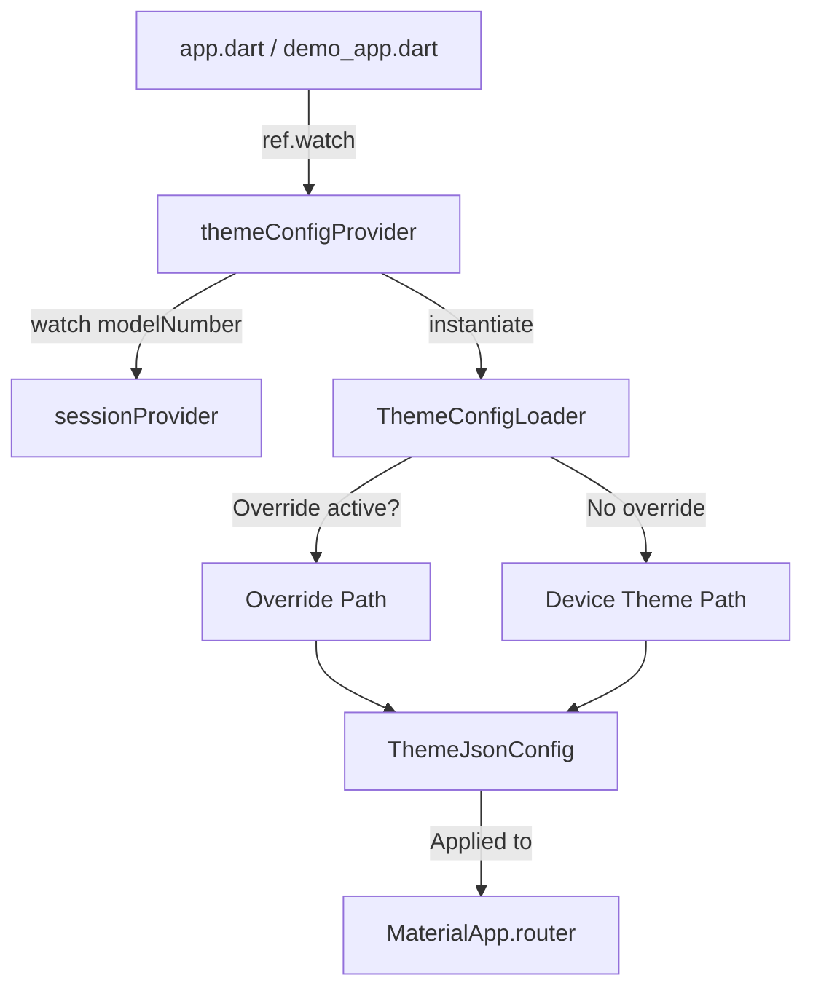
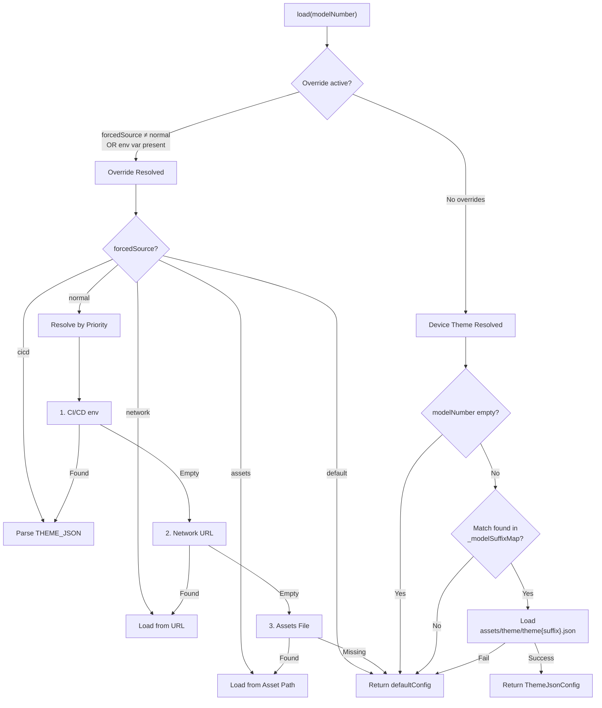

# Theme Loading Architecture

This document outlines the architecture and flow for theme configuration loading in the PrivacyGUI application following the refactoring.

## Architecture Overview



---

## Key Components

### 1. `themeConfigProvider` (Public API)

**Location**: [theme_config_provider.dart](file:///Users/peter.jhong/Documents/workspace/PrivacyGUI/lib/providers/theme_config_provider.dart)

- Riverpod `FutureProvider<ThemeJsonConfig>`
- The **single source of truth** for theme configuration.
- Watches `sessionProvider.modelNumber` to automatically reload the theme when the router model changes (e.g., login/logout).
- Internally instantiates `ThemeConfigLoader()` and calls `load()`.

```dart
final themeConfigProvider = FutureProvider<ThemeJsonConfig>((ref) async {
  final modelNumber = ref.watch(
    sessionProvider.select((state) => state.modelNumber),
  );
  return ThemeConfigLoader().load(modelNumber: modelNumber);
});
```

### 2. `ThemeConfigLoader` (Internal Implementation)

**Location**: [theme_config_loader.dart](file:///Users/peter.jhong/Documents/workspace/PrivacyGUI/lib/theme/theme_config_loader.dart)

- Instance class encapsulating all theme loading logic.
- Exposes a single public method: `load()`.

#### Constructors

| Constructor | Usage |
|---|---|
| `ThemeConfigLoader()` | Production use. Reads compile-time settings from `String.fromEnvironment`. |
| `ThemeConfigLoader.forTesting(...)` | Test use. Allows dependency injection of environment variables and ThemeSource. |

#### Environment Variables (Compile-time)

| Variable | Usage | Default |
|---|---|---|
| `THEME_SOURCE` | Force a specific theme source | `normal` |
| `THEME_JSON` | JSON string injected by CI/CD | `''` |
| `THEME_NETWORK_URL` | Remote theme URL (Reserved) | `''` |
| `THEME_ASSET_PATH` | Specific asset path | `assets/theme.json` |

---

## Loading Logic Flow



### ThemeSource Priority (Normal Mode)

When `THEME_SOURCE` is `normal` (default), overrides are checked in this order:

| Priority | Source | Description |
|:---:|---|---|
| 1 | CI/CD (`THEME_JSON`) | Direct JSON string injection |
| 2 | Network (`THEME_NETWORK_URL`) | Remote download (reserved) |
| 3 | Assets (`THEME_ASSET_PATH`) | Local asset file |
| 4 | Default | Built-in fallback (flat style) |

### Device Theme Mapping

| Model Prefix | Suffix | Asset Path |
|---|---|---|
| `TB-` | `_tb` | `assets/theme/theme_tb.json` |
| `CF-` | `_cf` | `assets/theme/theme_cf.json` |
| `DU-` | `_du` | `assets/theme/theme_du.json` |

---

## Consumers

### Main App (`app.dart`)

```dart
final themeConfigAsync = ref.watch(themeConfigProvider);

return themeConfigAsync.when(
  data: (themeConfig) => _buildMaterialApp(themeConfig: themeConfig),
  loading: () => _buildMaterialApp(themeConfig: ThemeJsonConfig.defaultConfig()),
  error: (e, s) => _buildMaterialApp(themeConfig: ThemeJsonConfig.defaultConfig()),
);
```

### Demo Mode

- **`main_demo.dart` / `main_usp_demo.dart`**: Do NOT call `ThemeConfigLoader` directly.
- **`DemoLinksysApp`**: Uses `getIt<ThemeJsonConfig>()` for base config (registered via GetIt as default).
- **`demoThemeConfigProvider`**: Provides dynamic theme studio adjustments.

---

## File Structure

```
lib/
├── theme/
│   ├── theme_config_loader.dart   ← Loading logic (internal)
│   └── theme_json_config.dart     ← Data model
├── providers/
│   └── theme_config_provider.dart ← Public API
├── di.dart                        ← GetIt registration (Default ThemeData)
├── app.dart                       ← Consumes themeConfigProvider
├── main.dart                      ← Entry point
├── main_demo.dart                 ← Demo Entry point
└── main_usp_demo.dart             ← USP Demo Entry point

test/
├── theme/
│   └── theme_config_loader_test.dart   ← Unit tests with injection
└── providers/
    └── theme_config_provider_test.dart ← Provider integration tests
```

---

## Testing Strategy

| Test Type | File | Approach |
|---|---|---|
| **Unit Test** | `theme_config_loader_test.dart` | Use `ThemeConfigLoader.forTesting()` to inject `ThemeSource` and mock env variables. |
| **Integration** | `theme_config_provider_test.dart` | Use `ProviderContainer` to read `themeConfigProvider` and verify behavior. |

```dart
// Example: Testing CI/CD override
test('cicd overrides device theme', () async {
  final loader = ThemeConfigLoader.forTesting(
    forcedSource: ThemeSource.cicd,
    themeJsonEnv: '{"light":{"style":"cicd"},"dark":{"style":"cicd"}}',
  );
  final config = await loader.load(modelNumber: 'TB-6W');
  expect(config.lightJson['style'], 'cicd'); // Assert override priority
});
```
