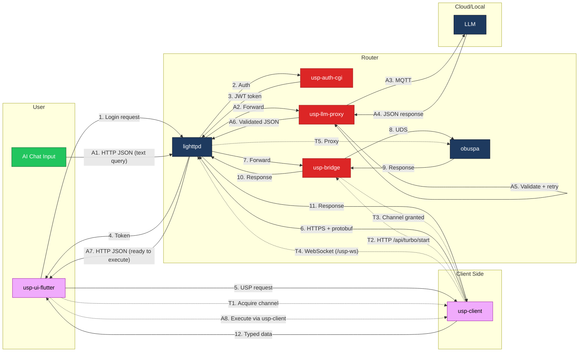
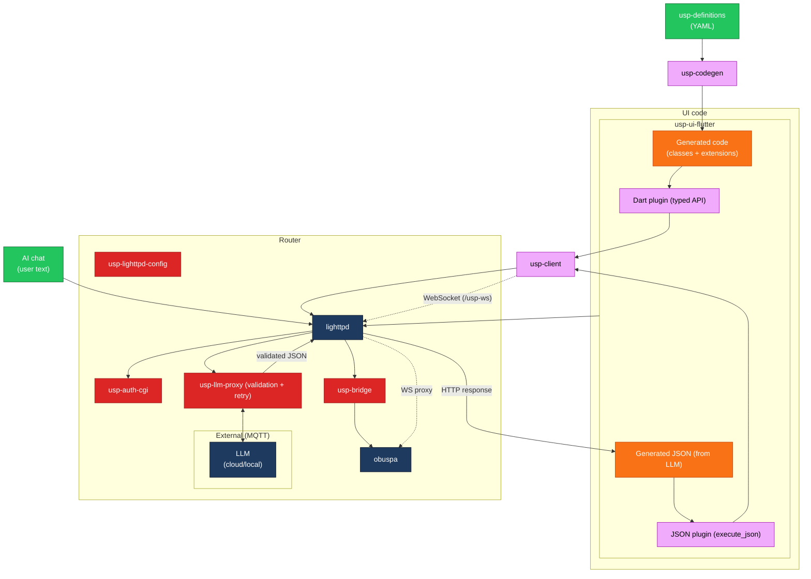
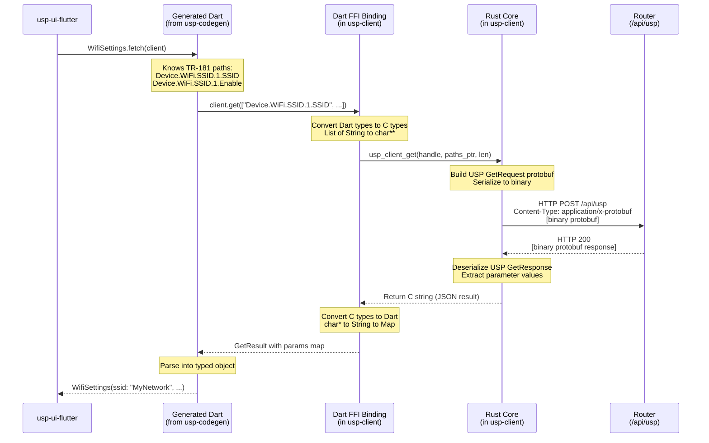
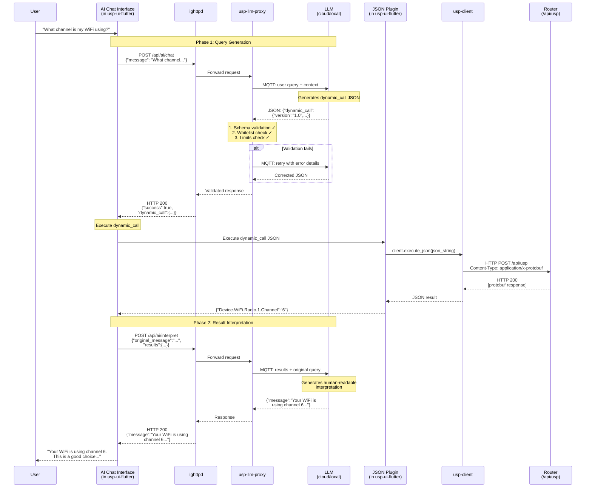
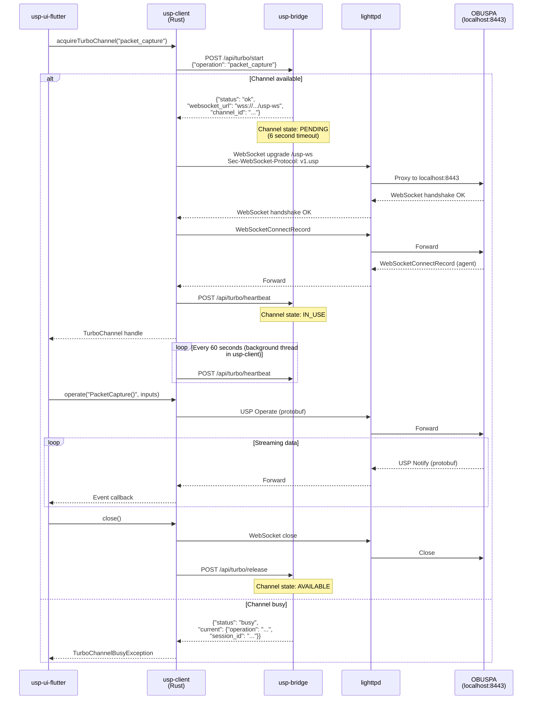

# USP-Driven UI Project — Package Architecture

## Package Overview

| # | Package | Language | Description |
|---|---------|----------|-------------|
| 1 | `usp-bridge` | C | Router daemon: HTTP/SSE to UDS bridge, session management, turbo channel coordination |
| 2 | `usp-auth-cgi` | C | Authentication CGI: password validation, JWT generation/refresh |
| 3 | `usp-lighttpd-config` | Config | lighttpd configuration: TLS, reverse proxy, WebSocket proxy |
| 4 | `usp-client` | Rust | Core client library with language bindings (Dart, TS) and JSON API |
| 5 | `usp-definitions` | YAML | API definitions (parameters, presets) + optional transforms (formulas, maps, converters) |
| 6 | `usp-codegen` | C | Code generator: translates YAML definitions to Dart/TS/Swift |
| 7 | `usp-llm-proxy` | C | AI chat proxy: MQTT to LLM, JSON validation, retry loop |
| 8 | `usp-ui-flutter` | Flutter | Main UI application |

---

## Architecture Diagrams

### User Experience View

This diagram shows the data flow from the user's perspective, serialized to highlight the different steps.



### Developer View

This diagram shows the component relationships and what needs to be developed.



**Legend:**
- 🟢 **Green**: Inputs (developer-provided definitions, user input)
- 🟠 **Orange**: Build-time or runtime generated 
- 🟣 **Pink**: Framework libraries (to be developed)
- 🔴 **Red**: Router packages (to be developed)
- 🔵 **Dark blue**: Existing/external components (lighttpd, obuspa, LLM)

---

## Workflow: Standard Call

A pre-defined UI operation (e.g., fetching WiFi settings).



### Interfaces — Standard Call

| From | To | Interface | Data Format |
|------|-----|-----------|-------------|
| UI | Generated Code | Dart method call | Typed Dart objects |
| Generated Code | Dart Binding | Dart method call | `List<String>`, `Map<String, String>` |
| Dart Binding | Rust Core | C ABI (FFI) | `char**`, `int` (C types) |
| Rust Core | Router | HTTP POST | Binary protobuf |

---

## Workflow: Dynamic Call (AI-generated)

An AI-generated query for parameters not in the standard UI. The AI processing is router-proxied using a **two-phase workflow**:

1. **Phase 1 (Query)**: User question → LLM generates `dynamic_call` JSON
2. **Phase 2 (Interpret)**: Execution results → LLM generates human-readable answer



### Interfaces — Dynamic Call

| From | To | Interface | Data Format |
|------|-----|-----------|-------------|
| AI Chat | lighttpd | HTTP POST `/api/ai/chat` | JSON (text query) |
| lighttpd | usp-llm-proxy | Internal | JSON |
| usp-llm-proxy | LLM | MQTT | JSON (query + context) |
| LLM | usp-llm-proxy | MQTT | JSON (dynamic_call) |
| usp-llm-proxy | lighttpd | Internal | JSON (validated) |
| lighttpd | AI Chat | HTTP response | JSON (dynamic_call) |
| AI Chat | JSON Plugin | Dart method call | `String` (JSON) |
| JSON Plugin | usp-client | C ABI (FFI) | `char*` (JSON string) |
| usp-client | Router | HTTP POST | Binary protobuf |
| AI Chat | lighttpd | HTTP POST `/api/ai/interpret` | JSON (results + original query) |
| LLM | usp-llm-proxy | MQTT | JSON (human-readable message) |
| lighttpd | AI Chat | HTTP response | JSON (message for user) |

---

## Workflow: Turbo Channel Operation

High-bandwidth streaming operations (e.g., packet capture) use a WebSocket connection managed by `usp-client` and proxied through lighttpd to OBUSPA, bypassing usp-bridge for data transfer. OBUSPA only listens on localhost; lighttpd handles external TLS termination.

**Key design decision:** The WebSocket is initiated by `usp-client` (Rust), not directly by the UI. This keeps all transport logic in one place and ensures consistent behavior across all language bindings (Dart, TypeScript, Swift, etc.).



### Interfaces — Turbo Channel

| From | To | Interface | Data Format |
|------|-----|-----------|-------------|
| UI | usp-client | FFI call `usp_client_turbo_acquire()` | C ABI |
| usp-client | usp-bridge | HTTP POST `/api/turbo/start` | JSON |
| usp-bridge | usp-client | HTTP response | JSON (WebSocket URL) |
| usp-client | lighttpd | WebSocket `/usp-ws` | Binary protobuf (USP Records) |
| lighttpd | OBUSPA | WebSocket proxy | Binary protobuf (USP Records) |
| usp-client | usp-bridge | HTTP POST `/api/turbo/heartbeat` | (empty) |
| usp-client | usp-bridge | HTTP POST `/api/turbo/release` | (empty) |
| usp-client | UI | Event callback | JSON (via registered callback) |

### Turbo vs Standard Transport

| Aspect | Standard (HTTP/SSE) | Turbo (WebSocket) |
|--------|---------------------|-------------------|
| Connection | Via usp-bridge | Via usp-client → lighttpd → OBUSPA |
| Use case | Normal operations | High-bandwidth streaming |
| Multi-client | Supported (usp-bridge manages) | Single client at a time |
| Examples | Get/Set params, subscriptions | Packet capture, log export |
| WebSocket owner | N/A | usp-client (Rust) |

---

## Component Details

### 1. `usp-bridge` (C)

Router-side daemon that bridges HTTP/SSE to OBUSPA via UDS.

**API Endpoints Exposed:**
| Endpoint | Method | Purpose |
|----------|--------|---------|
| `/api/usp` | POST | USP Request/Response |
| `/api/events` | GET | SSE notification stream |
| `/api/subscribe` | POST | Register subscription mapping |
| `/api/unsubscribe` | POST | Remove subscription mapping |
| `/api/turbo/status` | GET | Turbo channel availability |
| `/api/turbo/start` | POST | Acquire turbo channel |
| `/api/turbo/heartbeat` | POST | Turbo channel keepalive |
| `/api/turbo/release` | POST | Release turbo channel |
| `/api/health` | GET | Health check |

---

### 2. `usp-auth-cgi` (C)

Authentication CGI for JWT management.

**API Endpoints:**
| Endpoint | Method | Purpose |
|----------|--------|---------|
| `/api/auth/login` | POST | Authenticate, return JWT |
| `/api/auth/refresh` | POST | Refresh JWT |
| `/api/auth/logout` | POST | Invalidate session |

---

### 3. `usp-lighttpd-config` (Config)

lighttpd configuration files for routing.

**Routing Rules:**
| Path | Target |
|------|--------|
| `/api/auth/*` | Auth CGI |
| `/api/ai/*` | usp-llm-proxy (localhost:8081) |
| `/api/*` | usp-bridge (localhost:8080) |
| `/usp-ws` | OBUSPA WebSocket (localhost:8443) |
| `/*` | Static files (/www/usp-ui/) |

---

### 4. `usp-client` (Rust)

Core client library with multiple interfaces.

**C ABI (for FFI):**
```c
// Lifecycle
UspClient* usp_client_new(const char* base_url);
void usp_client_free(UspClient* client);

// Authentication
const char* usp_client_login(UspClient* client, const char* password);
const char* usp_client_logout(UspClient* client);

// Typed interface (for standard calls via Dart/TS bindings)
const char* usp_client_get(UspClient* client, const char** paths, int len);
const char* usp_client_set(UspClient* client, const char** keys, const char** vals, int len);
const char* usp_client_add(UspClient* client, const char* path, const char** keys, const char** vals, int len);
const char* usp_client_delete(UspClient* client, const char* path);
const char* usp_client_operate(UspClient* client, const char* command, const char** keys, const char** vals, int len);

// JSON interface (for dynamic calls)
const char* usp_client_execute_json(UspClient* client, const char* json_request);

// Turbo channel (WebSocket managed by usp-client)
const char* usp_client_turbo_status(UspClient* client);
void* usp_client_turbo_acquire(UspClient* client, const char* operation);
const char* usp_client_turbo_operate(void* channel, const char* command, const char* inputs_json);
void usp_client_turbo_set_callback(void* channel, void (*callback)(const char* event_json));
void usp_client_turbo_close(void* channel);

// Memory management
void usp_string_free(const char* s);
```

**Outputs:**
| Target | File | Use |
|--------|------|-----|
| Native lib | `libusp_client.so/.dylib/.dll` | FFI from Dart, Swift, etc. |
| WASM | `usp_client.wasm` + JS glue | Web browsers |
| CLI | `usp-cli` | Testing/debugging |

---

### 5. `usp-definitions` (YAML)

YAML files defining USP parameter groupings, presets, and optional transforms.

**Structure:**
```
usp-definitions/
├── definitions/
│   ├── core/
│   │   ├── hardware_info.yaml
│   │   ├── wifi_settings.yaml
│   │   ├── dns_settings.yaml        ← includes presets
│   │   └── ...
│   ├── extensions/
│   │   ├── parental_controls.yaml
│   │   └── ...
│   └── vendor/
│       └── linksys/
│           └── velop_nodes.yaml
└── transforms/                       ← optional
    ├── core/
    │   ├── download_diagnostics.yaml
    │   └── wan_status.yaml
    └── vendor/
```

**Key principle:** Transforms are optional. If a definition doesn't need derived values, no transform file is required.

**Definition content:**
- Parameters (TR-181 path mappings)
- Presets (configuration templates for user selection)
- Subscriptions (real-time notifications)

**Transform content (optional):**
- Formulas (multi-input calculations)
- Maps (status code → i18n key)
- Converters (single-value format conversion)

---

### 6. `usp-codegen` (C)

Code generator that translates YAML definitions to typed source code.

**Usage:**
```bash
# Definitions only (raw parameters + presets)
usp-codegen --definitions ./definitions --output ./lib/generated --lang dart

# With transforms (raw parameters + presets + derived values)
usp-codegen --definitions ./definitions --transforms ./transforms --output ./lib/generated --lang dart
```

**Supported outputs:**
- Dart (for Flutter)
- TypeScript (for web)
- Swift (for iOS)

---

### 7. `usp-llm-proxy` (C)

Router-side daemon that proxies AI chat requests to an LLM and validates responses.

**Responsibilities:**
1. Receive user text queries from UI via HTTP
2. Send queries to LLM via MQTT (cloud or local)
3. Validate LLM JSON responses against schema and whitelist
4. Retry with LLM if validation fails (up to 3 times)
5. Return validated JSON to UI

**HTTP Endpoints:**
| Endpoint | Method | Purpose |
|----------|--------|---------|
| `/api/ai/chat` | POST | Phase 1: Submit query, receive validated dynamic_call JSON |
| `/api/ai/interpret` | POST | Phase 2: Submit results, receive human-readable message |
| `/api/ai/config` | GET | Get current AI configuration |
| `/api/ai/config` | PUT | Update AI configuration (admin only) |

**Configuration** (`/etc/usp-llm-proxy/config.json`):
```json
{
  "llm_mode": "cloud",
  "cloud": {
    "mqtt_broker": "mqtts://ai.linksys.com:8883"
  },
  "local": {
    "mqtt_broker": "mqtt://localhost:1883"
  },
  "validation": {
    "max_retries": 3,
    "schema_path": "/etc/usp-llm-proxy/dynamic_call_request.schema.json",
    "whitelist_path": "/etc/usp-llm-proxy/path_whitelist.json"
  }
}
```

**Error codes (8000-8999):**
| Code | Description |
|------|-------------|
| 8000 | Schema validation failed |
| 8001 | Path not whitelisted |
| 8002 | Path explicitly denied |
| 8003 | Operation not permitted for path |
| 8004 | Limit exceeded |
| 8005 | Invalid path syntax |
| 8006 | Unsupported operation type |
| 8100 | LLM communication failed |
| 8101 | LLM retry limit exceeded |
| 8102 | LLM response malformed |

---

### 8. `usp-ui-flutter` (Flutter)

Main UI application.

**Dependencies:**
- `usp-client` (via Dart binding)
- Generated code from `usp-codegen`

**AI Chat Integration (two-phase workflow):**
1. Phase 1: Sends plain text query to `/api/ai/chat`, receives validated `dynamic_call` JSON
2. Executes `dynamic_call` via `usp-client`
3. Phase 2: Sends results to `/api/ai/interpret`, receives human-readable message for user
- UI has no LLM or validation logic

**Platforms:**
- Flutter Web (uses WASM build of usp-client)
- Flutter iOS (uses static lib via FFI)
- Flutter Android (uses shared lib via FFI)

---

## Summary: Three Paths to the Router

```
STANDARD CALLS              DYNAMIC CALLS (AI)           TURBO CHANNEL
(HTTP, type-safe)           (two-phase, router-proxied)  (WebSocket, streaming)

usp-definitions             User text query              UI requests channel
(YAML + transforms)               │                             │
        │                         │                             │
        ▼                         ▼                             │
   usp-codegen              ┌─────────────────────┐             │
        │                   │ Phase 1: Query      │             │
        ▼                   │ /api/ai/chat        │             │
 Generated Dart/TS          │      │              │             │
 (class + extension)        │      ▼              │             │
        │                   │ usp-llm-proxy       │             │
        │                   │ ├──► MQTT ──► LLM   │             │
        │                   │ │◄── JSON ◄──┘      │             │
        │                   │ Validate + Retry    │             │
        │                   │      │              │             │
        │                   │      ▼              │             │
        │                   │ dynamic_call JSON   │             │
        │                   └──────┬──────────────┘             │
        │                          │                            │
        ▼                          ▼                            ▼
┌─────────────────────────────────────────────────────────────────────────┐
│                            usp-client (Rust)                            │
│                                                                         │
│  Typed API     │      JSON API            │      Turbo API              │
│  get(paths[])  │  execute_json(string)    │  turbo_acquire(operation)   │
│       │        │          │               │          │                  │
│       └────────┴──────────┘               │          │                  │
│                │                          │          ▼                  │
│                ▼                          │   WebSocket /usp-ws         │
│        Protobuf encode                    │   (managed internally)      │
│                │                          │          │                  │
│                ▼                          │          │                  │
│        HTTP POST /api/usp                 │          │                  │
└────────────────┬──────────────────────────┴──────────┼──────────────────┘
                 │                                     │
                 │◄─────────────────────────┐          │
                 │          Results         │          │
                 ▼                          │          │
┌───────────────────────────────────────────┤          │
│ Phase 2: Interpret                        │          │
│ /api/ai/interpret                         │          │
│      │                                    │          │
│      ▼                                    │          │
│ usp-llm-proxy ──► LLM ──► Human message   │          │
└───────────────────────────────────────────┘          │
                 │                                     │
                 ▼                                     ▼
┌───────────────────────────────────────────────────────────────────────────┐
│                              Router                                       │
│                                                                           │
│    lighttpd ──► usp-bridge ──► OBUSPA ◄── lighttpd (WS proxy, turbo)     │
│        │            │             ▲                     ▲                 │
│        │            └─────────────┘                     │                 │
│        │                UDS                             │                 │
│        └────────────────────────────────────────────────┘                 │
│                        WebSocket proxy to localhost:8443                  │
└───────────────────────────────────────────────────────────────────────────┘
```

**Key differences**:
- **Standard**: HTTP/SSE via usp-bridge, supports multiple clients
- **Dynamic (AI)**: Two-phase router-proxied LLM (query → execute → interpret), validation and retry on router
- **Turbo**: WebSocket via **usp-client** → lighttpd proxy → OBUSPA, single client, high-bandwidth streaming
