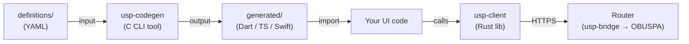
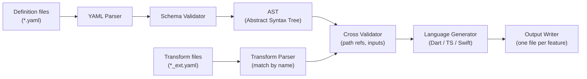
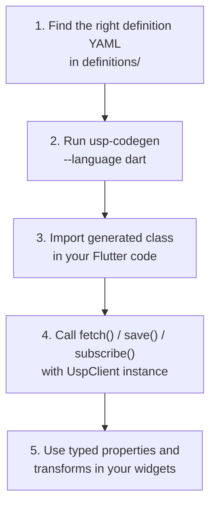
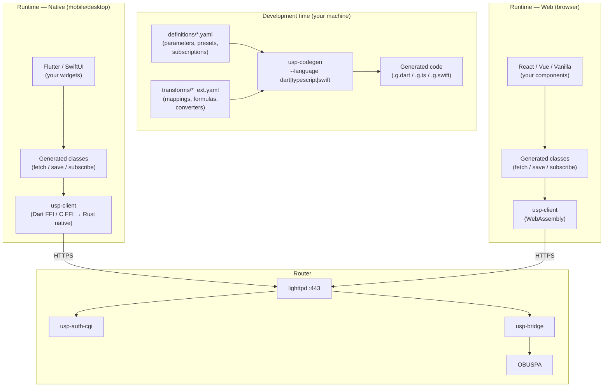

# USP Definitions & Code Generation — UI Developer Guide

> **Audience**: UI developers integrating router configuration into Flutter/Dart, Web, or Swift applications.
> **Last updated**: 2026-02-17

---

## 1. Overview

As a UI developer, you do **not** need to know the TR-181 data model, USP protocol details, or protobuf encoding. Instead, you work with **YAML definition files** that describe router features in a language-agnostic way, and a **code generator** that turns them into type-safe classes in your language.



| Component | What it is | Who owns it |
|---|---|---|
| **definitions/** | YAML files describing every router feature (parameters, transforms, presets, subscriptions) | Platform team |
| **usp-codegen** | CLI tool that reads definitions and emits typed source code | Platform team |
| **Generated code** | Dart/TypeScript/Swift classes with `fetch()`, `save()`, `applyPreset()`, `subscribe()` methods | Auto-generated (do not edit) |
| **usp-client** | Rust library that handles authentication, protobuf, and transport. Compiled to **native** (with Dart FFI for Flutter, C FFI for Swift) or **WebAssembly** (for browser/TypeScript apps) from a single codebase. | Platform team |
| **Your UI** | Flutter widgets, React components, or SwiftUI views that use the generated classes | **You** |

**The key idea**: you never construct TR-181 paths or USP messages yourself. The definitions encode that knowledge once; the code generator produces the glue; your UI calls typed methods.

---

## 2. The Definition Files

Definitions live in `definitions/` and are organized by domain:

```
definitions/
├── core/
│   ├── network/
│   │   ├── wifi-ssid.yaml        # WiFi network name, security, passphrase
│   │   ├── wifi-radio.yaml       # Radio bands, channels
│   │   ├── wifi-status.yaml      # Signal strength, connected devices
│   │   ├── dns-settings.yaml     # DNS servers with provider presets
│   │   ├── lan-config.yaml       # LAN settings
│   │   ├── wan-config.yaml       # WAN settings
│   │   └── dhcp-config.yaml      # DHCP server
│   ├── security/
│   │   ├── firewall.yaml         # Firewall rules
│   │   └── parental-controls.yaml
│   └── system/
│       ├── system-info.yaml      # Device info, uptime, memory
│       └── firmware-update.yaml  # Firmware upgrade
└── extensions/
    └── qos/
        └── traffic-shaping.yaml  # QoS, bandwidth priority
```

You do not need to write or modify these files — but reading them tells you exactly what data is available for a given feature.

> **Important**: definitions and transforms live in **separate files**. A definition file (`wifi-ssid.yaml`) describes the raw parameters, presets, and subscriptions. Its companion transform file (`wifi-ssid_ext.yaml`) describes computed properties derived from those parameters. The code generator matches them by name convention and merges them at generation time.

### 2.1 Definition file and transform file

A feature is described by **two files** that the code generator pairs automatically:

| File | Naming convention | Contains |
|---|---|---|
| Definition | `<feature>.yaml` | Metadata, parameters, presets, subscriptions, validation |
| Transform | `<feature>_ext.yaml` | Computed properties (mappings, formulas, converters) |

#### Definition file (e.g., `speed_test.yaml`)

```yaml
# Metadata
name: SpeedTest
version: 1.0.0
base_path: Device.IP.Diagnostics.DownloadDiagnostics
description: Download speed test results

# Parameters — the raw data fields from the router
parameters:
  - path: DiagnosticsState
    type: string
    access: read-write
    description: Test state (None, Requested, Complete, Error_*)

  - path: TestBytesReceived
    type: int
    access: read-only
    description: Total bytes received during test

  - path: TestDuration
    type: int
    access: read-only
    description: Test duration in milliseconds

# Transform file for computed properties
# Separate file: speed_test_ext.yaml
```

Note the comment at the bottom — the definition file itself does **not** contain transforms. It references the companion file by convention.

#### Transform file (e.g., `speed_test_ext.yaml`)

```yaml
name: SpeedTest          # Must match the definition's name
transforms:
  - name: throughputMbps
    description: Download throughput in megabits per second
    type: formula
    formula: "(TestBytesReceived * 8) / (TestDuration * 1000)"
    inputs:
      - TestBytesReceived
      - TestDuration
    output_type: double
    unit: Mbps

  - name: diagnosticsStateDisplay
    description: Human-readable diagnostic state
    type: mapping
    input: DiagnosticsState
    mappings:
      None: "Not started"
      Requested: "Test in progress..."
      Complete: "Test completed successfully"
      Error_Timeout: "Test timed out"
```

The `name` field in the transform file **must match** the definition's `name` exactly. The cross-validator will report an error if a transform references an input that does not exist in the definition's parameters.

#### A richer real-world example

Here is how the production `wifi-ssid.yaml` definition is structured (simplified):

```yaml
# wifi-ssid.yaml (definition)
name: wifi_ssid
base_path: Device.WiFi.SSID.{i}
multi_instance: true

parameters:
  - field_name: ssid
    path: SSID
    type: string
    writable: true

  - field_name: security_mode_enabled
    path: ../AccessPoint.{i}.Security.ModeEnabled
    type: string
    writable: true
    allowed_values: ["None", "WPA2-Personal", "WPA3-Personal", ...]

presets:
  security_preset:
    options:
      - id: wpa3
        values:
          security_mode_enabled: "WPA3-Personal"
          encryption_mode: "AES"

subscription:
  subscription_id: wifi_ssid_updates
  notification_type: ValueChange
  paths:
    - Device.WiFi.SSID.{i}.Enable
    - Device.WiFi.SSID.{i}.Status
```

```yaml
# wifi-ssid_ext.yaml (transforms)
name: wifi_ssid
transforms:
  - name: securityModeDisplay
    type: mapping
    input: security_mode_enabled
    output_type: string
    mappings:
      "None": "Open (No Security)"
      "WPA2-Personal": "WPA2-Personal"
      "WPA3-Personal": "WPA3-Personal"
    default: "Unknown"

  - name: isSecure
    type: mapping
    input: security_mode_enabled
    output_type: boolean
    mappings:
      "None": false
    default: true
```

### 2.2 Parameter types

| YAML type | Dart | TypeScript | Swift |
|---|---|---|---|
| `string` | `String` | `string` | `String` |
| `int` | `int` | `number` | `Int` |
| `long` | `int` | `number` | `Int` |
| `boolean` | `bool` | `boolean` | `Bool` |
| `double` | `double` | `number` | `Double` |
| `datetime` | `String` | `string` | `String` |

### 2.3 Transform types

Transforms produce **computed properties** that do not exist in the data model — they are derived client-side from raw parameters.

| Type | Purpose | Example |
|---|---|---|
| `mapping` | Map raw values to display labels | `"WPA3-Personal"` → `"WPA3-Personal (Most Secure)"` |
| `formula` | Arithmetic or logic on parameters | `signal_strength_percent = (dbm + 100) * 2` |
| `converter` | Named conversion function | `uptime_seconds` → `"3 days, 2 hours"` |

### 2.4 Presets

Presets are **ready-made configurations** that the UI can offer to the user (e.g., "Gaming", "Streaming", "Work from Home" for QoS). Each preset option specifies the exact parameter values to apply. Some presets include `user_inputs` for values the user must provide (e.g., a WiFi passphrase).

### 2.5 Subscriptions

A subscription section declares which TR-181 paths the UI should watch for changes. The generated code produces a `subscribe()` method that opens an SSE stream and delivers typed change events.

---

## 3. The Code Generator

### 3.1 What it does

`usp-codegen` is a C CLI tool that reads every `.yaml` file in a definitions directory, pairs definitions with their transform companions, and emits one source file per feature in your target language. The pipeline:



For each definition, the generator produces:

| Definition feature | Generated code |
|---|---|
| Read-only parameters | `fetch()` method → returns typed object |
| Writable parameters | `save()` method → accepts typed parameters |
| Multi-instance definitions | `add()` / `delete()` methods for creating/removing object instances |
| Transforms | Computed getters on the model class (e.g., `signalStrengthPercent`) |
| Presets | Enum + `applyPreset()` method |
| Subscriptions | `subscribe()` method → returns a stream of typed events |

### 3.2 Running the generator

```bash
# Build (once)
cd usp-codegen
make

# Generate Dart code from all definitions
./bin/usp-codegen \
  --definitions-dir ../definitions \
  --output-dir ../my-flutter-app/lib/generated \
  --language dart

# With path validation (checks TR-181 paths against the schema)
./bin/usp-codegen \
  --definitions-dir ../definitions \
  --output-dir ../my-flutter-app/lib/generated \
  --language dart \
  --validate-paths
```

| Flag | Required | Description |
|---|---|---|
| `--definitions-dir` | Yes | Path to the `definitions/` directory |
| `--output-dir` | Yes | Where to write generated files |
| `--language` | Yes | `dart`, `typescript`, or `swift` |
| `--validate-paths` | No | Validate TR-181 paths against the data model schema |
| `--json` | No | Machine-readable error output (for CI) |

### 3.3 Generated file structure

The generator outputs one file per definition, using the `.g.<ext>` naming convention to indicate generated code:

```
my-flutter-app/lib/generated/
├── wifi_ssid.g.dart          # from wifi-ssid.yaml + wifi-ssid_ext.yaml
├── wifi_radio.g.dart
├── wifi_status.g.dart        # includes signal_strength_percent from transform
├── dns_settings.g.dart       # includes DNS provider preset enum
├── system_info.g.dart        # includes uptime_human, memory_usage_percent
├── traffic_shaping.g.dart
└── ...
```

Each file is headed with a **DO NOT EDIT** warning — these files are overwritten on every generation run. The definition and its companion transform file are merged into a single output file.

---

## 4. Using Generated Code

### 4.1 Platform bindings — FFI vs WebAssembly

The `usp-client` Rust library is compiled differently depending on the target platform:

| Platform | Binding | How it works |
|---|---|---|
| **Flutter (mobile/desktop)** | Dart FFI → native `.so` / `.dylib` / `.dll` | Rust compiles to a native shared library; Dart calls it via FFI |
| **Swift (iOS/macOS)** | C FFI → native `.a` / `.framework` | Rust compiles to a static/dynamic library; Swift calls via C bridge |
| **Web (browser)** | **WebAssembly** (`.wasm`) | Rust compiles to WASM; TypeScript/JavaScript loads and calls it in the browser |

As a UI developer, you don't build `usp-client` yourself — the platform team provides the compiled artifact for your platform. The generated code and the API you call are the same regardless of binding.

### 4.2 Setup — Flutter/Dart (native)

Your Flutter project needs the `usp_client` package (provided as a Dart FFI binding to the Rust library):

```yaml
# pubspec.yaml
dependencies:
  usp_client: ^0.1.0
```

Then import both the client and the generated code:

```dart
import 'package:usp_client/usp_client.dart';
import 'package:my_app/generated/wifi_ssid.dart';
import 'package:my_app/generated/system_info.dart';
```

### 4.3 Reading data (fetch)

```dart
// Create and authenticate the client (usually done once at app startup)
final client = UspClient('https://192.168.1.1');
await client.login('admin-password');

// Fetch system information — all TR-181 path construction is hidden
final info = await SystemInfo.fetch(client);
print(info.manufacturer);       // e.g., "Linksys"
print(info.softwareVersion);    // e.g., "1.0.4"
print(info.uptimeSeconds);      // e.g., 259200

// Computed properties from transforms (no extra call needed)
print(info.uptimeHuman);        // e.g., "3 days, 0 hours, 0 minutes"
print(info.memoryUsagePercent); // e.g., 72
print(info.cpuUsageLabel);      // e.g., "Medium"
print(info.deviceFullName);     // e.g., "Linksys MR7500"
```

### 4.4 Writing data (save)

Only parameters marked `writable: true` in the definition are settable:

```dart
final wifi = await WifiSsid.fetch(client);
wifi.ssid = 'MyNewNetwork';
wifi.enabled = true;
await wifi.save(client);
```

### 4.5 Applying presets

Presets let you offer the user one-click configurations:

```dart
final dns = await DnsSettings.fetch(client);

// Apply a built-in preset
await dns.applyPreset(DnsPreset.cloudflare, client);
// This sets: PreferredServer=1.1.1.1, AlternateServer=1.0.0.1

// Or let the user pick from the enum
final selectedPreset = DnsPreset.google; // from a dropdown
await dns.applyPreset(selectedPreset, client);
```

For QoS, the presets are more elaborate:

```dart
final qos = await TrafficShaping.fetch(client);

// One-click "Gaming mode"
await qos.applyPreset(QosModePreset.gaming, client);
// Sets: enabled=true, mode=ApplicationBased, gaming_priority=true,
//       high_priority_guarantee=60%, sqm=cake
```

### 4.6 Subscribing to changes

Subscriptions deliver real-time updates via SSE, wrapped in typed events:

```dart
final wifiStatus = WifiStatus(client);

// Returns a Dart Stream — use in StreamBuilder or listen directly
wifiStatus.subscribe().listen((update) {
  print('Signal: ${update.signalStrengthPercent}%');
  print('Quality: ${update.signalQualityLabel}');
  print('Devices: ${update.associatedDevices}');
});
```

### 4.7 Using transforms in the UI

Transforms are available as computed getters on the fetched model. You never need to compute them yourself:

```dart
final wifi = await WifiSsid.fetch(client);

// Raw parameter
print(wifi.securityModeEnabled);   // "WPA3-Personal"

// Transforms derived from it
print(wifi.securityModeDisplay);   // "WPA3-Personal" (user-friendly label)
print(wifi.isSecure);              // true
print(wifi.requiresPassphrase);    // true
print(wifi.securityStrength);      // 5 (1=weak, 5=strong)
```

This lets you build UI indicators (security badges, signal bars, status pills) directly from the transform values without any mapping logic in your widget code.

### 4.8 Using generated code in TypeScript (WebAssembly)

For web applications, the Rust `usp-client` library is compiled to WebAssembly. The generated TypeScript code calls into the WASM module the same way Dart calls the native library — the API is identical.

**Setup:**

```bash
# Generate TypeScript code from definitions
./bin/usp-codegen \
  --definitions-dir ../definitions \
  --output-dir ../my-web-app/src/generated \
  --language typescript
```

```typescript
// Install the WASM-based client package
// npm install @anthropic/usp-client-wasm

import { UspClient } from '@anthropic/usp-client-wasm';
import { SystemInfo } from './generated/system_info';
import { WifiSsid } from './generated/wifi_ssid';

// Initialize the WASM module (must be done once before any calls)
await UspClient.init();

// From here on, the API is the same as Dart
const client = new UspClient('https://192.168.1.1');
await client.login('admin-password');

const info = await SystemInfo.fetch(client);
console.log(info.manufacturer);        // "Linksys"
console.log(info.uptimeHuman);         // "3 days, 0 hours, 0 minutes"

const wifi = await WifiSsid.fetch(client);
wifi.ssid = 'MyNewNetwork';
await wifi.save(client);
```

The WASM bundle is kept under 500 KB (compressed) to ensure fast browser load times. All protocol encoding, protobuf serialization, and authentication are handled inside the WASM module — your TypeScript code only interacts with the typed generated classes.

---

## 5. End-to-End Workflow

### 5.1 For a new UI screen



You only need steps 2–5. Step 1 is a one-time lookup.

### 5.2 When a definition changes

If the platform team modifies a definition (adds a parameter, changes a transform), you:

1. Pull the updated YAML files.
2. Re-run `usp-codegen` (same command as before).
3. Fix any compile errors in your UI code (the compiler tells you exactly what changed).

No manual code adaptation is needed beyond what the type system catches.

### 5.3 Adding a new feature

If you need a router feature that has no definition yet, ask the platform team to create one. Once the YAML exists, run codegen and the typed API is ready.

---

## 6. Architecture Diagram — How it All Fits Together



- **At development time**: YAML definitions → `usp-codegen` → generated source files committed alongside your UI code.
- **At runtime (native)**: Your widgets call generated classes → `usp-client` (via FFI to Rust native library) handles auth, protobuf, and HTTP → router serves data.
- **At runtime (web)**: Your components call generated classes → `usp-client` (compiled to WebAssembly, loaded in the browser) handles auth, protobuf, and HTTP → router serves data.

---

## 7. Definition Format Quick Reference

### Required fields

```yaml
name: feature_name          # snake_case, unique across all definitions
version: 1.0.0              # Semantic version
schema_version: 1.0.0       # Definition schema version
description: "..."          # Human-readable description
parameters: [...]           # At least one parameter
```

### Optional fields (definition file)

```yaml
base_path: Device.X.Y       # TR-181 root path
multi_instance: true         # Is this a list? (e.g., multiple SSIDs)
instance_path: Device.X.{i}  # Path with instance placeholder
instance_key: FieldName      # Which field identifies an instance
presets: { ... }             # Canned configurations
subscription: { ... }        # Real-time change notifications
validation: { ... }          # Cross-field validation rules
```

### Transform file format (`<name>_ext.yaml`)

```yaml
name: feature_name           # Must match the definition's name
transforms:
  - name: myComputedProp     # camelCase, becomes a getter in generated code
    type: formula            # formula | mapping | converter
    formula: "a + b"         # Expression referencing parameter field_names
    inputs: [a, b]           # Parameters consumed (must exist in definition)
    output_type: double      # Output type
    unit: "Mbps"             # Optional display unit
```

### Parameter fields

```yaml
- field_name: my_field       # Name used in generated code (becomes camelCase)
  path: TR181ParamName       # Relative TR-181 path
  type: string               # string | int | long | boolean | double | datetime
  writable: true             # true → save() includes it; false → fetch() only
  required: true             # Is this field mandatory?
  description: "..."         # Shown as doc comment in generated code
  sensitive: true            # Marks write-only fields (e.g., passwords)
  default_value: "..."       # Default value
  allowed_values: [...]      # Enum constraint
  minimum: 0                 # Numeric range
  maximum: 100
  minimum_length: 1          # String length range
  maximum_length: 32
```

---

## 8. Troubleshooting

| Problem | Cause | Solution |
|---|---|---|
| `"Missing required field 'name'"` | Malformed YAML | Check required fields in the definition |
| `"Transform references non-existent field"` | Typo in transform `input` | Match `input` exactly to a `field_name` (case-sensitive) |
| Generated code doesn't compile | Definition changed | Re-run codegen, fix type mismatches in your code |
| `fetch()` returns null for a field | Field is `sensitive: true` | Sensitive fields (e.g., passwords) are write-only |
| Subscription stream stops | Session token expired | Call `client.refreshToken()` or re-authenticate |

### Getting machine-readable errors (for CI)

```bash
./bin/usp-codegen --definitions-dir ./definitions --output-dir ./out --language dart --json 2> errors.json
```

---

## 9. Summary for Day-1 Developers

1. **Don't write TR-181 paths** — the definitions do that for you.
2. **Run `usp-codegen --language <dart|typescript|swift>`** after pulling definition updates.
3. **Import the generated class**, create a `UspClient`, call `fetch()` / `save()` / `applyPreset()`.
4. **Use transforms** for display values (labels, percentages, booleans) — they're just getters on the model.
5. **Use presets** for one-click user configurations (DNS providers, QoS modes, WiFi security).
6. **Subscribe** for real-time updates — returns a typed stream you can plug into your UI framework.
7. **Never edit generated files** — they are overwritten on every codegen run.
8. **Same API everywhere** — whether your app runs via Dart FFI (Flutter), C FFI (Swift), or WebAssembly (browser), the generated classes and methods are identical.
