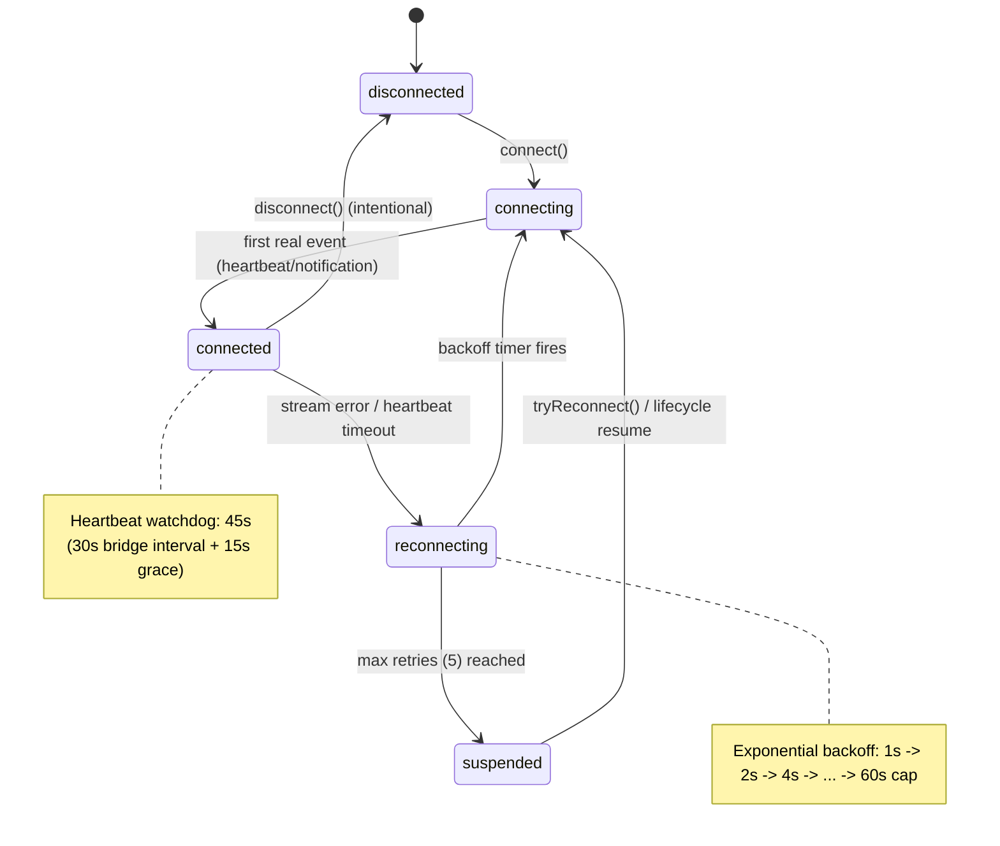
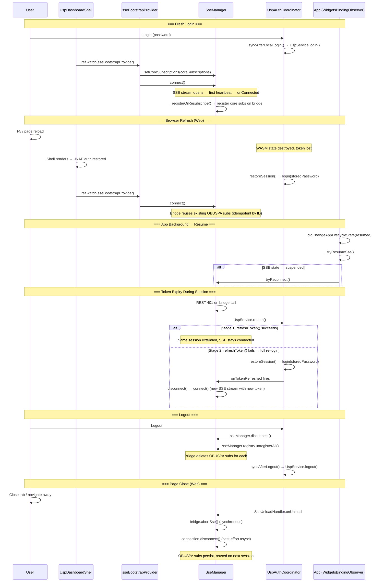
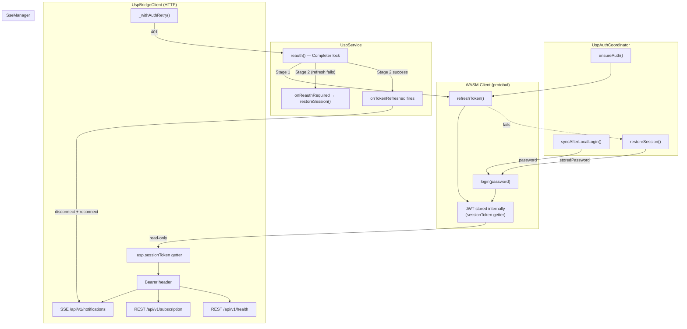
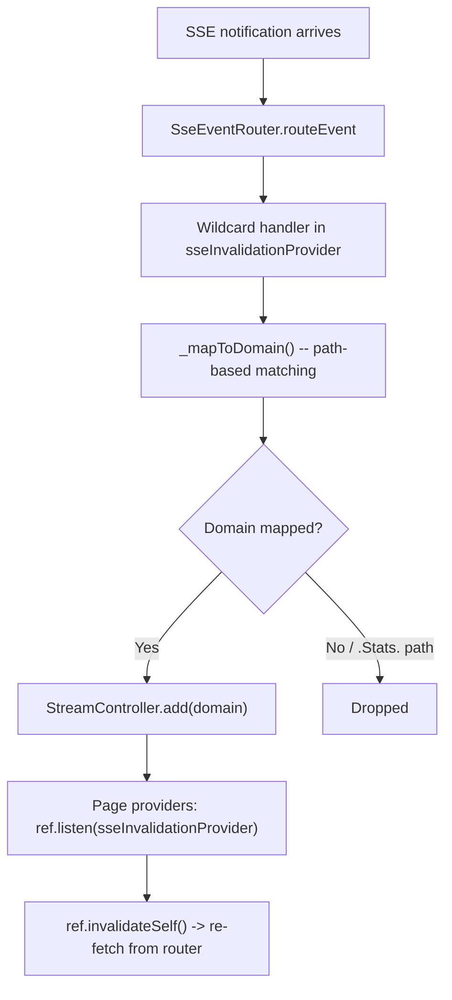
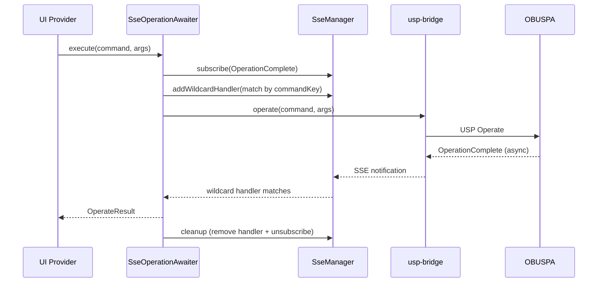
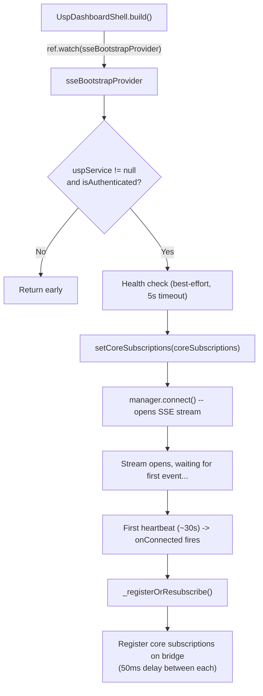
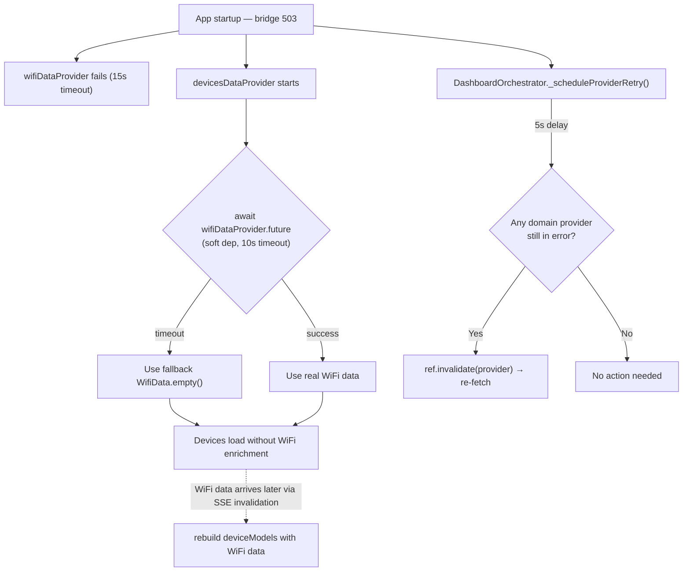
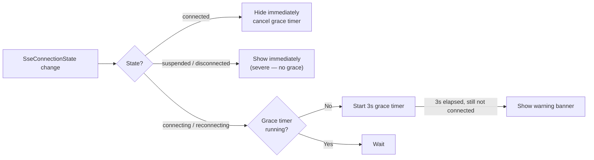
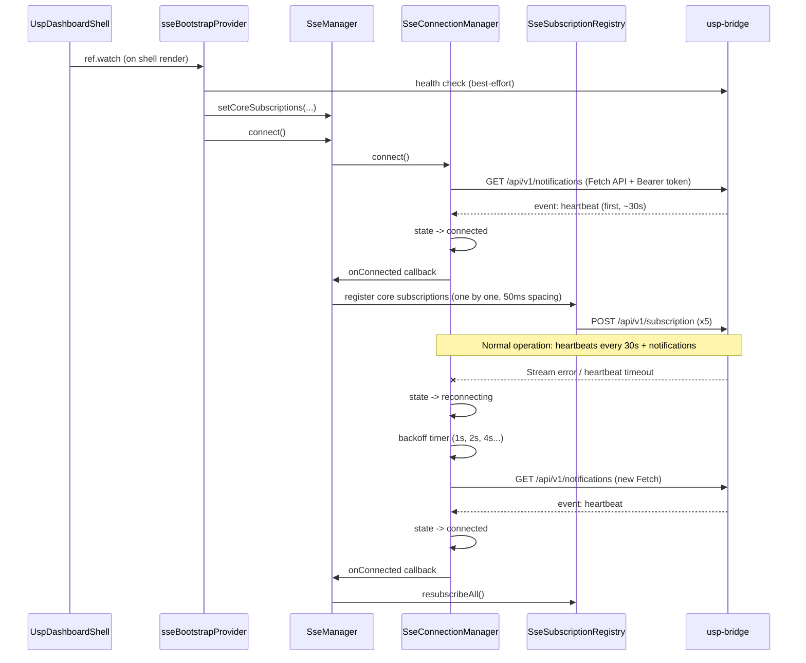

# SSE (Server-Sent Events) Implementation Guide

**Date:** 2026-03-13 (updated 2026-03-23) | **Branch:** `dev-2.2.1`
**Firmware:** 1.0.16.26013014 | **usp-bridge:** v0.1.1

---

## 1. Architecture Overview

SSE provides real-time push notifications from the router to the Flutter web app. The pipeline involves three independent systems:

```
Flutter App (WASM)
    |
    +-- UspBridgeClient ----------> usp-bridge HTTP API
    |     |                              |
    |     |    POST /api/v1/subscription
    |     |      -> Bridge auto-creates OBUSPA Subscription.{i}
    |     |      -> Bridge registers SSE session mapping
    |     |                              |
    |     |    GET /api/v1/notifications (SSE stream)
    |     |                              |
    |     |         OBUSPA monitors TR-181 data model
    |     |                |
    |     |         Change detected -> USP Notify (protobuf)
    |     |                |
    |     |         UDS socket -> bridge -> SSE event
    |     |
    +-- SseManager (facade)
          +-- SseConnectionManager   -- SSE stream lifecycle
          +-- SseSubscriptionRegistry -- bridge-only subscription tracking
          +-- SseEventRouter          -- event demux by subscription_id + wildcard
```

### Connection State Machine



### Token & Session Architecture

> Full token lifecycle, reauth flow, and SSE coordination details in [§1.6 Token Management](#16-token-management).

SSE uses a **dual-channel** model where the WASM client and the bridge client share the same JWT but maintain separate HTTP connections. SSE validates the JWT only at Fetch connection time. Once the TCP connection is established, the stream stays open regardless of token state.

- **Stage 1 (refreshToken)**: Extends the same session — SSE stays connected, no action needed.
- **Stage 2 (full re-login)**: New session — `onTokenRefreshed` fires → SSE `disconnect()` + `connect()` with new token.

### Bridge-Managed Subscription Architecture

The bridge `POST /api/v1/subscription` handles the full OBUSPA lifecycle automatically:

| Action | Bridge Behavior | OBUSPA Effect |
|--------|----------------|---------------|
| **register** | Creates OBUSPA `Subscription.{i}` + SSE session mapping | Router generates Notify for matching events |
| **unregister** | Deletes OBUSPA `Subscription.{i}` + SSE session mapping | Router stops generating Notify |
| **re-register** (same ID) | Idempotent -- reuses existing OBUSPA subscription | No duplicate subscriptions |

Key insight: OBUSPA subscriptions persist on the router even after the browser disconnects. Bridge session mappings are ephemeral.

On SSE reconnect, `SseSubscriptionRegistry.resubscribeAll()` re-registers all subscriptions on the bridge. Since the bridge is idempotent by `subscription_id`, this safely handles both scenarios (OBUSPA subs survived or were cleaned up).

**Session expiry caveat:** Bridge session timeout does NOT clean up OBUSPA subscriptions — but subscription IDs from codegen are deterministic, so re-registration reuses existing OBUSPA subs via bridge idempotency. `UspService.purgeAllSubscriptions()` available in Test Console for edge cases (e.g., ID rename across app versions).

---

## 1.5 SSE Lifecycle Management

SSE lifecycle is tied to the app's authentication state and page lifecycle. The following diagram shows when SSE connects, disconnects, and reconnects across all app states:



### SSE Lifecycle Summary

| App Event | SSE Action | Who Triggers | Key Code |
|-----------|-----------|--------------|----------|
| **Login** | `connect()` | `sseBootstrapProvider` (watched by `UspDashboardShell`) | `sse_providers.dart:76` |
| **Browser refresh** | `restoreSession()` → `connect()` | `UspAuthCoordinator` + `sseBootstrapProvider` | `usp_auth_coordinator.dart:57` |
| **Post-reload SSE setup** | `setCoreSubscriptions()` → `connect()` → `registerDeferredSubscriptions(force: true)` | `DashboardOrchestrator` (when `authWasRestored`) | `dashboard_orchestrator.dart:107-116` |
| **App resume** | `tryReconnect()` (if `suspended`) | `App.didChangeAppLifecycleState` | `app.dart:235-246` |
| **Stream error / heartbeat timeout** | Auto-reconnect (backoff) | `SseConnectionManager` internally | `sse_connection_manager.dart:255` |
| **Token refresh (Stage 1)** | SSE stays connected (same session) | — | `usp_service.dart:134` |
| **Full re-login (Stage 2)** | `disconnect()` → `connect()` | `onTokenRefreshed` callback | `sse_manager.dart:77-81` |
| **Logout** | `disconnect()` → `unregisterAll()` | `AuthProvider.logout()` | `auth_provider.dart:112-115` |
| **Page close** | `abortSse()` sync + `disconnect()` async | `SseUnloadHandler` (`beforeunload`/`pagehide`) | `sse_manager.dart:86-91` |
| **Provider dispose** | `dispose()` (full cleanup) | Riverpod `ref.onDispose` | `sse_providers.dart:31` |

---

## 1.6 Token Management

SSE uses a **dual-channel** model where the WASM client and the bridge client share the same JWT but maintain separate HTTP connections. Token lifecycle is managed by `UspService` and `UspAuthCoordinator`.

### Token Flow



### Token Lifecycle States

| State | Trigger | REST Impact | SSE Impact |
|-------|---------|-------------|------------|
| **Valid** | After login / refreshToken | All requests succeed | SSE stream active, notifications flowing |
| **Expired (soft)** | Token TTL elapsed | 401 → `reauth()` Stage 1 (`refreshToken`) | SSE TCP connection stays open (already established) |
| **Expired (hard)** | `refreshToken` also fails | 401 → `reauth()` Stage 2 (`restoreSession`) | After re-login: `onTokenRefreshed` → SSE disconnect + reconnect |
| **Lost (page reload)** | Browser refresh | WASM state destroyed | `restoreSession()` re-login → new SSE connection via bootstrap |
| **Invalidated (logout)** | User logout | Session terminated | SSE disconnected, subscriptions unregistered |

### Reauth Flow Detail

`UspService.reauth()` uses a `Completer` lock to prevent concurrent reauth attempts:

```
REST call hits 401
  → _withAuthRetry() calls reauth()
  → Completer lock: if reauth already in progress, await it
  → Stage 1: refreshToken()
    → Success: same session extended, Completer completes
    → SSE impact: none (same session, SSE stays connected)
  → Stage 1 fails → Stage 2: onReauthRequired → restoreSession()
    → UspAuthCoordinator reads stored password from FlutterSecureStorage
    → UspService.login(storedPassword) → new JWT
    → didFullRelogin = true
    → Completer completes
    → finally: onTokenRefreshed?.call()
      → SseManager: disconnect() → connect() with new token
```

**Key design points:**
- `onTokenRefreshed` only fires after Stage 2 (full re-login), not Stage 1 (token refresh). Stage 1 extends the same session, so SSE's existing TCP connection remains valid.
- `UspBridgeClient._withAuthRetry()` handles 401 for REST calls. SSE Fetch handles its own 401 in `_startSseStream()` with a single retry.
- Both `UspService.reauth()` and `UspBridgeClient._startSseStream()` use the same `UspService.reauth()` path — no duplicate auth logic.

---

## 2. Service Layer Files

### Core Services (`lib/core/usp/services/`)

| File | Class | Responsibility |
|------|-------|----------------|
| `sse_connection_manager.dart` | `SseConnectionManager` | SSE stream lifecycle, exponential backoff (1s -> 60s), heartbeat watchdog (45s = 30s heartbeat + 15s grace) |
| `sse_subscription_registry.dart` | `SseSubscriptionRegistry` | Bridge-only subscription tracking, `register()` / `unregister()` / `resubscribeAll()` |
| `sse_event_router.dart` | `SseEventRouter` | JSON parse -> route by `subscription_id`, wildcard handlers for cross-cutting concerns |
| `sse_manager.dart` | `SseManager` | Facade composing the above three. Primary API for Riverpod providers. Also wires `onSseSubscribe` delegate into `UspService` for codegen `subscribe()` |
| `sse_operation_awaiter.dart` | `SseOperationAwaiter` | Async Operate commands (Ping/Traceroute) via OperationComplete, polling fallback |
| `sse_unload_handler.dart` | `SseUnloadHandler` | Conditional export: Web version listens `beforeunload`/`pagehide` to `abortSse()` synchronously; non-Web is a no-op stub |
| `usp_bridge_client.dart` | `UspBridgeClient` | Conditional export: Web version uses Fetch API for SSE + `http` package for REST; non-Web throws `UnsupportedError` |

### Providers (`lib/core/usp/providers/`)

| File | Provider | Purpose |
|------|----------|---------|
| `sse_providers.dart` | `uspBridgeClientProvider` | `UspBridgeClient` singleton, depends on `uspServiceProvider` |
| | `sseManagerProvider` | Singleton `SseManager` for authenticated session (NOT autoDispose). `ref.onDispose` calls `manager.dispose()` |
| | `sseConnectionStateProvider` | Reactive `SseConnectionState` stream for UI (converts `ValueNotifier` to `StreamProvider`) |
| | `sseOperationAwaiterProvider` | `SseOperationAwaiter` for async Operate commands |
| | `sseBootstrapProvider` | App startup: health check -> set core subscriptions -> connect SSE |
| `sse_invalidation_provider.dart` | `sseInvalidationProvider` | Maps notifications to `InvalidationDomain` for selective re-fetch |

### Models (`lib/core/usp/models/`)

| File | Class | Purpose |
|------|-------|---------|
| `invalidation_domain.dart` | `InvalidationDomain` | Enum of data domains that can be invalidated by SSE |
| `operate_result.dart` | `OperateResult` | Parsed OperationComplete result (commandName, commandKey, status, outputArgs) |
| `sse_notification.dart` | `SseNotification` | Parsed notification payload (subscriptionId, type, payload map) |
| `sse_subscription_record.dart` | `SseSubscriptionRecord` | Tracked subscription metadata (id, notifType, referenceList, createdAt) |

### Generated (`lib/generated/`)

| File | Content | Source |
|------|---------|--------|
| `subscriptions.g.dart` | `coreSubscriptions` -- Record tuple list of all bootstrap subscriptions | Auto-generated from YAML `subscribe:` blocks by `usp-codegen` v0.10.5+ |

---

## 3. Two SSE Data Delivery Patterns

### Pattern A: Invalidation Signal (ValueChange / ObjectCreation / ObjectDeletion)

Used for data model changes where the UI needs to re-fetch fresh data.



**Invalidation Domains:**

| Domain | TR-181 Path | Notification Types |
|--------|-------------|-------------------|
| `connectedDevices` | `Device.Hosts.Host.` | ObjectCreation, ObjectDeletion, ValueChange |
| `wifiSsids` | `Device.WiFi.SSID.` | ValueChange |
| `wifiRadios` | `Device.WiFi.Radio.` | ValueChange |
| `wifiClients` | `Device.WiFi.AccessPoint.*.AssociatedDevice.` | ObjectCreation |
| `wifiAccessPoints` | `Device.WiFi.AccessPoint.` | ValueChange |
| `portForwarding` | `Device.NAT.PortMapping.` | ValueChange, ObjectCreation, ObjectDeletion |
| `dmz` | `Device.Firewall.DMZ.` | ValueChange, ObjectCreation, ObjectDeletion |
| `firewallRules` | `Device.Firewall.Chain.` | ValueChange |
| `dhcpReservations` | `Device.DHCPv4.Server.Pool.*.StaticAddress.` | ValueChange, ObjectCreation, ObjectDeletion |
| `dhcpClients` | `Device.DHCPv4.Server.Pool.*.Client.` | ObjectCreation |
| `staticRouting` | `Device.Routing.Router.*.IPv4Forwarding.` | ValueChange, ObjectCreation, ObjectDeletion |

### Pattern B: Direct Data Delivery (OperationComplete)

Used for async Operate commands where the SSE notification IS the result.



This pattern exists because one-shot Operate commands (IPPing, TraceRoute) produce transient results that are not persisted to the TR-181 data model — this is expected behavior, not a bug. The SSE OperationComplete notification is the correct and only delivery path for these results.

---

## 4. Critical Design Decisions

### 4.1 CPE Subscription ID Mismatch

**Problem:** When we register a subscription with `subscriptionId: "connected-devices-objectcreation"`, the CPE delivers the event with its own internal ID (`cpe-3`, `cpe-15`, etc.). Subscription-specific handlers registered under our client ID never fire.

**Solution:** Use wildcard handlers for all cross-cutting matching:

- **Invalidation signals**: Wildcard handler in `sseInvalidationProvider` matches by `param_path` / `obj_path` from the notification payload
- **OperationComplete**: Wildcard handler in `SseOperationAwaiter` matches by `command_key` (primary) or `command_name` (fallback)

The per-subscription handlers in `SseEventRouter._handlers` are technically unused for routing -- but the OBUSPA subscription itself must still be created to tell the router to generate notifications.

### 4.2 WiFi Stats Noise Elimination

**Problem:** `Device.WiFi.SSID.*.Stats.*` (BytesSent, PacketsReceived, etc.) and `Device.WiFi.Radio.*.Stats.*` (LastChange, etc.) fire ValueChange notifications every second, flooding the SSE stream with 50+ events/s.

**Root fix:** WiFi ValueChange subscriptions removed from bootstrap entirely. `Device.Hosts.Host.` registers ObjectCreation, ObjectDeletion, and ValueChange (safe -- no `.Stats.*` counters). Other subscriptions target specific subtrees (DHCP Clients, WiFi AccessPoint).

**Defense-in-depth:** `_mapToDomain()` in `sse_invalidation_provider.dart` filters out any path containing `.Stats.` as a safety net.

### 4.3 Stale Subscription Cleanup

**Problem:** Browser refresh doesn't trigger `dispose()` on Riverpod providers. OBUSPA subscriptions from the previous session accumulate on the router, causing duplicate notifications.

**Current status:** `UspService.purgeAllSubscriptions()` exists and performs GET-based enumeration + DELETE of all `Device.LocalAgent.Subscription.{i}` instances. However, it is **NOT called automatically during bootstrap**. It is only available via the Test Console for manual cleanup.

**Mitigation:** Bridge subscription API is idempotent by `subscription_id`, so re-registering the same subscription doesn't create duplicates. The main risk is orphaned OBUSPA subscriptions from sessions that used different IDs.

### 4.4 Polling Fallback

When SSE is disconnected, `SseOperationAwaiter` falls back to polling:

```
1. Fire operate command
2. Poll GET <path>. every 1s
3. Check DiagnosticsState == 'Complete' or 'Error'
4. Parse response into OperateResult
```

This fallback relies on GET returning results — which only works for diagnostics that persist state. One-shot Operate commands (IPPing, TraceRoute) do not write results back by design, so polling returns empty for these commands.

### 4.5 Deferred Core Subscription Registration

Core subscriptions are NOT registered immediately during bootstrap. Instead:

1. `sseBootstrapProvider` calls `manager.setCoreSubscriptions(coreSubscriptions)` -- stores the list in memory
2. `manager.connect()` opens the SSE stream
3. First real event (heartbeat, ~30s after stream opens) triggers `onConnected` callback
4. `onConnected` calls `_registerOrResubscribe()` which registers core subscriptions on the bridge

This deferral avoids HTTP/1.1 connection pool contention during the initial dashboard data fetch burst. By the time the first heartbeat arrives (~30s), all dashboard HTTP requests have completed.

On **reconnect**, the same `onConnected` callback calls `registry.resubscribeAll()` to re-register existing subscriptions on the bridge.

### 4.6 Browser Page Unload Handling

`SseUnloadHandler` (conditional export) registers `beforeunload` + `pagehide` listeners on Web:

- `beforeunload`: reliable on desktop browsers
- `pagehide`: reliable on mobile browsers (Safari/iOS)

On unload, `bridge.abortSse()` synchronously cancels the Fetch API's `AbortController`, then `connection.disconnect()` is called as best-effort async cleanup. Synchronous abort is critical because `beforeunload` does NOT wait for async operations.

---

## 5. SSE Event Format

### Heartbeat

```
event: heartbeat
data: {"timestamp":1773027837}
```

Sent every 30s by the bridge. Watchdog timeout: 45s.

### Notification -- ValueChange

```json
{
  "subscription_id": "cpe-15",
  "type": "ValueChange",
  "value_change": {
    "param_path": "Device.Hosts.Host.3.Active",
    "param_value": "true"
  }
}
```

### Notification -- ObjectCreation

```json
{
  "subscription_id": "cpe-3",
  "type": "ObjectCreation",
  "obj_creation": {
    "obj_path": "Device.Hosts.Host.5.",
    "unique_keys": {}
  }
}
```

### Notification -- ObjectDeletion

```json
{
  "subscription_id": "cpe-3",
  "type": "ObjectDeletion",
  "obj_deletion": {
    "obj_path": "Device.Hosts.Host.5."
  }
}
```

### Notification -- OperationComplete

```json
{
  "subscription_id": "cpe-3",
  "type": "OperationComplete",
  "oper_complete": {
    "obj_path": "Device.IP.Diagnostics.",
    "command_name": "TraceRoute()",
    "command_key": "f7a93db5-1321-49ec-b2ca-413781a9a2b7",
    "output_args": {
      "Status": "Complete",
      "RouteHops.1.Host": "10.92.12.1",
      "RouteHops.1.HostAddress": "10.92.12.1",
      "RouteHops.1.RTTimes": "1",
      "RouteHops.7.Host": "dns.google",
      "RouteHops.7.HostAddress": "8.8.8.8",
      "RouteHops.7.RTTimes": "5,6,5"
    }
  }
}
```

---

## 6. Subscription Creation -- Bridge API

The bridge handles OBUSPA subscription lifecycle automatically via `POST /api/v1/subscription`:

```dart
// SseSubscriptionRegistry.register() -- single bridge call
await _bridge.subscribe(
  subscriptionId: 'connected-devices-objectcreation',
  path: 'Device.Hosts.Host.',
  notifType: 2, // ObjectCreation -- converted to string internally
);
// Bridge internally: creates OBUSPA Subscription.{i} + SSE session mapping
```

### Bridge API Format

```http
POST /api/v1/subscription
{
  "action": "register",
  "subscription_id": "connected-devices-objectcreation",
  "NotifType": "ObjectCreation",
  "ReferenceList": "Device.Hosts.Host."
}
```

> **Note:** The bridge API uses `NotifType` (string) and `ReferenceList` -- not the old `type` (int) and `path` fields. `UspBridgeClient.subscribe()` handles the int->string conversion internally.

### Legacy: 5-Step OBUSPA Workaround (deprecated)

`UspService.createNotifySubscription()` previously performed direct OBUSPA manipulation (Add + GET-diff + SetMultiple). This is retained for debug/legacy use only -- bridge now handles this automatically.

---

## 7. Bootstrap Flow

`sseBootstrapProvider` executes when `UspDashboardShell` renders (i.e., after successful login):



### Current Core Subscriptions (from `subscriptions.g.dart`)

| Subscription ID | NotifType | ReferenceList |
|----------------|-----------|---------------|
| `dhcp-clients-01` | ObjectCreation | `Device.DHCPv4.Server.Pool.1.Client.` |
| `wifi-clients-01` | ObjectCreation | `Device.WiFi.AccessPoint.` |
| `connected-devices-objectcreation` | ObjectCreation | `Device.Hosts.Host.` |
| `connected-devices-objectdeletion` | ObjectDeletion | `Device.Hosts.Host.` |
| `connected-devices-valuechange` | ValueChange | `Device.Hosts.Host.` |

WiFi SSID/Radio ValueChange is intentionally excluded to avoid `.Stats.*` noise flooding.

### Bootstrap Resilience (added 2026-03-23, #717)

When the usp-bridge is temporarily unavailable (HTTP 503) during app startup, domain providers may fail before SSE connects. Three mechanisms handle this:



| Mechanism | File | Behavior |
|-----------|------|----------|
| **WiFi soft dependency** | `devices_data_provider.dart` | `wifiDataProvider.future` with 10s timeout → fallback `WifiData.empty()` |
| **WiFi fetch timeout** | `wifi_data_provider.dart` | `Future.wait` with 15s timeout prevents indefinite hang |
| **Orchestrator retry** | `dashboard_orchestrator.dart` | `_scheduleProviderRetry()` — 5s delayed check, invalidates error-state providers |

### SSE Connection Banner

`SseConnectionBanner` (`lib/page/_shared/components/sse_connection_banner.dart`) — placed at the top of `UspDashboardShell`, spans all pages.



| SSE State | Banner | Color | Action Button |
|-----------|--------|-------|---------------|
| `connected` | Hidden | — | — |
| `connecting` / `reconnecting` | Warning (after 3s grace) | `appColorScheme.warning` | None |
| `suspended` / `disconnected` | Danger (immediate) | `appColorScheme.danger` | "Reconnect" → `tryReconnect()` |

---

## 8. Reconnection Behavior

| Event | Connection Manager | Registry | Router |
|-------|-------------------|----------|--------|
| SSE stream error | Auto-reconnect (exp backoff 1s->60s, max 5 retries) | `resubscribeAll()` on reconnect (bridge is idempotent) | OBUSPA subscriptions survive |
| Heartbeat timeout (45s) | Cancel stream -> reconnect | Same as above | Same as above |
| Browser refresh | New session starts (WASM state lost) | Fresh bootstrap, re-login via stored password | Old OBUSPA subscriptions may persist as orphans |
| Intentional disconnect | No reconnect, state -> `disconnected` | Subscriptions retained in memory | OBUSPA subscriptions survive |
| Logout / dispose | Stop and clean | `unregisterAll()` calls bridge unsubscribe for each | Bridge deletes OBUSPA subs |
| App lifecycle resume | `tryReconnect()` if state is `suspended` | Same as reconnect | Same |
| Page unload (Web) | `abortSse()` (sync) + `disconnect()` (async) | No cleanup (browser closing) | OBUSPA subscriptions survive |

### SSE Lifecycle in Full Context



---

## 9. Known Issues & Workarounds

| Issue | Impact | Workaround | Status |
|-------|--------|------------|--------|
| **CPE subscription_id mismatch** | Per-subscription handlers never fire | Wildcard handlers + path/command_name matching | Permanent workaround |
| ~~**Token refresh -> SSE silent failure**~~ | After full re-login (`restoreSession()`), SSE previously stayed connected with old session. | `SseManager` wires `_usp.onTokenRefreshed` callback that forces `disconnect()` + `connect()` with the new token (`sse_manager.dart:77-81`) | **FIXED** (2026-03-23) |
| ~~**Stale subscriptions on refresh**~~ | OBUSPA subscriptions persist after browser refresh | Effectively mitigated: core subscription IDs are fixed constants from `subscriptions.g.dart` (codegen). Bridge is idempotent by `subscription_id` — re-registering the same ID reuses the existing OBUSPA sub. No orphans are created as long as IDs remain stable across sessions. `purgeAllSubscriptions()` available in Test Console for edge cases (e.g., ID rename across versions). | **Mitigated** |
| ~~**WASM `add` returns empty for LocalAgent**~~ | Can't get new subscription instance path | Not a problem — bridge handles full OBUSPA lifecycle automatically (FW 1.0.16). Client never needs to directly manipulate `LocalAgent.Subscription`. | **Not an issue** |
| ~~**Bridge subscribe doesn't create OBUSPA**~~ | ~~Client must manage OBUSPA subscriptions~~ | ~~5-step workaround~~ | FIXED (2026-03-16) |
| **WiFi Stats noise** | 50+ events/s from `.Stats.*` counters | Removed WiFi ValueChange from bootstrap + `.Stats.` filter | Fixed |
| **~~BUG-006: Operate results not in data model~~** | Polling fallback returns empty for one-shot Operate | Not a bug — one-shot Operate (IPPing, TraceRoute) results are transient by design and should not be persisted. SSE OperationComplete is the correct delivery path (Pattern B). | **Not a bug** |
| ~~**No SSE disconnection UI**~~ | User had no visual indicator when SSE is down | `SseConnectionBanner` (`lib/page/_shared/components/sse_connection_banner.dart`) — `ConsumerStatefulWidget` with 3s grace period. Shows warning (connecting/reconnecting) or danger (suspended/disconnected) with "Reconnect" button. See [Banner Behavior](#sse-connection-banner). | **FIXED** (2026-03-23, #717) |

### Token Refresh Risk — FIXED (2026-03-23)

The `UspBridgeClient` reads the JWT from `UspService.sessionToken` (a getter on the WASM client) at SSE connection time. Once the Fetch connection is established, the token is not re-validated.

**Original risk scenario (now mitigated):**

```
1. SSE connected with token-A (heartbeat active)
2. REST request hits 401
3. UspService.reauth() -> refreshToken() fails
4. UspService.reauth() -> restoreSession() -> login() -> token-B (new session)
5. REST requests resume with token-B
6. [FIXED] onTokenRefreshed fires -> SseManager disconnect() + connect()
   - SSE reconnects with token-B
   - Bridge subscription routing uses new session
```

**Fix:** `SseManager` constructor wires `_usp.onTokenRefreshed` callback (`sse_manager.dart:77-81`) that forces `disconnect()` + `connect()` on full re-login, ensuring the SSE stream uses the new session token and subscription routing is re-established.

---

## 10. Adding New SSE Subscriptions

### For Invalidation Signals (re-fetch on change)

1. Add `subscribe:` block to the YAML definition (`definitions/`):
   ```yaml
   # Single subscription:
   subscribe:
     enabled: true
     notifType: ValueChange
     id: my-feature-valuechange

   # Multiple subscriptions (array format, codegen v0.10.5+):
   subscribe:
     - notifType: ObjectCreation
       id: my-feature-objectcreation
     - notifType: ValueChange
       id: my-feature-valuechange
   ```

2. Run codegen -- `subscriptions.g.dart` is auto-generated with the new entries:
   ```bash
   ./tools/usp-codegen --definitions-dir definitions/ \
     --output-dir lib/generated/ --language dart \
     --client-import 'package:privacy_gui/core/usp/services/usp_service.dart'
   ```

3. Add domain to `InvalidationDomain` enum in `lib/core/usp/models/invalidation_domain.dart`

4. Add path mapping in `_mapToDomain()` (`lib/core/usp/providers/sse_invalidation_provider.dart`):
   ```dart
   if (path.startsWith('Device.My.Path.')) {
     return InvalidationDomain.myFeature;
   }
   ```

5. Listen in your provider:
   ```dart
   ref.listen(sseInvalidationProvider, (prev, next) {
     next.whenData((domain) {
       if (domain == InvalidationDomain.myFeature) {
         ref.invalidateSelf();
       }
     });
   });
   ```

**Warning:** Avoid subscribing to subtrees with high-frequency `.Stats.*` counters (WiFi SSID/Radio Stats).

### For Operate Commands (Direct Data Delivery)

Use `SseOperationAwaiter.execute()`:

```dart
final awaiter = ref.read(sseOperationAwaiterProvider);
final result = await awaiter!.execute(
  operateCommand: 'Device.IP.Diagnostics.IPPing()',
  referencePath: 'Device.IP.Diagnostics.IPPing()',
  args: {'Host': '8.8.8.8', 'NumberOfRepetitions': '3'},
  timeout: Duration(seconds: 30),
);

final ping = PingResult.fromOperateResult(result, '8.8.8.8');
```

The awaiter handles subscription creation, wildcard matching, cleanup, and polling fallback automatically.

---

## 11. Debug Tools

### Test Console

The USP Test Console (`lib/page/test_console/views/usp_test_console_view.dart`) provides:

- **SSE Status Badge**: Displays current `SseConnectionState` with color-coded indicator
- **List All**: Lists bridge-level subscriptions via WASM `listSubscriptions()`
- **Purge All**: Deletes all OBUSPA subscriptions via GET-based enumeration + DELETE
- **Subscribe / Unsubscribe**: Manual subscription management for testing

### App Lifecycle

`lib/app.dart` watches SSE state for lifecycle resume: when the app returns from background and SSE is in `suspended` state, it calls `tryReconnect()`.

### Logging

All SSE components use structured logging with `[USP][SSE]` prefix:

```
[USP][SSE]Connecting...
[USP][SSE]Connected (event: heartbeat)
[USP][SSE][Router]Routing: SseNotification(sub=cpe-3, type=OperationComplete)
[USP][SSE][Operate]Matched OperationComplete for IPPing() (commandKey=..., sub=cpe-3)
[USP][SSE][Registry]Registered connected-devices-objectcreation (type=ObjectCreation, ref=Device.Hosts.Host.)
[USP][SSE][Bootstrap]Complete -- SSE connected, core subscriptions will register on first heartbeat
```
