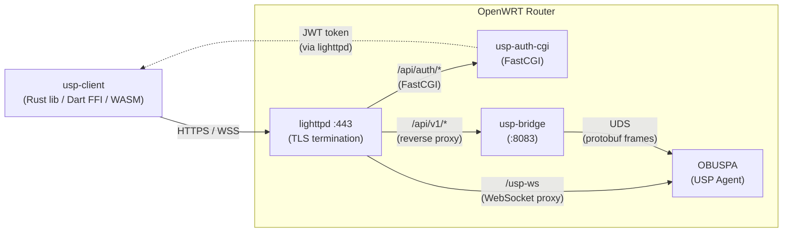
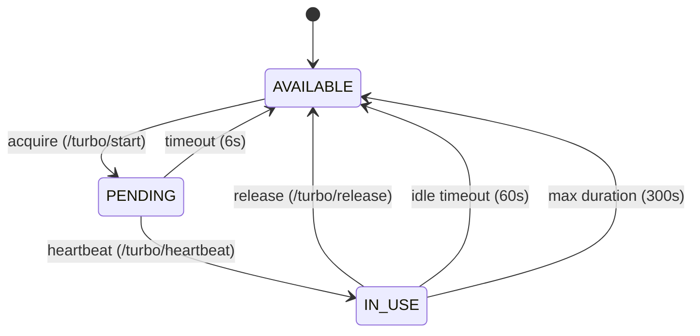
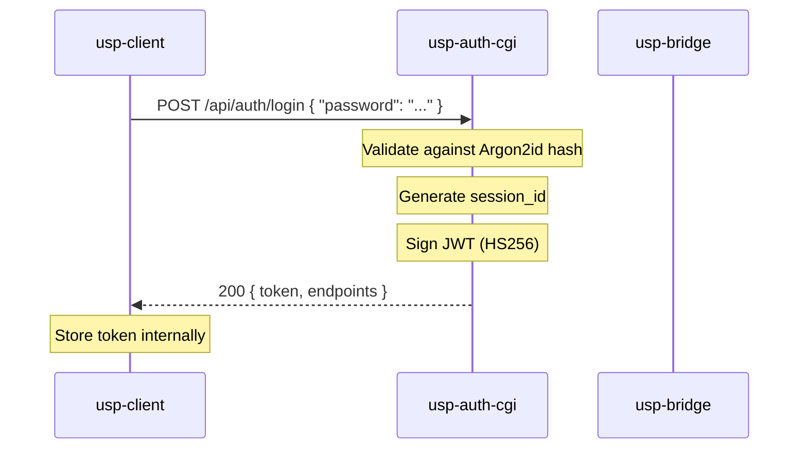
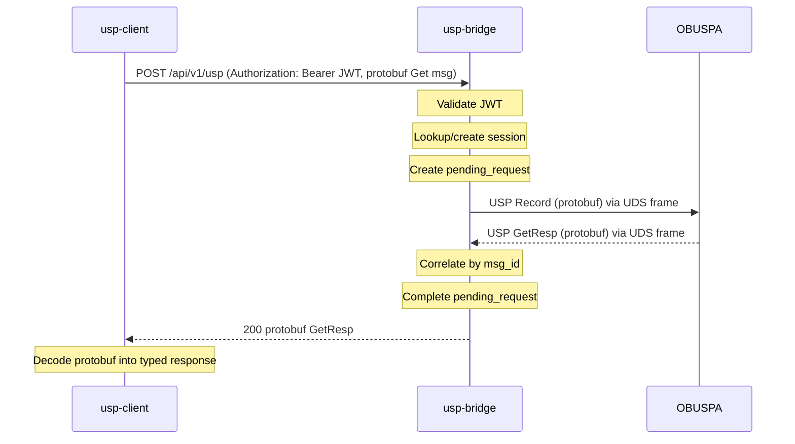
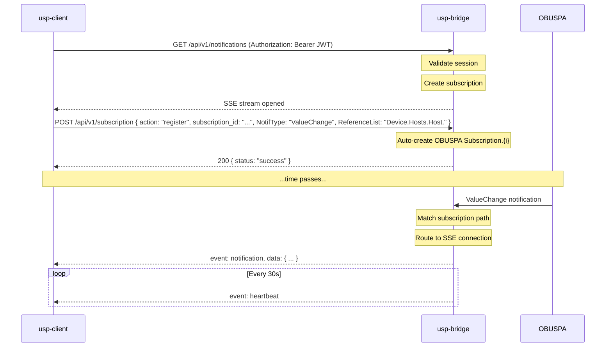
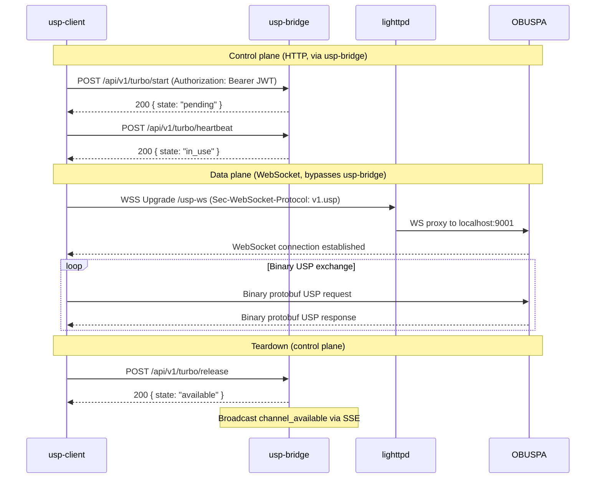

# USP Ecosystem — Architecture Reference

> **Audience**: Maintenance developers and UI developers integrating with the USP ecosystem.
> **Last updated**: 2026-02-17

---

## 1. Overview

The USP (User Services Platform) ecosystem enables UI applications to read and write the router's TR-181 data model via the [TR-369 USP protocol](https://usp.technology/). It is composed of three custom components that sit between a UI application (through **usp-client**) and the **OBUSPA** agent (the open-source USP agent running on the router).



| Component | Language | Runs as | Purpose |
|---|---|---|---|
| **usp-auth-cgi** | C | FastCGI behind lighttpd | Authentication gateway — issues and validates JWT tokens |
| **usp-bridge** | C | Standalone daemon (libevent2) | Protocol bridge — translates HTTP/SSE ↔ USP-over-UDS |
| **usp-client** | Rust | Library (linked into UI apps) | Client SDK — type-safe API for USP operations, ships as Rust lib + Dart FFI + WASM |
| **OBUSPA** | C | System daemon | USP Agent — owns the TR-181 data model, speaks protobuf over UDS |

---

## 2. Component Details

### 2.1 usp-auth-cgi

**Role**: Authentication gateway. It is the only component that handles credentials. All other components trust the JWT it issues.

**Runtime model**: FastCGI process managed by lighttpd. It does **not** listen on its own port; lighttpd proxies requests matching `/api/auth/*` to it.

#### Endpoints

| Method | Path | Description |
|---|---|---|
| `POST` | `/api/auth/login` | Validate password, return JWT |
| `POST` | `/api/auth/refresh` | Refresh a token before (or shortly after) expiry |
| `POST` | `/api/auth/logout` | Invalidate a session |

#### Login flow

1. Client POSTs `{ "password": "<admin-password>" }`.
2. Password is validated against an **Argon2id** hash (via libsodium's `crypto_pwhash_str_verify`).
3. On success, a 64-char hex **session ID** is generated (`randombytes_buf`) and embedded in a JWT (HS256, signed with a 256-bit key from `/etc/usp-auth/signing.key`).
4. The response contains the token, plus endpoint discovery information:
   ```json
   {
     "success": true,
     "token": "eyJ…",
     "endpoints": {
       "controller": "/api/v1/usp",
       "turbo": "/api/v1/turbo/start",
       "agent": "/api/v1/llm/query"
     }
   }
   ```
5. **Browser clients** (detected via `User-Agent`) additionally receive the token as a `Set-Cookie` header with `HttpOnly`, `Secure`, `SameSite=Strict` attributes.

#### JWT claims

```json
{
  "iss": "usp-bridge",
  "aud": "usp-client",
  "iat": 1705843200,
  "exp": 1705844100,
  "session_id": "a1b2c3d4…",
  "role": "admin"
}
```

Default token lifetime: **15 minutes** (configurable via UCI `usp_auth.token_expiration`).

#### Security features

- **Constant-time** password comparison (prevents timing attacks).
- **Memory clearing** of passwords via `sodium_memzero` immediately after validation.
- **Brute-force protection**: progressive rate-limiting (0–3 failures → no delay; 4–6 → 1 s; 7–10 → 3 s; 10+ → 10 s).
- Signing key auto-generated on first run, stored with `0600` permissions.

#### Key dependencies

`libsodium`, `libjwt`, `libjansson`, `libfcgi`, `libuci`

---

### 2.2 usp-bridge

**Role**: Protocol bridge between HTTP/SSE (what UIs speak) and the OBUSPA Unix Domain Socket (UDS). It is the central routing daemon.

**Runtime model**: Single-threaded C daemon using **libevent2** for asynchronous I/O. Binds to `127.0.0.1:8083` by default (configurable via UCI).

#### Architecture internals

The bridge is structured around a central `bridge_context_t` that owns all sub-systems:

| Sub-system | Header | Responsibility |
|---|---|---|
| **HTTP Server** | `http_server.h` | Accepts HTTP/SSE connections from UI clients (libevent `evhttp`) |
| **UDS Client** | `uds_client.h` | Maintains persistent connection to OBUSPA's UDS socket |
| **Session Manager** | `session_manager.h` | Tracks active sessions by session ID (from JWT) |
| **Router** | `router.h` | Correlates outbound USP requests with inbound responses by request ID |
| **Subscription Manager** | `subscription.h` | Maps SSE subscriptions to data model paths; auto-creates OBUSPA `Device.LocalAgent.Subscription.{i}` instances |
| **Channel Manager** | `channel.h` | Manages exclusive streaming channel (for firmware upgrade, speed test, etc.) |
| **JWT Util** | `jwt_util.h` | Validates incoming JWTs using the shared signing key |

#### Endpoints

| Method | Path | Auth | Description |
|---|---|---|---|
| `GET` | `/api/v1/health` | No | Health check + performance metrics |
| `POST` | `/api/v1/usp` | Yes | Forward a USP protobuf message to OBUSPA and return the response |
| `GET` | `/api/v1/notifications` | Yes | SSE stream — real-time notifications from OBUSPA |
| `POST` | `/api/v1/subscription` | Yes | Register/unregister notification subscriptions (auto-creates OBUSPA `Subscription.{i}`). Fields: `NotifType` (string), `ReferenceList` (string) |
| `POST` | `/api/v1/turbo/start` | Yes | Acquire the exclusive streaming channel |
| `POST` | `/api/v1/turbo/heartbeat` | Yes | Keep the streaming channel alive |
| `POST` | `/api/v1/turbo/release` | Yes | Release the streaming channel |
| `GET` | `/api/v1/turbo/status` | Yes | Query streaming channel status |

#### Session validation

Every authenticated endpoint validates the caller via one of two mechanisms (checked in order):

1. **`X-Session-ID` header** — if present, the bridge looks up or auto-creates a session.
2. **`Authorization: Bearer <JWT>` header** — the bridge validates the JWT signature and expiry, extracts the `session_id` claim, and looks up or auto-creates a session.

Sessions have a configurable **grace period** (default 30 s) after inactivity before expiration.

#### UDS protocol (Bridge ↔ OBUSPA)

The bridge connects to OBUSPA's UDS socket (default: `/var/run/usp/broker_agent_path`). Communication uses a **framed binary protocol**:

- **Sync header**: `0x5F555350` (`_USP`)
- **Frame types**: Handshake (`0x01`), Error (`0x02`), USP Record (`0x03`)
- **Payload**: TR-369 USP Records wrapping protobuf-encoded USP messages.
- The bridge identifies itself as `controller::localui` in outbound USP Records (FR-030).
- On connect, a handshake frame discovers the agent's endpoint ID.

Reconnection is automatic (every 5 seconds) if the UDS connection drops.

#### Request routing

When a USP request arrives via HTTP:

1. The bridge validates the session (JWT or session ID).
2. Creates a `pending_request_t` with a unique request ID and timeout.
3. Wraps the USP message in a USP Record and sends it through the UDS socket.
4. Waits for the matching response (correlated by message ID).
5. Returns the USP response to the HTTP caller.

Default timeout: **30 s**; extended timeout: **120 s** (for long-running operations).

#### Streaming channel (Turbo) and WebSocket data plane

The "turbo" channel is a **mutex-like exclusive resource** used for operations that require sustained, uninterrupted agent access (e.g., firmware upgrade, speed test). It has two planes:

- **Control plane** (HTTP, through usp-bridge) — acquire, heartbeat, release, status.
- **Data plane** (WebSocket, **bypassing** usp-bridge) — direct binary USP message exchange with OBUSPA.

##### Channel lifecycle



Only one session may own the channel at a time. All sessions are notified via SSE when the channel becomes available.

##### WebSocket data plane

Once the turbo channel reaches the **IN_USE** state, the client opens a WebSocket connection to the router at the `/usp-ws` endpoint. This connection is **proxied by lighttpd directly to OBUSPA** (listening on `localhost:9001` for WebSocket MTP), completely bypassing usp-bridge for maximum throughput.

Key characteristics:
- **URL**: `wss://<router>/usp-ws` (TLS terminated by lighttpd)
- **Subprotocol**: `v1.usp` (set via `Sec-WebSocket-Protocol` header)
- **Message format**: Binary USP protobuf messages (same encoding as the HTTP path, but sent as WebSocket binary frames instead of HTTP request/response)
- **Authentication**: The JWT token is passed as a `Bearer` token in the initial WebSocket upgrade request
- lighttpd enables WebSocket upgrade via `proxy.header = ( "upgrade" => "enable" )` in the proxy configuration

This design separates the low-frequency control concerns (session, locking, timeouts — handled by usp-bridge) from the high-bandwidth data transfer (handled directly by OBUSPA's WebSocket MTP).

#### Rate limiting

The HTTP server enforces rate limiting: **100 requests per 60-second window** per client IP (fail-open if the tracking table is full).

#### UCI configuration (`/etc/config/usp-bridge`)

```
config usp-bridge 'main'
    option enabled '1'
    option bind_address '127.0.0.1'
    option bind_port '8083'
    option uds_socket '/var/run/usp/broker_agent_path'
    option log_level 'info'
    option request_timeout '30'
    option extended_timeout '120'
    option max_connections '256'
    option session_grace_period '30'
    option heartbeat_interval '30'

config streaming 'channel'
    option pending_timeout '6'
    option idle_timeout '60'
    option max_duration '300'
```

#### Key dependencies

`libevent2`, `libjansson`, `libjwt`, `libubox`, `libuci`, `protobuf-c`

---

### 2.3 usp-client

**Role**: Client-side SDK. Provides a type-safe API for all USP operations. This is what UI applications link against to talk to the router.

**Language**: Rust, with bindings for multiple targets:

| Target | Binding mechanism | Use case |
|---|---|---|
| Native Rust | Direct crate dependency | Embedded / CLI tools |
| Dart (Flutter) | C FFI via `cbindgen` | Flutter mobile/desktop UI |
| TypeScript | WASM via `wasm-bindgen` | Web UI |

#### Module structure

```
usp-client/src/
├── lib.rs          # Public API, re-exports, path validation
├── client.rs       # UspClient + UspClientBuilder (builder pattern)
├── config.rs       # AuthMode (Cookie | Header), AuthConfig
├── error.rs        # Hierarchical error types (Transport, Protocol, Auth, Operation)
├── time_compat.rs  # Cross-platform time utilities
├── protocol/
│   ├── encode.rs   # Rust → protobuf (Get, Set, Add, Delete, Operate)
│   ├── decode.rs   # protobuf → Rust response types
│   └── messages.rs # Request/response data structures
├── transport/
│   ├── http.rs     # HTTP client (reqwest, cookie jar, auth headers)
│   └── auth.rs     # SessionToken, expiry tracking
├── api/
│   └── dynamic.rs  # DynamicOperation for JSON-driven operations
├── ffi/            # C FFI bindings for Dart/Flutter
└── wasm/           # WASM bindings for web
```

#### Core API

```rust
// Create a client
let client = UspClient::new("https://192.168.1.1")?;

// Or use the builder for advanced configuration
let client = UspClientBuilder::new("https://192.168.1.1")
    .endpoint("/api/v1/usp")
    .auth_mode(AuthMode::Header)
    .timeout(Duration::from_secs(60))
    .build()?;

// Authenticate (calls usp-auth-cgi's /api/auth/login)
client.login("admin-password").await?;

// USP operations (routed through usp-bridge's /api/v1/usp)
let response = client.get(vec!["Device.WiFi.Radio.1.".into()]).await?;
client.set(vec![("Device.WiFi.SSID.1.SSID".into(), "MyNetwork".into())]).await?;

// Logout
client.logout().await?;
```

#### Authentication handling

- Default auth mode: `AuthMode::Header` — sends `Authorization: Bearer <token>` on every request.
- Alternative: `AuthMode::Cookie` — relies on browser cookie jar.
- The client stores a `SessionToken` with expiry tracking and provides `is_authenticated()`, `refresh_token()`.
- Default auth endpoint: `/api/v1/auth/login`; configurable via `UspClientBuilder::auth_endpoint()`.

#### Protocol encoding

USP messages are encoded as **protobuf** using the `prost` crate. The `.proto` definition is at `proto/usp.proto` and compiled at build time via `build.rs`. The library supports:

- **Get** — read parameters by path (supports partial paths for subtree queries)
- **Set** — write parameters (atomic or `allow_partial` mode)
- **Add** — create object instances
- **Delete** — remove object instances
- **Operate** — invoke commands (e.g., `Device.WiFi.Radio.1.Reset()`)

#### Path validation

The library validates TR-181 paths before sending requests:
- Must start with `Device.`
- No consecutive dots, max 256 characters
- Supports `{i}` placeholder syntax for instance wildcards

#### Error model

Errors are hierarchical and typed:

```
UspError
├── TransportError  (NetworkError, HttpError, Timeout, ConnectionRefused, TlsError, InvalidUrl)
├── ProtocolError   (EncodingError, DecodingError, MalformedMessage, UnsupportedVersion)
├── AuthError       (InvalidCredentials, SessionExpired, InvalidToken, PermissionDenied)
├── OperationError  (GetFailed, SetFailed, AddFailed, DeleteFailed, OperateFailed, PathNotFound, ReadOnly)
└── ValidationError (String)
```

#### Key dependencies

`prost` (protobuf), `reqwest` + `rustls` (HTTP/TLS), `serde_json`, `tokio` (async), `uuid`, `wasm-bindgen` (WASM target), `cbindgen` (C FFI)

---

## 3. End-to-End Data Flow

### 3.1 Authentication



### 3.2 USP Get operation



### 3.3 Real-time notifications (SSE)



### 3.4 WebSocket turbo channel (high-bandwidth operations)



---

## 4. Shared Signing Key

The JWT signing key (`/etc/usp-auth/signing.key`, 256-bit, `0600` permissions) is the **single trust anchor** between components:

- **usp-auth-cgi** generates and signs JWTs with it.
- **usp-bridge** reads it at startup to validate incoming JWTs.

Both components must have read access to the same key file. The key is auto-generated by usp-auth-cgi on first run if it does not exist.

---

## 5. OBUSPA (USP Agent)

OBUSPA is the open-source TR-369 USP Agent daemon. In this architecture it is a black box that:

- Owns and serves the **TR-181 data model** (all `Device.*` parameters).
- Listens on a **Unix Domain Socket** (default: `/var/run/usp/broker_agent_path`).
- Accepts **USP Record** frames containing protobuf-encoded USP messages.
- Sends **notifications** (ValueChange, ObjectCreation, etc.) to connected controllers.

The bridge is registered as a USP Controller with endpoint ID `controller::localui`.

---

## 6. Deployment Topology

All components run **on the router** itself. The typical deployment looks like:

```
┌─────────────────────────────────────────────────────────┐
│                     OpenWRT Router                      │
│                                                         │
│  lighttpd (:443)                                        │
│    ├── static UI files                                  │
│    ├── /api/auth/*  ──▶  usp-auth-cgi (FastCGI)        │
│    └── /api/v1/*    ──▶  reverse proxy to :8083         │
│                              │                          │
│  usp-bridge (:8083)  ◀──────┘                          │
│    └── UDS ──▶ OBUSPA (/var/run/usp/broker_agent_path) │
│                                                         │
└─────────────────────────────────────────────────────────┘
```

- **lighttpd** terminates TLS (HTTPS) and acts as a reverse proxy.
- `usp-auth-cgi` runs as a FastCGI worker behind lighttpd.
- `usp-bridge` binds to `127.0.0.1:8083` and is only reachable through lighttpd's reverse proxy.
- All inter-component communication is **localhost-only**; only lighttpd is exposed on the LAN interface.

---

## 7. Configuration Reference

| Component | Config mechanism | Location |
|---|---|---|
| usp-auth-cgi | UCI | `/etc/config/usp_auth` |
| usp-bridge | UCI | `/etc/config/usp-bridge` |
| usp-client | Builder API / runtime | N/A (library) |
| OBUSPA | UCI + internal | `/etc/config/obuspa` |

---

## 8. For UI Developers

### What you need to know

1. **Link against `usp-client`** (Rust crate, Dart FFI, or WASM — pick your platform).
2. **Call `login(password)`** — this talks to `usp-auth-cgi` and stores the JWT internally.
3. **Use `get()`, `set()`, `add()`, `delete()`, `operate()`** — these are routed through `usp-bridge` to OBUSPA.
4. **All paths are TR-181** — e.g., `Device.WiFi.Radio.1.Channel`. Partial paths ending with `.` return subtrees.
5. **Notifications** come via SSE on `/api/v1/notifications`. Register interest with `/api/v1/subscription`.
6. **Tokens expire in 15 minutes** — call `refresh_token()` before expiry or re-authenticate.
7. **The turbo channel** must be acquired before long-running operations and released afterward. Only one session can hold it at a time.

### Default endpoints (returned by login)

| Name | Path | Purpose |
|---|---|---|
| controller | `/api/v1/usp` | USP message endpoint |
| turbo | `/api/v1/turbo/start` | Streaming channel acquisition |
| agent | `/api/v1/llm/query` | LLM proxy (optional) |

---

## 9. Build System

All components are built as **OpenWRT packages** within the OpenWRT build system:

```bash
# Build individual packages
make package/feeds/usp/usp-bridge/compile V=s
make package/feeds/usp/usp-auth-cgi/compile V=s
make package/feeds/usp/usp-client/compile V=s
```

`usp-client` can also be built standalone for development:

```bash
cd usp-client
cargo build          # Native
cargo test           # Tests
wasm-pack build      # WASM
```
