# PrivacyGUI → USP/TR-369 Integration Roadmap

## Vision

Migrate PrivacyGUI from JNAP protocol to USP/TR-369 (gRPC), creating a protocol-agnostic UI application.

---

## System Evolution


---

## High-Level Architecture (Target State)


---

## Technology Stack

> Reference: [usp_client_poc/ARCHITECTURE.md](file:///Users/austin.chang/flutter-workspaces/usp_client_poc/ARCHITECTURE.md)

```mermaid
graph TD
    subgraph "🖥️ Frontend - Controller"
        A[Flutter Client<br/>PrivacyGUI Demo]
        A1[Riverpod + GoRouter]
        A2[USP Protocol<br/>Msg/Record Builder]
        A --> A1 --> A2
    end

    subgraph "📡 Transport"
        B[Envoy Proxy<br/>:8090 gRPC-Web]
    end

    subgraph "☁️ Infrastructure"
        C[Mosquitto Broker<br/>:1883 MQTT]
    end

    subgraph "🤖 Backend - Agent"
        D[USP Simulator<br/>Dart Server]
        D1[USP Engine<br/>Record/Msg Parser]
        D2[TR-181 Data Model<br/>Device:2]
        D --> D1 --> D2
    end

    subgraph "📦 Shared Package"
        S[usp_protocol_common<br/>Protobuf Definitions]
    end

    A2 -->|"gRPC-Web / HTTP2"| B
    B -->|"TCP / 1883"| C
    C -->|"MQTT Pub/Sub"| D

    A2 -.->|uses| S
    D1 -.->|uses| S

    style A fill:#4CAF50,color:white
    style B fill:#FF9800,color:white
    style C fill:#2196F3,color:white
    style D fill:#9C27B0,color:white
    style S fill:#E91E63,color:white
```



### Data Flow (Request → Response)

```
1. User Action     → Flutter App creates USP Get Message
2. Encapsulation   → Wrap in UspRecord (to_id="proto::agent")
3. Transport       → Send via gRPC-Web to Envoy (:8090)
4. Routing         → Envoy forwards to MQTT Broker
5. Processing      → Simulator decodes Record/Msg, queries Data Model
6. Response        → Create GetResp, return via reverse path
```

### Frontend Technologies (Controller)

| Technology | Purpose |
|------------|---------|
| **Flutter 3.x** | Cross-platform UI framework |
| **Riverpod** | State Management |
| **GoRouter** | Declarative routing |
| **UI Kit Library** | Design system components |
| **gRPC-Web** | Gateway communication |
| **usp_protocol_common** | Build USP Msg/Record |

### Backend Technologies (Agent)

| Technology | Purpose |
|------------|---------|
| **Dart Server** | USP Simulator main process |
| **USP Engine** | Parse USP Record/Msg |
| **TR-181 Data Model** | Device:2 data structure |
| **usp_protocol_common** | Parse USP Msg/Record |

### Infrastructure

| Component | Port | Purpose |
|-----------|------|---------|
| **Envoy Proxy** | 8090 | gRPC-Web Gateway |
| **Mosquitto** | 1883 | MQTT Message Bus |

---

## Phase 1: Demo App Completion

### Goal
Standalone Demo application running without JNAP connectivity

### Completed ✅
| Item | File |
|------|------|
| Entry Point | `lib/main_demo.dart` |
| App Widget | `lib/demo/demo_app.dart` |
| Router | `lib/demo/demo_router.dart` |
| Mock Providers | `lib/demo/providers/demo_overrides.dart` |
| Mock Data | `lib/demo/data/` (41 files) |

### Pending
| Item | Priority | Description |
|------|----------|-------------|
| Asset files | Medium | `theme.json`, `versions.json` |
| Page validation | High | Verify all major routes work |
| TestHelper refactor | Low | Share `lib/demo/data/` |
| CI/CD | Low | GitHub Pages auto-deploy |

---

## Phase 2: Service Layer Refactoring

### Goal
Extract business logic following `wifi_settings` pattern

### Target Architecture

```
lib/page/{feature}/
├── services/
│   ├── {feature}_service.dart     # Business logic
│   └── {feature}_mapper.dart      # JNAP ↔ State
├── providers/
│   └── {feature}_provider.dart    # State management only
└── views/
    └── {feature}_view.dart        # Pure UI
```

### Refactoring Priority

| # | Module | Current | Target |
|---|--------|---------|--------|
| 1 | `instant_device` | Mixed logic in Provider | Service extraction |
| 2 | `instant_topology` | Mixed logic in Provider | Service extraction |
| 3 | `instant_admin` | Partial extraction | Complete extraction |
| 4 | `advanced_settings/internet` | Mixed in Provider | Service extraction |
| 5 | `advanced_settings/firewall` | Mixed in Provider | Service extraction |

---

## Phase 3: Repository Abstraction Layer

### Goal
Define protocol-agnostic interfaces

### Interface Design

```dart
// lib/core/repositories/wifi_repository.dart
abstract class WiFiRepository {
  Future<WifiBundleSettings> getSettings();
  Future<void> saveSettings(WifiBundleSettings settings);
  Stream<WifiBundleSettings> watchSettings();
}

// lib/core/repositories/device_repository.dart  
abstract class DeviceRepository {
  Future<List<Device>> getDevices();
  Future<Device> getDeviceById(String id);
}

// lib/core/repositories/network_repository.dart
abstract class NetworkRepository {
  Future<NetworkSettings> getSettings();
  Future<void> saveSettings(NetworkSettings settings);
}
```

### Directory Structure

```
lib/core/
├── repositories/           # Abstract interfaces
│   ├── wifi_repository.dart
│   ├── device_repository.dart
│   └── network_repository.dart
│
├── jnap/                   # JNAP implementation
│   ├── jnap_wifi_repository.dart
│   └── jnap_device_repository.dart
│
├── usp/                    # USP implementation (Phase 4)
│   ├── usp_wifi_repository.dart
│   └── usp_device_repository.dart
│
└── mock/                   # Mock implementation (Demo)
    ├── mock_wifi_repository.dart
    └── mock_device_repository.dart
```

---

## Phase 4: USP/gRPC Integration

### Goal
Connect to `usp_client_poc` simulator

### Integration Architecture


### TR-181 Path Mapping (WiFi Example)

| TR-181 Path | PrivacyGUI State |
|-------------|------------------|
| `Device.WiFi.SSID.1.SSID` | `WifiBundleSettings.ssid` |
| `Device.WiFi.AccessPoint.1.Security.KeyPassphrase` | `WifiBundleSettings.password` |
| `Device.WiFi.Radio.1.Enable` | `WifiBundleSettings.isEnabled` |
| `Device.WiFi.Radio.1.Channel` | `WifiBundleSettings.channel` |

### Dependency Configuration

```yaml
# pubspec.yaml
dependencies:
  usp_protocol_common:
    path: ../usp_client_poc/packages/usp_protocol_common
  grpc: ^3.2.4
```

---

## Timeline & Milestones


| Phase | Estimate | Deliverable |
|-------|----------|-------------|
| Phase 1 | 1-2 days | Demo App presentable |
| Phase 2 | 2-3 weeks | All Feature Modules follow Service pattern |
| Phase 3 | 1 week | Repository interfaces + DI switching mechanism |
| Phase 4 | 2-3 weeks | USP Simulator connection successful |

---

## Risks & Mitigation

| Risk | Mitigation Strategy |
|------|---------------------|
| TR-181 fields don't fully map | Build mapping table, fill incrementally |
| Refactoring breaks existing functionality | Maintain JNAP + Demo dual-track operation |
| gRPC connection issues | Validate with Mock first, then connect |
| Timeline delays | Phase 2-3 can run in parallel |

---

## Success Criteria

1. ✅ **Demo App**: Runs standalone in Chrome, complete UI flow
2. ⬜ **Service Layer**: All feature modules follow wifi_settings pattern
3. ⬜ **Repository Pattern**: Providers don't call JNAP/gRPC directly
4. ⬜ **USP Integration**: Demo App connects to usp_device2_simulator
