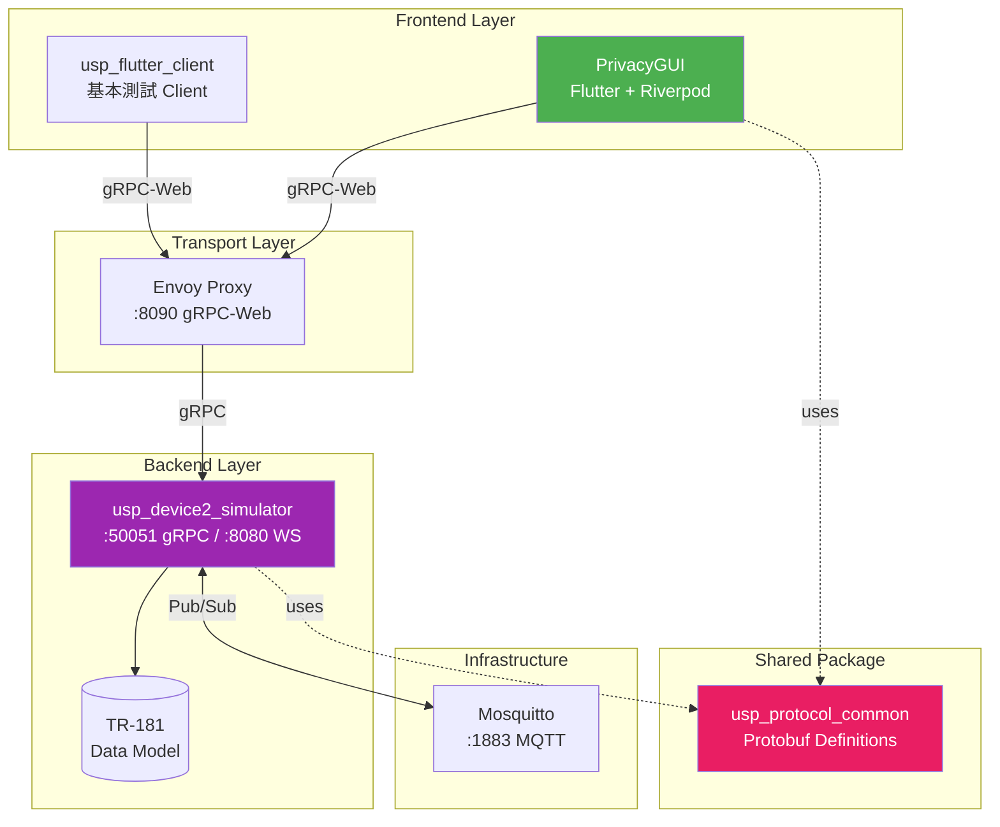
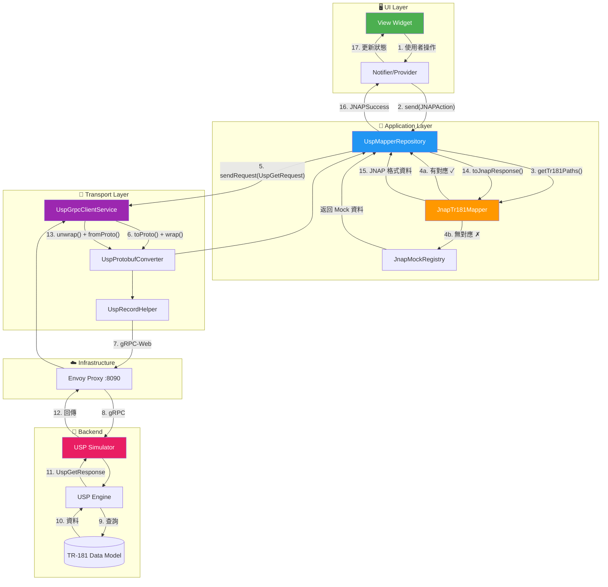
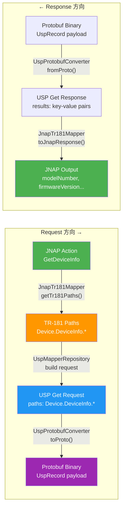
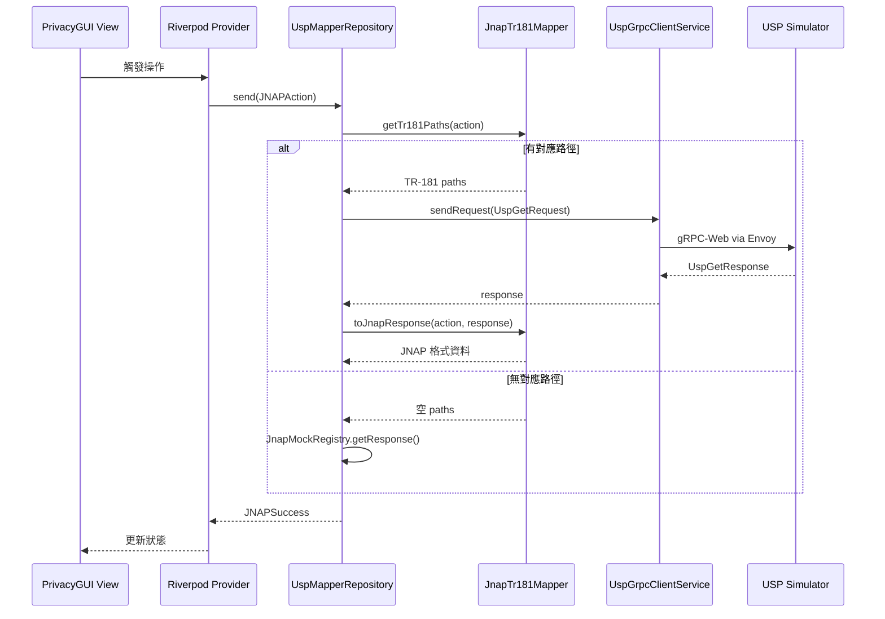

# USP Integration 現況分析

> 最後更新: 2025-12-25
> 對照文件: [USP_INTEGRATION_ROADMAP.md](./USP_INTEGRATION_ROADMAP.md)

---

## 專案總覽

### Monorepo 結構

```
usp_client_poc/
├── apps/
│   ├── PrivacyGUI/              # 主要 Flutter 應用 (Router 管理介面)
│   │   └── lib/core/usp/package/usp/  # 🎯 可抽離的 USP 核心
│   ├── usp_device2_simulator/   # USP Agent 模擬器 (Dart Server)
│   └── usp_flutter_client/      # 基本 gRPC 測試 Client
├── packages/
│   └── usp_protocol_common/     # 共用 USP 協議 (Protobuf)
└── infrastructure/              # Docker 基礎設施 (Envoy, Mosquitto)
```

> **Note**: `privacy_shared` 已移除，`grpc_creator` 已內化至 PrivacyGUI。

### 系統架構圖



### 各元件職責

| 元件 | 技術 | 職責 |
|------|------|------|
| **PrivacyGUI** | Flutter + Riverpod | Router 管理 UI，支援 JNAP/USP 雙協議 |
| **usp_device2_simulator** | Dart Server | 模擬 TR-369 Agent，提供 TR-181 Data Model |
| **usp_protocol_common** | Dart + Protobuf | USP Message/Record 編解碼共用庫 |
| **Envoy Proxy** | Docker | gRPC-Web 轉 gRPC/MQTT 閘道 |
| **Mosquitto** | Docker | MQTT 訊息佇列（Agent 間通訊） |

---

## USP Demo 資料流轉換

### 完整流程圖



### 資料格式轉換



### 單次請求範例

以 `GetDeviceInfo` 為例：

| 階段 | 元件 | 輸入 | 輸出 |
|------|------|------|------|
| 1 | Provider | User action | `JNAPAction.getDeviceInfo` |
| 2 | JnapTr181Mapper | Action | `["Device.DeviceInfo."]` |
| 3 | UspMapperRepository | TR-181 paths | `UspGetRequest(paths)` |
| 4 | UspGrpcClientService | Request DTO | `UspTransportRequest` (binary) |
| 5 | Envoy → Simulator | gRPC request | gRPC response |
| 6 | UspGrpcClientService | Binary | `UspGetResponse` |
| 7 | JnapTr181Mapper | Response | JNAP Map |

**TR-181 → JNAP 欄位映射：**

```dart
// JnapTr181Mapper._mapDeviceInfo()
{
  'modelNumber': response['Device.DeviceInfo.ModelName'],
  'firmwareVersion': response['Device.DeviceInfo.SoftwareVersion'],
  'manufacturer': response['Device.DeviceInfo.Manufacturer'],
  'serialNumber': response['Device.DeviceInfo.SerialNumber'],
  // ...
}
```

---

## Roadmap vs 現況對照

| Phase | Roadmap 目標 | 狀態 | 說明 |
|-------|-------------|------|------|
| **Phase 1** | Demo App 完成 | ✅ 完成 | `main_demo.dart` 可獨立運作 |
| **Phase 2** | Service Layer 重構 | ⚠️ 未開始 | 僅 `wifi_settings` 遵循此模式 |
| **Phase 3** | Repository 抽象層 | ⚠️ 跳過 | 直接使用 `RouterRepository` |
| **Phase 4** | USP/gRPC 整合 | ✅ 提前實作 | `main_usp_demo.dart` 已完成 |

---

## 現行架構

### 核心元件

| 元件 | 檔案路徑 | 職責 |
|------|----------|------|
| **Entry Point** | `lib/main_usp_demo.dart` | USP Demo 進入點，建立 gRPC 連線 |
| **UspMapperRepository** | `lib/core/usp/usp_mapper_repository.dart` | 攔截 JNAP 請求，轉發至 USP |
| **JnapTr181Mapper** | `lib/core/usp/jnap_tr181_mapper.dart` | JNAP ↔ TR-181 路徑轉換 (1185 行) |
| **UspGrpcClientService** | `lib/core/usp/usp_grpc_client_service.dart` | gRPC 傳輸層 |
| **DemoProviders** | `lib/demo/providers/demo_overrides.dart` | Auth/Connectivity Mock |

### 資料流



---

## 與 Roadmap 的架構差異

### Roadmap 計畫 (Phase 3)

```
Provider → Service → Repository Interface → USP/JNAP Implementation
                           ↓
                    可切換 Protocol
```

### 實際實作

```
Provider → RouterRepository → UspMapperRepository → gRPC
                 ↓
          JnapTr181Mapper (直接轉換 JNAP ↔ TR-181)
```

### 關鍵差異

| 面向 | Roadmap | 實作 |
|------|---------|------|
| **抽象層** | Repository Interface | 直接 Override Provider |
| **Protocol 切換** | Runtime 可切換 | 需重新編譯 |
| **Service 層** | 獨立業務邏輯 | 邏輯仍在 Provider |
| **Mapper 位置** | 在 Repository 內 | 獨立但耦合 JNAP |

---

## 優缺點分析

### 現行做法優點 ✅

1. **快速驗證** - 可立即測試 USP 連線與 TR-181 映射
2. **低侵入性** - 不需改動現有 JNAP 程式碼
3. **Fallback 機制** - 無法映射時自動使用 Mock 資料
4. **增量開發** - 可逐步擴充 Mapper 覆蓋範圍

### 現行做法缺點 ❌

1. **Mapper 耦合** - `JnapTr181Mapper` 將 JNAP 格式硬編碼
2. **無法動態切換** - Entry point 決定 Protocol，無法 runtime 切換
3. **維護成本** - 新增功能需同時維護 Mapper + Simulator Data Model
4. **測試困難** - 無抽象介面，難以單元測試 Repository 層

---

## 建議方向

### 選項 A：繼續目前路線 (快速迭代)

**適合場景**: POC 驗證、快速展示

```
持續擴展 JnapTr181Mapper 覆蓋更多 JNAP Action
- 優點：快速看到結果
- 缺點：技術債累積
- 預估工期：依 Action 數量而定
```

---

### 選項 B：回填 Phase 2-3 (長期架構)

**適合場景**: Production 目標、長期維護

```
1. Phase 2: 抽取 Service Layer
   - 將業務邏輯從 Provider 移至 Service
   - 預估工期：2-3 週

2. Phase 3: 建立 Repository Interface
   - 定義 WiFiRepository, DeviceRepository 等介面
   - 將 UspMapperRepository 實作該介面
   - 預估工期：1 週
```

**目錄結構**:
```
lib/core/
├── repositories/           # 抽象介面
│   ├── wifi_repository.dart
│   └── device_repository.dart
├── jnap/                   # JNAP 實作
│   └── jnap_wifi_repository.dart
└── usp/                    # USP 實作
    └── usp_wifi_repository.dart
```

---

### 選項 C：混合策略 (推薦)

**適合場景**: 平衡驗證需求與長期架構

```
1. 保持現有 main_usp_demo.dart 作為驗證環境
2. 同時開始 Phase 2 的 Service 抽取
3. 當 Service 穩定後，再建立 Repository 抽象
```

**優先順序**:
1. `instant_device` Service 抽取
2. `instant_topology` Service 抽取
3. Repository Interface 定義
4. USP Repository 實作

---

## JNAP 解耦策略

### 現況問題

目前資料流存在「JNAP 夾心」：

```
USP/TR-181 → JnapTr181Mapper → JNAP 格式 → Provider → UI State
                                   ↑
                               歷史包袱
```

**痛點**：
1. `RouterRepository` 是龐然大物，API 是 JNAP-shaped（Action, Transaction）
2. 要在 Repository 層抽象太困難，等於發明通用 RPC 抽象
3. Provider 內混雜業務邏輯與資料轉換

### 解耦方向：在 Service 層切斷

```
目標架構：
Provider ← [Service Interface] ← JnapService / UspService
   ↑              ↑
UI Models    Protocol-specific impl
```

**關鍵決策**：
- **Service 層是正確的抽象點**（業務邊界）
- **RouterRepository 不需要抽象**（讓它成為 JNAP 的內部實作細節）
- **利用 Dart 隱式介面**（implements 現有 Service 類別）

### 實作範例

```dart
// 現有 JNAP Service（保留）
class WifiSettingsService {
  final RouterRepository _repository;
  
  Future<WiFiConfig> getConfiguration() async {
    final result = await _repository.send(JNAPAction.getRadioInfo);
    return WiFiConfig.fromJnap(result.output);
  }
}

// 新增 USP Service（implements 現有 Service）
class UspWifiSettingsService implements WifiSettingsService {
  final UspGrpcClientService _grpcService;
  
  @override
  Future<WiFiConfig> getConfiguration() async {
    final response = await _grpcService.sendRequest(...);
    return WiFiConfig.fromTr181(response);
  }
}
```

### 切換機制

```dart
final wifiSettingsServiceProvider = Provider<WifiSettingsService>((ref) {
  final protocol = ref.watch(protocolSwitchProvider);
  
  return switch (protocol) {
    Protocol.jnap => WifiSettingsService(ref.watch(routerRepositoryProvider)),
    Protocol.usp => UspWifiSettingsService(ref.watch(uspGrpcServiceProvider)),
  };
});
```

### 漸進式遷移路徑

| Phase | 目標 | 說明 |
|-------|------|------|
| Phase 1 | Service 抽取 | 每個 feature 抽出 XxxService，內部仍使用 RouterRepository |
| Phase 2 | 加入 USP 實作 | 新增 UspXxxService，Provider 透過 DI 選擇 |
| Phase 3 | 移除 JNAP | 刪除 JnapXxxService 和 RouterRepository |

---

## Demo Mapper 可重用價值

### JnapTr181Mapper 結構分析

```dart
class JnapTr181Mapper {
  // 1. 路徑對應表 ← 永久價值
  static const _actionToTr181Paths = {...};
  
  // 2. 反向轉換邏輯 ← 永久價值
  Map<String, dynamic> toJnapResponse(...) {...}
  
  // 3. JNAP 輸出格式 ← 過渡期，可丟棄
}
```

### 價值分解

| 部分 | 重用價值 | 重構方向 |
|------|---------|---------|
| **TR-181 路徑對應表** | ✅ 永久價值 | 抽成 `Tr181Paths` 常數類 |
| **欄位映射邏輯** | ✅ 永久價值 | 移至 Model 的 `fromTr181()` factory |
| **JNAP 輸出格式** | ❌ 過渡期 | 未來丟棄 |

### 重構建議

**Step 1：抽出 TR-181 路徑常數**

```dart
// lib/core/usp/tr181_paths.dart
class Tr181Paths {
  static const deviceInfo = 'Device.DeviceInfo.';
  static const wifiRadio = 'Device.WiFi.Radio.';
  static const wifiSsid = 'Device.WiFi.SSID.';
  static const hosts = 'Device.Hosts.Host.';
  // ...
}
```

**Step 2：轉換邏輯移至 Model Factory**

```dart
// lib/core/models/device_info.dart
class DeviceInfo {
  factory DeviceInfo.fromJnap(Map<String, dynamic> json) { ... }
  
  // 來自 Mapper 的邏輯
  factory DeviceInfo.fromTr181(Map<String, String> data) {
    return DeviceInfo(
      modelNumber: data['Device.DeviceInfo.ModelName'] ?? '',
      firmwareVersion: data['Device.DeviceInfo.SoftwareVersion'] ?? '',
      // ...
    );
  }
}
```

**Step 3：UspService 使用這些組件**

```dart
class UspDeviceService implements DeviceService {
  @override
  Future<DeviceInfo> getDeviceInfo() async {
    final response = await _grpcService.sendRequest(
      UspGetRequest([UspPath.parse(Tr181Paths.deviceInfo)]),
    );
    return DeviceInfo.fromTr181(response.toFlatMap());
  }
}
```

### Demo 的長期價值

| 可重用資產 | 說明 |
|-----------|------|
| **TR-181 路徑知識** | 知道每個功能對應哪些 TR-181 路徑 |
| **欄位映射邏輯** | TR-181 欄位名 → Domain Model 欄位 |
| **gRPC 通訊框架** | `UspGrpcClientService` 可直接使用 |
| **測試資料結構** | Simulator 的 TR-181 Data Model |

> **結論**：Demo 不是一次性的，其核心邏輯可在正式 USP Service 中重用。

---

## 目前架構狀態 (2025-12-25 更新)

> [!IMPORTANT]
> **過渡期架構**
>
> 目前 USP Services 已完成拆分，但透過 `UspMapperRepository` 呼叫，而非 Provider 直接呼叫。
> 這是因為 **Service 層抽象尚未完成**，`UspXxxService` 尚未實作共同的 Service Interface。

### 目前資料流

```
Provider → UspMapperRepository → UspXxxService → gRPC → Simulator
                │
                └→ 未支援的 action fallback 到 JnapMockRegistry
```

### 已完成的 USP Services

| Service | 支援的 Actions |
|---------|---------------|
| `UspDeviceService` | GetDeviceInfo, GetSystemStats |
| `UspWifiService` | GetRadioInfo, GetGuestRadioSettings, GetMACFilterSettings |
| `UspNetworkService` | GetWANStatus, GetLANSettings, GetTimeSettings |
| `UspTopologyService` | GetDevices, GetBackhaulInfo, GetNetworkConnections |
| `UspDiagnosticsService` | GetInternetConnectionStatus, GetEthernetPortConnections |

### 待 Service 層完成後

```
Provider ← [Service Interface] ← JnapService / UspService (透過 DI 切換)
```

---

## 待辦事項

### 短期 (1-2 週)
- [x] ~~擴充 `JnapTr181Mapper` 覆蓋關鍵 Action~~ → 已拆分為 5 個 Services
- [x] 移除 `privacy_shared` 依賴，內化 `grpc_creator`
- [x] 將 USP 核心抽離至 `package/usp/` 準備獨立化
- [ ] 驗證 `main_usp_demo.dart` 所有主要頁面
- [ ] 完善 Simulator 的 TR-181 Data Model

### 中期 (3-4 週)
- [ ] 將 `package/usp/` 搬移至 `packages/usp_client_core/`
- [ ] 開始 Service Layer 抽取（定義 Service Interface）

### 長期
- [ ] 完成 Repository 抽象層
- [ ] Runtime Protocol 切換機制
- [ ] Production 部署準備

---

## 相關文件

- [USP_INTEGRATION_ROADMAP.md](./USP_INTEGRATION_ROADMAP.md) - 原始 Roadmap
- [jnap_tr181_mapping_report.md](./jnap_tr181_mapping_report.md) - TR-181 映射報告
- [ARCHITECTURE.md](file:///Users/austin.chang/flutter-workspaces/usp_client_poc/ARCHITECTURE.md) - 系統架構

