# USP Integration Status Analysis

> Last Updated: 2025-12-25
> Reference: [USP_INTEGRATION_ROADMAP.md](./USP_INTEGRATION_ROADMAP.md)

---

## Project Overview

### Monorepo Structure

```
usp_client_poc/
├── apps/
│   ├── PrivacyGUI/              # Main Flutter App (Router Management UI)
│   ├── usp_device2_simulator/   # USP Agent Simulator (Dart Server)
│   └── usp_flutter_client/      # Basic gRPC Test Client
├── packages/
│   ├── usp_protocol_common/     # Shared USP Protocol (Protobuf)
│   └── privacy_shared/          # Shared Utilities (gRPC Creator, etc.)
└── infrastructure/              # Docker Infrastructure (Envoy, Mosquitto)
```

### System Architecture Diagram


### Component Responsibilities

| Component | Technology | Responsibility |
|-----------|------------|----------------|
| **PrivacyGUI** | Flutter + Riverpod | Router management UI, supports JNAP/USP dual protocol |
| **usp_device2_simulator** | Dart Server | Simulates TR-369 Agent, provides TR-181 Data Model |
| **usp_protocol_common** | Dart + Protobuf | Shared library for USP Message/Record encoding/decoding |
| **Envoy Proxy** | Docker | gRPC-Web to gRPC/MQTT gateway |
| **Mosquitto** | Docker | MQTT message queue (inter-agent communication) |

---

## USP Demo Data Flow Conversion

### Complete Flow Diagram


### Data Format Conversion

```mermaid
flowchart LR
    subgraph REQUEST["Request Direction →"]
        JA[JNAP Action<br/>GetDeviceInfo]
        TR1[TR-181 Paths<br/>Device.DeviceInfo.*]
        USP1[USP Get Request<br/>paths: Device.DeviceInfo.*]
        PB1[Protobuf Binary<br/>UspRecord payload]
    end

    JA -->|"JnapTr181Mapper<br/>getTr181Paths()"| TR1
    TR1 -->|"UspMapperRepository<br/>build request"| USP1
    USP1 -->|"UspProtobufConverter<br/>toProto()"| PB1

    subgraph RESPONSE["← Response Direction"]
        PB2[Protobuf Binary<br/>UspRecord payload]
        USP2[USP Get Response<br/>results: key-value pairs]
        JNAP[JNAP Output<br/>modelNumber, firmwareVersion...]
    end

    PB2 -->|"UspProtobufConverter<br/>fromProto()"| USP2
    USP2 -->|"JnapTr181Mapper<br/>toJnapResponse()"| JNAP

    style JA fill:#4CAF50,color:white
    style TR1 fill:#FF9800,color:white
    style USP1 fill:#2196F3,color:white
    style PB1 fill:#9C27B0,color:white
    style JNAP fill:#4CAF50,color:white
```



### Single Request Example

Using `GetDeviceInfo` as an example:

| Step | Component | Input | Output |
|------|-----------|-------|--------|
| 1 | Provider | User action | `JNAPAction.getDeviceInfo` |
| 2 | JnapTr181Mapper | Action | `["Device.DeviceInfo."]` |
| 3 | UspMapperRepository | TR-181 paths | `UspGetRequest(paths)` |
| 4 | UspGrpcClientService | Request DTO | `UspTransportRequest` (binary) |
| 5 | Envoy → Simulator | gRPC request | gRPC response |
| 6 | UspGrpcClientService | Binary | `UspGetResponse` |
| 7 | JnapTr181Mapper | Response | JNAP Map |

**TR-181 → JNAP Field Mapping:**

```dart
// JnapTr181Mapper._mapDeviceInfo()
{
  'modelNumber': response['Device.DeviceInfo.ModelName'],
  'firmwareVersion': response['Device.DeviceInfo.SoftwareVersion'],
  'manufacturer': response['Device.DeviceInfo.Manufacturer'],
  'serialNumber': response['Device.DeviceInfo.SerialNumber'],
  // ...
}
```

---

## Roadmap vs Current Status

| Phase | Roadmap Goal | Status | Description |
|-------|--------------|--------|-------------|
| **Phase 1** | Demo App Completion | ✅ Done | `main_demo.dart` runs standalone |
| **Phase 2** | Service Layer Refactoring | ⚠️ Not Started | Only `wifi_settings` follows this pattern |
| **Phase 3** | Repository Abstraction Layer | ⚠️ Skipped | Directly using `RouterRepository` |
| **Phase 4** | USP/gRPC Integration | ✅ Early Implementation | `main_usp_demo.dart` completed |

---

## Current Architecture

### Core Components

| Component | File Path | Responsibility |
|-----------|-----------|----------------|
| **Entry Point** | `lib/main_usp_demo.dart` | USP Demo entry point, establishes gRPC connection |
| **UspMapperRepository** | `lib/core/usp/usp_mapper_repository.dart` | Intercepts JNAP requests, forwards to USP |
| **JnapTr181Mapper** | `lib/core/usp/jnap_tr181_mapper.dart` | JNAP ↔ TR-181 path conversion (1185 lines) |
| **UspGrpcClientService** | `lib/core/usp/usp_grpc_client_service.dart` | gRPC transport layer |
| **DemoProviders** | `lib/demo/providers/demo_overrides.dart` | Auth/Connectivity Mock |

### Data Flow


---

## Architectural Differences from Roadmap

### Roadmap Plan (Phase 3)

```
Provider → Service → Repository Interface → USP/JNAP Implementation
                           ↓
                    Switchable Protocol
```

### Actual Implementation

```
Provider → RouterRepository → UspMapperRepository → gRPC
                 ↓
          JnapTr181Mapper (Direct JNAP ↔ TR-181 Conversion)
```

### Key Differences

| Aspect | Roadmap | Implementation |
|--------|---------|----------------|
| **Abstraction Layer** | Repository Interface | Direct Provider Override |
| **Protocol Switching** | Runtime switchable | Requires recompilation |
| **Service Layer** | Separate business logic | Logic remains in Provider |
| **Mapper Location** | Inside Repository | Independent but coupled to JNAP |

---

## Pros and Cons Analysis

### Current Approach Advantages ✅

1. **Fast Validation** - Immediately test USP connection and TR-181 mapping
2. **Low Invasiveness** - No changes required to existing JNAP code
3. **Fallback Mechanism** - Automatically uses Mock data when mapping not found
4. **Incremental Development** - Can gradually expand Mapper coverage

### Current Approach Disadvantages ❌

1. **Mapper Coupling** - `JnapTr181Mapper` hard-codes JNAP format
2. **No Dynamic Switching** - Entry point determines protocol, no runtime switching
3. **Maintenance Cost** - New features require maintaining both Mapper and Simulator Data Model
4. **Testing Difficulty** - No abstract interface, hard to unit test Repository layer

---

## Recommended Directions

### Option A: Continue Current Path (Fast Iteration)

**Suitable for**: POC validation, quick demos

```
Continue expanding JnapTr181Mapper to cover more JNAP Actions
- Pros: Quick results
- Cons: Technical debt accumulation
- Estimated Timeline: Depends on number of Actions
```

---

### Option B: Backfill Phase 2-3 (Long-term Architecture)

**Suitable for**: Production target, long-term maintenance

```
1. Phase 2: Extract Service Layer
   - Move business logic from Provider to Service
   - Estimated Timeline: 2-3 weeks

2. Phase 3: Create Repository Interface
   - Define WiFiRepository, DeviceRepository, etc.
   - Implement UspMapperRepository against the interface
   - Estimated Timeline: 1 week
```

**Directory Structure**:
```
lib/core/
├── repositories/           # Abstract Interfaces
│   ├── wifi_repository.dart
│   └── device_repository.dart
├── jnap/                   # JNAP Implementation
│   └── jnap_wifi_repository.dart
└── usp/                    # USP Implementation
    └── usp_wifi_repository.dart
```

---

### Option C: Hybrid Strategy (Recommended)

**Suitable for**: Balancing validation needs with long-term architecture

```
1. Keep existing main_usp_demo.dart as validation environment
2. Simultaneously start Phase 2 Service extraction
3. Once Services stabilize, create Repository abstraction
```

**Priority Order**:
1. `instant_device` Service extraction
2. `instant_topology` Service extraction
3. Repository Interface definition
4. USP Repository implementation

---

## JNAP Decoupling Strategy

### Current Problem

The data flow has a "JNAP sandwich":

```
USP/TR-181 → JnapTr181Mapper → JNAP Format → Provider → UI State
                                    ↑
                              Legacy baggage
```

**Pain Points**:
1. `RouterRepository` is a monolith with JNAP-shaped API (Action, Transaction)
2. Abstracting at Repository layer is too difficult - would require inventing a generic RPC abstraction
3. Provider mixes business logic with data transformation

### Decoupling Direction: Cut at Service Layer

```
Target Architecture:
Provider ← [Service Interface] ← JnapService / UspService
   ↑              ↑
UI Models    Protocol-specific impl
```

**Key Decisions**:
- **Service layer is the correct abstraction point** (business boundary)
- **RouterRepository doesn't need abstraction** (let it be JNAP's internal implementation detail)
- **Leverage Dart's implicit interfaces** (implements existing Service classes)

### Implementation Example

```dart
// Existing JNAP Service (keep as-is)
class WifiSettingsService {
  final RouterRepository _repository;
  
  Future<WiFiConfig> getConfiguration() async {
    final result = await _repository.send(JNAPAction.getRadioInfo);
    return WiFiConfig.fromJnap(result.output);
  }
}

// New USP Service (implements existing Service)
class UspWifiSettingsService implements WifiSettingsService {
  final UspGrpcClientService _grpcService;
  
  @override
  Future<WiFiConfig> getConfiguration() async {
    final response = await _grpcService.sendRequest(...);
    return WiFiConfig.fromTr181(response);
  }
}
```

### Switching Mechanism

```dart
final wifiSettingsServiceProvider = Provider<WifiSettingsService>((ref) {
  final protocol = ref.watch(protocolSwitchProvider);
  
  return switch (protocol) {
    Protocol.jnap => WifiSettingsService(ref.watch(routerRepositoryProvider)),
    Protocol.usp => UspWifiSettingsService(ref.watch(uspGrpcServiceProvider)),
  };
});
```

### Incremental Migration Path

| Phase | Goal | Description |
|-------|------|-------------|
| Phase 1 | Service Extraction | Extract XxxService for each feature, still using RouterRepository internally |
| Phase 2 | Add USP Implementation | Add UspXxxService, Provider selects via DI |
| Phase 3 | Remove JNAP | Delete JnapXxxService and RouterRepository |

---

## Demo Mapper Reusability

### JnapTr181Mapper Structure Analysis

```dart
class JnapTr181Mapper {
  // 1. Path mapping table ← Permanent value
  static const _actionToTr181Paths = {...};
  
  // 2. Reverse conversion logic ← Permanent value
  Map<String, dynamic> toJnapResponse(...) {...}
  
  // 3. JNAP output format ← Transitional, can be discarded
}
```

### Value Breakdown

| Part | Reuse Value | Refactoring Direction |
|------|-------------|----------------------|
| **TR-181 Path Mapping Table** | ✅ Permanent value | Extract to `Tr181Paths` constants class |
| **Field Mapping Logic** | ✅ Permanent value | Move to Model's `fromTr181()` factory |
| **JNAP Output Format** | ❌ Transitional | Discard in future |

### Refactoring Recommendations

**Step 1: Extract TR-181 Path Constants**

```dart
// lib/core/usp/tr181_paths.dart
class Tr181Paths {
  static const deviceInfo = 'Device.DeviceInfo.';
  static const wifiRadio = 'Device.WiFi.Radio.';
  static const wifiSsid = 'Device.WiFi.SSID.';
  static const hosts = 'Device.Hosts.Host.';
  // ...
}
```

**Step 2: Move Conversion Logic to Model Factory**

```dart
// lib/core/models/device_info.dart
class DeviceInfo {
  factory DeviceInfo.fromJnap(Map<String, dynamic> json) { ... }
  
  // Logic from Mapper
  factory DeviceInfo.fromTr181(Map<String, String> data) {
    return DeviceInfo(
      modelNumber: data['Device.DeviceInfo.ModelName'] ?? '',
      firmwareVersion: data['Device.DeviceInfo.SoftwareVersion'] ?? '',
      // ...
    );
  }
}
```

**Step 3: UspService Uses These Components**

```dart
class UspDeviceService implements DeviceService {
  @override
  Future<DeviceInfo> getDeviceInfo() async {
    final response = await _grpcService.sendRequest(
      UspGetRequest([UspPath.parse(Tr181Paths.deviceInfo)]),
    );
    return DeviceInfo.fromTr181(response.toFlatMap());
  }
}
```

### Demo's Long-term Value

| Reusable Asset | Description |
|----------------|-------------|
| **TR-181 Path Knowledge** | Know which TR-181 paths each feature requires |
| **Field Mapping Logic** | TR-181 field names → Domain Model fields |
| **gRPC Communication Framework** | `UspGrpcClientService` can be used directly |
| **Test Data Structure** | Simulator's TR-181 Data Model |

> **Conclusion**: The Demo is not throwaway code. Its core logic can be reused in production USP Services.

---

## Action Items

### Short-term (1-2 weeks)
- [ ] Validate `main_usp_demo.dart` on all major pages
- [ ] Expand `JnapTr181Mapper` to cover critical Actions
- [ ] Enhance Simulator's TR-181 Data Model

### Mid-term (3-4 weeks)
- [ ] Decide refactoring direction (Option A/B/C)
- [ ] If B/C selected, begin Service Layer extraction

### Long-term
- [ ] Complete Repository abstraction layer
- [ ] Runtime Protocol switching mechanism
- [ ] Production deployment preparation

---

## Related Documents

- [USP_INTEGRATION_ROADMAP.md](./USP_INTEGRATION_ROADMAP.md) - Original Roadmap
- [USP_INTEGRATION_STATUS.md](./USP_INTEGRATION_STATUS.md) - Chinese Version
- [jnap_tr181_mapping_report.md](./jnap_tr181_mapping_report.md) - TR-181 Mapping Report
- [ARCHITECTURE.md](file:///Users/austin.chang/flutter-workspaces/usp_client_poc/ARCHITECTURE.md) - System Architecture

