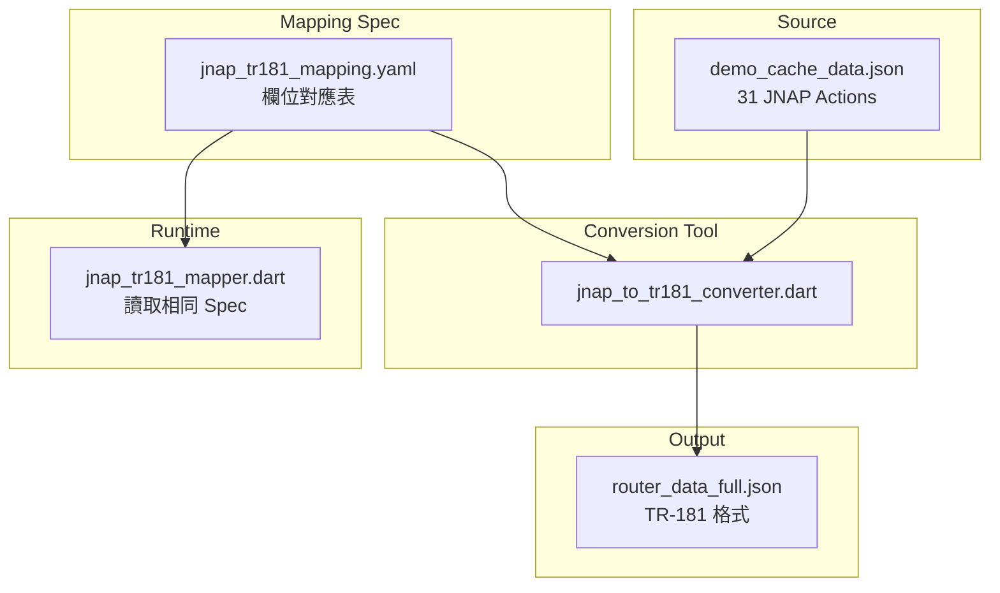

# JNAP ↔ TR-181 Data Conversion Plan

## Goal
將 JNAP demo data (`demo_cache_data.json`) 完整轉換為 TR-181 格式 (`router_data_full.json`)，確保 USP Simulator 與 PrivacyGUI 使用相同的 demo 資料。

---

## Architecture Overview



---

## Phase 1: Core Actions (High Priority)

這些 actions 對 Dashboard 運作至關重要：

| JNAP Action | 用途 | TR-181 Root Path |
|-------------|------|------------------|
| GetDeviceInfo | Router 基本資訊 | `Device.DeviceInfo.*` |
| GetRadioInfo3 | WiFi 設定 | `Device.WiFi.Radio.*`, `Device.WiFi.SSID.*` |
| GetDevices3 | 連線裝置列表 | `Device.Hosts.Host.*` |
| GetWANStatus3 | WAN 連線狀態 | `Device.IP.Interface.1.*` |
| GetLANSettings | LAN 設定 | `Device.IP.Interface.2.*`, `Device.DHCPv4.*` |
| GetLocalTime | 時間設定 | `Device.Time.*` |

---

## Phase 2: Secondary Actions

| JNAP Action | 用途 | TR-181 Root Path |
|-------------|------|------------------|
| GetNetworkConnections2 | 網路連線 | `Device.Hosts.Host.*.Connections` |
| GetGuestRadioSettings2 | Guest WiFi | `Device.WiFi.SSID.*.Guest` |
| GetMACFilterSettings | MAC 過濾 | 需擴展 TR-181 schema |
| GetFirmwareUpdateSettings | 韌體更新 | `Device.DeviceInfo.SoftwareVersion` |

---

## Phase 3: Extended Actions

其餘 actions（GetBackhaulInfo2, GetTopologyOptimizationSettings2 等）可根據需要逐步添加。

---

## Mapping Specification Format

建立 `packages/usp_protocol_common/lib/src/mapping/jnap_tr181_mapping.yaml`:

```yaml
GetDeviceInfo:
  tr181_paths:
    - Device.DeviceInfo.
  field_mappings:
    manufacturer:
      tr181: Device.DeviceInfo.Manufacturer
      type: string
    modelNumber:
      tr181: Device.DeviceInfo.ModelName
      type: string
    serialNumber:
      tr181: Device.DeviceInfo.SerialNumber
      type: string
    firmwareVersion:
      tr181: Device.DeviceInfo.SoftwareVersion
      type: string
    firmwareDate:
      tr181: null  # Not in TR-181
      default: ""
    services:
      tr181: null  # Not in TR-181
      default: []

GetRadioInfo3:
  tr181_paths:
    - Device.WiFi.Radio.
    - Device.WiFi.SSID.
    - Device.WiFi.AccessPoint.
  field_mappings:
    radios:
      type: list
      template:
        radioID:
          tr181: Device.WiFi.Radio.{index}.Name
          transform: "to_radio_id"
        isEnabled:
          tr181: Device.WiFi.Radio.{index}.Enable
          type: bool
        band:
          tr181: Device.WiFi.Radio.{index}.OperatingFrequencyBand
          type: string
        settings.ssid:
          tr181: Device.WiFi.SSID.{index}.SSID
          type: string
        settings.channel:
          tr181: Device.WiFi.Radio.{index}.Channel
          type: int
```

---

## Implementation Steps

### Step 1: Create Mapping Specification
- [ ] Create `jnap_tr181_mapping.yaml` with Phase 1 actions
- [ ] Define all field mappings with types and defaults
- [ ] Document unmappable fields (require fallback)

### Step 2: Build Conversion Tool
- [ ] Create `tools/jnap_to_tr181_converter.dart`
- [ ] Read demo_cache_data.json
- [ ] Read mapping spec
- [ ] Generate router_data_full.json

### Step 3: Update Runtime Mapper
- [ ] Refactor `jnap_tr181_mapper.dart` to use mapping spec
- [ ] Single source of truth for both directions

### Step 4: Validation
- [ ] Run USP Demo with converted data
- [ ] Verify all Phase 1 actions work without fallback

---

## File Locations

| File | Purpose |
|------|---------|
| `packages/usp_protocol_common/lib/src/mapping/jnap_tr181_mapping.yaml` | Mapping 規格 |
| `tools/jnap_to_tr181_converter.dart` | 轉換工具 |
| `apps/usp_device2_simulator/test/data/router_data_full.json` | 輸出：TR-181 格式 |
| `apps/PrivacyGUI/lib/core/usp/jnap_tr181_mapper.dart` | Runtime mapper |

---

## Unmappable Fields Strategy

某些 JNAP 欄位在 TR-181 中沒有對應，需要特殊處理：

| JNAP Field | Strategy |
|------------|----------|
| `services[]` (GetDeviceInfo) | Use hardcoded list or mock |
| `isGuestNetworkACaptivePortal` | Default: false |
| JNAP-specific enums | Transform functions |

---

## Estimated Effort

| Phase | Actions | Effort |
|-------|---------|--------|
| Phase 1 | 6 核心 actions | 2-3 天 |
| Phase 2 | 4 次要 actions | 1-2 天 |
| Phase 3 | 21 擴展 actions | 按需添加 |

---

## Related Files

- [demo_cache_data.json](../../assets/resources/demo_cache_data.json) - JNAP demo data
- [jnap_tr181_mapper.dart](../../lib/core/usp/jnap_tr181_mapper.dart) - Runtime mapper
- [router_data_full.json](../../../usp_device2_simulator/test/data/router_data_full.json) - TR-181 demo data
