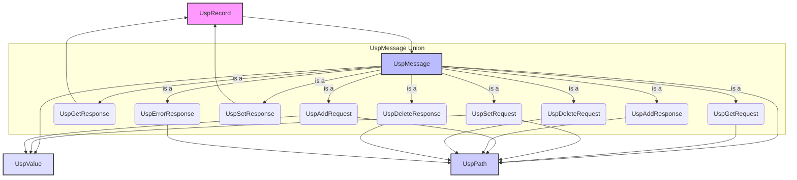

# Data Model for USP Protocol Common Core Library

This document defines the core data models for the `usp_protocol_common` library, aligned with the TR-369 (USP) specification. These models will be implemented as immutable Dart classes using `freezed` and will support `json_serializable` for JSON operations and `protobuf` for binary serialization.

## Core Entities

### 1. UspPath

Represents a hierarchical path within the USP data model.

**Fields**:
- `path`: `String` (required) - The normalized USP path string.

**Relationships**:
- None directly within the data model, but used to traverse `ITraversableNode` structures.

**Validation Rules**:
- Must conform to USP path syntax (e.g., "Device.LocalAgent.Endpoint.{i}.Manufacturer").
- Automatically normalized upon creation (e.g., trailing dots removed, instance identifiers validated).
- Wildcard characters (`*`) are supported.

**Implementation Notes**:
- Will be a `freezed` value object.
- Parsing and validation logic will reside within its factory constructors or a dedicated `UspPathParser` (part of Module D: Tools).

### 2. UspValue

A value object that encapsulates different data types as defined by USP.

**Fields**:
- `value`: `dynamic` (required) - The actual value, which can be `String`, `int`, `double`, `bool`, `List<int>` (for bytes), etc.
- `type`: `UspValueType` (required) - An enum indicating the type of the `value` (e.g., `STRING`, `INT`, `BOOL`).

**Relationships**:
- None.

**Validation Rules**:
- The `value` must be convertible to the specified `type`.
- Supports type-aware JSON serialization and deserialization.

**Implementation Notes**:
- Will be a `freezed` value object.
- The `type` field will guide JSON serialization/deserialization to ensure correct type handling.
- `UspValueType` will be a Dart enum mapping to USP data types.

### 3. UspMessage (Abstract Base)

An abstract base class for all USP request and response messages. Concrete DTOs will extend this class and use `equatable` for value-based comparison.

**Concrete Implementations (DTOs)**:
- `UspGetRequest` (extends `UspMessage`)
    - `paths`: `List<UspPath>` (required) - Paths to retrieve.
- `UspGetResponse` (extends `UspMessage`)
    - `records`: `List<UspRecord>` (required) - List of records containing retrieved data.
- `UspSetRequest` (extends `UspMessage`)
    - `parameters`: `Map<UspPath, UspValue>` (required) - Parameters to set.
- `UspSetResponse` (extends `UspMessage`)
    - `records`: `List<UspRecord>` (required) - List of records confirming set operations.
- `UspAddRequest` (extends `UspMessage`)
    - `parameters`: `Map<UspPath, UspValue>` (required) - Object and parameters to add.
    - `allowPartial`: `bool` (optional) - Whether partial addition is allowed.
- `UspAddResponse` (extends `UspMessage`)
    - `instantiatedPaths`: `List<UspPath>` (required) - Paths of newly instantiated objects.
- `UspDeleteRequest` (extends `UspMessage`)
    - `paths`: `List<UspPath>` (required) - Paths to delete.
- `UspDeleteResponse` (extends `UspMessage`)
    - `deletedPaths`: `List<UspPath>` (required) - Paths of successfully deleted objects.
- `UspErrorResponse` (extends `UspMessage`)
    - `errorCode`: `int` (required) - USP error code.
    - `errorMessage`: `String` (required) - Human-readable error message.
    - `affectedPath`: `UspPath` (optional) - The path that caused the error.

**Relationships**:
- `UspMessage` DTOs contain `UspPath` and `UspValue` objects.

**Validation Rules**:
- Fields must match their Protobuf definitions.
- Required fields must be present.

**Implementation Notes**:
- `UspMessage` will be an abstract class that extends `Equatable`.
- Each DTO will be a concrete class extending `UspMessage` and implementing `json_serializable`.
- Each DTO will have `fromJson` and `toJson` methods generated by `json_serializable`.
- Each DTO will have `toProto` and `fromProto` methods (or use a converter service).

### 4. UspRecord

A wrapper for a `UspMessage` for transport, containing metadata.

**Fields**:
- `id`: `String` (required) - A unique identifier for the record.
- `senderId`: `String` (required) - Identifier of the sender.
- `receiverId`: `String` (required) - Identifier of the receiver.
- `message`: `UspMessage` (required) - The actual USP message (request or response).

**Relationships**:
- Contains a `UspMessage`.

**Validation Rules**:
- All fields are required.
- `message` must be a valid `UspMessage` DTO.

**Implementation Notes**:
- Will be an `Equatable` data class.
- Will handle serialization/deserialization to/from the `usp_record.proto` definition.

## Data Model Diagram (Conceptual)

